# Python语言在科学计算与人工智能领域中的跨学科应用

## 课程目标

<font size=5>

1让学生掌握 Python 语言的基础知识，包括语法、数据类型和常用的数据结构。

2教会学生如何使用 Python 进行数据处理和可视化，包括使用常用的库（如 NumPy 和 Matplotlib）来处理和分析数据。

3让学生了解 Python 在科学计算和数据分析领域中的应用，包括在材料计算、计算流体力学、分析化学实验设计和地球科学等领域中的应用。

4让学生了解 Python 在金融领域中的应用，包括量化投资策略开发、风险度量和投资组合优化等。

5教会学生如何使用 Python 进行机器学习和人工智能程序开发，包括使用常用的库来构建机器学习模型。


</font>

---

# 课程目标

A. 学会处理实验数据和模拟获得的数据，进行数据分析。

B. 数据分析后提炼出有效结论，撰写论文使用。

---


# 课程章节设置

第一章：Python语言基础
第二章：Python数据处理与可视化
第三章：Python计算与数据分析
第四章：Python全局优化
第五章：Python在人工智能领域的应用
第六章：Python在材料计算领域中的应用
第七章：Python在计算力学领域中的应用
第八章：Python在金融领域中的应用

---


# 第一章：Python语言基础

<font size=4>

## 1.1 Python简介
## 1.2 Python的环境配置
## 1.3 基本语法
## 1.4 控制流程
## 1.5 函数
## 1.6 模块
## 1.7 文件I/O
## 1.8 面向对象编程（OOP）
## 1.9 方法
## 1.10 动态分配内存


</font>
---


# 第一章：Python语言基础

## 1.1 Python简介

<font size=5>

本课程的重点是给大家引入`Python`基础下的`开源数值计算`。

`计算机编程`和`数值计算`是两个不同但相关的概念，它们有各自的定义：

`计算机编程`，也称为软件开发，是指设计和构建可执行的计算机程序的过程。这些程序是一系列指令和算法的集合，可以被计算机执行以完成特定的任务或解决问题。计算机编程包括选择编程语言、编写代码、测试和调试程序，以及最终部署和维护软件应用。编程可以涵盖广泛的领域，包括应用程序开发、网站设计、游戏开发、数据分析等。


```python
def hello_world():
    print("Hello, World!")
```

</font>

---

## 1.1 Python简介

<font size=5>

`数值计算`，是指使用计算机进行数学计算和数值近似的过程，通常用于解决复杂的数学问题，如数值模拟、求解方程、数值积分等。数值计算涉及使用数值方法和近似技巧来求解数学问题，而不是通过解析方法推导出精确解。它在科学、工程和其他领域中广泛应用，用于模拟自然现象、优化设计、数据分析等。

```python
# 导入NumPy库
import numpy as np

# 创建一个包含数字的列表
numbers = [1, 2, 3, 4, 5]

# 使用NumPy库计算列表中数字的和
sum_result = np.sum(numbers)

# 打印结果
print("列表中数字的和为:", sum_result)
```

</font>

---


## 1.1 Python简介

<font size=5>

计算机编程和数值计算之间存在密切的关系：

*`数值计算是一种计算机应用领域`*：数值计算是计算机编程的一个重要应用领域之一。它涉及使用计算机来解决数学问题，通常是通过近似方法和数值技巧来求解复杂的数学方程或进行数值模拟。

*`计算机编程是实现数值计算的手段`*：编程是一种创建计算机程序的过程，这些程序可以执行各种任务，包括数值计算。编程语言提供了一种方式来编写算法，实现数值计算的方法，以便计算机可以自动执行这些计算。

*`编程用于实现数值算法`*：计算机编程用于实现数值计算中的算法和数学模型。程序员编写代码来描述数学问题和数值方法，然后计算机执行这些代码以进行数值计算。这包括迭代方法、差分方程、数值积分等等。

*`编程提供了灵活性和自动化`*：计算机编程使数值计算更加灵活和自动化。通过编程，可以轻松地调整参数、处理大规模数据、自动化复杂的数值步骤，从而提高效率和精确度。

</font>

---

## 1.1 Python简介

数值计算与解析解的区别：

<font size=5>

| 特点               | 数值计算                        | 解析解                     |
|--------------------|--------------------------------|-----------------------------|
| 计算精度           | 有限精度，近似解               | 精确解                     |
| 适用性             | 适用于复杂问题和无法求解的问题 | 适用于简单和已知方程的问题 |
| 计算时间           | 相对较快，但可能需要迭代       | 通常较慢，不需要迭代       |
| 算法选择           | 需要选择适当的数值方法         | 直接应用数学公式           |
| 数值稳定性         | 可能受到数值稳定性问题的影响   | 通常稳定                   |
| 解决非线性问题     | 适用于非线性问题               | 适用于线性和一些非线性问题 |
| 计算资源需求       | 相对较低的计算资源需求         | 可能需要更多的计算资源     |


</font>

---


## 1.1 Python简介

<font size=5>

我们通过一个例子来说明数值计算和解析解之间的区别:

考虑以下方程：

$f(x) = x^2 - 4x + 4 = 0$


解析解：
二次方程公式来解决这个二次方程$f(x) = 0$ ：

$x = \frac{-b \pm \sqrt{b^2 - 4ac}}{2a}$

在这种情况下，a=1，b=−4，c=4。将这些值代入公式中，由于判别式$(b^2−4ac)$为零，我们只有一个解：

$$x = \frac{-(-4) \pm \sqrt{(-4)^2 - 4(1)(4)}}{2(1)}\

 = \frac{4 \pm \sqrt{16 - 16}}{2}\

 = 2$$


</font>

---


## 1.1 Python简介

<font size=5>

数值计算：

数值方法涉及使用数值技术来近似解，特别是在难以找到解析解时。解决方程的一种常见数值方法是`迭代方法`。

$f(x) = x^2 - 4x + 4 = 0$

移项可得：

$x = \frac{x^2 + 4}{4}$

`迭代方法`：

$x_{n+1} = \frac{x_{n}^2 + 4}{4},n=0,1,2,....$


</font>

---


## 1.1 Python简介

<font size=5>

从一个初始猜测开始，$x_0=1$，$x_{n+1}$ 逐渐逼近于2.

```python
x0 = 1
x1 = x0

for i in range(1,20):
    x1 = (x0 * x0 + 4 )/4
    x0 = x1
    print(x1)
```

从一个初始猜测开始，$x_0=3$，$x_{n+1}$ 会发散。


</font>

迭代格式的好坏是算法的好坏。迭代格式需要精心设计。

---

## 1.1 Python简介

实际上所有的数值计算都需要进行`迭代`。

<font size=4>

`迭代格式涉及的典型数值计算方法`：

`求解非线性方程`： 迭代方法可用于找到非线性方程的根，如牛顿-拉普森法，二分法等。

`优化问题`： 一些优化算法使用迭代方法，如梯度下降法和共轭梯度法，用于寻找函数的最小值。

`求解线性系统`： 迭代方法如雅各比迭代和高斯-赛德尔迭代可用于求解大型稀疏线性系统的近似解。

`插值和逼近`： 插值和逼近问题通常需要找到多项式或其他函数，以拟合已知数据点，迭代方法可用于调整多项式系数以获得更好的逼近。

`数值积分`： 龙贝格-库塔法和蒙特卡洛方法是一些用于数值积分的迭代方法。

`常微分方程求解`： 迭代方法可用于求解常微分方程，如欧拉方法、龙格-库塔方法和变步长方法。

`矩阵特征值问题`： 幂法和反幂法是一些用于计算矩阵的主特征值和特征向量的迭代方法。

`傅里叶变换`： 快速傅里叶变换（FFT）是一种迭代算法，用于高效地计算信号的频谱。


</font>

---


## 1.1 Python简介

<font size=5>

数值计算涉及以下步骤：

`解方程`: 首先，数值计算要求将一个数学方程或问题转化为计算机可以处理的形式。这可能涉及将方程解出来以获得通用的解析解，通常表示为一个函数或表达式。

`编写通式`: 一旦获得了解析解，你可以将其表示为通用的数学公式，其中包含变量和参数。这个通式表示了问题的一般性质。

`带入具体数值`: 接下来，你可以将具体的数值带入这个通式中，以计算在特定数值下的结果。这可能涉及将特定的值分配给变量，并执行计算。

`计算结果`: 最后，通过执行计算，你将得到在特定数值下的问题的解。这个结果可以是一个数字或一组数字，它代表了问题的答案。

这个过程可以应用于各种数学问题，从简单的方程求解到复杂的数值模拟和优化问题。数值计算的关键在于使用计算机来进行大规模、复杂或无法精确求解的数学计算，以获得近似的数值结果。 一般对于解析求解，只需要`解方程`和`编写通式`这两个步骤。

</font>

---


### 1.1.1 Python的历史


Python是一种流行的高级编程语言，具有丰富的历史、独特的特点和显著的优势。

- 创始人：Guido van Rossum
  - Guido van Rossum于1956年1月31日在荷兰海牙出生，并在阿姆斯特丹大学获得了数学和计算机科学的硕士学位。他在荷兰的Centrum Wiskunde & Informatica (CWI)工作期间创造了Python。

---

### <!--fit-->创始人：Guido van Rossum

  
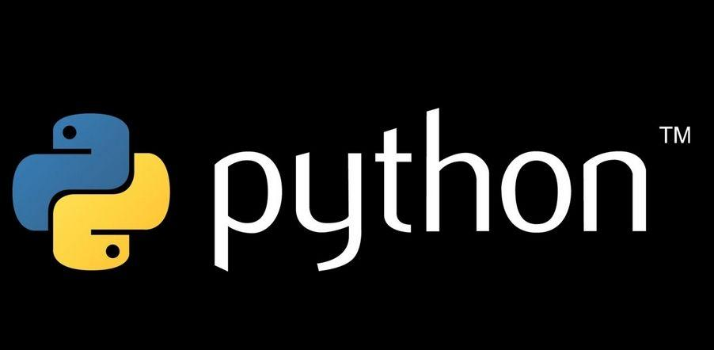

---

### 1.1.1 Python的历史

- 发展历程：
  - 诞生（1989-1991年）：
    - Python的创始人，Guido van Rossum，在1989年圣诞节期间开始编写Python的第一个版本。
    - 第一个公开发布的Python版本是1991年的0.9.0版。

---

### 1.1.1 Python的历史

- 发展历程：
  - Python 1.0（1994年）：
    - 1994年，Python发布了1.0版，这是一个重要的里程碑。
    - Python 1.0引入了一些重要的特性，如lambda函数、map()和filter()等。

---

### 1.1.1 Python的历史

- 发展历程：
  - Python 2.x系列（2000年）：
    - Python 2.0于2000年发布，引入了列表推导式、Unicode支持和其他功能。
    - 2.x系列一直持续到2008年，期间发布了多个子版本，如2.5、2.6和2.7。

---

### 1.1.1 Python的历史

- 发展历程：
  - Python 3.0（2008年）：
    - Python 3.0是一个重大的版本升级，旨在解决Python 2.x系列中的设计问题和不一致性。
    - Python 3.0引入了一些不向后兼容的变化，以提高语言的一致性和可读性。
    - Python 3.x系列继续推出，每个版本都引入了新特性和改进，例如f-strings、async/await、type hints等。

---

### 1.1.1 Python的历史

- Python社区的发展：
  - Python社区在不断壮大，建立了丰富的库和框架，包括NumPy、Pandas、Django、Flask、Matplotlib等，使Python成为数据科学、Web开发、机器学习等领域的首选语言之一。

---

### 1.1.1 Python的历史

- Python的广泛应用：
  - Python在各个领域得到了广泛应用，包括Web开发、数据科学、人工智能、自动化脚本、科学计算、网络安全、游戏开发等。
  - Python成为了一门通用且多用途的编程语言，受到了全球开发者社区的喜爱。

---

### 1.1.2 Python的特点

- 易读易写：简洁的语法，强调代码可读性
- 面向对象：支持面向对象编程
- 多用途：适用于Web开发、数据科学、自动化等多种领域
- 强大的标准库：丰富的内置模块和库

---

### 1.1.2 Python的特点

- 易读易写：
  - Python以简洁、清晰和可读性强的语法著称。它使用了明确的代码块缩进来表示程序结构，而不是像其他语言那样使用大括号。这使得Python代码看起来更干净、整洁，并且减少了语法错误的可能性。
  - 由于易读易写的特性，Python适用于编写可维护的代码，而且新手可以更容易地学习和理解它。

---

### 1.1.2 Python的特点

- 面向对象：
  - Python是一门支持面向对象编程（OOP）的语言，它允许开发者使用类和对象来组织代码。这种方式有助于将现实世界的问题模型化为代码，提高了代码的模块化和可复用性。
  - Python还支持其他编程范式，如过程式编程和函数式编程，因此可以灵活地满足不同编程需求。

---

### 1.1.2 Python的特点

- 多用途：
  - Python是一门通用编程语言，适用于各种领域和应用。它在Web开发（例如Django和Flask框架）、数据科学（例如NumPy和Pandas库）、自动化脚本（例如自动化测试和任务自动化）、科学计算、机器学习和人工智能等方面都具备广泛的应用。
  - 由于其多用途性质，Python可以在一个项目中用于多个不同的任务，无需切换到不同的编程语言。

---

### 1.1.2 Python的特点

- 强大的标准库：
  - Python附带了丰富的标准库，包括用于文件操作、网络通信、正则表达式、数据处理、日期时间处理等各种内置模块和库。这些模块和库大大简化了开发过程，减少了需要编写的代码量。
  - 标准库的强大之处在于它覆盖了许多常见的编程任务，使得开发者可以轻松地解决各种问题，无需从头开始编写复杂的功能。

---

### 1.1.3 Python的优势

- 社区支持：庞大的社区和资源
- 跨平台：可在多种操作系统上运行
- 扩展性：可通过第三方库和框架进行扩展

---

### 1.1.3 Python的优势

- 社区支持：
  - Python 3拥有一个庞大而活跃的全球社区，这意味着有大量的资源、教程、论坛和开发者共享的知识可供参考。
  - 社区支持也表现在大量的第三方库和框架上，它们扩展了Python的功能，使其适用于各种应用领域，如Web开发、数据科学、机器学习、自动化等。

---

### 1.1.3 Python的优势

- 跨平台：
  - Python 3是一种跨平台的编程语言，意味着你可以编写一次代码，然后在多个操作系统上运行，包括Windows、macOS和各种Linux发行版。
  - 这种跨平台性使Python成为一种非常灵活的选择，适用于不同操作系统下的开发和部署。

---

### 1.1.3 Python的优势

- 扩展性扩展性：
  - Python 3的强大之处在于它的扩展性。你可以通过使用第三方库和框架来扩展Python的功能，而无需从零开始编写所有代码。例如，如果你在数据科学领域工作，可以使用NumPy、Pandas和Matplotlib等库来进行数据分析和可视化。如果你从事Web开发，可以使用Django或Flask等框架来构建Web应用。
  - Python还支持C/C++扩展，这意味着你可以将C/C++代码与Python集成，以提高性能或访问底层系统功能。

---

### 1.1.3 Python的优势

- 优缺点对比扩展性：
  - 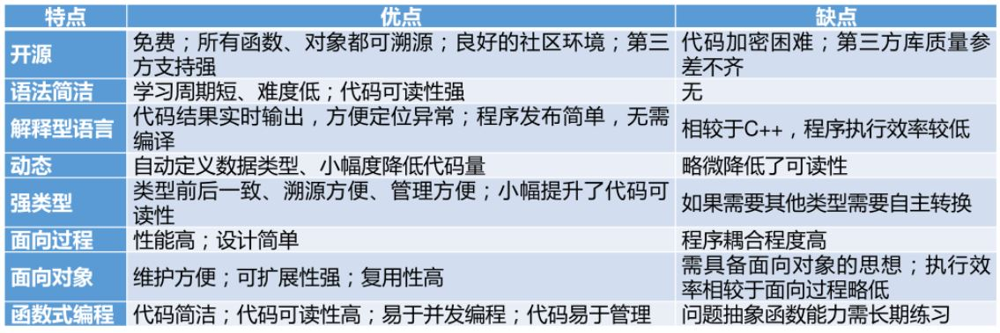

---


### 1.1.3 Python的优势

<font size=4>

- Python和C语言在预编译和编译方面有显著区别：

**C语言**：

*预编译*：在C语言中，通常需要进行预处理，其中包括宏替换、头文件包含等步骤。这将生成一个经过处理的源代码文件。

*编译*：C语言的源代码需要经过编译器的编译过程，将其翻译成汇编代码，然后生成可执行的机器代码文件。

*生成可执行文件*：编译后的代码将生成可执行文件，这是计算机可以直接运行的二进制文件。

**Python**：

*无需预编译*：Python是一种解释型语言，不需要预编译过程。您可以编写Python代码并直接运行它，无需生成中间可执行文件。

*解释执行*：Python代码在运行时由解释器逐行执行，而不是生成可执行的机器代码文件。

*跨平台性*：Python代码通常是跨平台的，因为解释器在不同操作系统上执行相同的代码。


**C语言需要经历明确的预处理和编译过程，生成可执行文件，而Python是解释型语言，无需生成可执行文件，代码在运行时逐行解释执行。这些区别对于开发和部署软件具有重要意义**。


</font>

---


### 1.1.4 Python的的应用领域

- 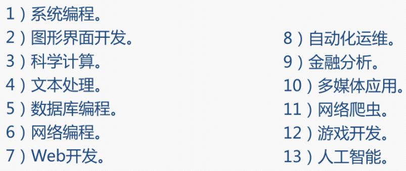

---

## 1.2 Python的环境配置

### 1.2.1 Anaconda简介

- Anaconda是一个用于科学计算的Python发行版，支持Linux, Mac, Windows系统，提供了包管理与环境管理的功能，可以很方便地解决多版本python并存、切换以及各种第三方包安装问题。Anaconda包含了conda、Python在内的超过180个科学包及其依赖项。

---

### 1.2.1 Anaconda简介

- Anaconda的主要特点：
  - 开源：Anaconda是开源的，可以自由使用和分发。
  - 安装过程简单：Anaconda的安装过程非常简单，用户可以轻松地在自己的计算机上安装和配置Anaconda。
  - 高性能：Anaconda支持使用Python和R语言进行高性能的科学计算和数据分析。
  - 免费的社区支持：Anaconda有一个活跃的社区，用户可以从社区中获取帮助和支持。

---

### 1.2.1 Anaconda简介

- Anaconda的主要特点：
  - Anaconda还包含了conda包和环境管理器，这使得用户可以方便地管理和切换不同的Python环境，以及安装和更新Python包。这对于需要在不同项目中使用不同版本的Python或者不同版本的Python库的用户来说，是非常有用的。

---

### 1.2.2 Anaconda的安装

    Anaconda个人版文档：https://anaconda.org.cn/anaconda
    Anaconda个人版安装程序下载：https://www.anaconda.com/download
---

### 1.2.2 Anaconda的安装

- 

---

### 1.2.2 配置Anaconda虚拟环境

- 为何Python需要配置虚拟环境？
  - 配置Anaconda虚拟环境的主要原因是为了解决包和Python版本之间的兼容性问题。例如，你可能有一个应用需要NumPy 1.18.1以上版本，而另一个应用使用的是NumPy 1.15.1，你要如何同时使用两个应用呢？如果都用最新版本，有时可能会出现不兼容的情况。因此，为每个项目创建一个独立的虚拟环境可以避免这种问题。

---

### 1.2.2 配置Anaconda虚拟环境

- 配置Anaconda虚拟环境的步骤：
  1. 打开Anaconda Prompt。
  2. 输入conda create -n your_env_name python=x.x来创建一个新的虚拟环境，其中your_env_name是你想要给虚拟环境命名的名称，x.x是Python的版本号。
   

---  

### 1.2.2 配置Anaconda虚拟环境

- 配置Anaconda虚拟环境的步骤：
  3. 输入conda activate your_env_name来激活你刚刚创建的虚拟环境。
   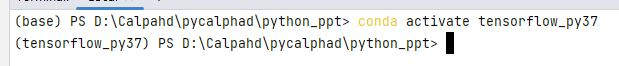
  4. 在这个虚拟环境中，你可以使用conda install package_name来安装你需要的包。

---

### 1.2.2 配置Anaconda虚拟环境

- 配置Anaconda虚拟环境的步骤：
  5. 如果你想退出虚拟环境，可以输入conda deactivate。
  6. 如果你想删除一个虚拟环境，可以输入conda remove -n your_env_name --all。

---

### 1.2.2 配置Anaconda虚拟环境

- 安装Anaconda后自动已安装python。

```
Python 标准库: https://docs.python.org/zh-cn/3/library/index.html
```

---

### 1.2.3 安装PyCharm

<font size=5>

- PyCharm是一款非常强大的Python集成开发环境。
- 在PyCharm中，你可以配置和使用不同版本的Python解释器，并创建虚拟环境来管理项目的依赖项。PyCharm支持的Python编译器:


| 编译器/解释器     | 描述                                                                                                       |
|----------------|----------------------------------------------------------------------------------------------------------|
| CPython        | CPython是Python的官方解释器，也是Python语言的标准实现。PyCharm通常默认支持CPython，你可以选择不同的CPython版本来运行项目。               |
| Anaconda Python | Anaconda是一个Python数据科学平台，它包括了许多科学计算库和工具。Anaconda Python通常与conda虚拟环境一起使用，可以方便地管理Python包和环境，特别适用于数据科学和机器学习项目。 |
| PyPy           | PyPy是Python的另一种实现，旨在提供更高的性能。虽然不是标准解释器，但PyCharm允许你配置和使用PyPy来运行Python代码，以获得更好的性能。           |

</font>

---

### 1.2.3 安装PyCharm

<font size=4>

PyCharm支持的Python虚拟环境：

| 虚拟环境           | 描述                                                                                                                     |
|-------------------|------------------------------------------------------------------------------------------------------------------------|
| Python虚拟环境       | Python自带了一个名为venv的虚拟环境工具，可以用来创建轻量级的虚拟环境，用于隔离项目的依赖项。                                              |
| conda虚拟环境       | conda是一个流行的包管理器和环境管理器，Anaconda Python通常与conda一起使用。你可以使用conda创建和管理虚拟环境，轻松地安装和管理各种Python包。 |
| virtualenv         | virtualenv是一个独立的Python虚拟环境管理工具，它允许你创建和管理虚拟环境，与PyCharm兼容，并用于项目的依赖项隔离。                           |
| pipenv            | pipenv是一个基于pip的虚拟环境管理工具，它集成了依赖管理和虚拟环境管理，可以帮助你更轻松地管理项目的依赖项。                                |
| venv            | Python 的内置工具，用于创建虚拟环境。它适用于 Python 3.3 及更高版本。                |


</font>

---


### 1.2.3 安装PyCharm

<font size=5>

- PyCharm社区版（PyCharm Community Edition）安装程序下载：

```
https://www.jetbrains.com/pycharm/download/?section=windows
```

</font>

---


### 1.2.3 安装PyCharm

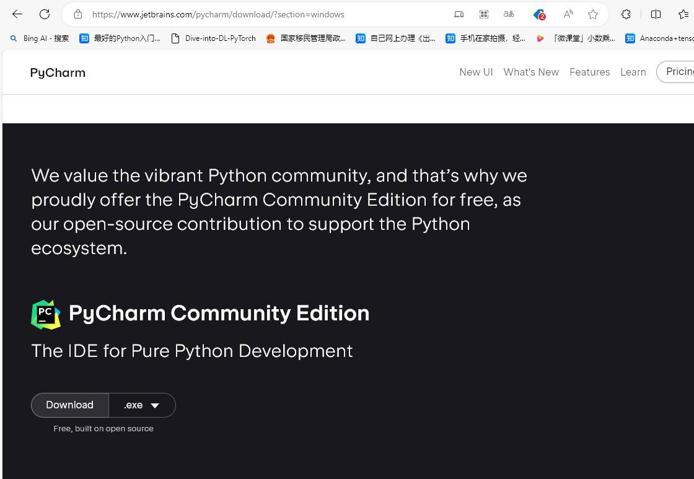

---

### 1.2.3 配置PyCharm

- 在完成安装后，点击PyCharm中的文件，新建项目，更改文件路径，选择合适的编译器，如果没有出现的话，请点击右边的三个点来手动选择，最后点击创建即可。
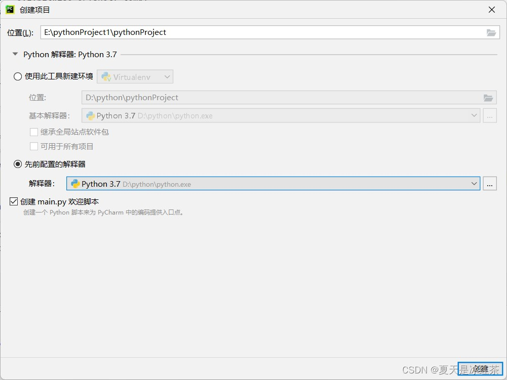

---

### 1.2.3 配置PyCharm

PyCharm 中的 Terminal 和 Python Console 是两个不同的工具，它们分别用于不同的目的，有一些重要的区别：

- Terminal：<font color=Red size=5>
  - 用途：Terminal 是一个命令行终端，允许您在操作系统级别执行命令。您可以在 Terminal 中运行各种命令，包括启动Python解释器、运行脚本、安装软件包、执行文件管理操作等。
  - 环境：Terminal 在 PyCharm 中打开一个独立的命令行窗口，通常默认运行在您的操作系统的默认 shell（例如，Bash、PowerShell、Command Prompt）中。
  - 外部环境：Terminal 是一个外部环境，它不受 PyCharm 控制，可以用于执行各种系统级别的操作。它与您的项目无关。
- </font>

---

### 1.2.3 配置PyCharm

- Python Console：<font color=Red size=5>
  - 用途：Python Console 是一个与Python交互式解释器集成的工具。它允许您在PyCharm中执行Python代码，并立即查看结果，用于快速测试、调试和探索Python代码。

  - 环境：Python Console 在PyCharm内部运行，与您的项目关联。它提供了一个Python环境，可以访问您项目中的所有模块和库。
  
  - Python版本：Python Console 使用的Python版本取决于您的项目配置。您可以在PyCharm中为每个项目选择不同的Python解释器。
  
  - 代码补全和历史记录：Python Console 提供了代码自动完成、历史记录查看和其他与Python代码交互相关的功能。
- </font>

---


## 1.3 基本语法

- 推荐学习网站：

  ```
  Python 标准库: https://docs.python.org/zh-cn/3/library/index.html
  
  https://www.runoob.com/python3/python3-tutorial.html

  https://c.biancheng.net
  ```

---

## 1.3 基本语法

Python的基本语法包括数据类型、变量、运算符和表达式。

1. 数据类型：
  Python支持多种数据类型，包括整数（int）、浮点数（float）、字符串（str）、布尔值（bool）等。这些数据类型用于表示不同种类的数据。例如，整数用于表示整数值，浮点数用于表示带有小数点的数值，字符串用于表示文本，布尔值用于表示True或False。

---

## 1.3 基本语法

2. 变量：
  在Python中，变量用于存储数据值。你可以将数据值分配给变量，并随后引用这些变量以访问数据。变量名是标识符，通常以字母或下划线开头，后跟字母、数字或下划线。变量名区分大小写。
  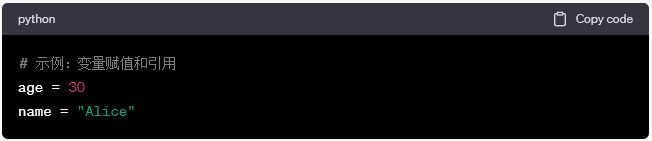

---

## 1.3 基本语法

3. 运算符：
  Python提供了各种运算符，用于执行数学运算、逻辑运算和比较运算。常见的运算符包括加法、减法、乘法、除法、取余、逻辑与、逻辑或等。  运算符用于对数据进行操作和计算。
  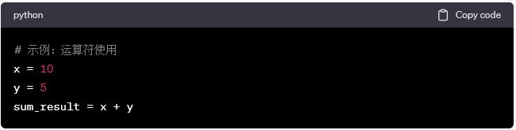

---

## 1.3 基本语法

3. 表达式：
  表达式是由运算符和操作数（变量、常数或其他表达式）组成的组合，用于生成某个值。
  Python中的表达式可以包含算术表达式、逻辑表达式和条件表达式等。
  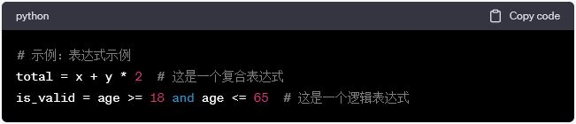  

---

### 1.3.1 数据类型

Python支持多种数据类型，包括：

- 数字(Number)
- 字符串（str）
- 列表（list）
- 元组（tuple）
- 字典（dict）
- 集合（set）

---

### 1.3.1 数据类型

- 数字(Number)
  - Python 数字数据类型用于存储数值。
  - 数据类型是不允许改变的，这就意味着如果改变数字数据类型的值，将重新分配内存空间。
  - 以下实例在变量赋值时 Number 对象将被创建：

    ```python
    var1 = 1
    var2 = 10
    ```

---

### 1.3.1 数据类型  

- Python 支持三种不同的数值类型：
  - 整数（int）
    - 通常被称为是整型或整数，是正或负整数，不带小数点。Python3 整型是没有限制大小的，可以当作 Long 类型使用，所以 Python3 没有 Python2 的 Long 类型。布尔(bool)是整型的子类型。

---

### 1.3.1 数据类型  

- 浮点数（float）
  - 浮点型由整数部分与小数部分组成，浮点型也可以使用科学计数法表示（2.5e2 = 2.5 x 100 = 250）
  
- 复数 (complex)
  - 复数由实数部分和虚数部分构成，可以用a + bj,或者complex(a,b)表示， 复数的实部a和虚部b都是浮点型。

---

### 1.3.1 数据类型

|int | float |complex|
|----- | ------|----|
|10 | 0.0|3.14j|
|100 | 15.20|45.j|
|-786 | -21.9 | 9.322e-36j|
|080 | 32.3e+18 | .876j|
|-0490 | -90. | -.6545+0j|
|-0x260 | -32.54e100 | 3e+26j|
|0x69 | 70.2E-12 | 4.53e-7j|

---

### 1.3.1 数据类型

- 字符串（str）
  - 字符串是 Python 中最常用的数据类型。我们可以使用引号( ' 或 " )来创建字符串。
  - 创建字符串很简单，只要为变量分配一个值即可。例如：

```python
var1 = 'Hello World!'
var2 = "Runoob"
```

---

### 1.3.1 数据类型

- Python 访问字符串中的值
  - Python 访问子字符串，使用方括号 [] 来截取字符串：

  ```
  变量[头下标:尾下标]
  ```

  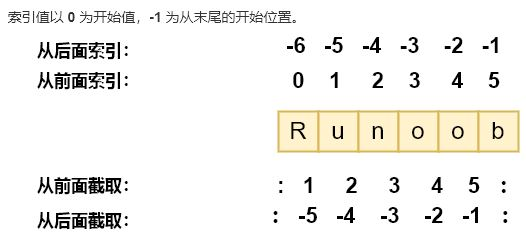

---

### 1.3.1 数据类型

- Python 访问字符串中的值
  <!-- 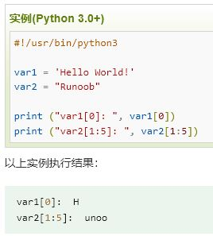  -->
  ```python
  var1 = 'Hello World!'
  var2 = "Runoob"
  print ("var1[0]: ", var1[0])
  print ("var2[1:5]: ", var2[1:5])
  以上实例执行结果：
  var1[0]:  H
  var2[1:5]:  unoo
  ```

  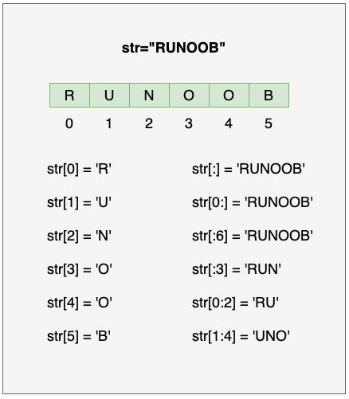

---

### 1.3.1 数据类型

- Python 字符串更新
  - 截取字符串的一部分并与其他字段拼接:

  ```python
  var1 = 'Hello World!'
  print ("已更新字符串 : ", var1[:6] + 'Runoob!')
  以上实例执行结果:
  已更新字符串 :  Hello Runoob!
  ```

---

### 1.3.1 数据类型

- Python 转义字符: 反斜杠 \

  ```python
  print('\'Hello, world!\'')  # 输出：'Hello, world!'
  print("Hello, world!\nHow are you?")  # 输出：Hello, world!
                                        #       How are you?
  print("Hello, world!\tHow are you?")  # 输出：Hello, world!    How are you?
  print("Hello,\b world!")  # 输出：Hello world!
  print("Hello,\f world!")  # 输出：
                           # Hello,
                           #  world!
                       
  ```  

---

### 1.3.1 数据类型

- Python 字符串运算符 (a="Hello"，b="Python")
<font size=3>

|操作符| 描述| 实例|
|----- | ------|----|
| + | 字符串连接 | a + b 输出结果： HelloPython|
| * | 重复输出字符串 | a*2 输出结果：HelloHello|
| [] | 通过索引获取字符串中字符 | a[1] 输出结果 e|
| [ : ] | 截取字符串中的一部分，遵循左闭右开原则，str[0:2] 是不包含第 3 个字符的。 | a[1:4] 输出结果 ell|
| in | 成员运算符 - 如果字符串中包含给定的字符返回 True | 'H' in a 输出结果 True|
| not in | 成员运算符 - 如果字符串中不包含给定的字符返回 True | 'M' not in a 输出结果 True|
| r/R | 原始字符串 - 原始字符串：所有的字符串都是直接按照字面的意思来使用，没有转义特殊或不能打印的字符。 原始字符串除在字符串的第一个引号前加上字母 r（可以大小写）以外，与普通字符串有着几乎完全相同的语法。| print( r'\n' ) print( R'\n' )|

</font>

---

### 1.3.1 数据类型

- Python 的字符串内建函数

---

### 1.3.1 数据类型

- 序列是 Python 中最基本的数据结构。

- 序列中的每个值都有对应的位置值，称之为索引，第一个索引是 0，第二个索引是 1，依此类推。

- Python 有 6 个序列的内置类型，但最常见的是列表和元组。

- 列表都可以进行的操作包括索引，切片，加，乘，检查成员。

- Python 已经内置确定序列的长度以及确定最大和最小的元素的方法。

---

### 1.3.1 数据类型

- 列表（list）
  - 列表是最常用的 Python 数据类型，它可以作为一个方括号内的逗号分隔值出现。
  - 列表的数据项不需要具有相同的类型
  - 创建一个列表，只要把逗号分隔的不同的数据项使用方括号括起来即可:

 ```python
list1 = ['Google', 'Runoob', 1997, 2000]
list2 = [1, 2, 3, 4, 5 ]
list3 = ["a", "b", "c", "d"]
list4 = ['red', 'green', 'blue', 'yellow', 'white', 'black']
 ```

---

### 1.3.1 数据类型

- 列表（list）
  - 访问列表中的值:与字符串的索引一样，列表索引从 0 开始，第二个索引是 1，依此类推。通过索引列表可以进行截取、组合等操作。
  
  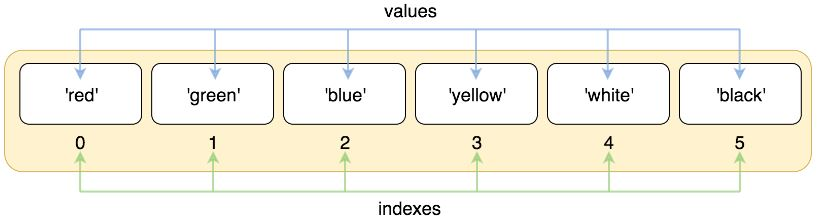

---

### 1.3.1 数据类型

- 列表（list）

 ```python
list = ['red', 'green', 'blue', 'yellow', 'white', 'black']

print( list[0] )
print( list[1] )
print( list[2] )

以上实例输出结果：

red
green
blue
 ```

---

### 1.3.1 数据类型

- 列表（list）
  - 索引也可以从尾部开始，最后一个元素的索引为 -1，往前一位为 -2，以此类推。

  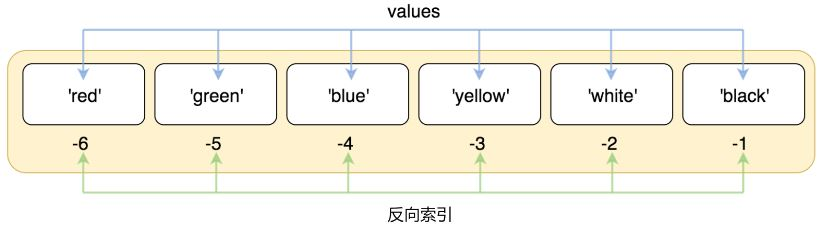

---

### 1.3.1 数据类型

- 列表（list）

 ```python
list = ['red', 'green', 'blue', 'yellow', 'white', 'black']
print( list[-1] )
print( list[-2] )
print( list[-3] )
以上实例输出结果：

black
white
yellow
 ```

---

### 1.3.1 数据类型

- 列表（list）
  - 使用下标索引来访问列表中的值，也可以使用方括号 [] 的形式截取字符，如下所示：
 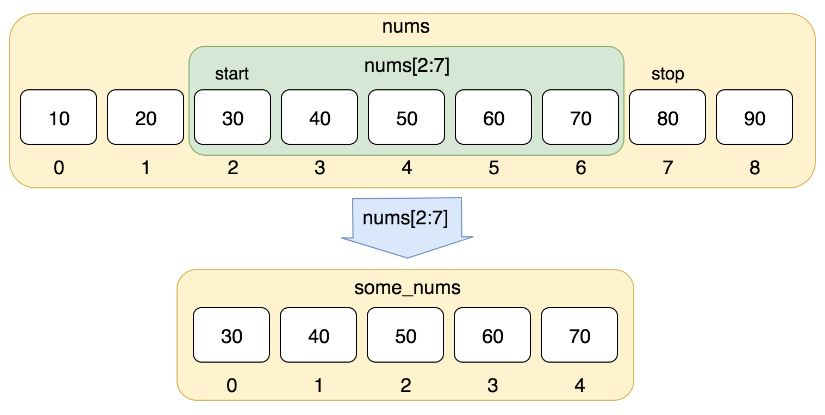

 ```python
nums = [10, 20, 30, 40, 50, 60, 70, 80, 90]
print(nums[0:4])
以上实例输出结果：

[10, 20, 30, 40]
 ```

---

### 1.3.1 数据类型

- 列表（list）
  - 使用负数索引值截取：

  ```python
  list = ['Google', 'Runoob', "Zhihu", "Taobao", "Wiki"]
  
  # 读取第二位
  print ("list[1]: ", list[1])
  # 从第二位开始（包含）截取到倒数第二位（不包含）
  print ("list[1:-2]: ", list[1:-2])
  以上实例输出结果：

  list[1]:  Runoob
  list[1:-2]:  ['Runoob', 'Zhihu']
  ```

---

### 1.3.1 数据类型

- 列表（list）
  - 更新列表：可以列表的数据项进行修改或更新.

    ```python
      list = ['Google', 'Runoob', 1997, 2000]
      print ("第三个元素为 : ", list[2])
      list[2] = 2001
      print ("更新后的第三个元素为 : ", list[2])   
      list1 = ['Google', 'Runoob', 'Taobao']
      list1.append('Baidu')
      print ("更新后的列表 : ", list1)    
    以上实例输出结果：
      第三个元素为 :  1997
      更新后的第三个元素为 :  2001
      更新后的列表 :  ['Google', 'Runoob', 'Taobao', 'Baidu']
    ```

---

### 1.3.1 数据类型

- 列表（list）
  - 删除列表元素

```python
list = ['Google', 'Runoob', 1997, 2000]
 
print ("原始列表 : ", list)
del list[2]
print ("删除第三个元素 : ", list)
以上实例输出结果：

原始列表 :  ['Google', 'Runoob', 1997, 2000]
删除第三个元素 :  ['Google', 'Runoob', 2000]
```

---

### 1.3.1 数据类型

- 列表（list）
  - 列表对 + 和 *的操作符与字符串相似。+ 号用于组合列表，* 号用于重复列表。
  
<font size=4>  

| Python 表达式 | 结果 | 描述 |
|----- | ------|----|
| len([1, 2, 3]) | 3 | 长度|
| [1, 2, 3] + [4, 5, 6] | [1, 2, 3, 4, 5, 6] | 组合|
| ['Hi!'] * 4 | ['Hi!', 'Hi!', 'Hi!', 'Hi!'] | 重复|
| 3 in [1, 2, 3] | True | 元素是否存在于列表中|
| for x in [1, 2, 3]: print(x, end=" ") | 1 2 3 | 迭代|

</font>

---

### 1.3.1 数据类型

- 列表（list）
  - Python列表截取与拼接

 ```python
  L=['Google', 'Runoob', 'Taobao']
 ```

截取操作：

<font size=4>  

| Python 表达式 | 结果 | 描述|
|----- | ------|----|
| L[2] | 'Taobao' | 读取第三个元素
| L[-2] | 'Runoob' | 从右侧开始读取倒数第二个元素: count from the right
| L[1:] | ['Runoob', 'Taobao'] | 输出从第二个元素开始后的所有元素

</font>

---

### 1.3.1 数据类型

- 列表（list）
  - 截取操作：

 ```python
>>>L=['Google', 'Runoob', 'Taobao']
>>> L[2]
'Taobao'
>>> L[-2]
'Runoob'
>>> L[1:]
['Runoob', 'Taobao']
>>>
 ```

---

### 1.3.1 数据类型

- 列表（list）
  - 拼接操作：

 ```python
>>>squares = [1, 4, 9, 16, 25]
>>> squares += [36, 49, 64, 81, 100]
>>> squares
[1, 4, 9, 16, 25, 36, 49, 64, 81, 100]
 ```

---

### 1.3.1 数据类型

- 列表（list）
  - Python列表函数
    - len(list),max(list),min(list),list(seq)
  - Python列表方法
    - list.append(obj),list.count(obj),list.extend(seq),list.index(obj),list.insert(index, obj),list.pop([index=-1]), list.remove(obj), list.reverse(), list.clear(), list.copy()

---

### 1.3.1 数据类型

- 元组（tuple）
  - Python 的元组与列表类似，不同之处在于元组的元素不能修改。
  - 元组使用小括号 ( )，列表使用方括号 [ ]。
  - 元组创建很简单，只需要在括号中添加元素，并使用逗号隔开即可。

---

### 1.3.1 数据类型

- 元组（tuple）

 ```python
>>> tup1 = ('Google', 'Runoob', 1997, 2000)
>>> tup2 = (1, 2, 3, 4, 5 )
>>> tup3 = "a", "b", "c", "d"   #  不需要括号也可以
>>> type(tup3)
<class 'tuple'>
 ```

---

### 1.3.1 数据类型

- 元组（tuple）
  - 元组中只包含一个元素时，需要在元素后面添加逗号 , ，否则括号会被当作运算符使用：

 ```python
>>> tup1 = (50)
>>> type(tup1)     # 不加逗号，类型为整型
<class 'int'>

>>> tup1 = (50,)
>>> type(tup1)     # 加上逗号，类型为元组
<class 'tuple'>
 ```

---

### 1.3.1 数据类型

- 元组（tuple）
  - 元组与字符串类似，下标索引从 0 开始，可以进行截取，组合等。
  - 元组可以使用下标索引来访问元组中的值，如下实例:

 ```python
  tup1 = ('Google', 'Runoob', 1997, 2000)
  tup2 = (1, 2, 3, 4, 5, 6, 7 )
  print ("tup1[0]: ", tup1[0])
  print ("tup2[1:5]: ", tup2[1:5])
以上实例输出结果：
  tup1[0]:  Google
  tup2[1:5]:  (2, 3, 4, 5)
 ```

---

### 1.3.1 数据类型

- 元组（tuple）
  - 修改元组

 ```python
tup1 = (12, 34.56)
tup2 = ('abc', 'xyz')
 
# 以下修改元组元素操作是非法的。
# tup1[0] = 100
 
# 创建一个新的元组
tup3 = tup1 + tup2
print (tup3)

以上实例输出结果：
(12, 34.56, 'abc', 'xyz')
 ```

---

### 1.3.1 数据类型

- 元组（tuple）
  - 删除元组

```python
tup = ('Google', 'Runoob', 1997, 2000)
print (tup)
del tup
print ("删除后的元组 tup : ")
print (tup)
以上实例元组被删除后，输出变量会有异常信息，输出如下所示：
删除后的元组 tup : 
Traceback (most recent call last):
  File "test.py", line 8, in <module>
    print (tup)
NameError: name 'tup' is not defined
```

---

### 1.3.1 数据类型

- 元组（tuple）
  - 元组运算符
 

---

### 1.3.1 数据类型

- 元组（tuple）
  - 元组索引和截取：

```python
tup = ('Google', 'Runoob', 'Taobao', 'Wiki', 'Weibo','Weixin')
```

 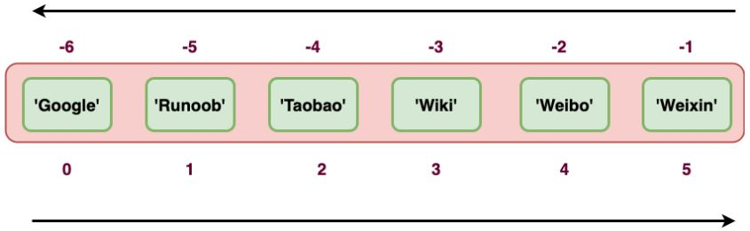

---

### 1.3.1 数据类型

- 元组（tuple）
  - 元组索引和截取：

<font size=4>

| Python 表达式 | 结果 | 描述
|----- | ------|----|
| tup[1] | 'Runoob'|  读取第二个元素
| tup[-2] | 'Weibo' | 反向读取，读取倒数第二个元素
| tup[1:] | ('Runoob', 'Taobao', 'Wiki', 'Weibo', 'Weixin') | 截取元素，从第二个开始后的所有元素。
| tup[1:4] | ('Runoob', 'Taobao', 'Wiki') | 截取元素，从第二个开始到第四个元素（索引为 3）。

</font>

---

### 1.3.1 数据类型

- 元组（tuple）
  - 元组索引和截取：

```python
>>> tup = ('Google', 'Runoob', 'Taobao', 'Wiki', 'Weibo','Weixin')
>>> tup[1]
'Runoob'
>>> tup[-2]
'Weibo'
>>> tup[1:]
('Runoob', 'Taobao', 'Wiki', 'Weibo', 'Weixin')
>>> tup[1:4]
('Runoob', 'Taobao', 'Wiki')
```

---

### 1.3.1 数据类型

- 元组（tuple）
  - 元组内置函数：len(tuple),max(tuple),min(tuple),tuple(iterable)
  - 关于元组是不可变的:元组所指向的内存中的内容不可变。

---

### 1.3.1 数据类型

- 字典（dict）
  - 字典是另一种可变容器模型，且可存储任意类型对象。
  - 字典的每个键值 key=>value 对用冒号 : 分割，每个对之间用逗号(,)分割，整个字典包括在花括号 {} 中 ,格式如下所示：

```python
d = {key1 : value1, key2 : value2, key3 : value3 }
```

---

### 1.3.1 数据类型

- 字典（dict）
  

  - 注意：dict 作为 Python 的关键字和内置函数，变量名不建议命名为 dict。
  - 值可以取任何数据类型，但键必须是不可变的，如字符串，数字。

---

### 1.3.1 数据类型

- 字典（dict）
  - 一个简单的字典实例：

```python
tinydict = {'name': 'runoob', 'likes': 123, 'url': 'www.runoob.com'}
```

  

---

### 1.3.1 数据类型

- 字典（dict）
  - 访问字典里的值

```python
tinydict = {'Name': 'Runoob', 'Age': 7, 'Class': 'First'}
 
print ("tinydict['Name']: ", tinydict['Name'])
print ("tinydict['Age']: ", tinydict['Age'])

以上实例输出结果：

tinydict['Name']:  Runoob
tinydict['Age']:  7
```

---

### 1.3.1 数据类型

- 字典（dict）
  - 修改字典(向字典添加新内容/增加新的键/值):

```python
tinydict = {'Name': 'Runoob', 'Age': 7, 'Class': 'First'}

tinydict['Age'] = 8               # 更新 Age
tinydict['School'] = "Python教程"  # 添加信息

print ("tinydict['Age']: ", tinydict['Age'])
print ("tinydict['School']: ", tinydict['School'])

以上实例输出结果：

tinydict['Age']:  8
tinydict['School']:  Python教程
```

---

### 1.3.1 数据类型

- 字典（dict）
  - 删除字典元素(删除已有键/值):

```python
tinydict = {'Name': 'Runoob', 'Age': 7, 'Class': 'First'}
 
del tinydict['Name'] # 删除键 'Name'
tinydict.clear()     # 清空字典
del tinydict         # 删除字典
 
print ("tinydict['Age']: ", tinydict['Age'])
print ("tinydict['School']: ", tinydict['School'])
但这会引发一个异常，因为用执行 del 操作后字典不再存在：
Traceback (most recent call last):
  File "/runoob-test/test.py", line 9, in <module>
    print ("tinydict['Age']: ", tinydict['Age'])
NameError: name 'tinydict' is not defined
```

---

### 1.3.1 数据类型

- 字典（dict）
  - 字典键的特性
  1. 字典值可以是任何的 python 对象，既可以是标准的对象，也可以是用户定义的，但键不行。
  2. 不允许同一个键出现两次。创建时如果同一个键被赋值两次，后一个值会被记住。
  3. 键必须不可变，所以可以用数字，字符串或元组充当，而用列表就不行。

---

### 1.3.1 数据类型

- 字典（dict）
  - 字典内置函数:len(dict),str(dict),type(variable)
  - 字典内置方法:dict.clear(),dict.copy(),dict.fromkeys(),dict.get(key, default=None), key in dict,dict.items(),dict.keys(),dict.setdefault(key,default=None),dict.update(dict2),dict.values(), dict.values(),pop(key[,default]),popitem()

---

### 1.3.1 数据类型

- 集合（set）
  - 集合（set）是一个无序的不重复元素序列。
  - 集合中的元素不会重复，可进行交集、并集、差集等。
  - 可以使用大括号 { } 创建集合，元素之间用逗号 , 分隔， 或者也可以使用 set() 函数创建集合。
  - 创建一个空集合必须用 set() 而不是 { }，因为 { } 是用来创建一个空字典。

```python
set1 = {1, 2, 3, 4}            # 直接使用大括号创建集合
set2 = set([4, 5, 6, 7])      # 使用 set() 函数从列表创建集合
```

---

### 1.3.1 数据类型

- 集合（set）
  - 集合的基本操作
  1. 添加元素: s.add( x )
  2. 移除元素: s.remove( x )
  3. 计算集合元素个数: len(s)
  4. 清空集合: s.clear()
  5. 判断元素是否在集合中存在: x in s

---

### 1.3.1 数据类型

- 集合（set）
  - 集合内置方法:add(),clear(),copy(),difference(),difference_update(),discard()...

---

### 1.3.1 数据类型

- 几种数据类型的异同
<font size=3>

| 特性                  | 字符串 (str)         | 列表 (list)          | 元组 (tuple)        | 字典 (dict)          | 集合 (set)          |
|-----------------------|-----------------------|-----------------------|----------------------|-----------------------|-----------------------|
| 可变性                | 不可变 (Immutable)   | 可变 (Mutable)       | 不可变 (Immutable) | 可变 (Mutable)       | 可变 (Mutable)       |
| 元素类型              | 字符                  | 可包含不同类型元素    | 可包含不同类型元素     | 键和值可以是不同类型   | 不可包含重复元素     |
| 访问元素              | 通过索引访问         | 通过索引访问         | 通过索引访问         | 通过键访问           | 通过成员检查访问     |
| 有序性                | 有序 (Ordered)       | 有序 (Ordered)       | 有序 (Ordered)      | 无序 (Unordered)     | 无序 (Unordered)     |
| 表示方式              | 使用单引号、双引号或三引号 | 使用方括号 []         | 使用圆括号 ()       | 使用花括号 {}        | 使用花括号 {}        |
| 示例                  | `"Hello, Python!"`    | `my_list = [1, 2, 3]` | `my_tuple = (1, 2, 3)` | `my_dict = {"name": "Alice", "age": 30}` | `my_set = {1, 2, 3}` |

</font>

---

### 1.3.1 数据类型

- Python 数字类型转换
  - int(x) 将x转换为一个整数。

  - float(x) 将x转换到一个浮点数。

  - complex(x) 将x转换到一个复数，实数部分为 x，虚数部分为 0。

  - complex(x, y) 将 x 和 y 转换到一个复数，实数部分为 x，虚数部分为 y。x 和 y 是数字表达式

---

### 1.3.2 变量

- 变量的命名规则
  - 标识符的字符：
    - 变量名只能包含字母、数字和下划线（_）。
    - 变量名不能以数字开头，但可以包含数字。
    - 变量名是区分大小写的，例如 myVariable 和 myvariable 是不同的变量。
  - 保留字：不能使用Python的保留字（关键字）作为变量名。例如，if、else、for、while等都是保留字，不能用作变量名。

---

### 1.3.2 变量

- 变量的命名规则
  - 命名约定：Python社区通常遵循以下命名约定（PEP 8）：
    - 使用小写字母来命名变量和函数，例如 my_variable。
    - 对于常量，通常使用全大写字母，例如 PI。
    - 如果变量名由多个单词组成，可以使用下划线进行单词分隔，这被称为蛇形命名法（snake_case）。

---

### 1.3.2 变量

- 变量的命名规则
  - 描述性命名：变量名应该具有描述性，以便其他人能够理解其用途。避免使用不清晰或过于简单的变量名，例如 x 或 a，而应该使用具有意义的名称，如 count、total_score 等。
  - 避免使用单个字符：除非用作计数器或临时变量，否则应避免使用单个字符的变量名。使用具有描述性的名称可以提高代码的可读性。
  - 内置函数和库名：避免使用Python内置函数和库的名称作为变量名，以免发生命名冲突。

---

### 1.3.2 变量

- 变量的命名规则
  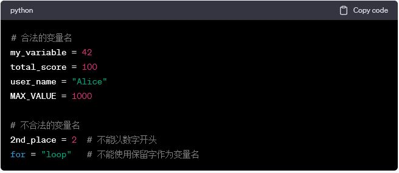

  正确的变量命名有助于使代码更易于理解和维护，因此请确保遵循Python的变量命名规则和最佳实践。

---

### 1.3.2 变量

- 变量的赋值
  - 变量可以通过使用等号 = 运算符来进行赋值。
  - 变量名必须遵循命名规则，如前面所述。
  - 赋值语句的右侧可以是任何表达式，包括常量、变量、运算、函数调用等。
  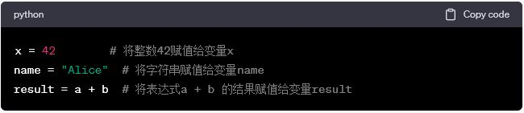

---

### 1.3.2 变量

- 变量类型：
  - Python 是一种动态类型语言，变量的类型是根据其值自动推断的，您不需要显式指定类型。同一个变量可以在不同的上下文中引用不同类型的值。
- 变量命名空间：
  - 变量名是在变量的命名空间中定义的，不同的命名空间可以包含相同名称的变量而不会冲突。例如，一个变量可以在全局命名空间中定义，同时在函数内定义相同名称的变量。

---

### 1.3.2 变量

- 变量的作用域：
  - 变量的作用域指的是变量在代码中的可见性范围。Python具有局部作用域和全局作用域。在函数内定义的变量通常具有局部作用域，只能在该函数内访问，而在函数外定义的变量通常具有全局作用域，可以在整个程序中访问。
- 变量引用：
  - 使用变量名可以访问变量的值。变量名可以用作表达式的一部分，以获取和修改变量的值。

---

### 1.3.2 变量

- 变量重赋值：
  - 变量的值可以重复赋值，新的值会覆盖旧的值。
  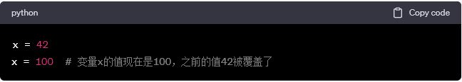
- 删除变量：
  - 使用 del 语句可以删除变量，释放其占用的内存。删除后尝试访问变量会引发 NameError。  
  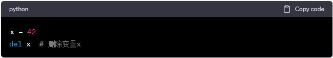

---


## 1.3.2 变量

<font size=4>

在 python 中，类型属于对象，变量是没有类型的：

```python
a=[1,2,3]
 
a="Runoob"
```

以上代码中，[1,2,3] 是 List 类型，"Runoob" 是 String 类型，而变量 a 是没有类型，她仅仅是一个对象的引用（一个指针），可以是 List 类型对象，也可以指向 String 类型对象。

**类型属于对象**：在Python中，每个值（包括变量）都是一个对象，而每个对象都有一个类型。类型描述了对象的性质和操作，例如整数、字符串、列表等。你可以使用type()函数来获取一个对象的类型。例如，type(42)会返回<class 'int'>，表示这是一个整数对象。

**变量是没有类型的**：Python的变量是标签或引用，它们指向内存中的对象。变量本身没有固定的类型，而是可以随时指向不同类型的对象。例如，你可以将一个变量用于存储整数，然后将其重新赋值为字符串，而Python会适应这个改变。

</font>

---


## 1.3.2 变量

<font size=4>

类和对象是面向对象编程（OOP）的核心概念：

**类（Class）**：类是一种抽象的蓝图或模板，它定义了对象的结构和行为。类包含属性（成员变量）和方法（成员函数），这些描述了对象应该具有的特征和行为。在Python中，类通过class关键字定义。

**对象（Object）**：对象是类的实例，它是根据类的定义创建的具体实体。对象具有类定义的属性和方法，可以独立操作和与其他对象互动。对象是程序中的实体，它们可以执行特定的任务和存储数据。

```python
class Dog:  # 定义一个类
    def __init__(self, name):  # 类的构造函数
        self.name = name  # 类的属性

    def bark(self):  # 类的方法
        print(f"{self.name} is barking")

# 创建两个狗的对象
dog1 = Dog("Buddy")
dog2 = Dog("Max")

# 调用对象的方法
dog1.bark()  # 输出: Buddy is barking
dog2.bark()  # 输出: Max is barking
```

</font>

---


## 1.3.2 变量

<font size=4>

在Python中，变量和对象是核心概念：

**变量**：变量是用于存储数据的标识符，它可以指向各种不同类型的对象。变量在Python中不需要提前声明或指定类型，你可以直接创建一个变量并将其赋值。变量本质上是名称，它指向内存中存储的对象。例如，x = 10中的x是一个变量，它指向一个整数对象10。

**对象**：对象是Python中的基本数据单元，一切都是对象。对象是具体的数据实体，可以是数字、字符串、列表、函数等等。每个对象都有自己的数据类型，特性和行为。例如，整数10、字符串"Hello"和列表[1, 2, 3]都是不同类型的对象。

Python的变量实际上是对象的引用，它们指向内存中存储的对象。将一个变量赋值给另一个变量时，它们实际上指向同一个对象，因此更改一个变量可能会影响另一个变量。这是因为Python采用引用语义，变量存储的是对象的引用，而不是对象本身。

```python
x = 10  # 创建一个变量x，指向整数对象10
y = x   # 创建一个变量y，也指向整数对象10

# 修改x的值，同时y的值也会受到影响
x = 20

print(x)  # 输出: 20
print(y)  # 输出: 10
```

</font>

---

## 1.3.2 变量

<font size=4>

在Python中，术语"对象"可以在不同上下文中具有不同的含义。以下是对Python中对象和OOP（面向对象编程）概念中的对象之间区别的解释：

**Python中的对象**：

在Python中，一切都是对象。这意味着所有数据都是对象，包括数字、字符串、函数、类等。
每个对象都有自己的数据类型，属性和方法。
你可以创建自定义对象，这通常是通过定义类（class）来实现的，然后可以创建该类的实例。
Python中的对象是编程中的核心，它们用于存储和操作数据。

**OOP概念中的对象**：

在面向对象编程（OOP）中，对象是类的实例。类是一种蓝图或模板，描述了对象应该具有的属性和方法。
对象是类的具体实现，它们基于类的定义创建。
OOP通过将数据和操作封装在对象中来组织和管理代码，使代码更易维护和理解。
面向对象编程的核心思想是将问题分解为对象，每个对象具有特定的职责和行为。

**Python中的对象是通用的，可以代表任何数据实体，而OOP中的对象是类的实例，具有特定的属性和行为，用于实现面向对象编程的概念。 Python是一种面向对象编程语言，因此在Python中，对象既可以指代通用的数据实体，也可以指代面向对象编程中的类的实例。**

</font>

---


### 1.3.3 运算符

- 算术运算符（+、-、*、/）
- 比较运算符（==、!=、<、>）
- 逻辑运算符（and、or、not）
- 赋值运算符（=、+=、-=）
- 其他运算符（in、is、位运算符等）

---

### 1.3.3 运算符

- 算术运算符
<font size=4>

| 运算符 | 描述                         | 实例                 |
| ------ | ---------------------------- | ---------------------- |
| +      | 加 - 两个对象相加           | a + b 输出结果 31     |
| -      | 减 - 得到负数或是一个数减去另一个数 | a - b 输出结果 -11 |
| *      | 乘 - 两个数相乘或是返回一个被重复若干次的字符串 | a * b 输出结果 210 |
| /      | 除 - x 除以 y               | b / a 输出结果 2.1   |
| %      | 取模 - 返回除法的余数       | b % a 输出结果 1     |
| **     | 幂 - 返回 x 的 y 次幂       | a**b 为 10 的 21 次方 |
| //     | 取整除 - 往小的方向取整数  | 9//2 输出结果 4，-9//2 输出结果 -5 |

</font>

---

### 1.3.3 运算符

- 比较运算符（==、!=、<、>）
<font size=5>

| 运算符 | 描述                               | 实例                  |
| ------ | ---------------------------------- | ----------------------- |
| ==     | 等于 - 比较对象是否相等             | (a == b) 返回 False。   |
| !=     | 不等于 - 比较两个对象是否不相等     | (a != b) 返回 True。    |
| >      | 大于 - 返回 x 是否大于 y             | (a > b) 返回 False。    |
| <      | 小于 - 返回 x 是否小于 y             | (a < b) 返回 True。     |
| >=     | 大于等于 - 返回 x 是否大于等于 y    | (a >= b) 返回 False。   |
| <=     | 小于等于 - 返回 x 是否小于等于 y    | (a <= b) 返回 True。    |

</font>

---

### 1.3.3 运算符

- 逻辑运算符（and、or、not）
<font size=4>

| 运算符 | 逻辑表达式 | 描述                                   | 实例              |
| ------ | ---------- | -------------------------------------- | ------------------- |
| and    | x and y    | 布尔"与" - 如果 x 为 False，返回 x 的值，否则返回 y 的计算值。 | (a and b) 返回 20。 |
| or     | x or y     | 布尔"或" - 如果 x 是 True，返回 x 的值，否则返回 y 的计算值。 | (a or b) 返回 10。  |
| not    | not x      | 布尔"非" - 如果 x 为 True，返回 False。如果 x 为 False，返回 True。 | not(a and b) 返回 False。 |

</font>

---

### 1.3.3 运算符

- 赋值运算符（=、+=、-=）
<font size=4>

| 运算符 | 描述                                | 实例                                   |
| ------ | ----------------------------------- | ---------------------------------------- |
| =      | 简单的赋值运算符                    | c = a + b 将 a + b 的运算结果赋值为 c  |
| +=     | 加法赋值运算符                      | c += a 等效于 c = c + a                |
| -=     | 减法赋值运算符                      | c -= a 等效于 c = c - a                |
| *=     | 乘法赋值运算符                      | c *= a 等效于 c = c * a                |
| /=     | 除法赋值运算符                      | c /= a 等效于 c = c / a                |
| %=     | 取模赋值运算符                      | c %= a 等效于 c = c % a                |
| **=    | 幂赋值运算符                        | c **= a 等效于 c = c ** a              |
| //=    | 取整除赋值运算符                    | c //= a 等效于 c = c // a              |
| :=     | 海象运算符，可在表达式内部为变量赋值 | 在这个示例中，赋值表达式可以避免调用 len() 两次: if (n := len(a)) > 10: print(f"List is too long ({n} elements, expected <= 10)") |

</font>

---

### 1.3.3 运算符

- 其他运算符（in、is、位运算符等）
<font size=4>

| 运算符 | 描述                                        | 实例                                |
| ------ | ------------------------------------------- | ------------------------------------- |
| in     | 如果在指定的序列中找到值返回 True，否则返回 False。 | x 在 y 序列中 , 如果 x 在 y 序列中返回 True。 |
| not in | 如果在指定的序列中没有找到值返回 True，否则返回 False。 | x 不在 y 序列中 , 如果 x 不在 y 序列中返回 True。 |

| 运算符 | 描述                                                         | 实例                                                               |
| ------ | ------------------------------------------------------------ | -------------------------------------------------------------------- |
| is     | 判断两个标识符是否引用同一个对象，类似于 `id(x) == id(y)`，如果引用同一个对象则返回 True，否则返回 False。 | `x is y` 返回 True，如果引用的是同一个对象。                         |
| is not | 判断两个标识符是否引用不同对象，类似于 `id(x) != id(y)`，如果引用不同对象则返回 True，否则返回 False。 | `x is not y` 返回 True，如果引用的不是同一个对象。                   |

</font>

---

### 1.3.4 表达式

- 表达式的构建
- 运算符优先级

---

### 1.3.4 表达式

- 表达式的构建
  - Python表达式是由`操作数（operands）`和`操作符（operators）`组成的组合，用于执行特定的计算或操作：
    1. 操作数（Operands）：操作数是表达式中的值或对象。操作数可以是各种类型的数据，包括数字、变量、字符串、函数调用、列表、字典等。操作数是表达式中的输入数据，通过运算符进行处理和计算。

---

### 1.3.4 表达式

1. 操作数（Operands）：
<font size=5>
     - 数字：整数、浮点数、复数等数字可以作为操作数。例如，5, 3.14, 2 + 3j。
     - 变量：变量可以存储数据，并在表达式中使用。例如，x, y, my_variable。
     - 字符串：文本字符串可以作为操作数。例如，"Hello, World!"。
     - 函数调用：函数调用的结果可以作为操作数。例如，len(my_list)。
     - 容器：列表、元组、集合、字典等容器类型可以作为操作数。例如，[1, 2, 3], ('a', 'b', 'c'), {'apple', 'banana'}。
     - 表达式：表达式本身也可以作为操作数。例如，(x + y) * z。

</font>

---

### 1.3.4 表达式

2. 操作符（Operators）：操作符是用于执行具体操作的符号或关键字。Python支持多种类型的操作符，包括算术、比较、逻辑、赋值、成员检查、身份检查等。
<font size=4>
     - 算术操作符：用于执行数学运算，如加法、减法、乘法、除法、取余等。例如，+, -, *, /, %。
     - 比较操作符：用于比较两个值，返回布尔结果，如等于、不等于、大于、小于等。例如，==, !=, >, <, >=, <=。
     - 逻辑操作符：用于执行逻辑运算，如与、或、非。例如，and, or, not。
     - 赋值操作符：用于将值分配给变量。例如，=，+=, -=。
     - 位操作符：用于执行位运算，如按位与、按位或、按位异或等。例如，&, |, ^。
     - 成员操作符：用于检查值是否存在于容器中。例如，in, not in。
     - 身份操作符：用于检查对象的标识是否相同。例如，is, is not。
</font>

---

### 1.3.4 表达式

3. 表达式的组合：表达式通过组合操作数和操作符来构建。操作符指定了如何处理操作数以获得结果。表达式可以是简单的，如 5 + 3，也可以是复杂的，包括多个嵌套的操作符和操作数。
<font size=5>
     - 以下是一些Python表达式的示例：
     - 简单加法表达式：5 + 3
     - 变量赋值表达式：x = 10
     - 逻辑与表达式：(x > 5) and (y < 3)
     - 函数调用表达式：len(my_list)
     - 字符串连接表达式："Hello, " + "World!"
     - 列表索引表达式：my_list[0]

</font>

---

### 1.3.4 表达式

4. 运算符优先级和结合性：Python中的操作符具有不同的优先级和结合性。优先级确定了操作符的执行顺序，而结合性指定了操作符在表达式中的结合方式。有时，使用括号来明确指定操作符的执行顺序是很重要的。
<font size=5>
     - 示例：乘法的优先级高于加法，因此 2 + 3 *4 的结果为 14，而 (2 + 3)* 4 的结果为 20。

</font>

---

### 1.3.4 表达式

- 运算符优先级
  - 以下表格列出了从最高到最低优先级的所有运算符， 相同单元格内的运算符具有相同优先级。 运算符均指二元运算，除非特别指出。 相同单元格内的运算符从左至右分组（除了幂运算是从右至左分组）：

---

### 1.3.4 表达式

<font size=2>

| 运算符       | 描述                                        |
| ------------ | ------------------------------------------- |
| ,            | 表达式分隔符                                |
| []           | 圆括号中的表达式                            |
| [ ]          | 列表，字典，集合的创建                      |
| ( )          | 圆括号中的表达式                            |
| x[index]     | 读取元素                                    |
| x[index:index] | 切片                                     |
| x(arguments...) | 调用函数或方法                             |
| x.attribute  | 属性引用                                    |
| await x      | 等待表达式                                  |
| **           | 乘方，指数运算                             |
| +x, -x, ~x   | 正数，负数，按位非 NOT                     |
| *, @, /, //, % | 乘法，矩阵乘法，除法，整除，取余           |
| +, -         | 加法，减法                                 |
| <<, >>       | 左移位，右移位                             |
| &            | 按位与 AND                                 |
| ^            | 按位异或 XOR                               |
| |            | 按位或 OR                                  |
| in, not in, is, is not, <, <=, >, >=, !=, == | 比较运算，包括成员检测和标识号检测 |
| not x        | 逻辑非 NOT                                 |
| and          | 逻辑与 AND                                 |
| or           | 逻辑或 OR                                  |
| if -- else   | 条件表达式                                 |
| lambda       | lambda 表达式                              |
| :=           | 赋值表达式                                 |

</font>

---

### 1.3.5 推导式

- Python 推导式是一种独特的数据处理方式，可以从一个数据序列构建另一个新的数据序列的结构体。Python推导式是一种用于创建新的数据序列的便捷方式，它通常使用以下关键词：

<font size=5>

**for**：用于迭代原始数据序列，类似于循环中的迭代变量。
**if**：可选关键词，用于过滤数据序列中的元素，只选择满足条件的元素。
**in**：用于指定要迭代的数据序列。
**表达式**：在推导式中执行的操作或计算，用于生成新数据序列中的每个元素。

这些关键词简化代码和提高可读性。

</font>

---


### 1.3.5 推导式

- Python 支持各种数据结构的推导式：
  - 列表(list)推导式
  - 字典(dict)推导式
  - 集合(set)推导式
  - 元组(tuple)推导式

---


### 1.3.5 推导式

- 列表(list)推导式：

```python
[表达式 for 变量 in 列表] 
[out_exp_res for out_exp in input_list]
```

或者

```python
[表达式 for 变量 in 列表 if 条件]
[out_exp_res for out_exp in input_list if condition]
```

<font size=3>
out_exp_res：列表生成元素表达式，可以是有返回值的函数。
for out_exp in input_list：迭代 input_list 将 out_exp 传入到 out_exp_res 表达式中。
if condition：条件语句，可以过滤列表中不符合条件的值。
</font>

---

### 1.3.5 推导式

- 列表(list)推导式`实例`：

```python
>>> names = ['Bob','Tom','alice','Jerry','Wendy','Smith']
>>> new_names = [name.upper()for name in names if len(name)>3]
>>> print(new_names)
['ALICE', 'JERRY', 'WENDY', 'SMITH']
```

```python
>>> multiples = [i for i in range(30) if i % 3 == 0]
>>> print(multiples)
[0, 3, 6, 9, 12, 15, 18, 21, 24, 27]
```

---

### 1.3.5 推导式

- 字典(dict)推导式:

```python
{ key_expr: value_expr for value in collection }
```

或

```python
{ key_expr: value_expr for value in collection if condition }
```

---


### 1.3.5 推导式

实例：推导式写出菲波那切数列。

```python
n = 10  # 想要生成的斐波那契数的数量
fibonacci = [0, 1]  # 初始斐波那契数列的前两个数

[fibonacci.append(fibonacci[-1] + fibonacci[-2]) for _ in range(2, n)]

print(fibonacci)
```

---


### 1.3.5 推导式

实例：推导式写出10000以内所有质数。

```python
primes = [2] + [i for i in range(3, 10001, 2) if all(i % j != 0 for j in range(3, int(i**0.5)+1, 2))]

```

---


### 1.3.5 推导式

实例：推导式写出10000以内所有质数。

```python
primes = [2] + [i for i in range(3, 10001, 2) if all(i % j != 0 for j in range(3, int(i**0.5)+1, 2))]

```

---


<!-- 
## 1.3 数据类型

详细讨论Python的各种数据类型，包括其特性、用途和示例。

---

## 1.4 数据结构

介绍Python的常见数据结构，如列表、元组、字典和集合，以及它们的操作和用法。

--- -->

## 1.4 控制流程

- Python通过一系列控制流程语句来管理程序的执行顺序。
- Python中的控制流程：
  - 条件语句（if、elif、else）
  - 循环语句（for、while）
  - break和continue
  - 异常处理

---

## 1.4.1 条件语句

- Python条件语句是通过一条或多条语句的执行结果（True或者False）来决定执行的代码块。
- Python 编程中 if 语句用于控制程序的执行：其中"判断条件"成立时（非零），则执行后面的语句，而执行内容可以多行，以缩进来区分表示同一范围。基本形式为：

```python
if 判断条件：
    执行语句……
else：
    执行语句……
```

---

## 1.4.1 条件语句


---

## 1.4.1 条件语句

```python
flag = False
name = 'luren'
if name == 'python':         # 判断变量是否为 python 
    flag = True              # 条件成立时设置标志为真
    print 'welcome boss'     # 并输出欢迎信息
else:
    print name               # 条件不成立时输出变量名称
```

---

## 1.4.1 条件语句

- if 语句的判断条件可以用>（大于）、<(小于)、==（等于）、>=（大于等于）、<=（小于等于）来表示其关系。当判断条件为多个值时，可以使用以下形式：

```python
if 判断条件1:
    执行语句1……
elif 判断条件2:
    执行语句2……
elif 判断条件3:
    执行语句3……
else:
    执行语句4……
```

---

## 1.4.1 条件语句

```python
num = 5     
if num == 3:            # 判断num的值
    print 'boss'        
elif num == 2:
    print 'user'
elif num == 1:
    print 'worker'
elif num < 0:           # 值小于零时输出
    print 'error'
else:
    print 'roadman'     # 条件均不成立时输出
```


---

## 1.4.2 循环语句

- 循环语句允许执行一个语句或语句组多次，下面是在大多数编程语言中的循环语句的一般形式：


---

## 1.4.2 循环语句

- Python 提供了 for 循环和 while 循环（在 Python 中没有 do..while 循环）:
<font size=5>

| 循环类型   | 描述                                                |
|------------|-----------------------------------------------------|
| while 循环 | 在给定的判断条件为 true 时执行循环体，否则退出循环体。 |
| for 循环   | 重复执行语句。                                       |
| 嵌套循环   | 你可以在 while 循环体中嵌套 for 循环。             |

</font>

---

## 1.4.2 循环语句

- 循环控制语句:循环控制语句可以更改语句执行的顺序。Python支持以下循环控制语句：
<font size=5>

| 控制语句      | 描述                                                                  |
|--------------|----------------------------------------------------------------------|
| break 语句   | 在语句块执行过程中终止循环，并且跳出整个循环。                      |
| continue 语句 | 在语句块执行过程中终止当前循环，跳出该次循环，执行下一次循环。      |
| pass 语句     | `pass` 是空语句，是为了保持程序结构的完整性。它不执行任何操作。       |

</font>

---

## 1.4.2 循环语句

- While 循环语句
  While用于循环执行程序: 即在某条件下，循环执行某段程序，以处理需要重复处理的相同任务。其基本形式为：

```python
while 判断条件(condition)：
    执行语句(statements)……
```

- 执行语句可以是单个语句或语句块。判断条件可以是表达式，任何非零、或非空（null）的值均为true。当判断条件假 false 时，循环结束。

---

## 1.4.2 循环语句

- While 循环语句


---

## 1.4.2 循环语句

- While 循环语句

```python
count = 0
while (count < 5):
   print 'The count is:', count
   count = count + 1
print "Good bye!"
以上代码执行输出结果:

The count is: 0
The count is: 1
The count is: 2
The count is: 3
The count is: 4
Good bye!
```

---

## 1.4.2 循环语句

- While 循环语句
while 语句时还有另外两个重要的命令 continue，break 来跳过循环，continue 用于跳过该次循环，break 则是用于退出循环：

```python
i = 1
while i < 10:   
    i += 1
    if i%2 > 0:     # 非双数时跳过输出
        continue
    print i         # 输出双数2、4、6、8、10
```

---

## 1.4.2 循环语句

- While 循环语句
"判断条件"还可以是个常值，表示循环必定成立

```python
i = 1
while 1:            # 循环条件为1必定成立
    print i         # 输出1~10
    i += 1
    if i > 10:     # 当i大于10时跳出循环
        break
```

---

## 1.4.2 循环语句

- 循环使用 else 语句
while … else 在循环条件为 false 时执行 else 语句块：
<font size=5>

```python
count = 0
while count < 5:
   print count, " is  less than 5"
   count = count + 1
else:
   print count, " is not less than 5"

以上实例输出结果为：

0 is less than 5
1 is less than 5
2 is less than 5
3 is less than 5
4 is less than 5
5 is not less than 5
```

</font>

---

## 1.4.2 循环语句

- for 循环语句
for循环可以遍历任何序列的项目，如一个列表或者一个字符串:


---

## 1.4.2 循环语句

- for 循环语句

```python
for letter in 'Python':     # 遍历字符串
   print("当前字母: %s" % letter)
 
fruits = ['banana', 'apple',  'mango']
for fruit in fruits:        # 遍历列表
   print ('当前水果: %s'% fruit)
 
print ("Good bye!")

```

---

## 1.4.2 循环语句

- for 循环语句

以上实例输出结果:

```
当前字母: P
当前字母: y
当前字母: t
当前字母: h
当前字母: o
当前字母: n
当前水果: banana
当前水果: apple
当前水果: mango
Good bye!
```

---

## 1.4.2 循环语句

- for 循环语句
  - 循环使用 else 语句
  - 在 python 中，for … else 表示这样的意思，for 中的语句和普通的没有区别，else 中的语句会在循环正常执行完（即 for 不是通过 break 跳出而中断的）的情况下执行，while … else 也是一样。

---

## 1.4.2 循环语句

- for 循环语句
  - 循环使用 else 语句

```python
for num in range(10,20):  # 迭代 10 到 20 之间的数字
   for i in range(2,num): # 根据因子迭代
      if num%i == 0:      # 确定第一个因子
         j=num/i          # 计算第二个因子
         print ('%d 等于 %d * %d' % (num,i,j))
         break            # 跳出当前循环
   else:                  # 循环的 else 部分
      print ('%d 是一个质数' % num)
```

---

## 1.4.2 循环语句

- 循环嵌套
  - Python 语言允许在一个循环体里面嵌入另一个循环。
  - for 循环嵌套语法：

```python
for iterating_var in sequence:
   for iterating_var in sequence:
      statements(s)
   statements(s)
```

---

## 1.4.2 循环语句

- 循环嵌套
  - while 循环嵌套语法：

```python
while expression:
   while expression:
      statement(s)
   statement(s)
```

---

## 1.4.2 循环语句

- 循环嵌套

```python
i = 2 
while(i < 100): # 嵌套循环输出2~100之间的素数
   j = 2
   while(j <= (i/j)):
      if not(i%j): break
      j = j + 1
   if (j > i/j) : print i, " 是素数"
   i = i + 1
 
print "Good bye!"
```

---

## 1.4.2 break和continue

- break 语句
  
<font size=3>
  Python break语句打破最小封闭for或while循环。
  break语句用来终止while和for循环，即循环条件没有False条件或者序列还没被完全递归完，也会停止执行循环语句。
  如果您使用嵌套循环，break语句将停止执行最深层的循环，并开始执行下一行代码。
</font>


---

## 1.4.2 break和continue

- break 语句

```python
# 使用 break 语句来提前结束循环

fruits = ["苹果", "香蕉", "橙子", "草莓", "葡萄"]

for fruit in fruits:
    if fruit == "橙子":
        print("我找到了橙子！")
        break  # 当找到橙子时提前结束循环
    print("正在检查：" + fruit)
```

---

## 1.4.2 break和continue

- continue 语句

<font size=3>
Python continue 语句跳出本次循环，而break跳出整个循环。
continue 语句用来告诉Python跳过当前循环的剩余语句，然后继续进行下一轮循环。
continue语句用在while和for循环中。
</font>


---

## 1.4.2 break和continue

- continue 语句

```python
# 使用 continue 语句来跳过当前循环迭代，继续下一次迭代：
# 当循环遍历到偶数时，continue语句被执行，
# 导致当前迭代被跳过，而不是执行后续的打印语句。因此，只有奇数数字被打印出来。

numbers = [1, 2, 3, 4, 5]

for number in numbers:
    if number % 2 == 0:
        continue  # 当数字是偶数时跳过当前迭代
    print(f"奇数数字：{number}")
```

---

## 1.4.2 异常处理

异常即是一个事件，该事件会在程序执行过程中发生，影响了程序的正常执行。

一般情况下，在Python无法正常处理程序时就会发生一个异常。

异常是Python对象，表示一个错误。

当Python脚本发生异常时我们需要捕获处理它，否则程序会终止执行。

---

## 1.4.2 异常处理

捕捉异常可以使用try/except语句。

try/except语句用来检测try语句块中的错误，从而让except语句捕获异常信息并处理。

如果你不想在异常发生时结束你的程序，只需在try里捕获它。

try....except...else的语法：

---

## 1.4.2 异常处理

```python
try:
<语句>        #运行别的代码
except <名字>：
<语句>        #如果在try部份引发了'name'异常
except <名字>，<数据>:
<语句>        #如果引发了'name'异常，获得附加的数据
else:
<语句>        #如果没有异常发生
```

---

## 1.4.2 异常处理

```python
try:
    fh = open("testfile", "w")
    fh.write("这是一个测试文件，用于测试异常!!")
except IOError:
    print "Error: 没有找到文件或读取文件失败"
else:
    print "内容写入文件成功"
    fh.close()
```

```
以上程序输出结果：
$ python test.py 
内容写入文件成功
$ cat testfile       # 查看写入的内容
这是一个测试文件，用于测试异常!!
```

---  

## 1.4.2 异常处理

```python
try:
    fh = open("testfile", "w")
    fh.write("这是一个测试文件，用于测试异常!!")
except IOError:
    print "Error: 没有找到文件或读取文件失败"
else:
    print "内容写入文件成功"
    fh.close()
```

```
在执行代码前为了测试方便，我们可以先去掉 testfile 文件的写权限，命令如下：
chmod -w testfile
再执行以上代码：
$ python test.py 
Error: 没有找到文件或读取文件失败
```

---

## 1.4.2 异常处理

```
可以不带任何异常类型使用except：

try:
    正常的操作
   ......................
except:
    发生异常，执行这块代码
   ......................
else:
    如果没有异常执行这块代码

以上方式try-except语句捕获所有发生的异常。
但这不是一个很好的方式，我们不能通过该程序识别出具体的异常信息。
因为它捕获所有的异常。
```

---

## 1.4.2 异常处理

```
可以使用相同的except语句来处理多个异常信息：
try:
    正常的操作
   ......................
except(Exception1[, Exception2[,...ExceptionN]]):
   发生以上多个异常中的一个，执行这块代码
   ......................
else:
    如果没有异常执行这块代码
```

---

## 1.5 函数

- 函数是组织好的，可重复使用的，用来实现单一，或相关联功能的代码段。

- 函数能提高应用的模块性和代码的重复利用率。

- Python提供了许多内建函数，比如print()。

- 自己创建函数叫做用户自定义函数。

---

## 1.5 函数

- 函数的定义规则：
  - 函数定义以 def 开始，后跟函数名称和参数列表。
  - 参数应放在括号内，可以在括号内定义参数。
  - 函数的第一行可以包含文档字符串，用于函数的说明。
  - 函数体以冒号开始，并进行缩进。
  - 使用 return [表达式] 来结束函数，可以选择性地向调用方返回一个值，不带表达式的 return 相当于返回 None。

---

## 1.5 函数

- 函数的定义

```python
def functionname( parameters ):
   "函数_文档字符串"
   function_suite
   return [expression]
```

```python
def printme( str ):
   "打印传入的字符串到标准显示设备上"
   print str
   return
```

---

## 1.5 函数

- 函数的调用
  - 定义一个函数基本结构后，可以通过另一个函数调用执行，也可以直接从Python提示符执行。
  - 如下实例调用了printme（）函数：

```python
def printme( str ):
   "打印任何传入的字符串"
   print str
   return
# 调用函数
printme("我要调用用户自定义函数!")
printme("再次调用同一函数")
```

---

## 1.5 函数

- 函数的调用

```
以上实例输出结果：

我要调用用户自定义函数!
再次调用同一函数
```

---


## 1.5 函数

- 函数的参数传递

<font size=5>

| 语言    | 参数传递方式                |
|---------|-----------------------------|
| C       | 值传递、指针传递         |
| **C++**     | **值传递、引用传递、指针传递** |
| Fortran | 值传递、指针传递         |
| Matlab  | 值传递                   |
| Python  | 引用传递                 |

</font>

---


## 1.5 函数

- C++ 函数的参数传递

<font size=5>

按值传递（Pass by Value）： 这是C++中最常见的参数传递方式。函数接收参数的拷贝，对参数的修改不会影响原始值。

```c++
void passByValue(int x) {
    x = 20;
}

int main() {
    int num = 10;
    passByValue(num);
    // 此时num仍然为10，没有改变
    return 0;
}
```

</font>

---


## 1.5 函数

- C++ 函数的参数传递

<font size=5>

按引用传递（Pass by Reference）： 通过引用传递参数，函数可以修改原始值。

```c++
void passByReference(int &x) {
    x = 20;
}

int main() {
    int num = 10;
    passByReference(num);
    // 此时num被修改为20
    return 0;
}

```

</font>

---


## 1.5 函数

- C++ 函数的参数传递

<font size=5>

指针传递（Pass by Pointer）： 通过指针传递参数，函数可以使用指针修改原始值。

```c++
void passByPointer(int *x) {
    *x = 20;
}

int main() {
    int num = 10;
    passByPointer(&num);
    // 此时num被修改为20
    return 0;
}


```

</font>

---


## 1.5 函数

- C++ 函数的参数传递

<font size=5>

传递常量引用（Pass by Const Reference）： 使用常量引用可以防止函数修改原始值。

```c++
void passByConstReference(const int &x) {
    // 无法修改x
}

int main() {
    int num = 10;
    passByConstReference(num);
    // num仍然为10
    return 0;
}


```

</font>

---


## 1.5 函数

- python 函数的参数传递
  - 可更改(mutable)与不可更改(immutable)对象
<font size=5>
  - 在 python 中，strings, tuples, 和 numbers 是不可更改的对象，而 list,dict 等则是可以修改的对象。
  - 不可变类型：变量赋值 a=5 后再赋值 a=10，这里实际是新生成一个 int 值对象 10，再让 a 指向它，而 5 被丢弃，不是改变a的值，相当于新生成了a。
  - 可变类型：变量赋值 la=[1,2,3,4] 后再赋值 la[2]=5 则是将 list la 的第三个元素值更改，本身la没有动，只是其内部的一部分值被修改了。

</font>

---

## 1.5 函数

- python 函数的参数传递：
<font size=5>

  - 不可变类型：类似 c++ 的值传递，如 **整数**、**字符串**、**元组**。如fun（a），传递的只是a的值，没有影响a对象本身。比如在 fun（a）内部修改 a 的值，只是修改另一个复制的对象，不会影响 a 本身。
  - 可变类型：类似 c++ 的引用传递，如 **列表**，**字典**。如 fun（la），则是将 la 真正的传过去，修改后fun外部的la也会受影响。
  - python 中一切都是对象，严格意义我们不能说值传递还是引用传递，我们应该说传不可变对象和传可变对象。
  
</font>

---

## 1.5 函数

- python 传不可变对象：

```python
def ChangeInt( a ):
    a = 10
 
b = 2
ChangeInt(b)
print b # 结果是 2
```

实例中有 int 对象 2，指向它的变量是 b，在传递给 ChangeInt 函数时，按传值的方式复制了变量 b，a 和 b 都指向了同一个 Int 对象，在 a=10 时，则新生成一个 int 值对象 10，并让 a 指向它。

---

## 1.5 函数

- python 传可变对象：

<font size=5>

```python
# 实例中传入函数的和在末尾添加新内容的对象用的是同一个引用
def changeme(mylist):
    "修改传入的列表"
    mylist.append([1, 2, 3, 4])
    mylist[0] = 100
    print("函数内取值: ", mylist)
    return


# 调用changeme函数
mylist = [10, 20, 30]
changeme(mylist)
print("函数外取值: ", mylist)
```
</font>

---

## 1.5 函数

- python 传可变对象：
输出结果如下：

```
函数内取值:  [100, 20, 30, [1, 2, 3, 4]]
函数外取值:  [100, 20, 30, [1, 2, 3, 4]]
```


---


## 1.6 模块
Python 模块(Module)是一个 Python 文件，以 .py 结尾，封装了 Python 对象定义和Python语句。

<font size=4>


| 优点                                       | 描述                                                                                                 |
| ------------------------------------------ | ---------------------------------------------------------------------------------------------------- |
| 模块化和可维护性                           | 将代码分割成小的、独立的单元，提高了代码的可维护性。                                              |
| 代码重用                                   | 可以在不同的项目中重复使用模块，提高了开发效率。                                                  |
| 命名空间分离                             | 模块内部的变量和函数不会与其他模块的命名冲突，有助于代码的可靠性。                              |
| 可读性和结构化                             | 模块帮助将代码组织成结构化形式，提高了代码的可读性。                                              |
| 导入系统                                   | Python的导入系统灵活，可以轻松导入标准库、第三方库和自定义模块。                              |
| 测试和调试                               | 模块的独立性使得测试和调试更加简便。                                                            |
| 命令行工具                               | 模块可以转换为可执行的命令行工具，用于编写脚本和自动化任务。                                  |
| 模块文档和注释                         | 模块内部可以包含文档字符串和注释，有助于其他开发人员理解模块的功能。                          |
| 代码重构                                   | 使用模块，可以更轻松地对代码进行重构，不会破坏其他部分的代码。                                |

</font>

---


## 1.6 模块

- 模块定义：

```python
support.py 模块定义：
def print_func( par ):
   print "Hello : ", par
   return
```
---


## 1.6 模块

- 模块的引入
使用 import 语句来引入模块：

<font size=3>

| 引入方法                               | 示例                                                                 |
| -------------------------------------- | -------------------------------------------------------------------- |
| 引入整个模块                           | `import random`<br>`random_number = random.randint(1, 10)                      |
| 引入特定对象                           | `from random import randint`<br>`value = randint(1, 100)`           |
| 为模块使用别名                         | `import random as r`<br>`random_number = r.randint(1, 10)`                  |


| 引入方法                               | 示例                                                                 |
| -------------------------------------- | -------------------------------------------------------------------- |
| 引入整个模块                           | `import math`<br>`result = math.sqrt(25)`                            |
| 引入特定对象                           | `from math import sqrt`<br>`result = sqrt(25)`           |
| 为模块使用别名                         | `import math as m`<br>`result = m.sqrt(25)`                  |

</font>


---


## 1.6 模块

- 模块的引入
使用 import 语句来引入模块：

<font size=3>


| 引入方法                               | 示例                                                                 |
| -------------------------------------- | -------------------------------------------------------------------- |
| 引入整个模块                           | `import pandas`<br>`data = pandas.DataFrame(...)`                         |
| 引入特定对象                           | `from pandas import DataFrame`<br>`data = DataFrame(...)`           |
| 为模块使用别名                         | `import pandas as pd`<br>`data = pd.DataFrame(...)`                  |


无论哪种引入方式，它们都使模块的功能在当前的Python环境中可用，可以利用模块提供的函数、变量和类。

</font>


---


## 1.6 模块
- Python中的包
-   Python中的包（Package）是一种用于组织和管理模块的层次结构。包定义了一个由模块及子包，和子包下的子包等组成的 Python 的应用环境。它们有助于将相关的模块组织到单个目录中，并提供一种有效的方式来管理大型项目的代码。
-   简单来说，包就是文件夹，但该文件夹下必须存在 `__init__.py` 文件, 该文件的内容可以为空。`__init__.py` 用于标识当前文件夹是一个包。

---

## 1.6 模块
- Python中的包
-   考虑一个在 package_runoob 目录下的 runoob1.py、runoob2.py、`__init__.py` 文件，test.py 为测试调用包的代码，目录结构如下：

```
test.py
package_runoob
|-- __init__.py
|-- runoob1.py
|-- runoob2.py
```

---


## 1.6 模块
<font size=5>

包的源代码如下：
package_runoob/runoob1.py
```python
def runoob1():
   print "I'm in runoob1"
``` 

package_runoob/runoob2.py 
```python 
def runoob2():
   print "I'm in runoob2" 
```  

在 package_runoob 目录下创建 `__init__.py`：

package_runoob/__init__.py
```python
if __name__ == '__main__':
    print '作为主程序运行'
else:
    print 'package_runoob 初始化'
``` 
</font>

---

## 1.6 模块
<font size=5>

在 package_runoob 同级目录下创建 test.py 来调用 package_runoob 包:

```python
# 导入 Phone 包
from package_runoob.runoob1 import runoob1
from package_runoob.runoob2 import runoob2

runoob1()
runoob2()
```

输出结果：
```
package_runoob 初始化
I'm in runoob1
I'm in runoob2
```
</font>

---

## 1.6 模块

<font size=4>

- 包内可以包含其他包，这些被称为子包。子包的目录结构类似于普通包，也需要包含一个__init__.py文件。

- 要导入包中的模块，可以使用点号（.）来表示层次结构。例如，如果有一个包my_package，其中包含一个模块my_module，可以这样导入它：
```python
from my_package import my_module
```
- **包内模块的导入**：在包内的模块之间进行导入时，可以使用相对导入。相对导入使用点号来表示相对于当前模块的位置。例如，从一个模块中导入另一个模块可以这样做：
```python
from . import another_module
```
- `__init__.py`的作用：`__init__.py`文件可以包含初始化包时需要执行的代码，也可以用来导入包内的模块，以便在导入包时，包内的模块也可以自动加载。

- **包的命名规则**：包的名称应该是有效的Python标识符，并且通常使用小写字母。避免使用Python内置模块和库的名称，以免引起命名冲突。

</font>


---

## 1.6 模块

```
my_package/
    __init__.py
    my_module1.py
    my_module2.py
    subpackage/
        __init__.py
        sub_module1.py
        sub_module2.py
```

---


## 1.7 文件I/O

- 打印到屏幕
最简单的输出方法是用print语句，你可以给它传递零个或多个用逗号隔开的表达式。此函数把你传递的表达式转换成一个字符串表达式，并将结果写到标准输出如下：

```python
print "Python is good ! "
```

标准屏幕上会产生以下结果：
```
Python is good ! 
```

---

## 1.7 文件I/O

- 打印到屏幕

在Python 2.x中，print语句可以使用**括号**，也可以**逗号**来分隔不同的输出项。

在Python 3.x 中，print语句已经被替代为print()函数，因此应该使用括号来传递要打印的内容

---


## 1.7 文件I/O

<font size=4>

Python 2.x 和 Python 3.x 之间重要的区别:

| 特点              | Python 2.x                           | Python 3.x                           |
|-------------------|-------------------------------------|-------------------------------------|
| 整数除法          | 整数除法会截断小数部分，如5/2返回2 | 整数除法会产生浮点数结果，如5/2返回2.5 |
| Unicode           | 不默认支持Unicode编码，需要使用u前缀 | 默认支持Unicode编码，字符串是Unicode字符串 |
| xrange()          | 存在xrange()函数用于生成范围迭代器  | 移除xrange()，range()类似Python 2.x的xrange() |
| 输入函数         | 使用raw_input()获取用户输入        | 使用input()获取用户输入，移除raw_input() |
| 长整数            | 长整数自动转换为长整数类型           | 长整数和整数不再自动转换，需使用L后缀表示 |

</font>

---


## 1.7 文件I/O

- 读取键盘输入
Python提供了两个内置函数从标准输入读入一行文本，默认的标准输入是键盘。

  1. raw_input函数:
raw_input([prompt]) 函数从标准输入读取一个行，并返回一个字符串（去掉结尾的换行符）：

```python
str = raw_input("请输入：")
print "你输入的内容是: ", str
```

---

## 1.7 文件I/O

  1. raw_input函数:
这将提示你输入任意字符串，然后在屏幕上显示相同的字符串。当我输入"Hello Python！"，输出如下：

```
请输入：Hello Python！
你输入的内容是:  Hello Python！
```

---

## 1.7 文件I/O

  2. input函数
input([prompt]) 函数和 raw_input([prompt]) 函数基本类似，但是 input 可以接收一个Python表达式作为输入，并将运算结果返回:

```python
str = input("请输入：")
print "你输入的内容是: ", str
```

  结果：

```
请输入：[x*5 for x in range(2,10,2)]
你输入的内容是:  [10, 20, 30, 40]
```

---

## 1.7 文件I/O

- 打开和关闭文件
Python 提供了必要的函数和方法进行默认情况下的文件基本操作。用 file 对象做大部分的文件操作。

  1. open 函数
先用Python内置的open()函数打开一个文件，创建一个file对象，相关的方法才可以调用它进行读写:
```python
file object = open(file_name [, access_mode][, buffering])
```

---

## 1.7 文件I/O

- open 函数参数：

<font size=5>

**file_name**：file_name变量是一个包含了你要访问的文件名称的字符串值。

**access_mode**：access_mode决定了打开文件的模式：**只读，写入，追加**等。所有可取值见如下的完全列表。这个参数是非强制的，默认文件访问模式为只读(r)。

**buffering**: 如果buffering的值被设为0，就不会有寄存。如果buffering的值取1，访问文件时会寄存行。如果将buffering的值设为大于1的整数，表明了这就是的寄存区的缓冲大小。如果取负值，寄存区的缓冲大小则为系统默认。
</font>

---

## 1.7 文件I/O

- open 函数参数 access_mode

<font size=5>

| 模式	| 描述
| ------ | -----------
| r	| 以只读方式打开文件。文件的指针将会放在文件的开头。这是默认模式。
| w	| 打开一个文件只用于写入。如果该文件已存在则打开文件，并从开头开始编辑，即原有内容会被删除。如果该文件不存在，创建新文件。
| a	| 打开一个文件用于追加。如果该文件已存在，文件指针将会放在文件的结尾。也就是说，新的内容将会被写入到已有内容之后。如果该文件不存在，创建新文件进行写入。

</font>

---


## 1.7 文件I/O

- File对象的属性
一个文件被打开后得到一个file对象，以下是和file对象相关的所有属性的各种信息：

<font size=5>

| 属性| 描述
| ------ | -----------
| file.closed| 返回true如果文件已被关闭，否则返回false。
| file.mode| 返回被打开文件的访问模式。
| file.name| 返回文件的名称。
| file.softspace| 如果用print输出后，必须跟一个空格符，则返回false。否则返回true。

</font>

---


## 1.7 文件I/O

- File对象的属性

```python
fo = open("foo.txt", "w") # 打开一个文件
print "文件名: ", fo.name
print "是否已关闭 : ", fo.closed
print "访问模式 : ", fo.mode
print "末尾是否强制加空格 : ", fo.softspace
```

以上实例输出结果：


```
文件名:  foo.txt
是否已关闭 :  False
访问模式 :  w
末尾是否强制加空格 :  0
```

---


## 1.7 文件I/O

  2. close()方法
File 对象的 close（）方法刷新缓冲区里任何还没写入的信息，并关闭该文件，这之后便不能再进行写入。
当一个文件对象的引用被重新指定给另一个文件时，Python 会关闭之前的文件。用 close（）方法关闭文件是一个很好的习惯。

---


## 1.7 文件I/O

```python
# 打开一个文件
fo = open("foo.txt", "w")
print "文件名: ", fo.name
 
# 关闭打开的文件
fo.close()
```

以上实例输出结果：

```
文件名:  foo.txt
```

---

## 1.7 文件I/O
  3. write()方法
write()方法可将任何字符串写入一个打开的文件。write()方法不会在字符串的结尾添加换行符('\n')。

```python
fo = open("foo.txt", "w")
fo.write( "www.google.com!\nVery good site!\n")
fo.close()# 关闭打开的文件
```
```
$ cat foo.txt 
www.google.com!
Very good site!
```

---

## 1.7 文件I/O
3. read()方法

read()方法从一个打开的文件中读取一个字符串。`fileObject.read([count])`被传递的参数是要从已打开文件中读取的字节计数。该方法从文件的开头开始读入；如果没有传入count，它会尝试尽可能多地读取更多的内容，很可能是直到文件的末尾。

---

```python
fo = open("foo.txt", "r+")
str = fo.read(10)
print "读取的字符串是 : ", str
# 关闭打开的文件
fo.close()
```

以上实例输出结果：
```
读取的字符串是 :  www.google
```

---


## 1.8 面向对象编程（OOP）

<font size=4>

Python 是一种支持面向对象编程（OOP）的编程语言，具有以下面向对象特性：

**类与对象**：在 Python 中，一切皆为对象，包括整数、字符串、函数等。对象是类的实例，类是对象的模板。通过类定义，可以创建多个对象。

**封装**：Python 支持封装，即将数据和方法封装在类中。这可以限制对数据的直接访问，只允许通过类的方法进行操作，提高了数据的安全性。

**继承**：继承是面向对象编程的核心概念之一。Python 支持单继承和多继承。子类可以继承父类的属性和方法，并可以添加新的属性和方法，实现代码重用。

**多态**：多态是指不同对象可以对相同方法产生不同的响应。Python 中的多态性使得可以使用统一的接口处理不同类的对象，提高了代码的灵活性。

**类和对象的成员**：Python 的类和对象可以包含成员变量（属性）和成员函数（方法）。属性用于存储数据，方法用于执行操作。

**访问控制**：Python 使用命名约定来控制访问，包括公有成员（通常以小写字母开头）和私有成员（通常以双下划线开头）。

**构造函数和析构函数**：Python 支持构造函数 __init__ 和析构函数 __del__，用于对象的初始化和资源的释放。

**属性和方法的继承与覆盖**：子类可以继承父类的属性和方法，也可以对其进行覆盖，以改变或扩展其行为。


</font>

---


## 1.8 面向对象编程（OOP）

<font size=4>


| 特点             | 公有成员                                        | 私有成员                                      |
|------------------|-----------------------------------------------|-----------------------------------------------|
| 访问权限        | 外部和内部都可以访问                            | 只能在类的内部访问，外部无法直接访问                |
| 封装            | 用于定义类的接口，供外部代码调用                    | 用于隐藏类的实现细节，防止外部直接访问和修改内部状态   |
| 安全性          | 对外部访问较开放，可能导致数据意外修改或破坏         | 提供更高的安全性，只有类的内部方法可以访问，可以更好地控制数据修改 |
| 继承            | 可以被子类继承和访问                             | 不能被子类继承，子类中不可见                         |
| 编程实践        | 应包括类的接口，私有成员应包含实现细节                 | 最小化公有成员的数量，提高封装性                       |


</font>

---


## 1.8 面向对象编程（OOP）

面向对象编程（OOP）的Python实现

<font size=4>

在Python中，定义类（Class）是一种方式来创建自定义数据类型，以包含属性（成员变量）和方法（成员函数）。以下是Python中定义类的具体规则和方法：

1. **使用class关键字**：要定义一个类，使用class关键字，后面跟着类的名称。类的名称通常以大写字母开头，按照惯例使用驼峰命名法。

```python
class MyClass:
    # 类的定义
```

2. **初始化方法**：类可以包含一个特殊的方法__init__，用于初始化类的实例。这个方法在创建对象时自动调用，通常用于初始化对象的属性。

```python
class MyClass:
    def __init__(self, parameter1, parameter2):
        self.parameter1 = parameter1
        self.parameter2 = parameter2
```


</font>

---


## 1.8 面向对象编程（OOP）

<font size=4>

3. **成员变量**：在类中，可以定义成员变量（属性）来存储对象的数据。成员变量通常以self关键字开头。

```python
class MyClass:
    def __init__(self, parameter1, parameter2):
        self.parameter1 = parameter1
        self.parameter2 = parameter2
```

4. **成员函数**：类可以包含成员函数（方法），这些方法定义对象的行为和操作。方法通常以self作为第一个参数，用于引用对象自身。

```python
class MyClass:
    def __init__(self, parameter1, parameter2):
        self.parameter1 = parameter1
        self.parameter2 = parameter2

    def some_method(self):
        # 方法的定义
```


</font>

---


## 1.8 面向对象编程（OOP）

<font size=4>


5. **创建对象**：要使用类创建对象，只需调用类的构造函数，并传递必要的参数。

```python
obj = MyClass(parameter1_value, parameter2_value)
```

6. **访问成员**：可以使用点号（.）来访问对象的成员变量和成员函数。

```python
obj.parameter1
obj.some_method()
```

7. **继承**：Python支持继承，允许一个类继承另一个类的属性和方法。

```python
class ChildClass(ParentClass):
    # 子类的定义
```

8. **特殊方法**：Python中有一些特殊的方法（如__str__、__eq__等），可以用于自定义对象的字符串表示和比较。

</font>

---


## 1.8 面向对象编程（OOP）

<font size=4>

C++和Python在访友问私有成员和函数时的区别

 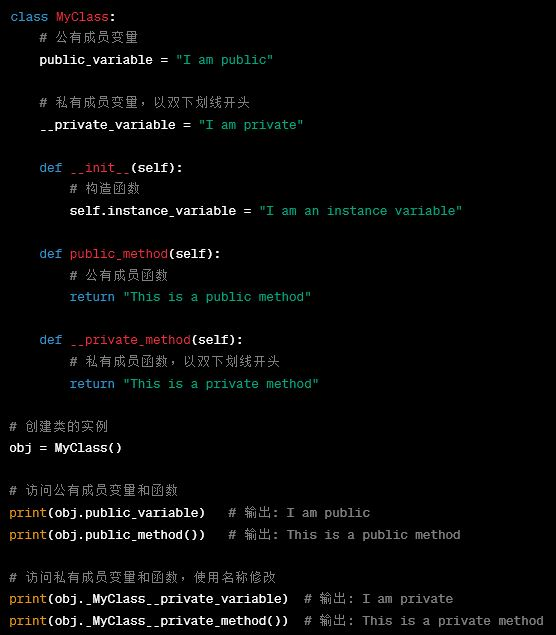    


</font>

---


## 1.8 面向对象编程（OOP）

<font size=4>


C++和Python在访友问私有成员和函数时的区别


| 特点                        | C++                          | Python                        |
|-----------------------------|------------------------------|-------------------------------|
| 访问控制                   | 使用访问修饰符（public、private、protected）控制成员的可见性。 | 没有明确的访问修饰符，依赖于命名约定。        |
| 私有成员                   | 私有成员（private）只能在类的内部访问，外部无法直接访问。 | 以双下划线`__`开头的成员被认为是私有的，**但仍允许访问**。 |
| 友元函数                   | 允许声明和定义友元函数，它们可以访问类的私有成员。  | Python没有友元函数的概念。                  |

友元函数是C++中的一个概念，它允许一个函数访问一个类的私有成员，即使它不是该类的成员函数。

</font>

---


## 1.9 方法

<font size=5>

在Python中，方法（Method）是与**类**或**对象**相关联的函数。方法用于实现类的行为和操作，可以访问类的属性、修改属性的值，以及执行特定的操作。Python中的方法通常包括一个特殊的参数 self，该参数表示调用该方法的对象本身。**方法**有两种主要类型：

1. **实例方法（Instance Method）**：这些方法与对象的实例相关联，可以访问和修改对象的属性。实例方法的第一个参数通常是 self，它表示对象本身。通过点操作符（.）可以调用实例方法。

```python
class MyClass:
    def instance_method(self, arg1, arg2):
        # 使用self来访问对象的属性
        self.arg1 = arg1
        self.arg2 = arg2

# 创建对象
obj = MyClass()
# 调用实例方法
obj.instance_method("Hello", "World")
```


</font>

---


## 1.9 方法

<font size=5>

2. **类方法（Class Method）**：在Python中，类方法（Class Method）是与类关联的方法，而不是与类的实例（对象）关联的方法。类方法通常用@classmethod装饰器进行定义，它的第一个参数通常是cls，代表类本身。与普通方法不同，类方法可以在没有类的实例的情况下调用，且它们可以访问和修改类级别的属性。

```python
class MyClass:
    class_attr = 0  # 类属性

    @classmethod
    def class_method(cls):
        cls.class_attr += 1

# 调用类方法
MyClass.class_method()
print(MyClass.class_attr)  # 输出: 1
```

- 类方法通常用于执行与整个类相关的操作，而不是依赖于特定实例的操作。类方法可以访问类级别的属性，但不能访问实例级别的属性。

</font>

---


## 1.9 方法

<font size=6>

- 方法是类的一部分，用于实现类的行为。

- 类可以包含多个方法，这些方法定义了对象的操作和行为。

- 方法的定义方式类似于函数，但它们位于类的内部，并可以访问类的属性和其他方法。

- 类可以创建多个对象，每个对象都有相同的属性和方法，但可以具有不同的属性值。

**Python中的方法就是类的成员函数。用于实现类的行为和操作。**

</font>

---


## 1.9 方法

<font size=5>

在Python中，方法（Method）和函数（Function）是两个不同的概念

| 特点        | 函数（Function）                                    | 方法 （Method）                                      |
|-------------|----------------------------------------|--------------------------------------------|
| 定义位置    | 在任何地方定义，不依赖于类或对象      | 在类的内部定义，与类或对象相关联             |
| 调用方式    | 直接调用，不需要通过对象               | 必须通过对象来调用，通常以 self 作为第一个参数 |
| 参数        | 可以接受任意数量的参数，包括没有参数   | 至少有一个参数（通常是 self），用于访问对象属性和数据 |
| 目的        | 通用的，不依赖于特定对象，用于执行一般任务 | 特定于类或对象，用于实现类的行为和操作     |


</font>

---


## 1.10 动态分配内存

<font size=5>

Python中的动态内存分配是通过内置的内存管理机制实现的，这包括垃圾回收和自动内存分配。Python的动态内存分配机制是一种自动化的、安全的方式来处理内存管理，程序员无需过多担心手动内存分配或释放，因为这些任务由Python的内存管理系统处理。Python中的动态内存分配的特点：

**垃圾回收**：Python使用垃圾回收器来自动管理内存。当对象不再被引用时，垃圾回收器会自动回收其内存以供其他用途。这减少了内存泄漏的风险。

**引用计数**：Python使用引用计数来跟踪对象的引用。当引用计数降为零时，垃圾回收器会释放对象的内存。这是一种快速回收内存的方法。


</font>

---


## 1.10 动态分配内存

<font size=5>

**循环引用**：Python垃圾回收器还能够处理循环引用，即两个或多个对象相互引用。在这种情况下，垃圾回收器会检测到它们之间的循环引用并及时释放内存。

**自动内存分配**：Python自动管理内存的过程使程序员不需要手动分配或释放内存。这降低了程序中内存相关错误的可能性。

**动态增长**：Python的内存管理系统还具有动态增长的能力，可以根据需要自动分配更多内存，而不需要手动管理内存大小。

</font>

---


## 1.10 动态分配内存

<font size=5>

Python和c语言在动态分配内存上的区别:

**内存管理方式**:

*Python*：Python使用自动内存管理，具体来说，它使用了垃圾回收机制。程序员通常不需要手动分配或释放内存。Python的垃圾回收器会自动追踪不再需要的对象并回收它们的内存，这降低了内存泄漏的风险。

*C语言*：C语言中需要显式地分配和释放内存。程序员需要调用malloc()分配内存和free()释放内存，这样的控制更直接，但也更容易出现内存泄漏和指针错误。


</font>

---


## 1.10 动态分配内存

<font size=5>

**类型系统**:

*Python*：Python是一门动态类型语言，变量的类型在运行时确定。这允许更大的灵活性，但也可能导致运行时类型错误。

*C语言*：C语言是静态类型语言，变量的类型在编译时确定。这提供了更严格的类型检查，有助于避免类型相关的错误。


**指针和引用**:

*Python*：Python中没有显式指针的概念，所有的变量都是对象的引用。这意味着在内存中通常存储的是对象的引用而不是对象本身。

*C语言*：C语言支持指针，允许直接访问内存地址。这提供了更多的控制，但也增加了出错的机会。

</font>

---


## 联系方式

- Email:`<calculate@njust.edu.cn>`
- Phone: 13047574560


<!-- 
## 1.9 Python 面向对象

<font size=3>
Python从设计之初就已经是一门面向对象的语言，在Python中可创建一个类和对象。

| 术语             | 描述                                                                                                 |
| ---------------- | ---------------------------------------------------------------------------------------------------- |
| 类(Class)        | 用于描述具有相同属性和方法的对象的集合。它定义了该集合中每个对象所共有的属性和方法。对象是类的实例。     |
| 类变量           | 类变量在整个实例化的对象中是公用的，定义在类中且在函数体之外。通常不作为实例变量使用。                   |
| 数据成员         | 包括类变量和实例变量，用于处理类及其实例对象的相关数据。                                           |
| 方法重写         | 如果从父类继承的方法不能满足子类的需求，可以对其进行改写，这个过程叫方法的覆盖（override）或方法的重写。 |
| 局部变量         | 定义在方法中的变量，只作用于当前实例的类。                                                           |
| 实例变量         | 在类的声明中，属性是用变量来表示的。这种变量就称为实例变量，是在类声明的内部但在类的其他成员方法之外声明的。 |
| 继承             | 一个派生类（derived class）继承基类（base class）的字段和方法，允许将派生类的对象作为基类对象对待。       |
| 实例化           | 创建一个类的实例，即类的具体对象。                                                                |
| 方法             | 类中定义的函数，描述了对象可以执行的操作。                                                           |
| 对象             | 通过类定义的数据结构实例，包括两个数据成员（类变量和实例变量）和方法。                               |

</font>

---


## 1.9 Python 面向对象
---


## 1.9 Python 面向对象
---


## 1.9 Python 面向对象
---


## 1.9 Python 面向对象
---

## 1.9 Python 面向对象
---

## 1.9 Python 面向对象
---
 -->

