# 第三章：Python计算与数据分析
## 3.1 △科学计算库简介
## 3.2 △数值计算
## 3.3 ★符号计算
## 3.4 正交试验设计

---

## 3.1 △科学计算库简介
Python如何使用SciPy、StatsModels等库进行数值计算、统计分析和优化求解。

---


## 3.2 △数值计算

- SciPy 应用
  - Scipy 是一个用于数学、科学、工程领域的开源的 Python 算法库和数学工具包，可以处理最优化、线性代数、积分、插值、拟合、特殊函数、快速傅里叶变换、信号处理、图像处理、常微分方程求解器等。 。

  - SciPy 包含的模块有最优化、线性代数、积分、插值、特殊函数、快速傅里叶变换、信号处理和图像处理、常微分方程求解和其他科学与工程中常用的计算。

  - NumPy 和 SciPy 的协同工作可以高效解决很多问题，在天文学、生物学、气象学和气候科学，以及材料科学等多个学科得到了广泛应用。


---

## 3.2 SciPy简介

<font size=4>


| 模块名            | 功能                  | 参考文档            |
| ----------------- | --------------------- | ------------------- |
| scipy.cluster     | 向量量化              | cluster API         |
| scipy.constants   | 数学常量              | constants API       |
| scipy.fft         | 快速傅里叶变换        | fft API             |
| scipy.integrate   | 积分                  | integrate API       |
| scipy.interpolate | 插值                  | interpolate API     |
| scipy.io          | 数据输入输出          | io API              |
| scipy.linalg      | 线性代数              | linalg API          |
| scipy.misc        | 图像处理              | misc API            |
| scipy.ndimage     | N 维图像              | ndimage API         |
| scipy.odr         | 正交距离回归          | odr API             |
| scipy.optimize    | 优化算法              | optimize API        |
| scipy.signal      | 信号处理              | signal API          |
| scipy.sparse      | 稀疏矩阵              | sparse API          |
| scipy.spatial     | 空间数据结构和算法    | spatial API         |
| scipy.special     | 特殊数学函数          | special API         |
| scipy.stats       | 统计函数              | stats.mstats API    |

</font>

---


## 3.2 SciPy简介

### 3.2.1 非线性方程求根
### 3.2.2 函数优化
### 3.2.3 常微分方程


</font>

---


### 3.2.1 非线性方程求根

方程求根常用算法-牛顿切线法。
<font size=4>

牛顿切线法是一种用于寻找函数的近似根的数值方法。它基于泰勒级数展开，使用切线来逼近函数的根。下面是牛顿切线法的数学公式描述：

牛顿法用于寻找方程的根考虑函数 

$$f\left(x^{*}\right)=f(x+\Delta x) \approx f(x)+f^{\prime}(x) \Delta x $$


$$f(x)+f^{\prime}(x) \Delta x=0$$


$$\Delta x=-\frac{f(x)}{f^{\prime}(x)}$$


$$\Delta x^{*}=x^{*}-x$$


这是迭代过程中的第1步。


</font>


---


### 3.2.1 非线性方程求根

方程求根常用算法-牛顿切线法。
<font size=4>


假设要找到函数 $f(x)$ 的根，从初始点 $x_0$ 开始，可以使用以下迭代公式来逼近根：

<center>

$x_{n+1} = x_n - \frac{f(x_n)}{f'(x_n)}$

</center>

其中$x_{n+1}$ 是下一个近似根。$x_n$ 是当前的近似根。$f(x_n)$ 是函数 $f(x)$ 在当前近似根处的函数值。$f'(x_n)$ 是函数 $f(x)$ 在当前近似根处的导数值。


</font>


---

### 3.2.1 非线性方程求根

方程求根常用算法-牛顿切线法。
<font size=4>

牛顿切线法的步骤如下：

1. 选择一个初始点 $x_0$。
2. 计算 $f(x_0)$ 和 $f'(x_0)$。
3. 使用上述公式计算下一个近似根 $x_1$。
4. 重复步骤 2 和 3，直到满足收敛条件（例如，近似根的变化很小）。

该方法通常能够快速逼近函数的根，但需要提供初始点并要求函数的导数存在。如果导数难以计算，可以使用数值方法估算导数。

</font>


---


### 3.2.1 非线性方程求根

方程求根常用算法-牛顿切线法。
<font size=4>

$f(x) = x^3 - 27$    从 $x_0 = 27$ 开始迭代： 即使从一个相对较远的初始值开始，收敛速度也会很快。

  

</font>


---


### 3.2.1 非线性方程求根

方程求根常用算法-牛顿切线法。
<font size=4>

$f(x) = x^3 - 9$    从 $x_0 = 1$ 开始迭代：不是特别好的初始值可能会使下一步长偏离变远。

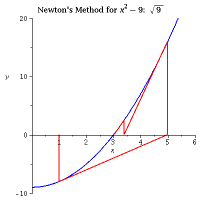     

</font>


---


### 3.2.1 非线性方程求根

方程求根常用算法-牛顿切线法。
<font size=4>

$f(x) = xsin (2.2 x) - 5sin(x)$    从 $x_0 = 18$ 开始迭代：较差的初始值可能不会导致最接近的根。如果初值不接近，则很难找到**多重根**。

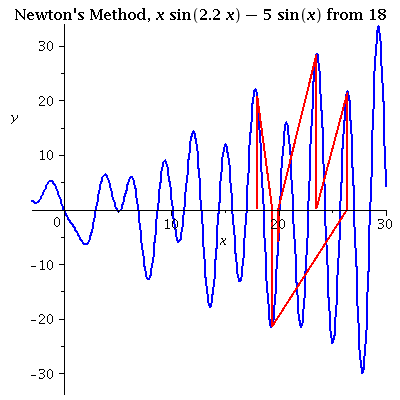  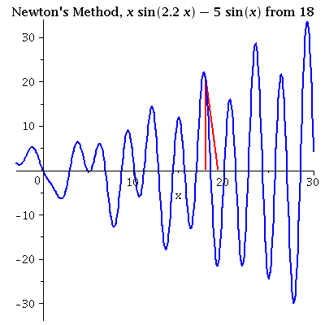

</font>


---


### 3.2.1 非线性方程求根

方程求根常用算法-牛顿切线法。

<font size=4>

$f(x) = e^x - sin(x)$    从 $x_0 = 2$ 开始迭代：选择一个接近的初始值对于避免像这样的“大旅行”非常重要!

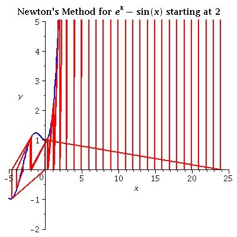  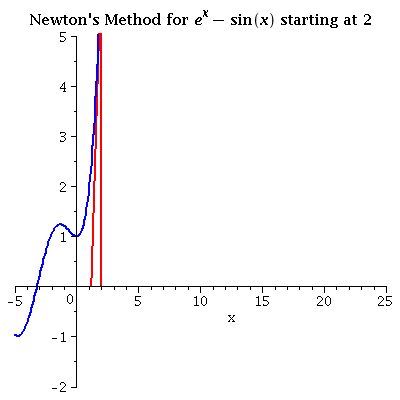

</font>


---


### 3.2.1 非线性方程求根

<font size=3>

**scipy.optimize.root** 有多种方法可用，其中hybr （默认） 和lm，分别使用 Powell 的混合方法和 MINPACK 的 Levenberg-Marquardt 方法。

**scipy.optimize.root(fun, x0, args=(), method='hybr', jac=None, tol=None, callback=None, options=None)**


**fun**：这是一个用户定义的函数，表示要求解的非线性方程组。函数应该以一个参数，表示未知数的数组，作为输入，并返回一个与方程组的值等于零的数组。

**x0**：这是包含未知数的初始猜测值的数组。它用于启动求解过程。

**args**：这是一个元组，包含传递给 fun 函数的额外参数。如果 fun 函数需要除未知数之外的其他参数，可以在这里指定。

**method**：这是求解非线性方程组的方法。可选的方法包括 **'hybr'**、**'lm'**、**'broyden1'**、**'broyden2'** 等。不同的方法适用于不同类型的问题。

**jac**：这是一个可选参数，表示 fun 函数的雅可比矩阵。如果未提供，root 函数将尝试使用数值方式计算雅可比矩阵。

**tol**：这是求解的容差，表示算法停止的条件。默认值通常适用，但可以根据需要进行调整。

**options**：这是一个字典，包含其他控制选项。这些选项可以用于自定义求解过程，如最大迭代次数、显示详细信息等。

**callback**：这是一个可选的回调函数，用于在每次迭代之后调用。可以用于监控求解过程或执行其他操作。

</font>


---


### 3.2.1 非线性方程求根


<font size=4>

| 方法                      | 优点                               | 缺点                                       |
|---------------------------|----------------------------------|------------------------------------------|
| 'hybr' (默认方法)        | 通用性强，可用于多种问题。       | 在某些情况下，可能需要更多的迭代次数才能达到收敛。 |
| 'lm' (Levenberg-Marquardt方法) | 适用于拟合问题，通常速度较快。 | 可能对初始猜测值敏感，需要谨慎选择。       |
| 'broyden1' 和 'broyden2' (Broyden方法) | 适用于大规模问题，不需要计算雅可比矩阵。 | 可能不够稳定，收敛性较差。     |
| 'krylov' (Krylov子空间方法) | 适用于大规模问题，对**雅可比矩阵**的要求较低。 | 可能需要更多的内存和计算时间。    |
| 'excitingmixing'  | 可用于求解复杂问题，允许自定义混合策略。 | 需要仔细调整参数以获得最佳性能。 |
| 'df-sane' (Saney方法)     | 稳定性较好，适用于某些复杂问题。 | 可能需要较多的计算资源。          |


</font>


---


### 3.2.1 非线性方程求根


<font size=4>


<center>

$$ x + 2 cos(x) = 0 $$

</center>

```python
import numpy as np
from scipy.optimize import root
def func(x):
    return x + 2 * np.cos(x)
sol = root(func, 0.3)
sol.x
输出：array([-1.02986653])
sol.fun
输出：array([ -6.66133815e-16])
```


$$ x_0 cos(x_1) = 4 $$
$$ x_0 + x_0 x_1 = 5 $$


```python
def func2(x):
    f = [x[0] * np.cos(x[1]) - 4,
         x[1]*x[0] - x[1] - 5]
    df = np.array([[np.cos(x[1]), -x[0] * np.sin(x[1])],
                   [x[1], x[0] - 1]])
    return f, df
sol = root(func2, [1, 1], jac=True, method='lm')
sol.x
array([ 6.50409711,  0.90841421])
```


</font>


---


## 3.2 非线性方程求根

- SciPy 优化器 - optimze.root 函数

<font size=5>

```python
from scipy.optimize import root
from math import cos

def eqn(x):
  return x + cos(x)

myroot = root(eqn, 0)

print(myroot.x)
# 查看更多信息
#print(myroot)
执行以上代码，输出结果如下：

[-0.73908513]
```

</font>

---

## 3.2 非线性方程求根

SciPy 优化器 - optimze.root() 函数

<font size=4>


```python
from scipy.optimize import root
from math import cos

def eqn(x):
  return x + cos(x)

myroot = root(eqn, 0)

print(myroot)

输出：

    fjac: array([[-1.]])
     fun: array([0.])
 message: 'The solution converged.'
    nfev: 9
     qtf: array([-2.66786593e-13])
       r: array([-1.67361202])
  status: 1
 success: True
       x: array([-0.73908513])


```


</font>


---


### 3.2.2 函数优化

<font size=4>

Optimization（优化）问题存在一个目标函数，需要进行最小化或最大化。这个目标函数通常表示为数学公式，描述了要优化的问题。
Optimization（优化）和 root finding（方程求根）之间存在一种联系和转化。通常，优化问题可以转化为根查找问题，反之亦然。这种转化可以通过数学公式来描述：

**优化问题到根查找问题的转化**：

假设我们有一个优化问题，要找到一个函数（**目标函数**）的最小值。这可以表示为以下形式：

$$min f(x)$$

其中，$f(x)$ 是目标函数，$x$ 是变量(向量)，我们希望找到使 $f(x)$ 取得最小值或最大值的 $x$ 值。对于数值优化，我们通常需要计算一阶导数（梯度）和二阶导数（Hessian矩阵），以确定下降方向和步长。这可以用以下公式表示：

$$\nabla f(x) = 0$$
$$\nabla^2 f(x) > 0 $$ 

一阶导数 $∇f(x)$ 告诉我们梯度方向，而二阶导数 $∇^2 f(x)$ 提供了曲率信息，帮助确定最优解。


</font>


---


### 3.2.2 函数优化

<font size=4>


所以优化问题$min f(x)$可以转化为根查找问题.

对于**一维**$min f(x)$优化问题, 求 $x$，使得

$$f'(x) = 0$$


这里，$f'(x)$ 表示函数 $f(x)$ 的导数。通过寻找**导数**为零的点，我们找到了函数的极小值点，实现了优化问题的转化。


**牛顿法**用于寻找方程的根考虑函数 $f'(x)$ 的二阶泰勒逼近 

$$f'\left(x^{*}\right)=f'(x+\Delta x) \approx f'(x)+f''(x) \Delta x $$

$$f'(x)+f''(x) \Delta x=0$$

$$\Delta x=-\frac{f'(x)}{f''(x)}$$

使用以下迭代公式来逼近根：


$$x_{n+1} = x_n - \frac{f'(x_n)}{f''(x_n)}$$


</font>


---


### 3.2.2 函数优化

<font size=4>


目标函数的数值优化和目标函数求根是两种不同的数值计算问题，它们在所需的导数信息方面存在差异：

**目标函数数值优化**通常需要二阶导数信息，这是因为数值优化的目标是找到函数的最小值或最大值，而二阶导数（Hessian矩阵）提供了有关函数曲率的关键信息。一些经典的数值优化算法，如牛顿法，需要计算二阶导数，以确定下降方向和步长，以快速收敛到最优解。

**目标函数求根**，又称方程求解，是寻找函数等于零的根的问题。虽然它涉及导数信息，但通常只需要一些导数信息，即一阶导数（函数的梯度）。一些求根算法，如牛顿-拉普森法，使用一阶导数来逼近根。在某些情况下，二阶导数信息（Hessian矩阵）也可以用于更快速的收敛，但它通常不是必需的。

**但是如果求根时的目标函数是由一个优化问题转化而得来的，则该目标函数均运用牛顿法需要二阶导数信息。**


</font>


---


### 3.2.2 函数优化

<font size=4>

**局部优化**和**全局优化**是两种不同的优化问题方法，它们之间存在明显的区别：

**目标**：

局部优化：局部优化旨在寻找目标函数的局部最优解，即在特定初始点附近找到最佳解决方案。它不考虑全局最优解。
全局优化：全局优化旨在寻找目标函数的全局最优解，即在整个搜索空间中找到最佳解决方案。它考虑找到最佳解决方案的可能性在整个搜索范围内。

**停止条件**：

局部优化：通常使用局部条件（如梯度为零）来确定是否达到了最佳局部解，然后停止搜索。
全局优化：需要更复杂的停止条件，因为搜索范围广泛，通常使用迭代次数或计算资源作为停止条件。

**风险**：

局部优化：可能会陷入局部极小值，无法找到全局最优解，因此具有风险。
全局优化：更有可能找到全局最优解，但计算成本通常更高。

**应用领域**：

局部优化：常用于解决问题的局部改进，如参数调整或局部搜索。
全局优化：适用于需要全局最优解的问题，如全局搜索、全局最优控制问题等。


</font>


---


### 3.2.2 函数优化

<font size=4>

| 特征             | 一阶算法                                                         | 二阶算法                                                       |
|------------------|----------------------------------------------------------------|----------------------------------------------------------------|
| 定义             | 一阶算法是一种优化算法，仅利用目标函数的一阶导数（梯度）信息。 | 二阶算法是一种优化算法，利用目标函数的一阶导数和二阶导数信息。    |
| 梯度信息         | 一阶算法使用目标函数的梯度信息来指导搜索方向和步长。            | 二阶算法使用目标函数的梯度和二阶导数信息来指导搜索方向和步长。   |
| 收敛速度         | 一阶算法通常具有**较慢**的收敛速度，特别是在目标函数具有弯曲的情况下。 | 二阶算法通常具有**更快**的收敛速度，因为它考虑了更多的信息。        |
| 鞍点问题         | 一阶算法在处理**鞍点问题时可能会陷入局部最小值**。               | 二阶算法在处理鞍点问题时通常更容易避免陷入局部最小值。         |
| 算法示例         | 梯度下降法是一种典型的一阶算法。                                | 牛顿法是一种典型的二阶算法。                                   |
| 二阶导数计算     | 一阶算法不需要计算目标函数的二阶导数。                        | 二阶算法需要计算目标函数的二阶导数（Hessian矩阵）。            |


</font>


---

### 3.2.2 函数优化

<font size=6>

1. **水平集（level set**）

2. **梯度向量 (Gradient Vector)**

3. **Hessian矩阵**

</font>


---


### 3.2.2 函数优化

<font size=5>

1. **水平集（level set**）

水平集（level set）是一个数学概念，通常用于描述一个函数在某个特定数值上的点的集合。对于函数 $f(x, y)$，它的水平集是在函数值等于某个特定常数 $c$ 的点组成的集合，即 $f(x, y) = c$。

在二维空间中，水平集可以用来表示函数 $f(x, y)$ 在不同高度上的等高线。这些等高线连接了具有相同函数值 $c$ 的点，形成了一个轮廓线。这些轮廓线的形状和分布取决于函数 $f(x, y)$ 的性质。

这个概念在数学、物理和工程领域中广泛应用，用于分析函数的性质和可视化数据。水平集的理解可以帮助人们更好地理解函数的行为和空间分布。

</font>


---


### 3.2.2 函数优化

<font size=5>

使用Wolfram代码绘制 $f_1(x, y) = x + y$ 和 $f_2(x, y) = x^2 + y^2$ 的图形并标出$f(x,y)=c$的**水平集（level set**）：函数f(x,y)的图像是所有点(x,y,f(x,y))的集合。它也称为曲面z=f(x,y)。$f_1$和$f_2$的曲线图如下(左侧)所示。

二元函数的**等高线**

假设我们有一个包含两个变量的函数f(x,y)如果我们在z=c平面上切割z=f(x,y)曲面，那么我们得到满足f(x,y)=c的所有点的集合，轮廓曲线是在z=c平面上满足f(x,y)=c的点的集合。可认为等高线和**水平集（level set**）是一样的。


</font>


---


### 3.2.2 函数优化

<font size=5>

2. **梯度向量 (Gradient Vector)**

$f(x)$ 的 **梯度向量(Gradient Vector)** 表示如下：

数学表达式：$\nabla f(x) = \begin{bmatrix} \frac{\partial f}{\partial x_1} \ \frac{\partial f}{\partial x_2} \ \vdots \ \frac{\partial f}{\partial x_n} \end{bmatrix}$

梯度向量是一个列向量，其中每个元素是 $f(x)$ 关于相应变量 $x_i$ 的偏导数。这个向量的每个分量告诉你了函数 $f(x)$ 在相应坐标方向上的变化率。如果你在某一点 $x$ 处计算梯度向量，那么梯度向量的方向就是函数在该点上升最快的方向，而梯度的大小表示上升的速率。

在几何上，梯度向量表示了函数 $f(x)$ 在点 $x$ 处的斜率。如果你想在 $x$ 点上找到函数值增加最快的方向，你可以沿着梯度向量的方向移动，因为它指向了函数上升最快的路径。梯度向量的大小（范数）越大，表示函数上升的速度越快。

</font>


---


### 3.2.2 函数优化

<font size=5>

当计算 $f(x)$ 的梯度向量时，首先需要定义一个函数 $f(x, y)$ 并计算其梯度。以下是一个示例，计算函数 $f(x, y) = x^2 + y^2$ 的梯度向量，并绘制对应的图形，标出梯度向量的方向：

计算 $f(x, y)$ 的梯度向量：
梯度向量由偏导数组成，对于 $f(x, y) = x^2 + y^2$，梯度向量为：

$$\nabla f(x, y) = \begin{bmatrix} \frac{\partial f}{\partial x} \\ \frac{\partial f}{\partial y} \end{bmatrix} = \begin{bmatrix} 2x \\ 2y \end{bmatrix}$$


</font>


---


### 3.2.2 函数优化

<font size=5>


使用Wolfram代码绘制 $f(x, y) = x^2 + y^2$ 的图形并标出$f(x,y)=c$的**水平集（level set**）和梯度向量的方向：

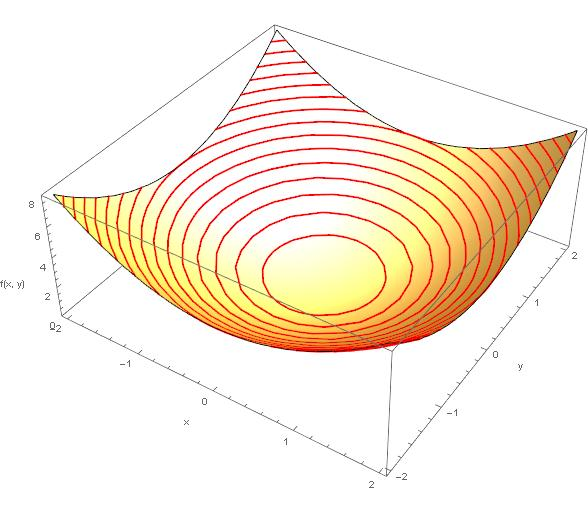  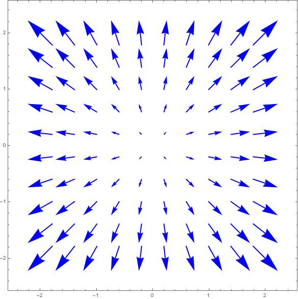
3D Contours and gradient for $f(x,y)$

在一个平面上，函数f(x,y)有一个常数值，即$f(x,y)=c$的点的集合是f的**水平集（level set**）或**水平曲线（level curve of f）**。


<!-- 
f[x_, y_] := x^2 + y^2
gradient[x_, y_] := {2x, 2y}

Show[
  Plot3D[f[x, y], {x, -2, 2}, {y, -2, 2}, PlotRange -> {0, 8}, 
    AxesLabel -> {"x", "y", "f(x, y)"}, MeshFunctions -> {#3 &}, 
    MeshStyle -> {{Thick, Red}}, Lighting -> "Neutral"],
  VectorPlot[gradient[x, y], {x, -2, 2}, {y, -2, 2}, 
    VectorStyle -> {{Thick, Blue}}, VectorPoints -> 10]
] -->


</font>


---


### 3.2.2 函数优化


<font size=5>

gradient for $f(x, y) = x^2 + y^2$ 


</font>


---


### 3.2.2 函数优化

<font size=5>

例，考虑热寻导弹如何工作的二维版本。（此应用程序借自美国空军学院数学科学部。）假设战斗机周围的温度可以通过以下函数建模被定义为:

$$\begin{equation*}
T(x,y) = \frac{100}{1+(x-5)^2 + 4(y-2.5)^2},
\end{equation*}$$
 
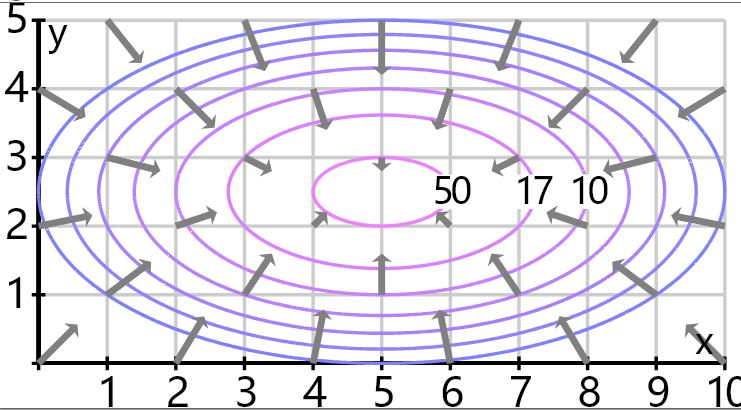 
Contours and gradient for $T(x,y)$

</font>


---


### 3.2.2 函数优化

<font size=4>

**Hessian矩阵**（又称Hessian矩阵或Hessian矩阵）是一个重要的数学概念，它在优化和微分几何中起着关键的作用。Hessian矩阵用于描述一个多元函数的二阶导数信息，特别是它的二阶偏导数。

Hessian矩阵的数学表达式如下，对于一个多元函数$f(x)$，其中$x$是一个包含多个变量的向量：

$$\mathbf{H} = \begin{bmatrix}
\frac{\partial^2 f}{\partial x_1^2} & \frac{\partial^2 f}{\partial x_1 \partial x_2} & \cdots & \frac{\partial^2 f}{\partial x_1 \partial x_n} \\
\frac{\partial^2 f}{\partial x_2 \partial x_1} & \frac{\partial^2 f}{\partial x_2^2} & \cdots & \frac{\partial^2 f}{\partial x_2 \partial x_n} \\
\vdots & \vdots & \ddots & \vdots \\
\frac{\partial^2 f}{\partial x_n \partial x_1} & \frac{\partial^2 f}{\partial x_n \partial x_2} & \cdots & \frac{\partial^2 f}{\partial x_n^2}
\end{bmatrix}
$$

其中，$\frac{\partial^2 f}{\partial x_i \partial x_j}$代表函数$f(x)$的二阶偏导数。


</font>


---


### 3.2.2 函数优化

<font size=4>

3. **Hessian矩阵**

Hessian矩阵的几何意义在优化问题中尤为重要。它描述了函数$f(x)$在特定点附近的曲率和凸凹性质。具体来说：

**a**. 正定Hessian矩阵：如果Hessian矩阵的所有特征值都大于零，那么函数$f(x)$在该点附近是严格凸函数。这表示函数的局部最小值。

**b**. 负定Hessian矩阵：如果Hessian矩阵的所有特征值都小于零，那么函数$f(x)$在该点附近是严格凹函数。这表示函数的局部最大值。

**c**. 非定Hessian矩阵：如果Hessian矩阵既有正特征值又有负特征值，那么函数$f(x)$在该点附近存在鞍点。

Hessian矩阵的特征值和特征向量提供了函数$f(x)$在不同方向上的曲率信息。通过分析Hessian矩阵，可以确定函数的局部极值点和最优化方向。这对于优化算法，如牛顿法，是至关重要的。

总之，Hessian矩阵是一个描述函数曲率和凸凹性质的关键工具，对于优化和微分几何问题具有重要意义。

</font>


---


### 3.2.2 函数优化

<font size=4>


</font>


---


### 3.2.2 函数优化

<font size=5>

Saddle 简单鞍点  


</font>


---

### 3.2.2 函数优化

<font size=5>

复杂鞍点


</font>


---


### 3.2.2 函数优化

<font size=5>

优化问题$min f(x)$常用算法。

1. 牛顿法（Newton's Method/Newton-Raphson method）

2. 梯度下降法（Gradient Descent）

3. 共轭梯度法（Conjugate Gradients）


</font>


---


## 3.2.1 函数优化

<font size=4>


**共轭梯度法（Conjugate Gradients）、梯度下降法（Gradient Descent）和牛顿法（Newton's Method）是三种常用的优化方法，用于寻找目标函数(如损失函数)的最小值。它们有不同的工作原理和适用场景：**

**1. 牛顿法**：

*工作原理*：牛顿法使用目标函数的**二阶导数信息**，即Hessian矩阵，来更新参数。它更快地收敛，因为它考虑了曲率信息。
*适用场景*：适用于**光滑**、**凸函数**的优化问题，特别是当目标函数有强烈的曲率变化时，牛顿法表现出色。

**2. 梯度下降法**：

*工作原理*：梯度下降法基于目标函数的**梯度信息**，沿着梯度的负方向更新参数，以减小目标函数的值。
*适用场景*：适用于**大规模的优化问题**，特别是在**深度学习中广泛应用**。对于**凸函数**，梯度下降法可以收敛到**全局最小值**。

**3. 共轭梯度法**：

*工作原理*：共轭梯度法结合了**梯度信息**和之前**搜索方向**的信息。在每次迭代中，它选择共轭的搜索方向，以加速收敛。
*适用场景*：特别适用于**二次型无约束优化**问题。对于这些问题，共轭梯度法通常在有限步骤内找到全局最小值。


</font>


---


## 3.2.1 函数优化

<font size=5>

**收敛速度**：牛顿法通常具有最快的收敛速度，共轭梯度法次之，梯度下降法最慢。
**适用性**：梯度下降法适用性广泛，但可能需要更多迭代次数。牛顿法和共轭梯度法在特定问题上表现更出色。
**计算成本**：牛顿法需要计算二阶导数（Hessian矩阵），计算成本较高。梯度下降法和共轭梯度法通常只需要计算梯度。
**鞍点问题**：共轭梯度法对抵达鞍点问题有一定的帮助，而梯度下降法可能会陷入鞍点。

因此，选择哪种优化方法取决于具体的问题性质，包括函数的光滑性、凸性质以及计算资源。

一般情况下，共轭梯度法在处理二次型无约束优化问题时是一个有效且高效的选择。

</font>


---


### 3.2.2 函数优化

<font size=4>

**牛顿法（Newton's Method）**又称为**牛顿切线法**, 迭代地寻找多维度优化问题的最小值。

假设我们要最小化目标函数 $f(\mathbf{x})$，其中 $\mathbf{x}$ 是一个**多维向量**（$\mathbf{x} = [x_1, x_2, \ldots, x_n]$）。$H(\mathbf{x})$ 表示目标函数的 Hessian 矩阵，$\nabla f(\mathbf{x})$ 表示目标函数的梯度向量。

1. 首先，我们希望找到一个新的向量 $\mathbf{d}$，使得 $f(\mathbf{x}_0 + \mathbf{d}) < f(\mathbf{x}_0)$。这将有助于我们逼近目标函数的最小值。

2. 我们希望 $\mathbf{d}$ 满足以下条件：
$$\nabla f(\mathbf{x}_0 + \mathbf{d}) = 0$$
这意味着 $\mathbf{x}_0 + \mathbf{d}$ 处的梯度为零，即我们找到了一个可能的最小值。

3. 使用泰勒级数展开来逼近 $f(\mathbf{x}_0 + \mathbf{d})$，我们得到：
$$f(\mathbf{x}_0 + \mathbf{d}) \approx f(\mathbf{x}_0) + \nabla f(\mathbf{x}_0)^\top \mathbf{d} + \frac{1}{2} \mathbf{d}^\top H(\mathbf{x}_0) \mathbf{d}$$

4. 为了找到 $\mathbf{d}$，我们可以最小化上述泰勒展开中的第二项。这相当于解以下方程：
$$\nabla f(\mathbf{x}_0) + H(\mathbf{x}_0) \mathbf{d} = 0$$


</font>


---

### 3.2.2 函数优化

<font size=4>

通过求解上述线性系统，我们可以得到 $\mathbf{d}$: 

$$\mathbf{d} =  - [H(\mathbf{x}_0)]^{-1} \nabla f(\mathbf{x}_0)$$

5. 最后，我们使用 $\mathbf{d}$ 来更新当前估计 $\mathbf{x}_0$：
$$\mathbf{x}_1 = \mathbf{x}_0 + \mathbf{d}$$

这样，我们得到了牛顿切线法的迭代公式，其中 $[H(\mathbf{x}_0)]^{-1}$ 是 Hessian 矩阵的逆矩阵，它用于将梯度 $\nabla f(\mathbf{x}_0)$ 转化为下一个估计值 $\mathbf{x}_1$。

**牛顿切线法**通过使用**二阶信息（Hessian 矩阵）**来更快速地逼近最小值，通常比**一阶方法**更快收敛。

</font>


---


### 3.2.2 函数优化

<font size=4>

**多维度优化问题**中的牛顿切线法是一种用于迭代地寻找目标函数的最小值的方法。

假设我们要最小化一个多维目标函数 $f(\mathbf{x})$，其中 $\mathbf{x}$ 是一个包含多个变量的向量（$\mathbf{x} = [x_1, x_2, \ldots, x_n]$），则牛顿切线法的**迭代公式**如下：

1. 选择一个初始猜测向量 $\mathbf{x}_0$。

2. 在 $\mathbf{x}_0$ 处计算目标函数值 $f(\mathbf{x}_0)$ 和梯度向量 $\nabla f(\mathbf{x}_0)$，其中梯度向量的每个分量是目标函数对应变量的一阶偏导数。

3. 计算目标函数的 Hessian 矩阵 $H(\mathbf{x}_0)$，它是目标函数的二阶偏导数关于变量的矩阵。

4. 计算下一个近似最小值的向量 $\mathbf{x}_1$，它是通过以下方式计算的：

$$\mathbf{x}_1 = \mathbf{x}_0 - [H(\mathbf{x}_0)]^{-1} \nabla f(\mathbf{x}_0)$$

  其中 $[H(\mathbf{x}_0)]^{-1}$ 代表 Hessian 矩阵的逆矩阵。

5. 重复步骤2到步骤4，直到达到所需的精度或满足终止条件。


</font>


---


### 3.2.2 函数优化

<font size=4>

**拟牛顿法(quasi-newton method)**

**多维度牛顿切线法的核心思想是使用二阶信息（Hessian 矩阵）来更快速地逼近最小值，因此它通常比一阶方法（如梯度下降法）更快收敛。然而，需要注意的是，计算和维护 Hessian 矩阵可能会导致计算成本较高，因此在实际应用中，可能会采用一些改进的方法，如拟牛顿法来近似 Hessian 矩阵，以减少计算开销。**

**拟牛顿法**是一种数值优化算法，用于寻找多元函数的最优解，特别是在非线性优化问题中广泛应用。该方法的主要思想是逐步逼近目标函数的Hessian矩阵（二阶导数矩阵）的逆，以找到最小值点。与牛顿法不同，拟牛顿法避免了计算和存储Hessian矩阵的高代价，而是通过近似Hessian矩阵来加速优化过程。

拟牛顿法（Quasi-Newton Method）并不是将割线代替切线的方法。它是一种用于解决非线性优化问题的迭代数值优化方法，旨在寻找目标函数的最小值点。拟牛顿法的主要思想是逐步逼近目标函数的Hessian矩阵的逆，以加速最小化过程。

割线法（Secant Method）和切线法（Newton's Method）不同，拟牛顿法的关键思想是使用一个近似的Hessian矩阵来代替真实的Hessian矩阵，从而避免了计算和存储Hessian矩阵的高计算成本。拟牛顿法通过迭代更新这个近似矩阵，使其逐步逼近真实Hessian矩阵的逆。

拟牛顿法是一种非线性优化方法，用于寻找目标函数的最小值点，它通过近似Hessian矩阵来代替真实Hessian矩阵，以加速最小化过程。它不是将割线代替切线的方法，而是一种更复杂的迭代优化算法。

</font>


---


### 3.2.2 函数优化

<font size=4>

**拟牛顿法(quasi-newton method)**


</font>


---


### 3.2.2 函数优化

<font size=4>

BFGS（Broyden-Fletcher-Goldfarb-Shanno）算法是一种**拟牛顿法**，用于求解非线性数值优化问题。它通过逐步逼近目标函数的Hessian 矩阵的逆，来寻找目标函数的最小值。下面是BFGS算法的详细描述，包括Latex公式：

BFGS算法步骤：

1. **初始化**：选择一个初始点$x_0$，一个初始的估计Hessian 矩阵$B_0$（通常选择单位矩阵I），和迭代计数$k=0$。

2. **计算搜索方向**：计算搜索方向$d_k$，通常为$-B_k∇f(x_k)$，其中$∇f(x_k)$是目标函数在当前点的梯度，$B_k$是估计的Hessian 矩阵。

3. **一维搜索**：使用一维搜索方法（如线搜索）来确定步长$\alpha_k$，以使$f(x_k + \alpha_kd_k)$最小化。

4. **更新参数**：根据$\alpha_k$和搜索方向$d_k$，更新参数$x_{k+1} = x_k + \alpha_kd_k$。

5. **更新估计的Hessian 矩阵**：计算向量$s_k = x_{k+1} - x_k$和$y_k = ∇f(x_{k+1}) - ∇f(x_k)$，然后使用BFGS更新公式来更新估计的Hessian 矩阵：

$$​B_{k+1}=B_{k}+\frac{y_{k} y_{k}^{T}}{y_{k}^{T} s_{k}}-\frac{B_{k} s_{k} s_{k}^{T} B_{k}}{s_{k}^{T} B_{k} s_{k}}$$
 
检查收敛：检查是否满足收敛条件，如果不满足，重复步骤2-5。

</font>


---


### 3.2.2 函数优化

<font size=5>

**梯度下降法（Gradient Descent）**

梯度下降法是一种优化算法，常用于机器学习和数值优化领域。其主要目标是通过迭代来最小化一个目标函数，通常是损失函数。这一过程涉及计算目标函数在当前位置的梯度（导数），然后沿着梯度的反方向更新当前位置，以逐渐接近目标函数的最小值。梯度下降法的核心思想是在每次迭代中调整参数，以使目标函数值逐渐减小。


</font>


---


### 3.2.2 函数优化

<font size=4>

梯度下降法（Gradient Descent）是一种优化算法，用于最小化目标函数 $f(x)$，其中 $x$ 是参数或变量。梯度下降法通过迭代调整参数的值来逐渐接近目标函数的最小值。以下是梯度下降法的数学表达：

**1. 目标函数**：假设我们有一个需要最小化的目标函数 $f(x)$。

**2. 梯度**：目标函数的梯度表示为 $\nabla f(x)$，它是目标函数对参数 $x$ 的偏导数。

**3. 更新参数**：梯度下降法通过以下公式来更新参数 $x$：

$$x_{k+1}=x_{k}-\eta_{k} \nabla f\left(x_{k}\right)$$

其中，$\alpha$ 是**学习率（或步长）**，用于控制每次迭代中参数的调整幅度。较小的学习率会使收敛更稳定，但可能需要更多的迭代，而较大的学习率可能导致不稳定的收敛。

**4. 迭代**：重复步骤2和3，直到满足停止条件，例如达到最大迭代次数或梯度足够小。

这个过程将使参数 $x$ 逐渐接近目标函数的最小值，从而实现目标函数的最小化。梯度下降法的效率和收敛性受到学习率的选择和目标函数的性质影响。


</font>


---

### 3.2.2 函数优化

<font size=4>

**梯度下降法（Gradient Descent）**


</font>


---


### 3.2.2 函数优化

<font size=4>

**Gradient Descent vs Newton's Method**

梯度下降法(**绿色**)和牛顿法(**红色**)用于最小化函数(小步)的比较。牛顿的方法使用曲率信息(即二阶导数)来采取更直接的路线。


</font>


---


### 3.2.2 函数优化

<font size=4>

梯度下降法有多个变种，包括**批量梯度下降**、**随机梯度下降**和**小批量梯度下降**，它们在计算梯度时使用不同的数据子集。


特点 | 批量梯度下降 | 随机梯度下降 | 小批量梯度下降
--- | --- | --- | ---
数据使用 | 使用全部训练数据 | 使用单个样本 | 使用一小部分样本（批次/迷你批次）
更新参数 | 在每次迭代中使用所有数据来更新参数 | 在每次迭代中使用单个样本来更新参数 | 在每次迭代中使用批次数据来更新参数
收敛速度 | 收敛速度较慢 | 收敛速度可能更快，但不稳定 | 收敛速度通常介于批量和随机之间
参数更新的稳定性 | 参数更新通常更稳定 | 参数更新可能不稳定 | 参数更新通常比随机更稳定，但比批量更快
内存需求 | 需要存储所有训练数据，内存需求较高 | 内存需求较低 | 内存需求介于批量和随机之间
收敛到局部最小值的风险 | 通常能够避免局部最小值 | 更容易陷入局部最小值 | 通常能够避免局部最小值
适用性 | 通常用于小数据集或特征较少的情况 | 适用于大数据集 | 通常是一种通用选择


</font>


---


### 3.2.2 函数优化

<font size=4>


</font>


---


### 3.2.2 函数优化

<font size=5>

**共轭梯度法**(**Conjugate Gradient Method**) 是一种用于求解无约束优化问题的迭代方法。

共轭梯度法是一种一阶优化算法。虽然它在某些方面类似于二阶算法，但它仍然被归类为一阶算法。

共轭梯度法是通过利用目标函数的梯度信息来寻找最优解的算法。与一阶算法相关的是，它只使用目标函数的一阶导数（梯度）信息。与二阶算法不同，共轭梯度法不涉及目标函数的二阶导数信息（Hessian 矩阵），因此它被认为是一阶算法。

共轭梯度法的独特之处在于它利用了**共轭方向**的概念，这是它与传统梯度下降方法的主要不同之处。共轭梯度法在每次迭代中选择一个共轭的搜索方向，以更快地收敛到最优解，但仍然是一阶优化算法，因为它**仅使用梯度信息**。


</font>


---


### 3.2.2 函数优化

<font size=4>


**共轭梯度法**特别适用于求解二次型无约束优化问题。共轭梯度法是为了求解线性方程组 $A x=b$ 而创建。该问题可以以二次函数最小化的形式提出，然后推广到非二次函数的情况。可以从抛物线情况开始，尝试构建共轭梯度方法。让我们考虑二次函数最小化的经典问题：

$$f(x)=\frac{1}{2} x^{\top} A x-b^{\top} x+c \rightarrow \min _{x \in \mathbb{R}^{n}}$$

其中 $x \in \mathbb{R}^{n}, A \in \mathbb{R}^{n \times n}, p \in \mathbb{R}^{n}, c \in \mathbb{R}$

**A. 二次函数的共轭梯度法**

考虑对称矩阵$A \in \mathbb{S}^{n}$, 如果$A$是非对称矩阵，替换$A' = \frac{A + A^\top}{2}$会得到同样的优化问题

$$\nabla f=A x-b$$

然后有一个初始猜测$x_0$，向量$d_0 = -\nabla f(x_0)$是下降最快的方向。该方向上最陡下降的过程由直线搜索过程得到:

$$\begin{aligned}
g(\alpha) & =f\left(x_{0}+\alpha d_{0}\right) \\
& =\frac{1}{2}\left(x_{0}+\alpha d_{0}\right)^{\top} A\left(x_{0}+\alpha d_{0}\right)-b^{\top}\left(x_{0}+\alpha d_{0}\right)+c \\
& =\frac{1}{2} \alpha^{2} d_{0}^{\top} A d_{0}+d_{0}^{\top}\left(A x_{0}-b\right) \alpha+\left(\frac{1}{2} x_{0}^{\top} A x_{0}+x_{0}^{\top} d_{0}+c\right)
\end{aligned}$$


</font>


---


### 3.2.2 函数优化

<font size=4>

假设抛物线上零导数的点是最小值(对于正矩阵，这是保证的，否则不是事实)，同样，将这个问题改写为该方法的任意($k$)方向，我们有:

$$g^{\prime}\left(\alpha_{k}\right)=\left(d_{k}^{\top} A d_{k}\right) \alpha_{k}+d_{k}^{\top}\left(A x_{k}-b\right)=0$$

其中$\alpha_{k}=-\frac{d_{k}^{\top}\left(A x_{k}-b\right)}{d_{k}^{\top} A d_{k}}=\frac{d_{k}^{\top} d_{k}}{d_{k}^{\top} A d_{k}} .$

然后我们开始我们的方法，用**最陡下降法/最速下降法/最优梯度法**（the method of the steepest descent）：

$$x_{1}=x_{0}-\alpha_{0} \nabla f\left(x_{0}\right)$$


注意：**最陡下降法/最速下降法/最优梯度法**是一种简单而有效的优化方法，特别适用于凸函数的最小化问题。学习率$\alpha$的选择对算法的性能至关重要，需要进行调整以确保快速收敛而不会发散。这个方法通常用于机器学习和深度学习中的参数优化，以找到模型的最佳参数值。


</font>


---


### 3.2.2 函数优化

<font size=4>

**收敛速度**：最陡下降法在某些情况下可能收敛较慢，因为它沿着梯度最陡峭的方向进行更新，导致多次迭代可能会在一个维度上来回震荡。


</font>


---


### 3.2.2 函数优化

<font size=4>

为了避免这种情况，我们引入了A共轭向量的概念:假设两个向量x和y在执行时是A共轭的:

$$x^{\top} A y=0$$

当矩阵A是正定义时，这个概念变得特别有趣，如果标量积由矩阵A定义，那么向量x,y是正交的。因此，这个性质也被称为A正交性。


然后我们将以这样一种方式构建方法，即下一个方向与前一个方向正交:


$$d_{1}=-\nabla f\left(x_{1}\right)+\beta_{0} d_{0}$$

其中$\beta_0$满足$d_1 \perp (A d_0)$:


$$d_{1}^{\top} A d_{0}=-\nabla f\left(x_{1}\right)^{\top} A d_{0}+\beta_{0} d_{0}^{\top} A d_{0}=0$$


其中$\beta_{0}=\frac{\nabla f\left(x_{1}\right)^{\top} A d_{0}}{d_{0}^{\top} A d_{0}}$，所有得到的A方向都是彼此正交的


</font>


---


### 3.2.2 函数优化

<font size=4>


**共轭梯度法**可以看作是最陡下降法的改进版本，共轭梯度法通过选择共轭方向，可以更快地接近最优解，减少了震荡现象。

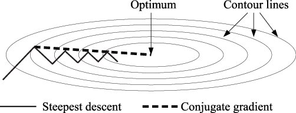

</font>

---


### 3.2.2 函数优化

<font size=4>

最陡下降法（Steepest Descent）和共轭梯度法（Conjugate Gradient）搜索方向的对比:


</font>


---


### 3.2.2 函数优化

<font size=4>

**B. 非二次函数的共轭梯度法**

如果我们没有一个函数或其梯度的解析表达式，我们很可能无法解析地解决一维最小化问题。因此，将算法的第2步替换为通常的行搜索过程。但对于第四个点，有如下的数学技巧:

对于两次迭代，它是公平的:

$$x_{k+1}-x_{k}=c d_{k},$$

其中$c$是常数。然后对于二次方程，我们有:

$$\nabla f(x_{k+1}) - \nabla f(x_k) = (A x_{k+1} - b) - (A x_k - b) = A(x_{k+1}-x_k) = cA d_k$$

从这个方程中表示功$Ad_k = \dfrac{1}{c} \left( \nabla f(x_{k+1}) - \nabla f(x_k)\right)$，我们在步骤定义$\beta_k$中去掉函数的“知识”，然后将第4点重写为:

$$\beta_k = \frac{\nabla f(x_{k+1})^\top (\nabla f(x_{k+1}) - \nabla f(x_k))}{d_k^\top (\nabla f(x_{k+1}) - \nabla f(x_k))}.$$

这种方法称为**Polack - Ribier方法**。

</font>


---


### 3.2.2 函数优化

<font size=4>


**C. 共轭梯度法步骤**:

**1. 初始化：**

让 $k = 0$ 和 $x_k = x_0$，其中 $x_0$ 是初始猜测值。

计算初始梯度方向 $d_k$，通常设置为 $-\nabla f(x_0)$。

**2. 行搜索：**

通过行搜索的过程，计算最优步长(**学习率**) $\alpha_k$，以最小化 $f(x_k + \alpha_k d_k)$。这是通过解一个一维优化问题得到的，其中

$$\alpha_{k}=-\frac{d_{k}\left(A x_{k}-b\right)}{d_{k}^{\top} A d_{k}}$$ 


**3. 更新变量：**

使用步长 $\alpha_k$ 更新变量 $x_k$：
$$x_{k+1} = x_k + \alpha_k d_k$$


</font>


---


### 3.2.2 函数优化

<font size=4>

**4. 更新方向：**

更新下一步的梯度方向: $d_{k+1} = -\nabla f(x_{k+1}) + \beta_k d_k$， $d_{k+1}$是当前负梯度方向和之前方向 $d_k$ 的线性组合，其中$\beta_k$由公式计算:
$$\beta_k = \frac{\nabla f(x_{k+1})^\top A d_k}{d_k^\top A d_k}.$$

**5. 迭代：**

重复步骤2-4直到建立 $n$ 个共轭方向，其中 $n$ 是空间的维度（$x$的维度）。


共轭梯度法是一种高效的优化算法，特别适用于解决二次凸规划问题，例如线性回归和二次规划。它在每个迭代步骤中保持了共轭性，以加速收敛。

</font>


---


### 3.2.2 函数优化

<font size=4>

牛顿法, 最陡下降法, 共轭梯度法搜索方向的对比:

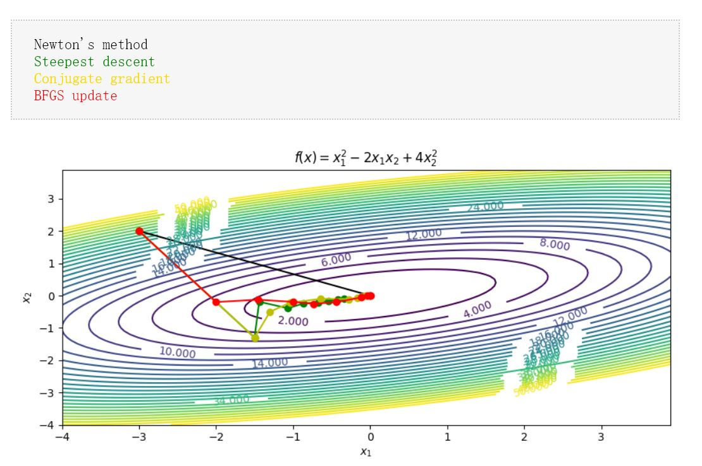

</font>


---


### 3.2.2 函数优化

<font size=4>

牛顿法, 最陡下降法, 共轭梯度法搜索方向的对比:


</font>


---


### 3.2.2 函数优化

- SciPy 优化器
  - SciPy 的 optimize 模块提供了常用的最优化算法函数实现，我们可以直接调用这些函数完成我们的优化问题，比如查找函数的最小值或方程的根等。

  - NumPy 能够找到多项式和线性方程的根，但它无法找到非线性方程的根。

---


### 3.2.2 函数优化

- 最小化函数 - optimize.minimize() 函数
  - 函数表示一条曲线，曲线有高点和低点。
  - 高点称为最大值。
  - 低点称为最小值。
  - 整条曲线中的最高点称为全局最大值，其余部分称为局部最大值。
  - 整条曲线的最低点称为全局最小值，其余的称为局部最小值。
  - 可以使用 scipy.optimize.minimize() 函数来最小化函数。


---


### 3.2.2 函数优化

<font size=4>

- 最小化函数 - optimize.minimize() 函数受以下几个参数：

  **fun** - 要优化的函数

  **x0** - 初始猜测值

  **method** - 要使用的方法名称，值可以是：'CG'，'BFGS'，'Newton-CG'，'L-BFGS-B'，'TNC'，'COBYLA'，，'SLSQP'。

  **callback** - 每次优化迭代后调用的函数。

  **options** - 定义其他参数的字典：
  {
      "disp": boolean - print detailed description
      "gtol": number - the tolerance of the error
  }

</font>

---

### 3.2.2 函数优化

<font size=4>


| 方法名称                                             | 方法值    | 描述                                         |
|-----------------------------------------------------|-----------|----------------------------------------------|
| CG (Conjugate Gradient)                              | 'CG'      | 共轭梯度法，用于无约束凸优化问题。             |
| BFGS (Broyden-Fletcher-Goldfarb-Shanno)              | 'BFGS'    | BFGS算法，一种无约束优化方法，逐步逼近Hessian矩阵的逆。 |
| Newton-CG                                          | 'Newton-CG' | 牛顿法，用于解决有约束和非约束的优化问题。需要提供Hessian矩阵的近似。 |
| L-BFGS-B (Limited-memory BFGS with box constraints) | 'L-BFGS-B' | 带有边界约束的有限内存BFGS算法，适用于有约束优化问题。 |
| TNC (Truncated Newton Conjugate-Gradient)           | 'TNC'     | 截断牛顿共轭梯度法，用于有约束的优化问题，支持约束条件。 |
| COBYLA (Constrained Optimization BY Linear Approximations) | 'COBYLA' | COBYLA算法，用于解决问题具有约束条件的情况，使用线性逼近。 |
| SLSQP (Sequential Least Squares Quadratic Programming) | 'SLSQP' | 顺序最小二乘二次规划方法，适用于有约束条件的二次优化问题。 |

</font>

---


### 3.2.2 函数优化

- 最小化函数 - optimize.minimize() 函数

<font size=4>

```python
from scipy.optimize import minimize

def eqn(x):
  return x**2 + x + 2

mymin = minimize(eqn, 0, method='BFGS')

print(mymin)

输出：
      fun: 1.75
 hess_inv: array([[0.50000001]])
      jac: array([0.])
  message: 'Optimization terminated successfully.'
     nfev: 8
      nit: 2
     njev: 4
   status: 0
  success: True
        x: array([-0.50000001])
```

</font>

---


### 3.2.3 常微分方程

<font size=4>

常微分方程（Ordinary Differential Equation，ODE）是数学中的一个分支，用于描述一个未知函数的导数和自变量之间的关系。它是微分方程的一种，通常涉及到一个未知函数和其导数的关系，通常表现为：

$$F\left(x, y, y^{\prime}, y^{\prime \prime}, \ldots, y^{(n)}\right)=0$$

其中，$x$是自变量，$y$是未知函数，$y'$表示$y$的一阶导数，$y''$表示$y$的二阶导数，以此类推。$n$代表方程中涉及到的最高阶导数。常微分方程可以根据阶数和其他特性分为不同类型，如一阶ODE、二阶ODE、线性ODE、非线性ODE等。

常微分方程在各个科学领域中都有广泛的应用，包括物理学、工程学、生物学等。它们用于建模自然现象和解决各种问题，如弹簧振动、电路分析、化学反应动力学等。求解常微分方程的目标是找到满足方程的函数$y(x)$。

解常微分方程的方法包括分离变量法、特解法、变换法、**数值方法**等。常微分方程理论在数学和应用领域都具有重要性，它有助于理解自然现象和改进技术应用。

</font>

---


### 3.2.3 常微分方程

<font size=5>

简要介绍以下三种用于求解一阶常微分方程的数值方法：

1. 欧拉方法
2. 后向欧拉法
3. 龙格-库塔法

</font>

---


### 3.2.3 常微分方程

<font size=5>

一阶微分方程是一个初始值问题(IVP)，其形式为：

$$y^{\prime}(t)=f(t, y(t)), \quad y\left(t_{0}\right)=y_{0}$$

其中$f$是一个函数，$f:\left[t_{0}, \infty\right) \times \mathbb{R}^{d} \rightarrow \mathbb{R}^{d}$，初始条件${\displaystyle y_{0}\in \mathbb {R} ^{d}}$是给定的向量。


</font>

---


### 3.2.3 常微分方程

<font size=4>

有限差分逼近导数

0. 导数: $f^{\prime}(a)=\lim _{x \rightarrow a} \frac{f(x)-f(a)}{x-a}$

1. 前向差分：$D_+f\left(x_{j}\right)=\frac{f\left(x_{j+1}\right)-f\left(x_{j}\right)}{x_{j+1}-x_{j}}$,$f^{\prime}\left(x_{j}\right)=D_+f\left(x_{j}\right)+O\left(\Delta x\right)$ 具有`一阶`精度

2. 前后差分：$D_-f\left(x_{j}\right)=\frac{f\left(x_{j}\right)-f\left(x_{j-1}\right)}{x_{j}-x_{j-1}}$,$f^{\prime}\left(x_{j}\right)=D_-f\left(x_{j}\right)+O\left(\Delta x\right)$ 具有`一阶`精度

3. 中心差分：$D_cf\left(x_{j}\right)=\frac{f\left(x_{j+1}\right)-f\left(x_{j-1}\right)}{x_{j+1}-x_{j-1}}$,$f^{\prime}\left(x_{j}\right)=D_cf\left(x_{j}\right)+O\left(\Delta x^2\right)$ 具有`二阶`精度

.png>)


</font> 

---


### 3.2.3 常微分方程

<font size=5>

**1. 欧拉方法**

从曲线上的任意点，您可以通过沿着与曲线相切的线移动一小段距离来找到曲线上附近点的近似值。

从微分方程（1 ）开始，我们用有限差分近似 代替导数y ′

$$y^{\prime}(t) \approx \frac{y(t+h)-y(t)}{h}$$

重新排列后会产生以下公式

$${\displaystyle y(t+h)\approx y(t)+hy'(t)}$$

并使用 ( 1 ) 给出：
$${\displaystyle y(t+h)\approx y(t)+hf(t,y(t))。}$$


</font>

---


### 3.2.3 常微分方程

<font size=5>


该公式通常按以下方式应用。我们选择步长h，然后构建序列${\displaystyle t_{0},t_{1}=t_{0}+h,t_{2}=t_{0}+2h,...}$我们表示为$y_{n}$精确解的数值估计${\displaystyle y(t_{n})}$。

受 ( 3 ) 的启发，我们通过以下递归方案 计算这些估计
$${\displaystyle y_{n+1}=y_{n}+hf(t_{n},y_{n}).}$$
 
这就是**欧拉方法**（或前向欧拉方法，与后向欧拉方法相反，将在下面描述）。该方法以1768 年描述的 Leonhard Euler命名。欧拉方法是显式方法的一个示例。这意味着新值$y_{n+1}$是根据已知的事物定义的，例如$y_{n}$。


</font>

---


### 3.2.3 常微分方程

<font size=5>

**2. 后向欧拉法**

如果我们使用近似值 
$${\displaystyle y'(t)\approx {\frac {y(t)-y(th)}{h}},}$$

我们得到后向欧拉法：

$${\displaystyle y_{n+1}=y_{n}+hf(t_{n+1},y_{n+1}).}$$

后向欧拉法是一种隐式方法，这意味着我们必须求解方程才能找到$y_{n+1}$。人们经常使用定点迭代或**牛顿-拉夫森方法**（对其进行某种修改）来实现这一目标。

求解该方程比显式方法花费更多时间。诸如之类的**隐式方法**的优点是它们通常对于求解刚性方程更稳定，这意味着可以使用更大的步长h。

</font>

---


### 3.2.3 常微分方程

<font size=5>

**3. 龙格-库塔方法**

龙格-库塔方法（Runge-Kutta method）是一种用于数值求解常微分方程的迭代数值方法，它提供相对较高的精确度和稳定性。

1. **初始条件**：首先，需要明确初始条件，包括初始时间点$x₀$和初始状态$y₀$。

2. **步长选择**：选择一个适当的步长$h$，它表示在每一步中前进的$x$的距离。

3. **四个斜率$k₁$、$k₂$、$k₃$、$k₄$的计算**：

    a. $k₁ = h * f(x₀, y₀)$

    b. $k₂ = h * f(x₀ + h/2, y₀ + k₁/2)$

    c. $k₃ = h * f(x₀ + h/2, y₀ + k₂/2)$

    d. $k₄ = h * f(x₀ + h, y₀ + k₃)$


</font>

---

### 3.2.3 常微分方程

<font size=4>

**3. 龙格-库塔方法**


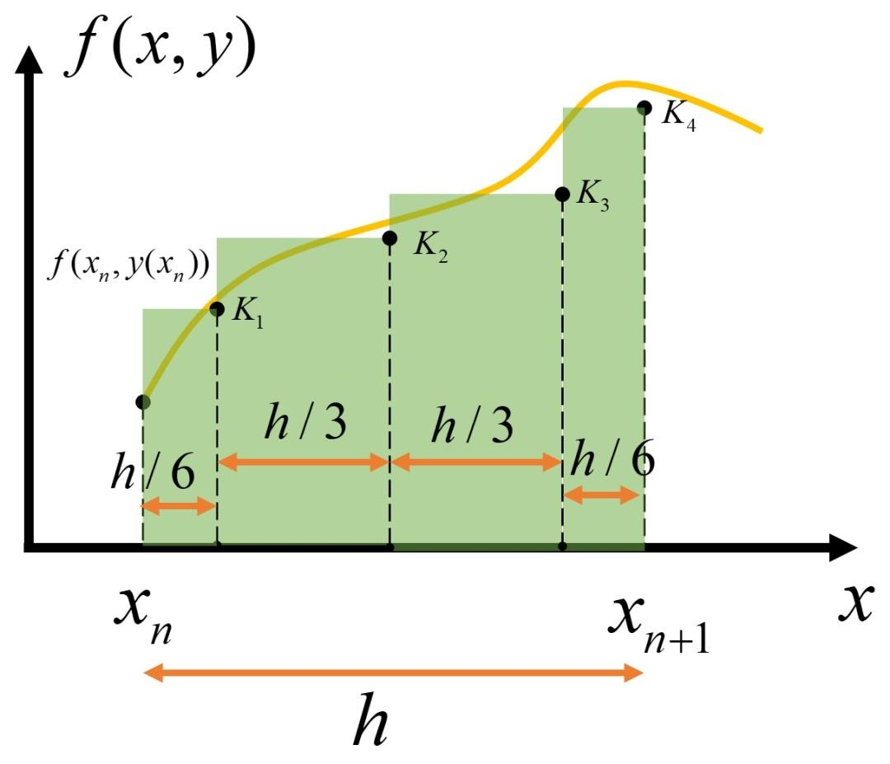

4. *新状态值的计算*：使用四个斜率的加权平均值来更新状态值：

    $y₁ = y₀ + (1/6) * (k₁ + 2k₂ + 2k₃ + k₄)$

5. **迭代**：重复上述步骤，将$x₀$和$y₀$更新为$x₀ + h$和$y₁$，然后计算下一个步骤的状态值。一直重复此过程，直到达到所需的终点$x$。

龙格-库塔方法通过多次迭代来逼近微分方程的解，每次迭代都使用四个斜率来提高精确度。龙格-库塔方法是一种广泛使用的数值求解微分方程的方法，适用于各种应用领域，包括物理学、工程学和科学研究。

</font>

---


### 3.2.3 常微分方程

<font size=4>


| Method                 | Description                                             | Order of Accuracy  |
|------------------------|---------------------------------------------------------|--------------------|
| 前向欧拉法 Forward Euler          | Simplest explicit method, prone to stability issues     | 1st order          |
| 后向欧拉法 Backward Euler         | Implicit method, unconditionally stable for linear ODEs | 1st order          |
| 梯形法 Trapezoidal Rule       | Implicit method with better stability properties        | 2nd order          |
| 龙格-库塔法 Runge-Kutta Methods    | General family of explicit methods                      | 4th order    |
| 亚当斯-巴什福斯 Adams-Bashforth        | Explicit multi-step method                              | 4th order    |
| 亚当斯-穆尔顿法 Adams-Moulton          | Implicit multi-step method                              | 4th order    |

</font>

---


### 3.2.3 常微分方程

<font size=3>

Scipy（Scientific Python）是一个强大的Python科学计算库，其中包含了用于求解常微分方程（Ordinary Differential Equations，ODEs）的功能。常微分方程求解是科学和工程领域中的常见任务，用于建模和模拟各种动态系统的行为。Scipy提供了多种方法来求解ODEs，以下是一些常用的功能和方法：

**odeint函数**：Scipy的odeint函数是最常用的ODE求解工具之一。它可以用于解决初值问题，其中需要提供初始条件和ODE的描述。这个函数可以处理多个ODE的耦合系统。

**ode函数**：ode是Scipy中的一种更通用的ODE求解器。它允许更灵活地定义ODE系统，并选择不同的积分方法（例如，使用龙格-库塔法）。

**odeintw函数**：类似于odeint，但用于处理刚性ODEs（stiff ODEs）的情况。刚性ODEs通常需要更精确的积分方法。

**LSODA求解器**：Scipy还提供了LSODA（Livermore Solver for Ordinary Differential Equations）求解器，用于处理一般的ODEs。它是一种自适应方法，适用于不同类型的ODE问题。

**BDF求解器**：BDF（Backward Differentiation Formula）求解器是Scipy中的另一个求解器，用于刚性ODEs。它使用隐式方法来处理刚性系统。

**事件处理**：Scipy还允许定义和处理事件，这些事件可以在ODE求解的特定时间点触发。这对于模拟系统中的特殊情况非常有用。

Scipy的ODE求解功能非常强大，可适用于各种科学和工程领域的问题。可以根据问题的性质选择合适的ODE求解方法，并使用Scipy来模拟和分析动态系统的行为。

</font>

---


### 3.2.3 常微分方程

<font size=4>

Scipy中的ODE求解器主要依赖于scipy.integrate模块。使用Scipy求解常微分方程的详细步骤：

1. 导入必要的库：首先，需要导入Scipy库的ODE求解器和其他必要的库。

      ```python
      from scipy.integrate import solve_ivp
      ```
2. 定义ODE函数：创建一个Python函数，该函数接受自变量t和未知函数y作为参数，并返回ODE的右侧。例如，如果你有一个一阶ODE dy/dt = f(t, y)，则定义如下：

      ```python
      def odefunc(t, y):
          return f(t, y)
      ```
3. 设置初始条件：指定初始条件，包括初始时间点t₀和初始状态y₀。

4. 选择求解器：Scipy提供了不同类型的ODE求解器，如'RK45'，'RK23'，'DOP853'等，可以根据问题的性质选择合适的求解器。

5. 调用ODE求解器：使用solve_ivp函数来求解ODE。传入ODE函数、初始条件、求解的时间范围以及所选的求解器。

      ```python
      solution = solve_ivp(odefunc, (t₀, t_final), [y₀], method='RK45', t_eval=time_points)
      ```

6. 获取结果：获得求解的结果，包括时间点和对应的状态值。

      ```python
      t = solution.t
      y = solution.y
      ```

</font>

---


### 3.2.3 常微分方程

<font size=4>

ODE初值问题： $y' = -2y，y(0) = 1$

```python
# 导入所需的库
import numpy as np
from scipy.integrate import solve_ivp
import matplotlib.pyplot as plt

# 定义ODE函数
def odefunc(t, y): 
    return -2 * y # 这是一个示例ODE，dy/dt = -2y

# 设置初始条件
t0 = 0            # 初始时间
t_final = 5       # 最终时间
y0 = 1            # 初始状态值

# 使用Scipy的solve_ivp函数求解ODE
solution = solve_ivp(odefunc, (t0, t_final), [y0], method='RK45', t_eval=np.linspace(t0, t_final, 100))

# 从解中提取时间点和状态值
t = solution.t
y = solution.y[0]

# 绘制解的图表
plt.figure(figsize=(8, 6))
plt.plot(t, y, label='Solution')
plt.xlabel('Time')
plt.ylabel('y(t)')
plt.title('ODE Solution Using Scipy')
plt.legend()
plt.grid()
plt.show()

```

</font>

---


### 3.2.3 常微分方程

<font size=4>


</font>

---


### 3.2.3 常微分方程

<font size=3>

ODE边值问题： $y'' + exp(y) = 0，y(0) = y(1) = 0$

```python
# 导入所需的库
import numpy as np
from scipy.integrate import solve_bvp
import matplotlib.pyplot as plt

# 定义边界条件函数
def bc(ya, yb):
    return np.array([ya[0], yb[0]])

# 创建一个均匀的时间点数组
x = np.linspace(0, 1, 5)

# 初始化两个状态变量的数组，每个数组有两个行（状态变量）和与时间点数组相同的列数
y_a = np.zeros((2, x.size))
y_b = np.zeros((2, x.size))
y_b[0] = 3  # 初始化y_b的初始状态

# 使用Scipy的solve_bvp函数求解边值问题
res_a = solve_bvp(fun, bc, x, y_a)  # 求解第一个问题
res_b = solve_bvp(fun, bc, x, y_b)  # 求解第二个问题

# 创建用于绘图的时间点数组
x_plot = np.linspace(0, 1, 100)

# 从解中提取状态变量的值
y_plot_a = res_a.sol(x_plot)[0]
y_plot_b = res_b.sol(x_plot)[0]

# 绘制两个问题的解
plt.plot(x_plot, y_plot_a, label='y_a')
plt.plot(x_plot, y_plot_b, label='y_b')
plt.legend()
plt.xlabel("x")  # x轴标签
plt.ylabel("y")  # y轴标签
plt.show()  # 显示图表
```

</font>


---


### 3.2.3 常微分方程

<font size=4>


</font>


---


## 3.3 ★符号计算

<font size=5>

  **符号计算**: 处理数学对象的计算称为符号计算。在符号计算中，数学对象是精确表示的，而不是近似的，未计算的数学表达式会以符号形式保留。与符号计算相对应的是数值计算，下面将以两个例子来展示二者之间的区别。 

  典型的符号计算操作包括：**表达式化简，表达式求值，表达式的变形：展开、积、幂、部分分式表示、将三角函数转换为指数函数等，一元或多元微分，带条件的化简，部分或完整的因式分解，求解线性或非线性方程，求解微分方程或差分方程，求极限，求函数的定积分、不定积分，泰勒展开、洛朗展开等，无穷级数展开，级数求和，矩阵运算，数学公式的 TEX 和 LATEX 显示。**


</font>

---

## 3.3 ★符号计算

<font size=5>

**计算机代数系统**（Computer Algebra System，缩写作：CAS）是进行符号运算的软件。


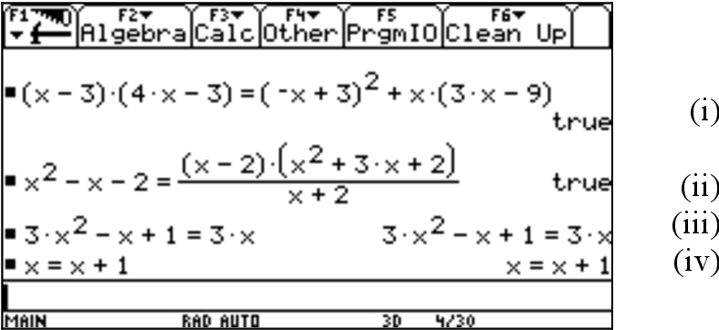

</font>

---


## 3.3 ★符号计算

<font size=5>

在计算机代数系统中运算的对象是数学表达式，通常表达式有如下几类：

1. 多元多项式
2. 标准函数（三角函数、指数函数等）
3. 特殊函数（ Γ 函数、Bessel 函数等）
4. 多种函数组成的复合函数
5. 表达式的导数、积分、和与积等
6. 级数
7. 矩阵

</font>

---


## 3.3 ★符号计算
目前存在众多的计算机代数系统，下面列出了几种：

Maple
MuPAD
Maxima
Mathcad
**Mathematica**
MATLAB Symbolic Math Toolbox
SageMath

---

## 3.3 ★符号计算

<font size=5>

SymPy 是一个由 Python 语言编写的符号计算库。SymPy 4 个优势：

1. SymPy 是自由软件，免费开源，在遵守许可证条款的前提下，用户可以自由地根据自己的需求修改其源代码。与之形成对比的是，Maple、MuPad、Mathcad、MATLAB、Mathematica 等都是商业软件，价格昂贵；
2. SymPy 使用 Python 编写而成，与使用自己发明的语言的计算机代数系统相比（如 Maxima 由 LISP 编写），SymPy 具有很强的通用性；
3. SymPy 完全用 Python 编写，完全在 Python 中执行。这样，只要您熟悉 Python，那么 SymPy 将会很容易入门；
4. 与另一个使用 Python 的符号计算软件——SageMath 相比，SymPy 的优点是安装包体积小；

SymPy 可以作为库集成到其他软件中，为别的软件所用。SageMath 便是将 SymPy 作为其子模块，然后再加入其他模块，构建出一个功能齐全的数学软件。

</font>

---


## 3.3 ★符号计算

<font size=5>

0. 定义符号变量


1. 求导$sin(x)e^x$


2. 不定积分


</font>

---


## 3.3 ★符号计算

<font size=5>

3. 定积分


4. 极限


</font>

---


## 3.3 ★符号计算

<font size=5>

5. 解非线性方程$x^2−2=0$


6. 解常微分方程


</font>

---


## 3.3 ★符号计算

<font size=5>

7. 矩阵特征值


8. 把贝塞尔函数Jν(z)写成球形贝塞尔函数Jν(z)


</font>

---


## 3.4 正交试验设计


各个学科做实验，一般均会采用正试验设计。

<font size=5>

1. 正交试验设计是一种研究多因素多水平的试验设计方法。它的主要目标是在有限的试验次数内，找到一组有代表性的试验条件，以全面而有效地探索多因素之间的相互关系。

2. 正交试验设计使用正交性质从全面试验中选择一部分有代表性的点进行试验。这些点具备均匀分散、齐整可比的特点。正交试验设计是为了在保持试验效果的同时，降低试验次数，节省时间和资源。


</font>

---


## 3.4 正交试验设计

<font size=5>

3. 指标

就是试验要考核的效果。在正交试验中，主要设计可测量的定量指标，常用X、Y、Z来表示。

4. 因素

是指对试验指标可能产生影响的原因。因素是在试验中应当加以考察的重点内容，一般用A、B、C、•• • 来表示。在正交试验中，只选取可控因素参加试验。

5. 水平

是指因素在试验中所处的状态或条件。对于定量因素，每一个选定值即为一个水平。水平又叫位级，一般用1、2、3、•• • 来表示。在试验中需要考察某因素的几种状态时，则称该因素为几水平（位级）的因素。


</font>

---


## 3.4 正交试验设计


---


## 3.4 正交试验设计

<font size=5>


**完全因子实验**： 对于三因素三水平的设计，如果采用完全因子实验，即每个因素的每个水平都要进行试验，总共需要 $3^3=27$ ($3^k$，其中 $k$ 是因素的数量) 次实验运行。这是因为每个因素有两个水平，而有三个因素，因此是 $3×3×3=27$。

</font>


---


## 3.4 正交试验设计

<font size=4>

**正交表设计**：一种常见的三因素三水平设计的正交表是$3^{k−1}$ 阵列，其中 $k$ 是因素的数量。对于三个因素($k=3$)，这将是一个 $3^2$ 阵列，导致只需 9 次实验运行。

**实验次数降低**： 使用正交表的设计，实验次数从完全因子实验的 27 次降低到了只需要 9 次。

| Run | Type of Adhesive (A) | Temperature (B) | Pressure (C) |
|-----|-----------------------|------------------|--------------|
|  1  |           1           |         1        |      1       |
|  2  |           2           |         2        |      3       |
|  3  |           3           |         3        |      2       |
|  4  |           1           |         2        |      2       |
|  5  |           2           |         3        |      1       |
|  6  |           3           |         1        |      3       |
|  7  |           1           |         3        |      3       |
|  8  |           2           |         1        |      1       |
|  9  |           3           |         2        |      2       |


</font>


---


## 3.4 正交试验设计

Python可以使用多种库和工具来设计正交试验表。以下是一种使用pyDOE库的方法来设计正交试验表的示例：

```python

安装pyDOE库： https://pypi.org/project/pyDOE2/


pip install pyDOE2

```

---


## 3.4 正交试验设计


Python代码来生成一个三因素三水平**完全因子实验**：

<font size=5>

```python
import pyDOE2

# 定义因素和水平的数量
num_factors = 3  # 因素的数量
num_levels = 3   # 每个因素的水平数

# 生成一个三因素、三水平的完全因子实验设计
design = pyDOE2.fullfact([num_levels] * num_factors)

# 打印生成的设计
print("Factor A\tFactor B\tFactor C")
for row in design:
    # 输出时将每个因素的水平值加一，以与传统索引从1开始的习惯对齐
    print(f"{row[0] + 1}\t\t{row[1] + 1}\t\t{row[2] + 1}")


```

</font>


---


## 3.4 正交试验设计

<font size=3>


输出三因素三水平**完全因子实验**：

```python
Factor A	Factor B	Factor C
1.0		1.0		1.0
2.0		1.0		1.0
3.0		1.0		1.0
1.0		2.0		1.0
2.0		2.0		1.0
3.0		2.0		1.0
1.0		3.0		1.0
2.0		3.0		1.0
3.0		3.0		1.0
1.0		1.0		2.0
2.0		1.0		2.0
3.0		1.0		2.0
1.0		2.0		2.0
2.0		2.0		2.0
3.0		2.0		2.0
1.0		3.0		2.0
2.0		3.0		2.0
3.0		3.0		2.0
1.0		1.0		3.0
2.0		1.0		3.0
3.0		1.0		3.0
1.0		2.0		3.0
2.0		2.0		3.0
3.0		2.0		3.0
1.0		3.0		3.0
2.0		3.0		3.0
3.0		3.0		3.0
```

</font>

---


## 3.4 正交试验设计

Python代码来生成一个三因素三水**平正交试验表**：

<font size=5>

```python

import pyDOE2

# 定义因素和水平的数量
num_factors = 3  # 因素的数量
num_levels = 3   # 每个因素的水平数

# 生成一个三因素、三水平的简化正交实验设计
design = pyDOE2.fullfact([num_levels - 1] * num_factors)

# 将水平值递增以与期望的范围对齐（例如，从1到3）
design += 1

# 打印生成的设计
print("Factor A\tFactor B\tFactor C")
for row in design:
    # 输出设计表格，每个因素的水平值都在递增范围内
    print(f"{row[0]}\t\t{row[1]}\t\t{row[2]}")


```

</font>


---


## 3.4 正交试验设计

<font size=3>


输出三因素三水**平正交试验表**：

```python
Factor A	Factor B	Factor C
1.0		1.0		1.0
2.0		1.0		1.0
1.0		2.0		1.0
2.0		2.0		1.0
1.0		1.0		2.0
2.0		1.0		2.0
1.0		2.0		2.0
2.0		2.0		2.0
```

</font>

---


## 3.4 正交试验设计

常用正交设计表

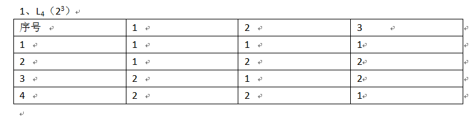


---


## 3.4 正交试验设计

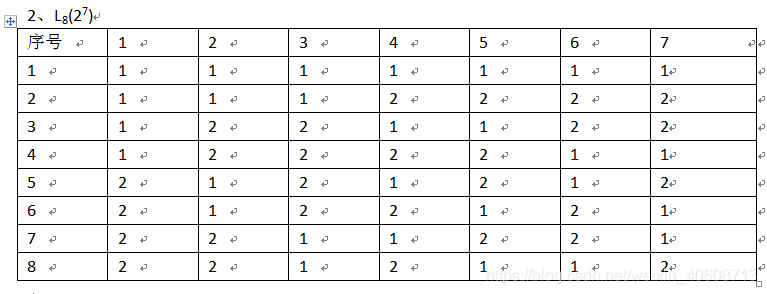


---


## 3.4 正交试验设计


---


## 3.4 正交试验设计

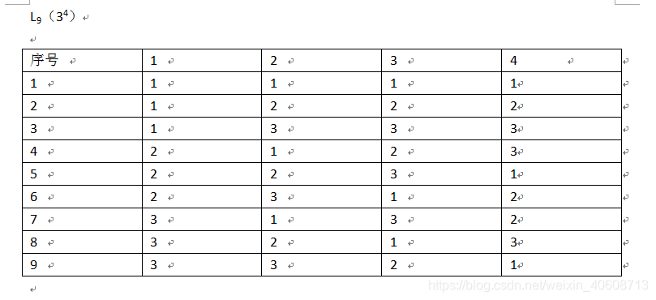


---


## 3.4 正交试验设计

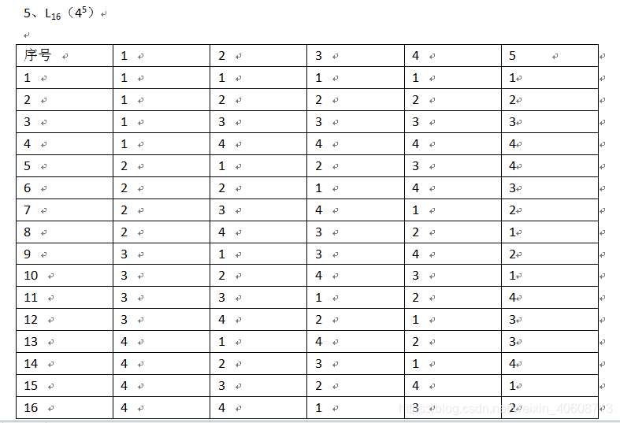


---


## 3.4 正交试验设计

应用举例:

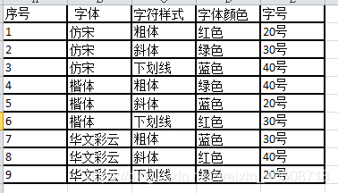


---


## 3.4 正交试验设计


---


## 3.4 正交试验设计

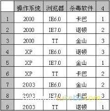  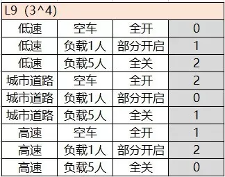


---


## 3.4 正交试验设计

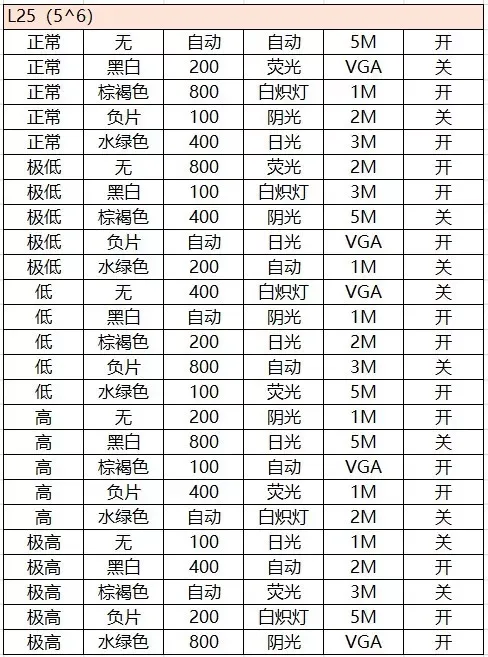

---


## 3.4 正交试验设计


---


