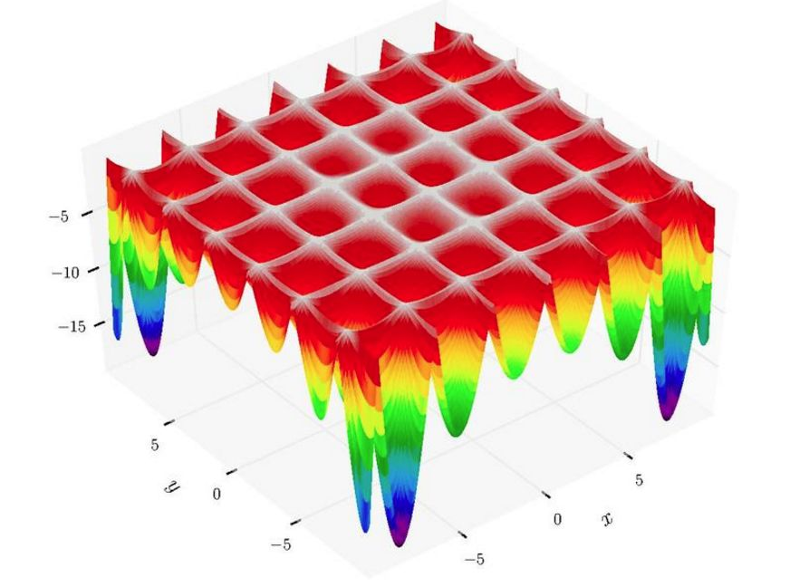
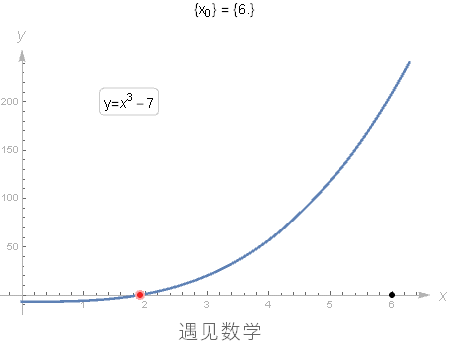
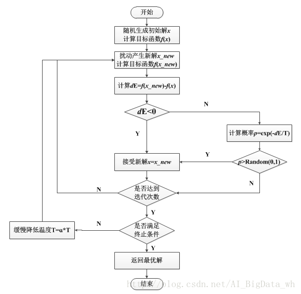
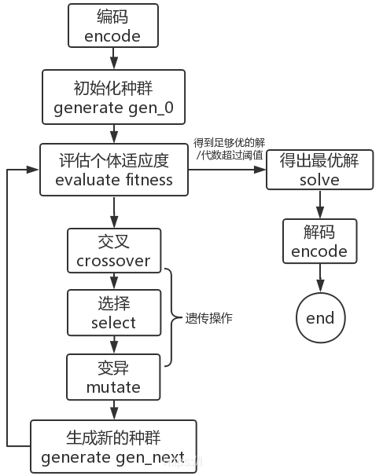

# 第四章 Python全局优化
## 4.1 全局优化简介
## 4.2 模拟退火算法
## 4.3 差异进化算法
## 4.4 遗传算法
## 4.5 粒子群优化算法

---


## 4.1 全局优化简介

<font size=6>

优化算法是一类数学方法，旨在找到一个函数的最小值或最大值，以满足一定的约束或条件。这些算法在众多领域中广泛应用，包括机器学习、数据分析、工程优化和科学研究。

优化算法通常可以分为两大类：局部优化和全局优化。它们的区别在于优化的范围和目标不同：

**局部优化**：局部优化是指在函数值空间的一个有限区域内寻找最小值或最大值。这意味着算法尝试在一个局部范围内找到最优解，而不考虑整个函数值空间。局部优化更适合处理那些具有单一最优解或者在特定范围内寻找最优解的问题。


</font>

---


## 4.1 全局优化简介

<font size=6>


**全局优化**：全局优化是在函数值空间整个区域内寻找最小值或最大值问题。这意味着算法的目标是找到函数的全局最优解，考虑了整个函数值空间。全局优化更适用于那些具有多个潜在最优解或者需要在广泛范围内搜索最优解的问题。

**选择使用局部优化还是全局优化取决于问题的性质和要求。如果问题已知具有单一最优解或者搜索范围有限，局部优化可能更有效。而如果问题具有多个潜在最优解或者搜索空间广泛，全局优化则更合适。**

不同的优化算法可以用于解决局部和全局优化问题，这些算法的性能和效果因问题而异

</font>

---


## 4.1 全局优化简介

<font size=4>

局部优化和全局优化的区别：

| 特征             | 局部优化                                           | 全局优化                               |
|------------------|--------------------------------------------------|----------------------------------------|
| 定义             | 寻找局部最优解，仅关注在给定范围内的最佳解决方案 | 寻找整个问题领域内的全局最佳解决方案   |
| 目标             | 在局部范围内最小化或最大化目标函数                 | 在整个问题空间中最小化或最大化目标函数 |
| 结果稳定性       | 结果可能受初始点选择的影响                       | 结果通常不受初始点选择的影响           |
| 解决复杂性       | 通常较容易解决                                   | 通常较复杂且需要更多计算资源解决       |
| 发现全局最优解   | 不保证找到全局最优解                             | 目标是找到全局最优解                   |
| 适用领域         | 适用于问题具有单一解或局部解足够好的情况         | 适用于问题具有多个解且全局最优解很重要 |


</font>

---


## 4.1 全局优化简介

<font size=5>

局部优化和全局优化的区别：




</font>

---


## 4.1 全局优化简介

<font size=5>

局部优化/全局优化和方程求根的转化：

| 转化类型 | 问题描述 | 转化方法 |
|----------|----------|----------|
| 局部优化转方程求根 | 寻找局部最小值的问题 | 构建目标函数，计算梯度，找梯度为零的点 |
| 全局优化转方程求根 | 寻找全局最小值的问题 | 构建目标函数，找到全局最小值对应的点 |
| 方程求根转局部优化 | 求解方程根的问题 | 构建目标函数，将求解根的问题转化为最小化问题 |
| 方程求根转全局优化 | 求解方程根的问题 | 构建目标函数，将求解根的问题转化为全局最小化问题 |


</font>

---


## 4.1 全局优化简介

<font size=5>

局部优化/全局优化和方程求根的转化：


</font>

---


## 4.1 全局优化简介

<font size=4>

局部优化举例：

| 算法名称           | 描述                                             | 应用领域                                |
|--------------------|--------------------------------------------------|-----------------------------------------|
| 梯度下降法 Gradient Descent | 基于梯度的优化算法，用于寻找局部最小值。           | 机器学习、神经网络训练                  |
| 牛顿法 Newton's Method/Newton-Raphson Mmethod | 使用二阶导数信息来优化，通常更快但要求更多计算资源。 | 优化问题、物理建模                      |
| 拟牛顿法 Quasi-Newton Methods | 近似牛顿法，结合了梯度信息和二阶信息。            | 大规模优化问题、经济建模                |
| 随机梯度下降法 Stochastic Gradient Descent | 梯度下降的变体，每次迭代使用随机样本，适用于大规模数据。 | 深度学习、自然语言处理                |
| 动态规划 Dynamic Programming | 用于解决具有重叠子问题的优化问题。                | 路径规划、资源分配问题                  |
| 共轭梯度法 Conjugate Gradient | 一种迭代法，用于求解对称正定线性方程组，也可用于无约束优化。 | 数值线性代数、信号处理、图像处理    |


</font>

---


## 4.1 全局优化简介

<font size=5>

牛顿法（局部优化算法）的缺陷：
牛顿法使用函数f(x)的泰勒级数的前面几项来寻找方程f(x)=0的根。其迭代格式为：
$$\begin{align}
x_{n+1} &= x_n - \frac{f(x_n)}{f'(x_n)}
\end{align}$$
牛顿法假设  $x_{n}$  是对方程 f(x) = 0 的解的一个近似. 如果令 $x_{n+1}$ = $x_{n}$ - f($x_{n}$)/f′($x_{n}$). 则在很多情况下, $x_{n+1}$ 是个比 $x_{n}$ 更好的近似. 



</font>

---


## 4.1 全局优化简介

<font size=5>


</font>

---


## 4.1 全局优化简介

<font size=4>

# 牛顿法（局部优化算法）的缺陷


| 缺陷                        | 描述                                                                                             |
|---------------------------|--------------------------------------------------------------------------------------------------|
| 初始点敏感性               | 牛顿法对初始点选择敏感，选择不当的初始点可能导致算法无法收敛或收敛到局部最小值。              |
| 局部收敛性               | 牛顿法是一种局部优化算法，只能找到离初始点较近的局部最小值，对于全局优化问题有限制。            |
| Hessian矩阵计算复杂度    | 牛顿法需要计算目标函数的Hessian矩阵，这在高维问题中可能会非常昂贵和复杂。                      |
| 正定性要求                | 为了确保牛顿法的下降性，Hessian矩阵必须是正定的，否则算法可能会失败或收敛缓慢。                |
| 不适用于约束问题          | 牛顿法通常用于无约束的优化问题，对于带有约束的问题，需要使用其他方法，如拉格朗日乘子法。     |

这些缺陷限制了牛顿法在一些优化问题中的适用性，特别是在全局优化和高维问题中。


</font>

---


## 4.1 全局优化简介

<font size=6>

全局优化算法是一类用于求解复杂优化问题的算法，其目标是在问题的搜索空间中找到全局最优解，即在给定问题的约束条件下找到能够最小化或最大化目标函数的解。这种类型的算法通常用于处理复杂的非线性、高维、多峰和具有约束条件的优化问题，其中局部搜索方法可能会陷入局部最优解。

全局优化算法的核心思想是在搜索空间中探索不同的解，并尽可能覆盖整个空间，以确保找到全局最优解。这些算法通常包括对候选解的评估和选择策略，以确定哪些解应该被保留或进一步改进。

</font>

---


## 4.1 全局优化简介

模拟退火算法过程: 单粒子

<font size=4>


</font>

---

## 4.1 全局优化简介

粒子群优化算法: 多粒子

<font size=4>


</font>

---


## 4.1 全局优化简介

全局优化在许多领域中的应用

<font size=4>

| 领域                   | 应用                                                         |
|------------------------|--------------------------------------------------------------|
| 机器学习和深度学习    | - 模型参数优化，包括神经网络的训练                         |
| 工程设计              | - 优化工程结构参数，如航空设计中的翼型优化                   |
| 金融领域              | - 投资组合优化，以最大化回报或最小化风险                     |
| 药物发现              | - 分子结构参数优化，以提高药物的效力和安全性               |
| 天文学和物理学        | - 参数估计和模型拟合，用于研究宇宙和物质世界的性质           |
| 能源领域              | - 发电厂运营优化，以提高能源生产效率                       |
| 供应链管理            | - 最优化物流和库存管理，以降低成本和提高效率                 |
| 电子设计自动化        | - 电路设计参数优化，以改进电子产品性能                     |
| 生态学和环境科学      | - 生态模型参数优化，用于生态系统和环境模拟                   |
| 城市规划              | - 城市交通流优化，以减少交通拥堵和改善交通流动性           |

</font>

---


## 4.1 全局优化简介


<font size=4>

**常见的全局优化算法**包括遗传算法、差异进化算法、模拟退火算法、蚁群算法和粒子群优化算法等。这些算法在不同类型的问题上表现出色，并根据问题的性质和约束条件选择合适的算法。全局优化算法在许多领域，如工程优化、机器学习、数据挖掘和科学研究中具有广泛的应用。


| 算法名称                   | 描述                                       |
|--------------------------|--------------------------------------------|
| 遗传算法 (Genetic Algorithms)  | 模拟生物进化过程来搜索最优解。                 |
| 差异进化算法 (Differential Evolution) | 使用变异、交叉和选择策略进行全局优化。        |
| 模拟退火算法 (Simulated Annealing)  | 通过随机搜索和概率接受策略寻找最优解。       |
| 蚁群算法 (Ant Colony Optimization) | 模拟蚂蚁在搜索空间中的移动来寻找最优解。       |
| 粒子群优化算法 (Particle Swarm Optimization) | 模拟鸟群或鱼群行为来搜索最优解。        |
| 遗传规划算法 (Genetic Programming) | 使用树状结构表示解空间中的候选解。           |
| 蜂群算法 (Artificial Bee Colony) | 模拟蜜蜂在搜索空间中的行为来寻找最优解。       |
| 水滴算法 (Water Drop Algorithm) | 受到水滴流动和蒸发过程的启发来搜索最优解。     |
| 免疫算法 (Immune Algorithm)    | 模拟免疫系统的工作原理来搜索最优解。          |
| 蜘蛛猴算法 (Spider Monkey Optimization) | 模拟蜘蛛猴的搜索策略来寻找最优解。     |


</font>


---


## 4.1 全局优化简介


<font size=4>

遗传算法、差异进化算法、模拟退火算法、粒子群优化算法、蚁群算法的优缺点对比：

| 算法库               | 优点                                          | 缺点                                     | Python库         |
|----------------------|---------------------------------------------|----------------------------------------|------------------|
| 遗传算法 (Genetic Algorithm) | 1. 适用于复杂的优化问题。 2. 并行性强。        | 1. 需要调优参数。 2. 可能陷入局部最优解。 | DEAP, PyGAD     |
| 差异进化算法 (Differential Evolution) | 1. 高效收敛。 2. 不需要导数信息。 | 1. 对高维问题的适应性较差。 2. 参数设置敏感。 | scikit-opt       |
| 模拟退火算法 (Simulated Annealing) | 1. 全局最优解的概率较高。 2. 适用于大规模问题。 | 1. 需要调整初始温度和降温策略。 2. 收敛速度较慢。 | SciPy, scikit-opt |
| 蚁群算法 (Ant Colony Optimization) | 1. 具有较强的全局搜索能力。 2. 适用于离散问题。 | 1. 参数选择和调优复杂。 2. 收敛速度较慢。 | PyGMO            |
| 粒子群优化算法 (Particle Swarm Optimization) | 1. 收敛速度快。 2. 适用于大规模问题。 | 1. 可能陷入局部最优解。 2. 对高维问题的适应性较差。 | PyGMO, PyOpt     |


</font>


---


## 4.2 模拟退火

<font size=4>

**模拟退火算法**（Simulated Annealing，SA）是一种**启发式算法(利用问题拥有的启发信息来引导搜索，达到减少搜索范围、降低问题复杂度的目的)**，由S.Kirkpatrick, C.D.Gelatt和M.P.Vecchi在1983年所发明的，V.Čern在1985年也独立发明此演算法。

模拟退火算法用于解决**组合优化问题**和**全局优化问题**。模拟退火算法基本思想 **爬山法**是一种贪婪的方法，对于一个优化问题，其大致图像如右图所示。其目标是要找到函数的最大值，若初始化时，初始点的位置在C处，则会寻找到附近的局部最大值A点处，由于A点出是一个局部最大值点，故对于**爬山法**来讲，该算法无法跳出局部最大值点。若初始点选择在D处，根据**爬山法**，则会找到全部最大值点B。这一点也说明了这样基于贪婪的爬山法是否能够取得全局最优解与初始值的选取由很大的关系。 .png>)


</font>


---


## 4.2 模拟退火算法

<font size=4>


**模拟退火算法**(Simulated Annealing, SA)的思想借鉴于固体的退火原理，当固体的温度很高的时候，内能比较大，固体的内部粒子处于快速无序运动，当温度慢慢降低的过程中，固体的内能减小，粒子的慢慢趋于有序，最终，当固体处于常温时，内能达到最小，此时，粒子最为稳定。模拟退火算法便是基于这样的原理设计而成。

**模拟退火算法**从某一较高的温度出发，这个温度称为初始温度，伴随着温度参数的不断下降，算法中的解趋于稳定，但是，可能这样的稳定解是一个局部最优解，此时，模拟退火算法中会以一定的概率跳出这样的局部最优解，以寻找目标函数的全局最优解。如上图中所示，若此时寻找到了A点处的解，模拟退火算法会以一定的概率跳出这个解，如跳到了D点重新寻找，这样在一定程度上增加了寻找到全局最优解的可能性。


</font>


---


## 4.2 模拟退火算法

<font size=4>


模拟退火算法过程: **以一定的概率来接受一个比当前解要差的解，因此有可能会跳出局部的最优解，达到全局的最优解。**

根据Metropolis准则，粒子在温度T时趋于平衡的概率为$exp(-ΔE_n/(kT))$，其中$E$为温度$T$时的内能，$ΔE_n$为其改变数，$k$为Boltzmann常数。Metropolis准则使用过程:

(1) 随机挑选一个解$x_n$，计算解$x_n$的目标函数值$E_n$; 给$x_n$一个随机的位移获得随机解$x_{n+1}$，计算解$x_{n+1}$的目标函数值$E_{n+1}$;求出系统因此而产生的能量变化$ΔE_n=E_{n+1}-E_n$。

(2) 若$ΔE_n$⩽0，该位移可采纳($x_n=x_{n+1}$)，更新后的系统状态可作为下次变化的起点(爬山法思想)； 若$ΔE_n$>0，位移后的状态可采纳的概率为

$$ P_n = exp(-\frac{ΔE_n}{kT})$$

式中$T$为温度，然后从(0,1)区间均匀分布的随机数中挑选一个数$R$，若$R < P_n$ ，则将变化后的状态作为下次的起点($x_n=x_{n+1}$)；否则，将变化前的状态作为下次的起点。

(3) 转第(1)步继续执行，知道达到平衡状态为止。


</font>


---


## 4.2 模拟退火算法

<font size=5>


**得到全局最优的条件**

(1)初始温度足够高

(2)迭代次数足够大

(3)终止温度足够低

(4)降温过程足够缓慢


**停止搜索的条件**

(1)达到指定的迭代次数。

(2)达到指定的温度。

(3)找到最优解连续M次迭代都没有变化。


</font>


---


## 4.2 模拟退火算法

<font size=2>


| 步骤                 | 描述                                                         |
|----------------------|--------------------------------------------------------------|
| 1. 初始解设置         | 从解空间中选择`一个`初始解。                                   |
| 2. 温度调度           | 引入温度参数，允许接受劣解的程度。随时间逐渐降低温度。        |
| 3. 随机扰动           | 在每个温度下，通过随机扰动生成一个新解。                    |
| 4. 目标函数计算       | 计算新解的目标函数值。                                       |
| 5. 接受策略           | 根据新解和当前解之间的差异以及温度参数决定是否接受新解。   |
| 6. 迭代过程           | 重复上述步骤，降低温度并搜索，直到满足停止条件。             |
| 7. 最优解收集         | 在搜索过程中记录每个温度下的最优解，选择最佳解作为输出。   |




</font>


---


## 4.2 模拟退火算法

<font size=3>

利用模拟退火算法求解如下优化问题： $min f(x)=(x−2)∗(x+3)∗(x+8)∗(x−9)$

```python
import numpy as np
import matplotlib.pyplot as plt

def inputfun(x):
    return (x-2)*(x+3)*(x+8)*(x-9)

initT = 1000 #初始温度
minT = 1 #温度下限
iterL = 1000 #每个T值的迭代次数
delta = 0.95 #温度衰减系数
k = 1

initx = 10*(2*np.random.rand()-1)
nowt = initT
print("初始解：",initx)

xx = np.linspace(-10,10,300)
yy = inputfun(xx)
plt.figure()
plt.plot(xx,yy)
plt.plot(initx,inputfun(initx),'o')

#模拟退火算法寻找最小值过程
while nowt>minT:
    for i in np.arange(1,iterL,1):
        funVal = inputfun(initx)
        xnew = initx+(2*np.random.rand()-1)
        if xnew>=-10 and xnew<=10:
            funnew = inputfun(xnew)
            res = funnew-funVal
            if res<0:
                initx = xnew
            else:
                p = np.exp(-(res)/(k*nowt))
                if np.random.rand()<p:
                    initx = xnew
    nowt = nowt * delta

print("最优解：",initx)
print("最优值：",inputfun(initx))
plt.plot(initx,inputfun(initx),'*r')
plt.show()
```

</font>


---


## 4.2 模拟退火算法

<font size=4>

**参数控制**
模拟退火算法的应用很广泛，可以求解NP完全问题，但其参数难以控制，其主要问题有以下三点：

(1) **温度T的初始值设置问题**

温度T的初始值设置是影响模拟退火算法全局搜索性能的重要因素之一、初始温度高，则搜索到全局最优解的可能性大，但因此要花费大量的计算时间；反之，则可节约计算时间，但全局搜索性能可能受到影响。实际应用过程中，初始温度一般需要依据实验结果进行若干次调整。

(2) **退火速度问题**

模拟退火算法的全局搜索性能也与退火速度密切相关。一般来说，同一温度下的“充分”搜索(退火)是相当必要的，但这需要计算时间。实际应用中，要针对具体问题的性质和特征设置合理的退火平衡条件。

(3) **温度管理问题**

温度管理问题也是模拟退火算法难以处理的问题之一。实际应用中，由于必须考虑计算复杂度的切实可行性等问题。


</font>


---


## 4.2 模拟退火算法

<font size=5>

模拟退火算法的优缺点

优点 

    - 能够处理具有任意程度的非线性、不连续性、随机性的目标函数，目标函数可以具有任意边界条件和约束。

    - 比起其他的非线性优化算法，模拟退火的编程工作量小，且易于实现，统计上可以保证找到全局最优解。

缺点

    - 找到最优解要耗费非常多的时间。

    - 参数调整到最适合比较困难。

    - 使用不当(如降温过快等)会找到误差很大的结果。


</font>


---


## 4.1 全局优化简介

<font size=4>

scikit-opt 库的安装方法:

```python
pip install scikit-opt
```

求以下函数在-1~2之间的全局最小值:

$$y = x \cdot \sin(10 \pi x) + 2.0$$


</font>

---


## 4.2 模拟退火算法

<font size=4>

```python
import numpy as np

# 定义目标函数
def aim(x):
    # 这是目标函数，计算给定输入 x 的函数值，这个函数是一个特定的示例
    # 在这个示例中，函数是 (x[0] * sin(10π * x[0]) + 2.0) * (-1)
    return (x * np.sin(10 * np.pi * x) + 2.0) * (1)


# 导入模拟退火（Simulated Annealing）算法库
from sko.SA import SA

# 创建模拟退火算法实例
# - func: 目标函数，这里是定义的 aim 函数
# - x0: 初始解，这里设置为 [0]
# - T_max: 初始温度，这里设置为 1
# - T_min: 最低温度，通常设置为接近零的小数，这里是 1e-9
# - L: 每个温度下的迭代次数，这里设置为 30
# - max_stay_counter: 如果连续 max_stay_counter 次都没有接受更好的解，则算法停止
# - lb: 变量的下界（Lower Bound），这里是 -1
# - ub: 变量的上界（Upper Bound），这里是 2
sa = SA(func=aim, x0=[0], T_max=1, T_min=1e-9, L=30, max_stay_counter=50, lb=[-1], ub=[2])

# 运行模拟退火算法以找到最优解
best_x, best_y = sa.run()

# 输出最优解和最优函数值
print('SA best_x:', best_x)
print('SA best_y:', best_y)

# 导入 Matplotlib 和 Pandas 库
import matplotlib.pyplot as plt
import pandas as pd

# 绘制最优函数值的收敛图
# 使用 Pandas 创建一个 DataFrame 包含每一代的最优函数值，并对其进行累积最小化处理
plt.plot(pd.DataFrame(sa.best_y_history).cummin(axis=0))
plt.show()


```

</font>


---


## 4.2 模拟退火算法

<font size=4>
最优函数值的收敛图: 随机生成一个初始解！


</font>


---


## 4.2 模拟退火算法

<font size=4>

在使用scikit-opt库的模拟退火算法时，以下是一些常用的调参技巧：

1. 初始温度 (T_max) 和最低温度 (T_min): 初始温度通常应设置为相对高的值，以允许算法接受较差的解并跳出局部最优解。最低温度通常设置为接近零的小值，以确保算法在最后的迭代中逐渐收敛。
2. 温度调度策略: 选择合适的温度调度策略，如指数衰减或线性衰减。这些策略控制温度如何随时间降低。
实验不同的温度调度策略以找到适合问题的最佳策略。
3. 迭代次数 (L):设置每个温度下的迭代次数，通常应该足够大以充分搜索当前温度下的解空间。
可以根据问题的复杂性和计算资源进行调整。
4. 初始解 (x0):初始解可以是随机生成的，但根据问题的性质，也可以选择更智能的初始解。
初始解的选择可能会影响算法的性能，特别是在处理特定问题时。

</font>

---


## 4.4 遗传算法

<font size=5>

**遗传算法**（Genetic Algorithm，GA）是一种通过模拟自然选择和遗传机制进行问题求解的优化算法。它基于达尔文的进化论和孟德尔的遗传学原理，使用进化的思想来搜索问题的解空间。


**算法特点**：
 (1) 直接对结构对象进行操作，不存在求导和函数连续性的限定；
 (2) 具有内在的隐含并行性和更好的全局寻优能力；
 (3) 采用概率化的寻优方法，能自动获取和指导优化的搜索空间，自适应地调整搜索方向，不需要确定的规则。


**遗传算法将“优胜劣汰，适者生存”的生物进化原理引入优化参数形成的编码串群体中**，按所选择的适应度函数并通过遗传中的**复制**、**交叉**及**变异**对个体进行筛选，**适应度高的个体被保留下来**，组成新的群体，新的群体既继承了上一代的信息，又优于上一代。这样周而复始，群体中个体适应度不断提高，直到满足一定的条件。**遗传算法的算法简单，可并行处理，并能到全局最优解**。

</font>


---


## 4.4 遗传算法

<font size=5>


**遗传算法**是从代表问题可能潜在的解集的一个**种群**（population）开始的，而一个种群则由经过基因（gene）编码的一定数目的个体(individual)组成。每个个体实际上是染色体(chromosome)带有特征的实体。

染色体作为遗传物质的主要载体，即多个基因的集合，其内部表现（即基因型）是某种基因组合，它决定了个体的形状的外部表现，如黑头发的特征是由染色体中控制这一特征的某种基因组合决定的。因此，在一开始需要实现从表现型到基因型的映射即编码工作。由于仿照基因编码的工作很复杂，我们往往进行简化，如**二进制编码**。


</font>


---

## 4.4 遗传算法

<font size=4>

初代种群产生之后，按照适者生存和优胜劣汰的原理，逐代（generation）演化产生出越来越好的近似解，在每一代，根据问题域中个体的适应度（fitness）大小选择（selection）个体，并借助于自然遗传学的遗传算子（genetic operators）进行组合交叉（crossover）和变异（mutation），产生出代表新的解集的种群。

这个过程将导致种群像自然进化一样的后生代种群比前代更加适应于环境，末代种群中的最优个体经过解码（decoding），可以作为问题近似最优解。



</font>


---


## 4.4 遗传算法

<font size=4>

**算法示例**
求f(x) = $x^2$ 极大值问题，设自变量 x 介于0～31，求其二次函数的最大值，即：max f(x) = $x^2$, x∈ [0, 31]


</font>


---


## 4.4 遗传算法

<font size=4>


</font>


---


## 4.4 遗传算法

<font size=4>


</font>


---


## 4.4 遗传算法

<font size=4>


</font>


---


## 4.4 遗传算法

<font size=4>


</font>


---


## 4.4 遗传算法

<font size=4>

```python
import numpy as np

def aim0(x):
    # 这是目标函数，计算给定输入 x 的函数值，这个函数是一个特定的示例
    # 在这个示例中，函数是 (x[0] * sin(10π * x[0]) + 2.0) * (-1)
    return (x * np.sin(10 * np.pi * x) + 2.0) * (1)

# 定义目标函数
def aim(x):
    # 这是目标函数，计算给定输入 x 的函数值，这个函数是一个特定的示例
    # 在这个示例中，函数是 (x[0] * sin(10π * x[0]) + 2.0) * (-1)
    return (x[0] * np.sin(10 * np.pi * x[0]) + 2.0) * (1)

# 导入遗传算法（Genetic Algorithm）库
from sko.GA import GA

# 创建遗传算法实例
# - func: 目标函数，这里是定义的 aim 函数
# - n_dim: 变量的维度，这里是 1
# - size_pop: 种群大小，这里设置为 50
# - max_iter: 最大迭代次数，这里设置为 10
# - prob_mut: 变异概率，这里设置为 0.001
# - lb: 变量的下界（Lower Bound），这里是 -1
# - ub: 变量的上界（Upper Bound），这里是 2
# - precision: 优化精度，这里设置为 1e-7
ga = GA(func=aim, n_dim=1, size_pop=50, max_iter=10, prob_mut=0.001, lb=[-1], ub=[2], precision=1e-7)

# 运行遗传算法以找到最优解
best_x, best_y = ga.run()

# 输出最优解和最优函数值
print('GA best_x:', best_x)
print('GA best_y:', best_y)

# 导入 Matplotlib 和 Pandas 库
import matplotlib.pyplot as plt
import pandas as pd

# 绘制最优解的收敛图
# 使用 Pandas 创建一个 DataFrame 包含每一代的最优解，并对其进行累积最小化处理
plt.plot(pd.DataFrame(ga.all_history_Y).cummin(axis=0))
plt.show()
```

</font>


---


## 4.4 遗传算法

<font size=4>
最优函数值的收敛图: 随机生成多个初始解！


</font>


---


## 4.4 遗传算法

<font size=4>


</font>


---


<!-- 

## 4.4 遗传算法

<font size=4>

**Lennard-Jones 势能函数**通常用于描述分子之间的相互作用，尤其是稀薄气体或者稀薄液体中的分子间相互作用。该势能函数的表达式为：

$$V(r)=4 \varepsilon\left[\left(\frac{\sigma}{r}\right)^{12}-\left(\frac{\sigma}{r}\right)^{0}\right]$$

其中：$r$ 是两个粒子之间的距离。$ε$ 是深度参数，表示势能的最小值。$σ$ 是硬核直径。

在**二体问题**中，我们可以考虑多个粒子，每个粒子的位置用 $x_i$  表示，$i=1,2,…,N$。二体问题的 Lennard-Jones 能量可以表示为所有粒子之间相互作用的总和：

$$E\left(\mathbf{x}_{1}, \mathbf{x}_{2}, \ldots, \mathbf{x}_{N}\right)=\sum_{i=1}^{N-1} \sum_{j=i+1}^{N} V\left(\left\|\mathbf{x}_{i}-\mathbf{x}_{j}\right\|\right)$$

这是一个多变量函数，其中 $\| \mathbf{x}_{i}-\mathbf{x}_{j} \|$ 表示欧几里德距离，即两个粒子之间的直线距离。在全局优化中，我们的目标是找到使得上述能量函数 $E$ 最小的粒子位置。这个问题可以通过使用优化算法，如遗传算法、粒子群算法等，来搜索最小值的位置。


</font>


---


## 4.4 遗传算法

<font size=5>


```python
import numpy as np
from sko.GA import GA

# 定义 Lennard-Jones 函数
def lennard_jones(x):
    n = len(x)
    total_energy = 0
    for i in range(n - 1):
        for j in range(i + 1, n):
            r = np.linalg.norm(x[i] - x[j])
            total_energy += (1 / r**12 - 2 / r**6)
    return total_energy

# 定义优化问题
problem = {
    'dim': 2,  # 二体问题中每个粒子的维度
    'size_pop': 50,  # 种群大小
    'max_iter': 100,  # 最大迭代次数
    'lb': -5,  # 搜索空间的下界
    'ub': 5,   # 搜索空间的上界
}

# 使用遗传算法进行全局优化
ga = GA(func=lennard_jones, n_dim=problem['dim'], size_pop=problem['size_pop'], max_iter=problem['max_iter'], lb=problem['lb'], ub=problem['ub'])
best_solution, best_value = ga.run()

print('最优解：', best_solution)
print('最优值：', best_value)
```

</font>


---


 -->


## 4.4 遗传算法

<font size=4>

遗传算法调参技巧:

- scikit-opt库提供的遗传算法有四个主要超参数：种群规模(size_pop)、最大迭代次数(max_iter)、变异概率(prob_mut)和精度(precision)。

1. 最大迭代次数和精度都可以增加，以提高搜索的成熟度，但需要考虑时间开销。

2. 种群规模的设置需要适度，太小的规模可能导致近亲交配和病态基因，而太大的规模则浪费资源且难以收敛。

3. 变异操作的目的是保持多样性，增强局部搜索能力，但变异概率设置过高会使算法变为随机搜索。


</font>


---


## 局部优化和全局优化算法选择 !

<font size=4>

| 因素                 | 局部优化算法选择                             | 全局优化算法选择                           |
|----------------------|---------------------------------------------|-------------------------------------------|
| 问题性质             | 凸问题通常适合                             | 复杂非凸问题通常适合                     |
| 多模态性             | 单一最优解时使用                           | 多个最优解时使用                         |
| 计算资源             | 较少计算资源可用时使用                     | 较多计算资源可用时使用                   |
| 领域知识             | 具有领域知识时可能更容易选择               | 领域知识有限时可能需要全局搜索           |
| 实验和调优           | 需要实验和参数调优来确定最佳算法           | 需要实验和参数调优来确定最佳算法         |
| 策略示例             | 梯度下降、牛顿法、拟牛顿法等               | 遗传算法、模拟退火、粒子群优化等         |


</font>


---


