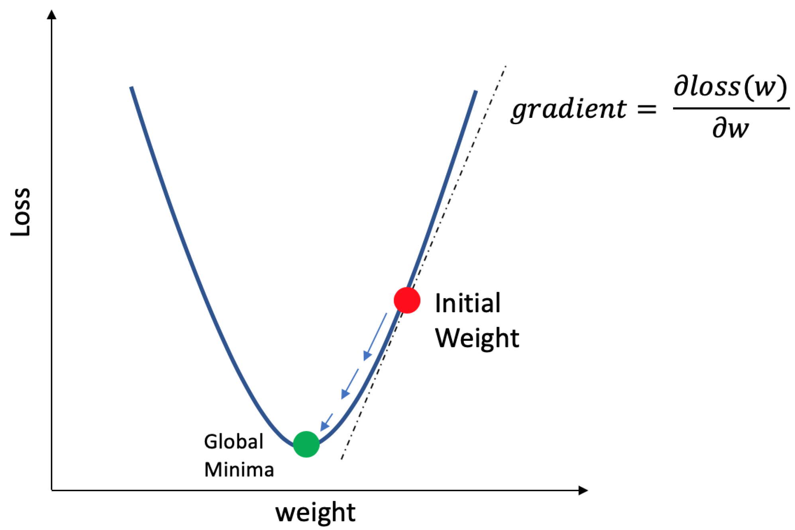

# 第六章：Python在人工智能领域的应用 - 深度学习

<font size=5>

## 6.1 深度学习简介
## 6.2 深度学习模型构建和常用库


</font> 


---


## 6.1 深度学习简介

<font size=5>

0.概述

**深度学习**，作为现代技术的一个革命性进展，是通过学习数据的多个层次的表示和抽象来深入理解数据，例如图像、声音和文本。它的核心理念源于人工神经网络的领域，特别是那些包含多个隐藏层的多层感知器结构。

在深度学习中，一个核心的概念是网络的“深度”，即从输入到输出所经历的最长路径的长度。这个概念可以通过流程图来形象化，其中流程图中的深度对应于网络从输入层到输出层的层级数（包括隐藏层和输出层）。传统的前馈神经网络可以视为深度等同于其层数（隐藏层数量+1）的网络。

深度学习的强大之处在于其能够通过组合较低层的特征来形成更高层次、更加抽象的表示（如属性类别或特征），从而揭示数据中的分布式特征表示。

</font> 


---


## 6.1 深度学习简介

<font size=5>

1. 深度学习产生的背景

1.1 深度不够的缺陷

在许多场合，仅需两层深度（即深度为2的神经网络）就能在既定的精度范围内表达各种函数，如逻辑门、标准神经元、Sigmoid神经元以及支持向量机（SVM）中的径向基函数（RBF）。但这种表达方式通常需要大量的节点，意味着在学习目标函数时，将涉及更多的计算单元和参数。理论上，对于特定类型的函数，所需参数数量与输入规模成指数关系，逻辑门、标准神经元和RBF单元即属此列。Hastad的研究发现，当网络深度为d时，输入为n的神经网络可以用O(n)个节点高效表达这类函数。然而，如果深度限制为d-1，就需要O(n²)个节点来实现相同的表示。

我们可以将深度结构视作一种因子分解。大多数随机选择的函数，不管采用深层还是浅层结构，都难以有效表示。然而，许多能通过深层结构有效表达的函数，却不能通过浅层结构做到这一点。这种深层表示的现象表明，对于某些待表示的函数，存在一些结构化的特性。如果没有这些结构化元素，那么模型的泛化能力将受到限制。

</font> 


---


## 6.1 深度学习简介

<font size=4>

1.2 大脑具有深层的结构

**深度学习神经网络是一种强大的机器学习方法，通过多层神经元模拟人脑的结构，解决各种复杂的任务**。例如，被深入研究的视觉皮层（图（a）包含一系列的区域，每个区域都有输入， 信号流从一个区域到下一个区域。 在这种功能层次结构中，每个层次上的输入代表了不同层次的抽象特征，越上层的特征， 又越底层的信息表征，抽象性越高，如下图（c）所示。


</font> 


---


## 6.1 深度学习简介

<font size=5>

1.3 认知过程是深层次的

• 人们是使用层次化的方式来组织它们的想法和观念的；
• 人们首先是学习简单的概念，然后将它们组合起来以表示更加抽象的概念；
• 工程师们习惯于将解决问题的方案分解为多个层次的抽象和处理过程。

如果计算机能够像人一样学习到这些概念，那将会是非常棒的。

深度学习的概念和思想很简单，然而如果构建一个合理的深度网络拓扑结构，如何学习网络中的信号传递权值， 都是非常困难的问题。


</font> 


---


## 6.2 深度学习模型构建和常用库
### 深度学习神经网络方法和步骤

<font size=3>


| 步骤 | 描述 |
|------|------|
| 1. 问题定义 | - 定义解决的任务或问题类型。 |
| 2. 数据收集 | - 收集适用于问题的数据集。 |
| 3. 数据预处理 | - 数据清洗、归一化、标准化和特征工程。 |
| 4. 数据分割 | - 划分数据为训练、验证和测试集。 |
| 5. 模型选择 | - 选择神经网络架构（如卷积神经网络、循环神经网络等）。 |
| 6. 网络构建 | - 使用深度学习框架构建神经网络模型。 |
| 7. 模型训练 | - 使用训练集来训练神经网络。 |
| 8. 超参数调整 | - 调整学习率、批处理大小、层数、神经元数量等超参数。 |
| 9. 模型评估 | - 使用验证集评估模型性能，包括损失函数、准确率等指标。 |
| 10. 模型调整 | - 根据评估结果对模型进行调整，如修改架构或超参数。 |
| 11. 模型测试 | - 使用测试集进行最终性能评估。 |
| 12. 模型部署 | - 部署训练好的模型到实际应用中。 |
| 13. 监控与维护 | - 持续监控模型性能并进行维护。 |
| 14. 解释与可解释性 | - 探索模型的决策过程和可解释性。 |
| 15. 迭代与改进 | - 根据反馈和新数据不断改进神经网络模型。 |


</font>

---


## 6.2 深度学习模型构建和常用库
### 神经网络方法

<font size=4>


`传统`线性回归（最小二乘法）是机器学习和统计学中的一种用于估计线性回归模型系数的常见方法。当我们讨论最小二乘法获得的解析解与神经网络中的线性回归时，有一些区别：

线性回归与神经网络结构不同：

1. 线性回归是一种基本的线性模型，其预测是基于输入特征的线性组合，没有隐藏层或非线性激活函数。
在神经网络中，线性回归通常是一个单独的神经元（或层），但神经网络可以包含多个神经元、多个隐藏层以及非线性激活函数，因此具有更大的灵活性，可以拟合更复杂的模式。
解析解与迭代优化的区别：

2. 最小二乘法用于线性回归时，可以通过解析方法获得系数的闭式解，即可以直接计算出系数的数学表达式，如前面所示。
在神经网络中，特别是深度神经网络，通常使用梯度下降等迭代优化算法来学习权重和偏差（系数），而不是得到解析解。这是因为神经网络通常包含大量参数，解析解可能难以获得或不实际。


</font>

---


## 6.2 深度学习模型构建和常用库
### 神经网络方法

<font size=4>


3. 模型复杂性的不同：
线性回归是一种线性模型，适用于简单的线性关系建模，对于复杂非线性问题可能表现不佳。
神经网络可以表示更复杂的非线性关系，因为它们包括非线性激活函数和多层结构，因此在处理复杂数据和问题时更具优势。

4. 适用性的不同：
线性回归通常用于回归问题，其中目标是预测连续数值（例如，房价预测）。
神经网络既可用于回归问题，也可用于分类问题，其中目标是将输入数据分为不同的类别（例如，图像分类）。

综上所述，线性回归是一个简单的线性模型，可以通过最小二乘法获得解析解，但在处理复杂问题时可能效果有限。神经网络具有更大的灵活性和拟合能力，但通常需要使用迭代优化方法来学习参数，适用于更广泛的问题。选择模型取决于问题的性质和需求。在某些情况下，神经网络的线性回归层可以被嵌入到更复杂的神经网络结构中以处理更复杂的数据模式。


</font>

---


## 6.2 深度学习模型构建和常用库
### 神经网络方法

<font size=3>

在深度学习中，我们可以使用神经网络图直观地表现模型结构。为了更清晰地展示线性回归作为神经网络的结构，图中使用神经网络图表示本节中介绍的线性回归模型。神经网络图隐去了模型参数权重和偏差。

 

图中，输入分别为 $x_1$ 和 $x_2$，因此输入层的输入个数为2。输入个数也叫`特征数`或`特征向量维度`。网络的输出为 o，输出层的输出个数为1。需要注意的是，我们直接将图中神经网络的输出 o 作为线性回归的输出，即 $\hat{y}$=o。由于输入层并不涉及计算，按照惯例，所示的神经网络的层数为1。所以，线性回归是一个单层神经网络。输出层中负责计算 o 的单元又叫`神经元`。在线性回归中，o 的计算依赖于 $x_1$ 和 $x_2$ 。输出层中的神经元和输入层中各个输入完全连接。因此，这里的输出层又叫`全连接层（fully-connected layer）`或`稠密层（dense layer）`。

</font>

---


## 6.2 深度学习模型构建和常用库
### 神经网络方法

<font size=5>

1. 多层感知机
   
2. 激活函数

3. 损失函数

4. 梯度下降

5. 正向传播、反向传播

6. 自动微分


</font>

---


## 6.2 深度学习模型构建和常用库
### 神经网络方法

<font size=4>

1. 多层感知机（multilayer perceptron，MLP）

**神经元模型**

神经网络(neural networks) 方面的研究很早就已出现, 今天 “神经网络”已是一个相当大的多学科交叉的学科领域. 各相关学科对神经网络的定义多种多样, 神经网络是由具有适应性的简单单元组成的广泛并行互连的网络, 它的组织能够模拟生物神经系统对真实世界物体所作出的交互反应 [Kohonen, 1988]. 

神经网络中最基本的成分是**神经元(neuron)模型**. 

在生物神经网络中, 每个神经元与其他神经元相连, 当它 “兴奋” 时,就会向相连的神经元发送化学物质, 从而改变这些神经元内的电位。 


</font>


---


## 6.2 深度学习模型构建和常用库
### 神经网络方法

<font size=4>

1. 多层感知机（multilayer perceptron，**MLP**）

**神经元模型**

如果某神经元的电位超过了一个 “國值” (threshold), 那么它就会被激活, 即 “兴奋” 起来, 向其他神经元发送化学物质.
1943 年, [McCulloch and Pitts, 1943] 将上述情形抽象为图中的简单模型, 这就是一直沿用至今的 “M-P 神经元模型” . 在这个模型中, 神经元接收到来自 $n$ 个其他神经元传递过来的输入信号, 这些输入信号通过带权重的连接(connection)进行传递, 神经元接收到的总输入值将与神经元的**阈值** $\theta$ 进行比较，然后通过激活函数处理，以产生神经元的输出。

   


</font>


---


## 6.2 深度学习模型构建和常用库
### 神经网络方法

<font size=4>


  

单个**神经元模型**可以直接实现Logistic回归的二分类效果。实际上，Logistic回归可以视为**单层神经网络**，因为它包括了与神经网络相似的元素：

**激活函数**： 在Logistic回归中，常用的激活函数是Sigmoid函数，用于将线性组合的输入映射到[0, 1]的范围，表示概率。

**权重和偏差**： 类似于神经网络中的权重和偏差，Logistic回归也有参数，通过这些参数来进行分类决策。


</font>


---


## 6.2 深度学习模型构建和常用库
### 神经网络方法

<font size=4>


**损失函数**： 在Logistic回归中，通常使用交叉熵损失函数，这与神经网络中的损失函数类似。

**输出层**： 输出层通常包括一个神经元，其输出可以解释为样本属于正类别的概率。

**因此，Logistic回归是一种特殊情况的神经网络，通常用于简单的二分类问题。单个神经元模型可以模拟Logistic回归的行为，因此它们具有相似的功能，尤其是在处理二分类任务时。**

</font>


---


<font size=4>

### 神经网络方法

基于**神经元模型**，多层感知机在单层神经网络的基础上引入了一到多个**隐藏层**（hidden layer）。隐藏层位于输入层和输出层之间。图展示了一个多层感知机的神经网络图，输入和输出个数分别为4和3，中间的隐藏层中包含了5个隐藏单元（hidden unit）。由于输入层不涉及计算，图中的多层感知机的层数为2。该多层感知机中的隐藏层和输出层都是**全连接层**。

<center>


</center>

其中输入层神经元接收外界输入, 隐层与输出层神经元对信号进行加工, 最终结果由输出层神经元输出; 换言之, 输入层神经元仅是接受输入, 不进行函数处理, 隐层与输出层包含功能神经元. 

</font>

---


<font size=4>

### 神经网络方法

1. 多层感知机 (拥有 $d$ 个输入神经元、 $l$ 个输出神经元、 $q$ 个隐层神经元的多层前馈网络结构)

<center>


</center>

**A**. 一般情况下，给定训练集 $D=\left\{\left(\boldsymbol{x}_1, \boldsymbol{y}_1\right)\right.$, $\left.\left(\boldsymbol{x}_2, \boldsymbol{y}_2\right), \ldots,\left(\boldsymbol{x}_m, \boldsymbol{y}_m\right)\right\}, 其中\boldsymbol{x}_k=\left(x_1^k, x_2^k, \ldots, x_d^k\right) \in \mathbb{R}^d, \boldsymbol{y}_k =\left(y_1^k, y_2^k, \ldots, y_l^k\right) \in \mathbb{R}^l$, 即输入示例由 $d$ 个属性描述, 输出 $l$维实值向量. $m$ 为样本数，$k=1,2,...,m$. 
**B**. $d$表示`输入数据的维度`，$l$表示`输出数据的维度`，$q$表示`隐藏层的维度`；在这个双层MLP中，输入变量为向量${X}=\{x_1, x_2, ... , x_i,...,x_d\}$，输出向量为${Y}=\{y_1, y_2,...,y_j,...,y_l\}$; 
**C**. $x_i$表示输入层输入层的第$i$个神经元模型、$b_h$表示隐藏层第$h$个神经元模型、$y_j$表示输出层第$j$个神经元；权重$v_{ih}$表示输入层神经元$x_i$到隐藏层神经元$b_h$之间的权重、权重$w_{hj}$表示隐藏层神经元$b_h$到输出层神经元$y_j$之间的权重；

</font>

---


<font size=4>

### 神经网络方法

1. 多层感知机

**case A: 如果不考虑激活函数和阈值**

由输入数据和权重可以得到，隐藏层神经元$b_h$的输入数据

$$\begin{aligned}
\alpha _h & =\sum_{i=1}^{d}v_{ih}x_i \\
( 隐藏层神经元的输出 b_h & = 隐藏层神经元的输入 \alpha_h)
\end{aligned}$$

类似地，输出层神经元$y_j$的输入数据即为

$$\begin{aligned}
\beta_j & = \sum_{h=1}^{q}w_{hj}b_h \\
( 输出层神经元的输出 y_j & = 输出层神经元的输入 \beta_j)
\end{aligned}$$


</font>

---


<font size=4>

### 神经网络方法

1. 多层感知机

**如果不考虑激活函数和阈值**

如果将以上两个式子联立起来，可以得到：

$$\begin{aligned}
y_j = \beta_j & =\sum_{h=1}^q w_{h j} b_h=\sum_{h=1}^q w_{h j} \alpha_h \\
& =\sum_{h=1}^q w_{h j}\left(\sum_{i=1}^d v_{i h} x_i\right) \\
& =\sum_{i=1}^q \sum_{h=1}^d v_{i h} w_{h j} x_i=\sum_{i=1}^q\left(\sum_{h=1}^d v_{i h} w_{h j}\right) x_i=\sum_{i=1}^q\left(w_{i j}^{\prime}\right) x_i \\
w_{i j}^{\prime} & =\sum_{t=0}^d v_{i h} w_{h j}
\end{aligned}$$


从联立后的式子可以看出，虽然神经网络引入了隐藏层，却依然等价于一个**单层神经网络**：即便再添加更多的隐藏层，以上设计依然只能与仅含输出层的单层神经网络等价。


</font>

---


<font size=4>

### 神经网络方法

**2. 激活函数（activation function）**

上述问题的根源在于全连接层只是对数据做仿射变换（affine transformation），而多个仿射变换的叠加仍然是一个仿射变换。解决问题的一个方法是引入非线性变换，例如对隐藏变量使用按元素运算的非线性函数进行变换，然后再作为下一个全连接层的输入。这个非线性函数被称为激活函数（activation function）。下面我们介绍几个常用的激活函数。

1. ReLU（rectified linear unit）函数： $\operatorname{ReLU}(x)=\max (x, 0)$ 


                             
ReLU函数只保留正数元素，并将负数元素清零。当输入为负数时，ReLU函数的导数为0；当输入为正数时，ReLU函数的导数为1。尽管输入为0时ReLU函数不可导，但是我们可以取此处的导数为0。

</font>

---


<font size=4>

### 神经网络方法

2. sigmoid函数：$\operatorname{sigmoid}(x)=\frac{1}{1+\exp (-x)}$


sigmoid函数在早期的神经网络中较为普遍，但它目前逐渐被更简单的ReLU函数取代。当输入接近0时，sigmoid函数接近线性变换。

依据链式法则，sigmoid函数的导数满足：

$$\operatorname{sigmoid}^{\prime}(x)=\operatorname{sigmoid}(x)(1-\operatorname{sigmoid}(x))$$

</font>

---


<font size=4>

### 神经网络方法

3. tanh（双曲正切）函数：$\tanh (x)=\frac{1-\exp (-2 x)}{1+\exp (-2 x)}$


当输入接近0时，tanh函数接近线性变换。虽然该函数的形状和sigmoid函数的形状很像，但tanh函数在坐标系的原点上对称。

依据链式法则，tanh函数的导数满足：

$$\tanh ^{\prime}(x)=1-\tanh ^{2}(x)$$

</font>

---


### 神经网络方法

<font size=4>

<center>


</center>

输出层第 $j$ 个神经元的**阈值**用 $\theta_j$ 表示, 隐层第 $h$ 个神经元的阈值用 $\gamma_h$ 表示. 输入层第 $i$ 个神经元与隐层第 $h$ 个神经元之间的连接权为 $v_{i h}$. 隐层第 $h$ 个神经元与输出层第 $j$ 个神经元之间的连接权为 $w_{h j}$. 

由输入数据和权重可以得到，隐藏层神经元$b_h$的输入数据$\alpha _h=\sum_{i=1}^{d}v_{ih}x_i$，再结合激活函数，隐藏层神经元$b_h$的输出值为$b_h=f(\alpha _h-\gamma _h)$，其中函数$f(\cdot)$为激活函数，$\gamma _h$表示神经元$b_h$的阈值；类似地，输出层神经元$y_j$的输入数据即为$\beta _j = \sum_{h=1}^{q}w_{hj}b_h$，可以得到输出神经元的输出数据为${\hat y}_j=f(\beta _j-\theta _j)$，其中函数为$f(\cdot)$激活函数，$\theta _j$为神经元${\hat y}_j$的阈值。


</font>

---


### 神经网络方法

<font size=4>


| 描述                         | 公式                             |
|--------------------------|---------------------------------|
| 隐藏层神经元输入 $\alpha_h$ | $\alpha_h=\sum_{i=1}^{d}v_{ih}x_i$ |
| 隐藏层神经元输出 $b_h$     | $b_h=f(\alpha_h-\gamma_h)$       |
| 输出层神经元输入 $\beta_j$ | $\beta_j = \sum_{h=1}^{q}w_{hj}b_h$ |
| 输出层神经元输出 ${\hat y}_j$   | ${\hat y}_j=f(\beta_j-\theta_j)$        |


满足复合函数：


$$\begin{array}{l}
{{\hat y}_j} = f\left( {{\beta _j} - {\theta _j}} \right)\\
\quad  = f\left( {\sum\limits_{h = 1}^q {{w_{hj}}} \cdot{b_h} - {\theta _j}} \right)\\
\quad  = f\left( {\sum\limits_{h = 1}^q {{w_{hj}}} \cdot f\left( {{\alpha _h} - {\gamma _h}} \right) - {\theta _j}} \right)\\
\quad  = f\left( {\sum\limits_{h = 1}^q {{w_{hj}}} \cdot f\left( {\sum\limits_{i = 1}^d {{v_{ih}}} \cdot{x_i} - {\gamma _h}} \right) - {\theta _j}} \right)
\end{array}$$


</font>

---


### 神经网络方法

3. 损失函数

<font size=4>


假设隐层和输出层神经元都使用 Sigmoid 函数. 对训练例 $\left(\boldsymbol{x}_k, \boldsymbol{y}_k\right)$, 假定神经网络的输出为 $\hat{\boldsymbol{y}}_k=\left(\hat{y}_1^k, \hat{y}_2^k, \ldots, \hat{y}_l^k\right)$, 即
$$
\hat{y}_j^k=f\left(\beta_j-\theta_j\right),
$$
则网络在 $\left(\boldsymbol{x}_k, \boldsymbol{y}_k\right)$ 上的**均方误差**为

$$
E_k=l_k=\frac{1}{2} \sum_{j=1}^l\left(\hat{y}_j^k-y_j^k\right)^2 .
$$


样本数为 $n$ 的**损失函数**：

$$
L = \frac{1}{n} \sum_{k=1}^{n} E_k = \frac{1}{2n} \sum_{k=1}^{n}

\sum_{j=1}^l\left(\hat{y}_j^k-y_j^k\right)^2 .
$$

</font>

---


3. 损失函数

<font size=5>

**正则化**

正则化是一种在保持模型性能的同时，提高模型稳定性和可解释性的有效方法

**防止过拟合**：正则化可以帮助防止模型过拟合，即模型在训练数据上表现得过于完美，但在新的、未见过的数据上表现得很差。


</font>

---


3. 损失函数

<font size=5>

**正则化**

**处理多重共线性**：在多元线性回归中，如果输入特征之间存在高度相关性（即多重共线性），可能会导致模型的不稳定。通过引入正则化项，可以减小这种影响。

**模型简化**：正则化通过对模型参数施加惩罚，使得模型倾向于选择较小的参数，从而得到一个更简单、更稳定的模型。

**特征选择**：某些类型的正则化（如L1正则化）可以使得一些参数变为零，从而实现了特征选择的功能。


</font>

---


3. 损失函数

<font size=5>

**正则化**主要有以下几种方法：

**L1正则化**：也被称为Lasso回归，它在损失函数中添加了一个一次的惩罚项，用来描述模型的复杂程度。L1正则化是权重向量 w 中各个元素的绝对值之和：

$$
\Omega(w) = ||w||_1 = \sum_i |w_i|
$$

其中，wi​ 是权重向量 w 的第 i 个元素。

**Lasso回归的损失函数**:
$$
J=\frac{1}{n} \sum_{i=1}^{n}\left(f\left(\boldsymbol{x}_{i}\right)-y_{i}\right)^{2}+\lambda\|w\|_{1}
$$

</font>

---


3. 损失函数

<font size=5>

**L2正则化**：也被称为**岭回归**，它在损失函数中添加了一个二次的惩罚项。L2正则化可以使得模型参数接近于0，虽然不如L1更彻底地降低模型复杂度，但是由于处处可微降低了计算难度。L2正则化是权重向量 w 中各个元素的平方和：

$$
\Omega(w) = ||w||_2^2 = \sum_i w_i^2
$$

其中，wi​ 是权重向量 w 的第 i 个元素。


**岭回归的损失函数**:
$$
J=\frac{1}{n} \sum_{i=1}^{n}\left(f\left(\boldsymbol{x}_{i}\right)-y_{i}\right)^{2}+\lambda\|w\|_{2}^{2}
$$

</font>

---


3. 损失函数

<font size=5>

损失函数为蓝红色（蓝色 = 较低，红色 = 较高损失），正则化惩罚项为橙色，原点 (0,0)

  


</font>

---


3. 损失函数

<font size=5>


Lasso回归和岭回归的同和异：

**相同**：
都可以用来解决标准线性回归的过拟合问题。

**不同**：
lasso 可以用来做 feature selection，而 ridge 不行。
或者说，lasso 更容易使得权重变为 0，而 ridge 更容易使得权重接近 0。


</font>

---


3. 损失函数

<font size=4>

<center>


</center>

lasso 限制了w的取值范围为有棱角的方形，而 ridge 限制了w的取值范围为圆形，等高线和方形区域的切点更有可能在坐标轴上，而等高线和圆形区域的切点在坐标轴上的概率很小。

由于 lasso 容易使得部分权重取 0，所以可以用其做 feature selection。

权重为 0 的 feature 对回归问题没有贡献，直接去掉权重为 0 的 feature，模型的输出值不变。

</font>

---


### 神经网络方法

4. 梯度下降

<font size=4>

<center>


</center>

网络中有 $(d+l+1) q+l$ 个俢数需确定: 输入层到隐层的 $d \times q$个权值、隐层到输出层的 $q \times l$ 个权值、 $q$ 个隐层神经元的阈值、 $l$ 个输出层神经元的间值. BP 是一个迭代学习算法, 在迭代的每一轮中采用广义的感知机学习规则对参数进行更新估计, 任意参数 $v$ 的更新估计式为
$$
v \leftarrow v+\Delta v
$$


</font>

---


### 神经网络方法

4. 梯度下降

<font size=4>

以图中隐层到输出层的连接权 $w_{h j}$ 为例：

BP 算法基于**梯度下降**(gradient descent)策略, 以目标的负梯度方向对参数进行调整. 对误差 $E_k$ ($E_k=\frac{1}{2} \sum_{j=1}^l\left(\hat{y}_j^k-y_j^k\right)^2$ 是对**一个样本点**$k$产生的误差！), 给定学习率 $\eta$, 有
$$
\Delta w_{h j}=-\eta \frac{\partial E_k}{\partial w_{h j}}
$$


注意到 $w_{h j}$ 先影响到第 $j$ 个输出层神经元的输入值 $\beta_j$, 再影响到其输出值 $\hat{y}_j^k$,然后影响到 $E_k$, 有
$$
\frac{\partial E_k}{\partial w_{h j}}=\frac{\partial E_k}{\partial \hat{y}_j^k} \cdot \frac{\partial \hat{y}_j^k}{\partial \beta_j} \cdot \frac{\partial \beta_j}{\partial w_{h j}} .
$$
根据 $\beta_j$ 的定义, 显然有
$$
\frac{\partial \beta_j}{\partial w_{h j}}=b_h .
$$


</font>

---


### 神经网络方法

4. 梯度下降

<font size=4>


Sigmoid 函数有一个很好的性质:
$$
f^{\prime}(x)=f(x)(1-f(x))
$$
于是有
$$
\begin{aligned}
g_j & =-\frac{\partial E_k}{\partial \hat{y}_j^k} \cdot \frac{\partial \hat{y}_j^k}{\partial \beta_j} \\
& =-\left(\hat{y}_j^k-y_j^k\right) f^{\prime}\left(\beta_j-\theta_j\right) \\
& =\hat{y}_j^k\left(1-\hat{y}_j^k\right)\left(y_j^k-\hat{y}_j^k\right)
\end{aligned}
$$


</font>

---


### 神经网络方法

4. 梯度下降

<font size=4>


BP 算法中关于 $w_{h j}$ 的更新公式
$$
\Delta w_{h j}=\eta g_j b_h
$$
类似可得
$$
\begin{array}{c}
\Delta \theta_j=-\eta g_j, \\
\Delta v_{i h}=\eta e_h x_i, \\
\Delta \gamma_h=-\eta e_h
\end{array}
$$
式(5.13)和(5.14)中
$$
\begin{aligned}
e_h & =-\frac{\partial E_k}{\partial b_h} \cdot \frac{\partial b_h}{\partial \alpha_h} \\
& =-\sum_{j=1}^l \frac{\partial E_k}{\partial \beta_j} \cdot \frac{\partial \beta_j}{\partial b_h} f^{\prime}\left(\alpha_h-\gamma_h\right) \\
& =-\sum_{j=1}^l w_{hj} \cdot g_j f^{\prime}\left(\alpha_h-\gamma_h\right) \\
& =b_h (1 - b_h ) \sum_{j=1}^l w_{hj} g_j
\end{aligned}
$$


</font>

---


### 神经网络方法

4. 梯度下降

<font size=5>

**牛顿法**用于使用以下迭代公式来逼近$f'(x)=0$：

$$x_{n+1} = x_n - \frac{f'(x_n)}{f''(x_n)}$$

**梯度下降法**用于使用以下迭代公式来逼近$f'(x)=0$：

$$x_{n+1} = x_n - \eta f'(x_n)$$

其中$n$表示迭代次数, 和神经网络结构无关。

</font>

---


### 神经网络方法

<font size=4>

由于

$$x_{n+1} = x_n - \eta f'(x_n)$$

可知对于输入的每个样本$k$进行梯度下降：

$$ w_{n+1} = w_n - \eta \frac {\partial E_k(w_n)} {\partial w_n} $$


其中$1 \leq k \leq m$ 可分 $m$ 次修正进行分别梯度下降, $m$ 为样本总数。其中$n$表示迭代次数, 和神经网络结构无关。


如果每次下降2个样本:

$$ w_{n+1} = w_n - \frac {\eta} {2} \frac {\partial (E_1(w_n)+E_2(w_n))} {\partial w_n} ....$$


如果每次下降3个样本:


$$ w_{n+1} = w_n - \frac {\eta} {3} \frac {\partial (E_1(w_n)+E_2(w_n)+E_3(w_n))} {\partial w_n}.... $$



</font>

---


### 神经网络方法

<font size=4>

是否需要**全局优化**算法？


</font>

---


### 神经网络方法

<font size=4>

证明损失函数（残差平方和）$S(\beta) = (y - X\beta)^T(y - X\beta)$ 是一个凸函数。


所以使用神经网络**建模过程**中只需要使用**局部优化**的梯度下降法。

但是神经网络算法建模后获得的模型，如果需要做与物理问题相关的优化，则建议使用**全局优化算法**。

</font>

---


### 神经网络方法

<font size=4>

 
**梯度下降通常用于局部优化**，但可以结合其他方法来尝试在全局范围内找到最小值。以下是一些使用梯度下降进行全局优化的常见方法：

`多次启动`：一种简单的方法是多次运行梯度下降算法，每次从不同的随机起始点开始。这样可以增加找到全局最小值的机会，因为每次运行可能会收敛到不同的局部最小值。最后，可以选择具有最小函数值的解作为全局最小值的估计。

`学习率调整`：使用自适应学习率策略，如Adagrad、Adam或RMSprop，可以帮助梯度下降更好地处理全局优化问题。这些算法会动态地调整学习率，以便在搜索空间中更广泛地探索，有助于跳出局部最小值。

<center>


</center>

</font>

---


### 神经网络方法

<font size=4>


`混合优化方法`：结合梯度下降与其他全局优化方法，如遗传算法、模拟退火或粒子群优化，可以提高找到全局最小值的机会。在混合方法中，可以使用全局优化算法来探索搜索空间，然后在局部细化时使用梯度下降来加速收敛。

`随机梯度下降 (SGD) 变种`：随机梯度下降与全局优化相结合的变种方法，如随机梯度下降的Mini-Batch版本，可以更广泛地探索搜索空间。通过使用小批量的数据点进行迭代，SGD可以跳出局部最小值，并且有时候可以找到全局最小值。

需要注意的是，梯度下降不是专门设计用于全局优化的算法，而是一种局部优化方法。在处理全局优化问题时，通常需要考虑更复杂的算法和策略，以确保找到全局最小值，但上述方法可以在某些情况下提供帮助。选择合适的方法取决于具体的问题和目标。


</font>

---


### 神经网络方法

4. 梯度下降

<font size=3>

**梯度下降数值解与最小二乘法解析解对比**: 

**例如**：输入层的输入个数为2, 输出层的输出个数为1, 样本数为 $n$ 的**损失函数**:

$$L = \frac{1}{n} \sum_{i=1}^{n} l_i

= \frac{1}{n} \sum_{i=1}^{n} \frac{e_i^2}{2} = \frac{1}{n} \sum_{i=1}^{n} \frac{(y_i - \hat{y}_i)^2}{2}$$

<!-- $$S = \sum_{i=1}^{n} e_i^2 = \sum_{i=1}^{n} (y_i - \hat{y}_i)^2$$ -->

其中$l_i = \frac{e_i^2}{2}$， 预测值 $\hat{y}_i = x_{1i} w_{1}+x_{2i} w_{2}+b$ 


多元回归分析的的`解析解`（$\frac{\partial L}{\partial w_1} = \frac{1}{n} \sum_{i=1}^{n}\frac{\partial l_i}{\partial w_1} =\frac{\partial L}{\partial w_2} = \frac{1}{n} \sum_{i=1}^{n} \frac{\partial l_i}{\partial w_2} =\frac{\partial L}{\partial b} = \frac{1}{n} \sum_{i=1}^{n} \frac{\partial l_i}{\partial b} =0$）：

$$w_1 = \frac{\sum_{i=1}^{n} x_{1i}(\hat{y}_i - y_i)}{\sum_{i=1}^{n} x_{1i}^2}$$

$$w_2 = \frac{\sum_{i=1}^{n} x_{2i}(\hat{y}_i - y_i)}{\sum_{i=1}^{n} x_{2i}^2}$$

$$b = \frac{\sum_{i=1}^{n} (\hat{y}_i - y_i)}{n}$$

然而，大多数深度学习模型并没有解析解，只能通过优化算法有限次迭代模型参数来尽可能降低损失函数的值。这类解叫作`数值解（numerical solution）`。


</font>

---


### 神经网络方法

4. 梯度下降

<font size=3>

在求`数值解`的优化算法中，**小批量随机梯度下降**（mini-batch stochastic gradient descent）在**深度学习**中被广泛使用。它的算法很简单：先选取一组模型参数的初始值，如随机选取；接下来对参数进行多次迭代，使每次迭代都可能降低损失函数的值。在每次迭代中，先随机均匀采样一个由固定数目训练数据样本所组成的小批量（mini-batch）B，然后求小批量中数据样本的平均损失有关模型参数的导数（梯度），最后用此结果与预先设定的一个正数的乘积作为模型参数在本次迭代的减小量。

模型（输入层的输入个数为2，输出层的输出个数为1,样本数为 $n$ ）的每个参数将作如下**迭代**：

$$
\begin{aligned}
w_{1} & \leftarrow w_{1}-\frac{\eta}{|\mathcal{B}|} \sum_{i \in \mathcal{B}} \frac{\partial l_i\left(w_{1}, w_{2}, b\right)}{\partial w_{1}}=w_{1}-\frac{\eta}{|\mathcal{B}|} \sum_{i \in \mathcal{B}} x_{1i}\left(x_{1i} w_{1}+x_{2i} w_{2}+b-y_i\right) \\
w_{2} & \leftarrow w_{2}-\frac{\eta}{|\mathcal{B}|} \sum_{i \in \mathcal{B}} \frac{\partial l_i\left(w_{1}, w_{2}, b\right)}{\partial w_{2}}=w_{2}-\frac{\eta}{|\mathcal{B}|} \sum_{i \in \mathcal{B}} x_{2i}\left(x_{1i} w_{1}+x_{2i} w_{2}+b-y_i\right) \\
b & \leftarrow b-\frac{\eta}{|\mathcal{B}|} \sum_{i \in \mathcal{B}} \frac{\partial l_i\left(w_{1}, w_{2}, b\right)}{\partial b}=b-\frac{\eta}{|\mathcal{B}|} \sum_{i \in \mathcal{B}}\left(x_{1i} w_{1}+x_{2i} w_{2}+b-y_i\right)
\end{aligned}
$$

在上式中，$∣B∣$ 代表每个**小批量中的样本个数**（批量大小，batch size），$η$ 称作`学习率（learning rate）`并取正数。需要强调的是，这里的批量大小和学习率的值是人为设定的，并不是通过模型训练学出的，因此叫作**超参数**（**hyperparameter**）。我们通常所说的“调参”指的正是调节超参数，例如通过反复试错来找到超参数合适的值。

</font>

---


### 神经网络方法

4. 梯度下降

<font size=3>

| 梯度下降方法            | 目标函数                                               |
|----------------------|----------------------------------------------------|
| 随机梯度下降 (SGD)   | $J(θ) = (1/2)Σ(hθ(xⁱ) - yⁱ)²$，每次迭代使用一个样本   |
| 小批量梯度下降 (Mini-batch GD) | $J(θ) = (1/2b)Σ(hθ(xⁱ) - yⁱ)²$，每次迭代使用一小批量样本 |
| 批量梯度下降 (Batch GD)   | $J(θ) = (1/2m)Σ(hθ(xⁱ) - yⁱ)²$，每次迭代使用全部样本     |


  


</font>

---


### 神经网络方法

5. 误差逆传播算法: 正向传播、反向传播
 
<font size=4>

多层网络的学习能力比单层感知机强得多. 欲训练多层网络, 需要更强大的学习算法. 误差逆传播(error BackPropagation, 简称 BP) 算法就是其中最杰出的代表, 它是迄今**最成功**的神经网络学习算法. 现实任务中使用神经网络时, 大多是在使用 BP 算法进行训练. 值得指出的是, BP 算法不仅可用于多层前馈神经网络, 还可用于其他类型的神经网络, 例如训练递归神经网络 [Pineda, 1987]. 但通常说 “BP 网络” 时,一般是指用 BP 算法训练的多层前馈神经网络.


**正向传播**将输入**实验数据**(确定)通过神经网络传递至输出，计算**损失**。

**反向传播**计算损失梯度(**梯度下降算法**)，通过链式法则向后传递，以更新**模型参数（权重和偏置）**。(每个样本$k$进行梯度下降：$w_{n+1} = w_n - \eta \frac {\partial E_k(w_n)} {\partial w_n}$)

正向传播是用于生成预测和计算损失的过程（评估模型性能），而在反向传播过程中梯度下降是用于更新模型参数的优化算法。

这一过程反复迭代进行，模型参数（权重和偏置），直到损失最小。

注意：**实验数据**都是确定的或给定的，优化的是**模型参数（权重和偏置）**。

</font>

---


### 神经网络方法

5. 正向传播、反向传播

<font size=4>


</font>

---


### 神经网络方法

5. 正向传播、反向传播(举例)

<font size=4>

两个输入、隐含层两个神经元、两个输出，其中隐含层和输出层都有偏置，结构如下：

  

先初始化权重w和偏置量b，得到如右效果。 反向传播的目标是优化权重，以便神经网络能够学习如何正确地将任意输入映射到输出。在本教程的其余部分中，我们将使用单个训练集：给定输入 0.05 和 0.10，我们希望神经网络输出 0.01 和 0.99。

</font>

---


### 神经网络方法

5. 正向传播、反向传播(举例)

<font size=4>

`正向传播`：

首先，让我们看看神经网络当前在给定上述权重和偏差以及输入 0.05 和 0.10 的情况下预测什么。为此，我们将通过网络转发这些输入。

我们计算出每个隐藏层神经元的总净输入，使用激活函数（这里我们使用逻辑函数）压缩总净输入，然后对输出层神经元重复该过程。

以下是我们计算 $h_1$ 的**总净输入** ：

$$net_{h1} = w_1 * i_1 + w_2 * i_2 + b_1 * 1$$

$$net_{h1} = 0.15 * 0.05 + 0.2 * 0.1 + 0.35 * 1 = 0.3775$$

然后我们使用逻辑函数压缩$h_1$ 的**总净输入** $net_{h1}$ 以获得 $h_1$ 的**输出**：

$$out_{h1} = \frac{1}{1+e^{-net_{h1}}} = \frac{1}{1+e^{-0.3775}} = 0.593269992$$

对 $h_2$ 执行相同的过程我们得到：

$$out_{h2} = 0.596884378$$


</font>

---


### 神经网络方法

5. 正向传播、反向传播(举例)

<font size=4>

`正向传播`：

我们使用**隐藏层**神经元的输出作为输入，对**输出层**神经元重复此过程。

$o_1$ 的**总净输入**：

$$net_{o1} = w_5 * out_{h1} + w_6 * out_{h2} + b_2 * 1$$

$$net_{o1} = 0.4 * 0.593269992 + 0.45 * 0.596884378 + 0.6 * 1 = 1.105905967$$

$o_1$ 的**输出**：

$$out_{o1} = \frac{1}{1+e^{-net_{o1}}} = \frac{1}{1+e^{-1.105905967}} = 0.75136507$$

对 $o_2$ 并执行相同的过程得到：

$$out_{o2} = 0.772928465$$


</font>

---


### 神经网络方法

5. 正向传播、反向传播(举例)

<font size=4>

`正向传播`：

**计算总误差**：使用平方误差函数计算每个输出神经元的误差，并将它们相加得到总误差：

$$E_{total} = \sum \frac{1}{2}(target - output)^{2}$$


$o_1$的**目标输出（真实输出）**$target_{o1}$ 为0.01，但神经网络输出为0.75136507，因此其误差为：

$$E_{o1} = \frac{1}{2}(target_{o1} - out_{o1})^{2} = \frac{1}{2}(0.01 - 0.75136507)^{2} = 0.274811083$$

重复此过程，根据 $o_2$ 的目标输出 $target_{o2}$ 是 0.99，得到：

$$E_{o2} = 0.023560026$$

神经网络的总误差是这些误差的总和：

$$E_{total} = E_{o1} + E_{o2} = 0.274811083 + 0.023560026 = 0.298371109$$


</font>

---


### 神经网络方法

5. 正向传播、反向传播(举例)

<font size=4>

`反向传播`：

考虑一下$w_5$。我们想知道 的变化对$w_5$总误差的影响有多大$\frac{\partial E_{total}}{\partial w_{5}}$。

$\frac{\partial E_{total}}{\partial w_{5}}E_{total}$被理解为“关于”的偏导数$w_{5}$。你也可以说“相对于”的梯度$w_{5}$。
通过应用链式法则我​​们知道：

$$\frac{\partial E_{total}}{\partial w_{5}} = \frac{\partial E_{total}}{\partial out_{o1}} * \frac{\partial out_{o1}}{\partial net_{o1}} * \frac{\partial net_{o1}}{\partial w_{5}}$$

从视觉上看，这就是我们正在做的事情：

<center>


</center>

</font>

---


### 神经网络方法

5. 正向传播、反向传播(举例)

<font size=4>

`反向传播`：

我们需要计算出这个等式中的每一部分。

1. 首先，总误差相对于输出变化, $\frac{\partial E_{total}}{\partial out_{o1}}$, 有多大？

$$E_{total} = \frac{1}{2}(target_{o1} - out_{o1})^{2} + \frac{1}{2}(target_{o2} - out_{o2})^{ 2}$$

$$\frac{\partial E_{total}}{\partial out_{o1}} = 2 * \frac{1}{2}(target_{o1} - out_{o1})^{2 - 1} * -1 + 0$$

$$\frac{\partial E_{total}}{\partial out_{o1}} = -(target_{o1} - out_{o1}) = -(0.01 - 0.75136507) = 0.74136507$$


</font>

---


### 神经网络方法

5. 正向传播、反向传播(举例)

<font size=4>

`反向传播`：

2. 接下来，$o_1$ 的输出相对于总净输入的变化, $\frac{\partial out_{o1}}{\partial net_{o1}}$ ？

**逻辑函数**的偏导数可以表示为 $\operatorname{sigmoid}^{\prime}(x)=\operatorname{sigmoid}(x)(1-\operatorname{sigmoid}(x))$，因此：

$$out_{o1} = \frac{1}{1+e^{-net_{o1}}}$$

$$\frac{\partial out_{o1}}{\partial net_{o1}} = out_{o1}(1 - out_{o1}) = 0.75136507(1 - 0.75136507) = 0.186815602$$


</font>

---


### 神经网络方法

5. 正向传播、反向传播(举例)

<font size=4>

`反向传播`：


3. 最后，总净输入$o_1$相对于$w_5$的变化 $\frac{\partial net_{o1}}{\partial w_{5}}$ 是多少？

$$net_{o1} = w_5 * output_{h1} + w_6 * output_{h2} + b_2 * 1$$

$$\frac{\partial net_{o1}}{\partial w_{5}} = 1 * out_{h1} * w_5^{(1 - 1)} + 0 + 0 = out_{h1} = 0.593269992$$

把$\frac{\partial E_{total}}{\partial out_{o1}}$，$\frac{\partial out_{o1}}{\partial net_{o1}}$，$\frac{\partial net_{o1}}{\partial w_{5}}$ 连乘：

$$\frac{\partial E_{total}}{\partial w_{5}} = \frac{\partial E_{total}}{\partial out_{o1}} * \frac{\partial out_{o1}}{\partial net_{o1}} * \frac{\partial net_{o1}}{\partial w_{5}}$$

$$\frac{\partial E_{total}}{\partial w_{5}} = 0.74136507 * 0.186815602 * 0.593269992 = 0.082167041$$


</font>

---


### 神经网络方法

5. 正向传播、反向传播(举例)

<font size=4>

`反向传播`：

为了减少误差，我们从当前权重中减去该值（可以选择乘以某个学习率 $\eta$，我们将其设置为 0.5）：

$$w_5^{+} = w_5 - \eta * \frac{\partial E_{total}}{\partial w_{5}} = 0.4 - 0.5 * 0.082167041 = 0.35891648$$

我们可以重复这个过程来获得新的权重$w_6$、$w_7$和$w_8$：

$$w_6^{+} = 0.408666186$$

$$w_7^{+} = 0.511301270$$

$$w_8^{+} = 0.561370121$$

在将新权重引入隐藏层神经元后，我们在神经网络中执行实际更新（即，当我们继续下面的反向传播算法时，我们使用原始权重，而不是更新后的权重）。


</font>

---


### 神经网络方法

5. 正向传播、反向传播(举例)

<font size=4>

`隐藏层`：

接下来计算$w_1$、$w_2$、$w_3$和$w_4$的新值来继续向后传递。

$w_1$：

$$\frac{\partial E_{total}}{\partial w_{1}} = \frac{\partial E_{total}}{\partial out_{h1}} * \frac{\partial out_{h1}}{\partial net_{h1}} * \frac{\partial net_{h1}}{\partial w_{1}}$$

其中$\frac{\partial E_{total}}{\partial out_{h1}}$， $\frac{\partial out_{h1}}{\partial net_{h1}}$， $\frac{\partial net_{h1}}{\partial w_{1}}$ 需要分别进行计算


</font>

---


### 神经网络方法

5. 正向传播、反向传播(举例)

<font size=3>

`隐藏层`：

1. 我们将使用与输出层类似的过程，但略有不同，因为每个隐藏层神经元的输出都会影响多个输出神经元的输出（从而产生误差）。我们知道这$out_{h1}$会影响两者$out_{o1}$，$out_{o2}$，因此$\frac{\partial E_{total}}{\partial out_{h1}}$需要考虑它对两个输出神经元的影响：

$$\frac{\partial E_{total}}{\partial out_{h1}} = \frac{\partial E_{o1}}{\partial out_{h1}} + \frac{\partial E_{o2}}{\partial out_{h1}}$$

其中$\frac{\partial E_{o1}}{\partial out_{h1}}$：

$$\frac{\partial E_{o1}}{\partial out_{h1}} = \frac{\partial E_{o1}}{\partial net_{o1}} * \frac{\partial net_{o1}}{\partial out_{h1}}$$

其中$\frac{\partial E_{o1}}{\partial net_{o1}}$：

$$\frac{\partial E_{o1}}{\partial net_{o1}} = \frac{\partial E_{o1}}{\partial out_{o1}} * \frac{\partial out_{o1}}{\partial net_{o1}} = 0.74136507 * 0.186815602 = 0.138498562$$

因为$net_{o1} = w_5 * out_{h1} + w_6 * out_{h2} + b_2 * 1$，所以$\frac{\partial net_{o1}}{\partial out_{h1}}$等于$w_5$：

$$\frac{\partial net_{o1}}{\partial out_{h1}} = w_5 = 0.40$$


</font>

---


### 神经网络方法

<font size=4>

5. 正向传播、反向传播(举例)

`隐藏层`：

将$\frac{\partial E_{o1}}{\partial net_{o1}}$，$\frac{\partial net_{o1}}{\partial out_{h1}}$代入：

$$\frac{\partial E_{o1}}{\partial out_{h1}} = \frac{\partial E_{o1}}{\partial net_{o1}} * \frac{\partial net_{o1}}{\partial out_{h1}} = 0.138498562 * 0.40 = 0.055399425$$

按照与之相同的过程得到$\frac{\partial E_{o2}}{\partial out_{h1}}$：

$$\frac{\partial E_{o2}}{\partial out_{h1}} = -0.019049119$$

所以：

$$\frac{\partial E_{total}}{\partial out_{h1}} = \frac{\partial E_{o1}}{\partial out_{h1}} + \frac{\partial E_{o2}}{\partial out_{h1}} = 0.055399425 + -0.019049119 = 0.036350306$$


</font>

---


### 神经网络方法

5. 正向传播、反向传播(举例)

<font size=4>

`隐藏层`：

2. 现在我们有了$\frac{\partial E_{total}}{\partial out_{h1}}$，我们需要计算出$\frac{\partial out_{h1}}{\partial net_{h1}}$：

$$out_{h1} = \frac{1}{1+e^{-net_{h1}}}$$

$$\frac{\partial out_{h1}}{\partial net_{h1}} = out_{h1}(1 - out_{h1}) = 0.59326999(1 - 0.59326999 ) = 0.241300709$$


3. 然后计算 $net_{h1}$ 对于每个权重的变化，$\frac{\partial net_{h1}}{\partial w}$，即计算$h_1$的**总净输入**对$w_1$的偏导数：

$$net_{h1} = w_1 * i_1 + w_3 * i_2 + b_1 * 1$$

$$\frac{\partial net_{h1}}{\partial w_1} = i_1 = 0.05$$


</font>

---


### 神经网络方法

5. 正向传播、反向传播(举例)

<font size=4>

`隐藏层`：

把$\frac{\partial E_{total}}{\partial out_{h1}}$、 $\frac{\partial out_{h1}}{\partial net_{h1}}$和 $\frac{\partial net_{h1}}{\partial w_{1}}$ 连乘可得 $\frac{\partial E_{total}}{\partial w_{1}}$：

$$\frac{\partial E_{total}}{\partial w_{1}} = \frac{\partial E_{total}}{\partial out_{h1}} * \frac{\partial out_{h1}}{\partial net_{h1}} * \frac{\partial net_{h1}}{\partial w_{1}}$$

$$\frac{\partial E_{total }}{\partial w_{1}} = 0.036350306 * 0.241300709 * 0.05 = 0.000438568$$

现在可以更新$w_1$：

$$w_1^{+} = w_1 - \eta * \frac{\partial E_{total}}{\partial w_{1}} = 0.15 - 0.5 * 0.000438568 = 0.149780716$$


</font>

---


### 神经网络方法

5. 正向传播、反向传播(举例)

<font size=4>

`隐藏层`：

对$w_2$、$w_3$和$w_4$重复此操作

$$w_2^{+} = 0.19956143$$

$$w_3^{+} = 0.24975114$$

$$w_4^{+} = 0.29950229$$


最后，我们更新了所有的权重！

当我们最初前馈 0.05 和 0.1 输入时，网络上的误差为 0.298371109。

经过第一轮反向传播后，总误差现已降至 0.291027924。看起来可能不多，但例如，**重复此过程 10,000 次后**，误差会骤降至 0.0000351085。

此时，当我们前馈 0.05 和 0.1 时，两个输出神经元生成 0.015912196（相对于 0.01 目标）和 0.984065734（相对于 0.99 目标）。


</font>

---


### 神经网络方法

6. 自动微分（自动求导）

<font size=4>

在神经网络中**计算损失函数相对于模型参数的梯度**采用自动微分（Automatic Differentiation，简称AD）。

自动微分（Automatic Differentiation，AD）是一种计算技术，用于精确计算函数的导数。它是一种自动计算方法，可用于计算函数的导数，而不需要手动推导。自动微分可以分为两种主要模式：前向模式（Forward Mode）和反向模式（Reverse Mode），通常用于不同类型的问题。

**前向模式**：前向模式从函数的输入开始，按照链式法则逐步计算导数。它适用于函数输入较少且输出较多的情况，例如计算标量函数对多个输入的导数。

**反向模式**：反向模式从函数的输出开始，逆向计算导数。它适用于函数输入较多且输出较少的情况，例如计算标量函数对多个输入的导数。


</font>

---


### 神经网络方法

6. 自动微分（自动求导）

<font size=4>

常见的计算机程序求导的方法可以归纳为以下四种 [2015Automatic]：手工微分（Manual Differentiation）、数值微分（Numerical Differentiation）、符号微分（Symbolic Differentiation）和自动微分（Automatic Differentiation）。

（1）手工微分：需手工求解函数导数的表达式，并在程序运行时根据输入的数值直接计算结果。手工微分需根据函数的变化重新推导表达式，工作量大且容易出错。

（2）数值微分：数值微分通过差分近似方法完成，其本质是根据导数的定义推导而来。

$$f^{'}(x)=\lim_{h \to 0}\frac{f(x+h)-f(x)}{h}$$

当$h$充分小时，可以用差分$\frac{f(x+h)-f(x)}{h}$来近似导数结果。而近似的一部分误差，称为截断误差（Truncation error）。理论上，数值微分中的截断误差与步长$h$有关，$h$越小则截断误差越小，近似程度越高。但实际情况下数值微分的精确度并不会随着$h$的减小而一直减小。这是因为计算机系统对于浮点数运算的精度有限导致另外一种误差的存在，这种误差称为舍入误差（Round-off Error）。舍入误差会随着$h$变小而逐渐增大。当h较大时，截断误差占主导。而当h较小时，舍入误差占主导。 在截断误差和舍入误差的共同作用下，数值微分的精度将会在某一个值处达到最小值，并不会无限的减小。因此，虽然数值微分容易实现，但是存在精度误差问题。

</font>

---


### 神经网络方法

6. 自动微分（自动求导）

<font size=4>

（3）符号微分 [2003Computer]：利用计算机程序自动地通过如下的数学规则对函数表达式进行递归变换来完成求导。

$$
\frac{d}{dx}(f(x)+g(x))\rightsquigarrow\frac{d}{dx}f(x)+\frac{d}{dx}g(x)
$$

$$
\frac{d}{dx}(f(x)g(x))\rightsquigarrow(\frac{d}{dx}f(x))g(x)+f(x)(\frac{d}{dx}g(x))
$$

符号微分常被应用于现代代数系统工具中，例如Mathematica、Maxima和Maple，以及机器学习框架，如Theano。符号微分虽然消除了手工微分硬编码的缺陷。但因为对表达式进行严格的递归变换和展开，不复用产生的变换结果，很容易产生表达式膨胀问题。如 图6.4.1 所示，用符号微分计算递归表达式$l_{n+1}=4l_n(1-l_n)$，$l_1=x$的导数表达式，其结果随着迭代次数增加快速膨胀。


</font>

---


### 神经网络方法

6. 自动微分（自动求导）

<font size=4>

符号微分的表达式膨胀问题


并且符号微分需要表达式被定义成闭合式的（closed-form），不能带有或者严格限制控制流的语句表达，使用符号微分会很大程度上地限制了机器学习框架网络的设计与表达。

</font>

---


### 神经网络方法

6. 自动微分（自动求导）

<font size=4>

**自动微分**：

自动微分的思想是将计算机程序中的运算操作分解为一个有限的基本操作集合，且集合中基本操作的求导规则均为已知，在完成每一个基本操作的求导后，使用链式法则将结果组合得到整体程序的求导结果。

自动微分是一种介于数值微分和符号微分之间的求导方法，结合了数值微分和符号微分的思想。

相比于数值微分，自动微分可以精确地计算函数的导数；

相比符号微分，自动微分将程序分解为基本表达式的组合，仅对基本表达式应用符号微分规则，并复用每一个基本表达式的求导结果，从而避免了符号微分中的表达式膨胀问题。

而且自动微分可以处理分支、循环和递归等控制流语句。目前的深度学习框架基本都采用自动微分机制进行求导运算，下面我们将重点介绍自动微分机制以及自动微分的实现。

</font>

---


### 神经网络方法

6. 自动微分（自动求导）

<font size=5>

自动微分的主要**优点**包括：

精确性：自动微分计算的导数是数值上精确的，不会引入数值误差。

高效性：自动微分可以高效地计算导数，通常比符号微分（手动推导）更快。

适用性广泛：自动微分适用于复杂的函数和大规模的数据，包括神经网络训练等任务


</font>

---


### 神经网络方法

6. 自动微分（自动求导）

<font size=4>

自动微分根据链式法则的不同组合顺序，可以分为**前向模式**（Forward Mode）和**反向模式**（Reverse Mode）。对于一个复合函数$y=a(b(c(x)))$,其梯度值$\frac{dy}{dx}$的计算公式为：

$$
\frac{dy}{dx}=\frac{dy}{da}\frac{da}{db}\frac{db}{dc}\frac{dc}{dx}
$$

**前向模式**的自动微分是从输入方向开始计算梯度值的，其计算公式为：

$$
\frac{dy}{dx}=(\frac{dy}{da}(\frac{da}{db}(\frac{db}{dc}\frac{dc}{dx})))
$$

**反向模式**的自动微分是从输出方向开始计算梯度值的，其计算公式为：

$$
\frac{dy}{dx}=(((\frac{dy}{da}\frac{da}{db})\frac{db}{dc})\frac{dc}{dx})
$$


</font>

---


### 神经网络方法

6. 自动微分（自动求导）

<font size=4>

我们以下面的函数为例介绍两种模式的计算方式，我们希望计算函数在$(x_1, x_2)=(2,5)$处的导数$\frac{\partial y}{\partial x_1}$：

$$
y=f(x_1,x_2)=ln(x_1)+{x_1}{x_2}-sin(x_2)
$$

该函数对应的计算图


</font>

---


### 神经网络方法

<font size=4>

**前向模式**: 左侧是源程序分解后得到的基本操作集合，右侧展示了运用链式法则和已知的求导规则，从上至下计算每一个中间变量${\dot{v}_i}=\frac{\partial v_i}{\partial x_1}$，从而计算出最后的变量${\dot{v}_5}=\frac{\partial y}{\partial x_1}$。


</font>

---


### 神经网络方法

<font size=4>

**反向模式**: 左侧是源程序分解后得到的基本操作集合，右侧展示了运用链式法则和已知的求导规则，从$\bar{v}_5=\bar{y}=\frac{\partial y}{\partial y}=1$开始， 由下至上地计算每一个中间变量${\bar{v}_i}=\frac{\partial y_j}{\partial v_i}$，从而计算出最后的变量${\bar{x}_1}=\frac{\partial y}{\partial x_1}$和${\bar{x}_2}=\frac{\partial y}{\partial x_2}$。


</font>

---


### 神经网络方法

6. 自动微分（自动求导）
 
<font size=4>

自动微分在各个领域中都有广泛的应用。它是一种强大的数值计算工具，用于计算函数的导数或梯度，无论函数是简单的数学函数还是复杂的模型。领域应用：

**机器学习和深度学习**：自动微分在训练神经网络和其他机器学习模型中应用广泛。通过计算模型参数相对于损失函数的梯度，它使得优化算法能够更新参数以最小化损失。深度学习框架如TensorFlow和PyTorch都内置了自动微分功能。

**优化问题**：自动微分可用于解决各种优化问题，包括线性规划、非线性规划、整数规划等。通过计算目标函数相对于决策变量的梯度，它有助于找到最优解。

**物理建模**：在物理建模中，自动微分可用于解决微分方程、边界值问题和初始值问题。它允许工程师和科学家将物理方程嵌入到模型中，同时计算模型参数或边界条件的梯度。

**金融和风险管理**：自动微分可用于计算金融衍生品定价和风险度量中的敏感性和梯度。这对于金融建模和风险管理非常重要。

**自动编程**：自动微分在自动编程和编程语言中的应用也有所增加。它可以用于自动生成代码，例如优化算法的实现、神经网络结构的生成等。

**模拟和仿真**：在科学和工程中，自动微分可用于模拟和仿真，以分析和优化系统的性能。

</font>

---


### 神经网络方法

6. 自动微分（自动求导）
 
<font size=4>

Python中有几个库可以用来实现自动微分，这些库提供了不同模式的自动微分，以满足不同需求。以下是一些主要的Python库用于自动微分：

**NumPy**: NumPy是Python中的数值计算库，可以用于计算梯度，但需要手动编写导数的计算。它适用于简单的导数计算，但对于复杂的神经网络训练等任务，可能不够高效。

**autograd**: autograd是一个用于自动微分的库，提供了NumPy的替代实现，可以计算函数的导数。它支持前向和反向模式自动微分，适用于深度学习任务。

**TensorFlow**: TensorFlow是一个深度学习框架，内置了自动微分功能，支持反向模式自动微分。用户可以定义计算图，然后通过调用反向传播操作来计算梯度。

**PyTorch**: PyTorch是另一个深度学习框架，具有自动微分功能，支持反向模式自动微分。PyTorch的动态计算图使得定义和计算梯度更加自然和灵活。

**JAX**: JAX是一个用于数值计算和自动微分的库，支持反向模式自动微分。它特别适用于高性能计算，支持加速计算和在GPU/TPU上执行。

</font>

---


### 神经网络方法

<font size=4>
6. 自动微分（自动求导）

A. **在NumPy数组上执行自动微分**：

```python
import numpy as np
import autograd.numpy as ag_np  # pip install autograd
from autograd import grad
from scipy.optimize import newton

def f(x):# 定义方程
    return x**2 - 4*x + 4

f_grad = grad(f)  # 使用自动微分库来计算函数 f(x) 的导数

x0 = 2.0  # 初始化起始点

root = newton(f, x0)  # 使用牛顿法来求解方程的根
print("使用SciPy的牛顿法找到的根：", root)

x = ag_np.array(x0)  # 使用自动微分和梯度下降来找到方程的根 # 使用autograd.numpy创建自动微分的变量

learning_rate = 0.1   # 设置学习率

for i in range(100):  # 迭代更新 x
    x -= learning_rate * f_grad(x)  # 使用自动微分计算梯度
    if np.abs(f(x)) < 1e-6:
        break

print("使用自动微分和梯度下降找到的根：", x)
```

</font>

---


### 神经网络方法

<font size=4>

B. **TensorFlow中的autograd**：

- TensorFlow 2.0及更高版本采用了Eager Execution模式，它使TensorFlow的行为更接近PyTorch。
- 在TensorFlow中，你可以使用 tf.GradientTape 上下文管理器来跟踪计算，并计算梯度。
- TensorFlow的 tf.Variable 对象可以标记需要计算梯度的变量，而且它的默认行为类似于PyTorch的 requires_grad=True。
- TensorFlow还提供了 tf.gradients 和 tf.GradientTape，用于计算梯度。


```python
import tensorflow as tf

x = tf.Variable(2.0, trainable=True)  # 创建一个可训练的变量 x，并初始化为2.0

# 定义一个目标函数 f(x) = x^3 - 3x^2 + 4x
def f(x):
    return x**3 - 3*x**2 + 4*x

with tf.GradientTape() as tape: # 使用 tf.GradientTape() 开始梯度计算
    y = f(x)  # 记录所有与 x 相关的运算

grad = tape.gradient(y, x)  # 计算目标函数 f(x) 相对于 x 的梯度

print("f'(x) =", grad.numpy())  # 打印梯度
```


</font>

---


### 神经网络方法

<font size=4>


C. **PyTorch中的autograd**：

- PyTorch的autograd是其核心功能之一，内置在框架中。
- 它是一种动态计算图，允许你构建动态计算图，然后自动计算梯度。这使得PyTorch非常适合需要动态计算图的任务，如循环神经网络（RNN）和变长序列处理。
- PyTorch中的 torch.Tensor 对象具有 requires_grad 属性，可以标记哪些变量需要计算梯度，然后可以使用 .backward() 方法来计算梯度。
- PyTorch还提供了方便的自动微分工具，如 torch.autograd.grad 和 torch.autograd.grad_fn，用于计算梯度和跟踪计算图。

```python
import torch

x = torch.tensor(2.0, requires_grad=True) # 创建一个可训练的张量 x，并初始化为2.0

# 定义一个目标函数 f(x) = x^3 - 3x^2 + 4x
def f(x):
    return x**3 - 3*x**2 + 4*x

y = f(x)  # 计算目标函数 f(x) 在 x 处的值

# 使用 torch.autograd.grad 计算 f(x) 相对于 x 的梯度
grad = torch.autograd.grad(y, x, create_graph=True)[0]

print("f'(x) =", grad.item()) # 打印梯度
```


</font>

---


## 6.2 深度学习模型构建和常用库

<font size=4>

深度学习不同于传统机器学习的最大特点在于其能够自动从数据中学习特征表示，而无需手动设计特征。以下是深度学习与传统机器学习的主要区别和特点：


| 特点                                   | 描述                                                                                              |
|----------------------------------------|---------------------------------------------------------------------------------------------------|
| 自动特征学习                           | 深度学习能够自动从数据中学习特征表示，无需手动设计和提取特征。                                      |
| 层次化特征表示                         | 深度学习模型包含多层神经元，能够层次化地学习数据的抽象特征，有助于处理复杂数据。                    |
| 大规模数据需求                         | 深度学习通常需要大规模数据集进行训练，数据量越大，模型性能通常越好。                              |
| 强大的计算资源需求                     | 训练深度学习模型需要大量计算资源，如GPU，以处理大规模神经网络和数据。                              |
| 端到端学习                             | 深度学习支持端到端学习，能够直接从原始数据到最终任务输出进行学习，简化了任务建模的流程。          |
| 泛化能力                               | 深度学习模型具有强大的泛化能力，可以适应多种数据分布和任务，广泛应用于多个领域。                    |
| 模型复杂性和深度                       | 深度学习模型通常由多个层次的神经元组成，因此复杂性较高，需要更多的参数和训练时间。                |
| 数据依赖性                             | 深度学习对大量数据依赖性强，对于小规模数据集可能不如传统机器学习方法表现出色。                      |


</font> 

---


## 6.2 深度学习模型构建和常用库

<font size=5>

**Keras**是一个高层神经网络API，Keras由纯Python编写而成并基Tensorflow、Theano以及CNTK后端。Keras 为支持快速实验而生，能够把你的idea迅速转换为结果：

  1. 简易和快速的原型设计（keras具有高度模块化，极简，和可扩充特性）
  
  2. 支持CNN和RNN，或二者的结合
  
  3. 无缝CPU和GPU切换


</font> 

---


## 6.2 深度学习模型构建和常用库

<font size=4>

**Keras** 是一个开源的深度学习框架，广泛用于构建和训练人工神经网络。它被设计成用户友好、模块化和易于使用，因此在初学者和有经验的深度学习从业者中都非常流行。

| 特性                 | 描述                                                                                                 |
| ------------------ | ---------------------------------------------------------------------------------------------------- |
| 用户友好的界面       | Keras 提供了一个高级且用户友好的界面，用于构建和训练神经网络。它允许开发人员使用简单直观的语法来定义神经网络架构。        |
| 模块化               | Keras 的设计考虑到了模块化。它提供了一系列预建的层、激活函数、损失函数和优化器，可以轻松组合在一起创建神经网络。       |
| 多后端支持           | Keras 支持多种深度学习后端引擎，包括 TensorFlow、Theano 和 Microsoft Cognitive Toolkit (CNTK)。这意味着你可以根据自己的需求选择合适的后端，而无需更改代码。 |
| 快速实验             | 由于其简单性和易用性，Keras 适用于快速实验。你可以快速构建不同的神经网络架构，进行训练和调整超参数以优化模型。              |
| 社区支持             | Keras 拥有一个活跃的社区，提供了大量的文档、示例和教程。这使得学习和解决问题变得更加容易。                          |

</font> 

---


## 6.2 深度学习模型构建和常用库

<font size=4>

深度学习软件对比

| 特性                  | Keras                                    | TensorFlow                                   | PyTorch                                   |
|----------------------|------------------------------------------|-----------------------------------------------|-------------------------------------------|
| 易用性               | `易于上手，适合初学者。`简单、直观的API。    | 较复杂，学习曲线陡峭。                       | 相对易于使用，灵活性高。                  |
| 灵活性               | 较低，受限于高层API。                   | 非常高，可以进行底层操作。                  | 高，可以自定义网络结构和训练循环。       |
| 社区支持             | 中等规模社区，文档丰富。                | 非常大规模社区，资源众多。                  | 大规模社区，拥有丰富的资源和教程。      |
| 部署和生产环境     | 适合快速原型开发，较难用于生产环境。     | 适用于生产环境，有TensorFlow Serving等工具。| 可以用于生产环境，但部署稍微复杂。      |
| 可视化工具           | 较少集成的可视化工具。                  | TensorFlow提供TensorBoard。                   | PyTorch提供Visdom等工具。                |
| 大规模分布式训练     | 适合小规模分布式训练。                   | 支持大规模分布式训练，如TensorFlow Distribute。| 较难进行大规模分布式训练。               |

</font> 

---


## 6.2 深度学习模型构建和常用库

- Keras 在虚拟环境tensorflow_py311下安装

```python
打开 anaconda prompt, 输入命令：

conda create -n tensorflow_py311 python=3.11  #创建虚拟环境名
conda info --envs  #查看已创建环境 
conda activate tensorflow_py36   #激活到创建的环境中去

pip install numpy
pip install pandas
pip install matplotlib
pip install scipy
pip install tensorflow
pip install keras

```

---


## 6.2 深度学习模型构建和常用库

<font size=4>

Keras的核心数据结构是“模型”，模型是一种组织网络层（layer）的方式。Keras中主要的模型是Sequential模型，Sequential是一系列网络层按顺序构成的栈。也可以查看函数式模型来学习建立更复杂的模型。

1. Sequential模型导入：

```python
from keras.models import Sequential # 导入Sequential模型

# 创建一个Sequential模型，表示按顺序逐层堆叠的神经网络模型
model = Sequential()
```

2. 将一些网络层通过.add()堆叠起来，就构成了一个模型：
```python
# 导入 Dense（全连接层） 和 Activation（激活函数） 模块
from keras.layers import Dense, Activation

# 添加第一层全连接层，有64个神经元，输入维度为100
model.add(Dense(units=64, input_dim=100))

# 添加第一层激活函数，使用ReLU（线性整流函数）
model.add(Activation("relu"))

# 添加第二层全连接层，有10个神经元
model.add(Dense(units=10))

# 添加第二层激活函数，使用Softmax（用于多类别分类问题的激活函数）
model.add(Activation("softmax"))
```

</font> 

---


## 6.2 深度学习模型构建和常用库

<font size=5>

3. 完成模型的搭建后需要使用.compile()方法来编译模型：

```python
model.compile(loss='categorical_crossentropy', optimizer='sgd', metrics=['accuracy'])
```

编译模型时必须指明损失函数和优化器，如果你需要的话，也可以自己定制损失函数。Keras的一个核心理念就是简明易用同时，保证用户对Keras的绝对控制力度，用户可以根据自己的需要定制自己的模型、网络层，甚至修改源代码。

```python
from keras.optimizers import SGD
model.compile(loss='categorical_crossentropy', optimizer=SGD(lr=0.01, momentum=0.9, nesterov=True))
```

</font> 

---


## 6.2 深度学习模型构建和常用库

<font size=5>


4. 完成模型编译后，我们在训练数据上按batch进行一定次数的迭代来训练网络

```python
model.fit(x_train, y_train, epochs=5, batch_size=32)
```

当然，我们也可以手动将一个个batch的数据送入网络中训练，这时候需要使用：

```python
model.train_on_batch(x_batch, y_batch)
```

</font> 

---


## 6.2 深度学习模型构建和常用库

<font size=5>

5. 随后，我们可以使用一行代码对我们的模型进行评估，看看模型的指标是否满足我们的要求：

```python
loss_and_metrics = model.evaluate(x_test, y_test, batch_size=128)
```

6. 使用我们的模型，对新的数据进行预测：

```python
classes = model.predict(x_test, batch_size=128)
```

</font> 

---


## 6.2 深度学习模型构建和常用库

<font size=6>

1. 顺序（Sequential）模型

2. 函数式（Functional）模型

</font> 

---


## 6.2 深度学习模型构建和常用库

<font size=5>

1. 顺序（Sequential）模型

顺序模型是多个网络层的线性堆叠，也就是“一条路走到黑”。

可以通过向Sequential模型传递一个layer的list来构造该模型：

```python
from keras.models import Sequential  # 导入 Keras 的 Sequential 模型。
from keras.layers import Dense, Activation  # 导入 Dense 和 Activation 层。
# Dense 层是一个全连接层，Activation 层用于应用激活函数。

model = Sequential([  # 初始化一个 Sequential 模型实例。
    Dense(32, input_dim=784),  # 添加一个 Dense 层，有 32 个神经元，输入维度为 784（例如用于 28x28 像素的图像）。
    Activation('relu'),  # 添加一个激活层，使用 ReLU（修正线性单元）作为激活函数。
    Dense(10),  # 添加另一个 Dense 层，有 10 个神经元。
    Activation('softmax'),  # 添加一个激活层，使用 softmax 激活函数，将输出转化为概率分布。
])
```

也可以通过.add()方法一个个的将layer加入模型中：

```python
model = Sequential()  # 初始化一个 Sequential 模型实例。
model.add(Dense(32, input_shape=(784,)))  # 向模型中添加一个 Dense 层。这个层有 32 个神经元，
# 指定 input_shape=(784,) 表明输入数据的形状是 784 维的。这是适用于扁平化的 28x28 像素图像。
model.add(Activation('relu'))  # 向模型中添加一个激活层，使用 ReLU（修正线性单元）作为激活函数。
```


</font> 

---


## 6.2 深度学习模型构建和常用库

<font size=5>

1. 顺序（Sequential）模型
   
**指定输入数据的shape**


   * 模型需要知道输入数据的shape，因此，Sequential的第一层需要接受一个关于输入数据shape的参数，后面的各个层则可以自动的推导出中间数据的shape，因此不需要为每个层都指定这个参数。有几种方法来为第一层指定输入数据的shape

```python
model = Sequential()
model.add(Dense(32, input_shape=784)) 
```

   * 传递一个input_shape的关键字参数给第一层，input_shape是一个tuple类型的数据，其中也可以填入None，如果填入None则表示此位置可能是任何正整数。数据的batch大小不应包含在其中。


</font> 

---


## 6.2 深度学习模型构建和常用库

<font size=5>

1. 顺序（Sequential）模型

```python
model = Sequential()
model.add(Dense(32, input_dim=784))
```

   * 有些2D层，如Dense，支持通过指定其输入维度input_dim来隐含的指定输入数据shape。一些3D的时域层支持通过参数input_dim和input_length来指定输入shape。

   * 如果需要为输入指定一个固定大小的batch_size（常用于stateful RNN网络），可以传递batch_size参数到一个层中，例如你想指定输入张量的batch大小是32，数据shape是（6，8），则你需要传递batch_size=32和input_shape=(6,8)。


</font> 

---


## 6.2 深度学习模型构建和常用库

<font size=5>

**编译**

  在训练模型之前，我们需要通过compile来对学习过程进行配置。compile接收三个参数：

   * **优化器optimizer**：该参数可指定为已预定义的优化器名，如rmsprop、adagrad，或一个Optimizer类的对象，详情见optimizers

   * **损失函数loss**：该参数为模型试图最小化的目标函数，它可为预定义的损失函数名，如categorical_crossentropy、mse，也可以为一个损失函数。详情见losses

   * **指标列表metrics**：对分类问题，我们一般将该列表设置为metrics=['accuracy']。指标可以是一个预定义指标的名字,也可以是一个用户定制的函数.指标函数应该返回单个张量,或一个完成metric_name - > metric_value映射的字典.请参考性能评估


</font> 

---


## 6.2 深度学习模型构建和常用库

<font size=5>

**编译**

```python
# 对于多类别分类问题
model.compile(optimizer='rmsprop',
              loss='categorical_crossentropy',  # 使用交叉熵作为损失函数
              metrics=['accuracy'])  # 监控精确度作为评估指标

# 对于二分类问题
model.compile(optimizer='rmsprop',
              loss='binary_crossentropy',  # 使用二分类交叉熵作为损失函数
              metrics=['accuracy'])  # 监控精确度作为评估指标

# 对于均方误差回归问题
model.compile(optimizer='rmsprop',
              loss='mse')  # 使用均方误差作为损失函数

# 对于自定义评估指标
import keras.backend as K
def mean_pred(y_true, y_pred):
    return K.mean(y_pred)

model.compile(optimizer='rmsprop',
              loss='binary_crossentropy',  # 使用二分类交叉熵作为损失函数
              metrics=['accuracy', mean_pred])  # 监控精确度和自定义评估指标作为评估指标

```

</font> 

---


## 6.2 深度学习模型构建和常用库

<font size=5>

**训练**

Keras以Numpy数组作为输入数据和标签的数据类型。训练模型一般使用fit函数。

</font> 


---


## 6.2 深度学习模型构建和常用库

<font size=5>

**例1**：二元**分类**的简单神经网络模型

```python
from keras.models import Sequential
from keras.layers import Dense
import numpy as np

# 创建模型
model = Sequential()
model.add(Dense(32, activation='relu', input_dim=100))  # 添加具有32个神经元的隐藏层，激活函数为ReLU，输入维度为100
model.add(Dense(1, activation='sigmoid'))  # 添加输出层，激活函数为sigmoid，输出维度为1

# 编译模型
model.compile(optimizer='rmsprop',
              loss='binary_crossentropy',  # 使用二元交叉熵作为损失函数
              metrics=['accuracy'])  # 监控精确度作为评估指标

# 生成虚拟数据
data = np.random.random((1000, 100))
# 生成了一个形状为 (1000, 100) 的 NumPy 数组 data，其中包含了 1000 个样本，每个样本有 100 个特征。
# 这些特征值是随机的，并且在 0 到 1 之间。

labels = np.random.randint(2, size=(1000, 1))
# 代码生成了一个形状为 (1000, 1) 的 NumPy 数组 labels，表示 1000 个样本的标签。
# 由于 np.random.randint(2, size=(1000, 1))，这些标签是随机的，取值为 0 或 1。这暗示着一个二分类问题。

# 训练模型
model.fit(data, labels, epochs=10, batch_size=32)
# data：输入特征集。
# labels：对应的标签数据，这里是二分类标签。
# epochs=10：整个数据集将被遍历 10 次来训练模型。每一次遍历称为一个 epoch。
# batch_size=32：这表示在进行一次梯度更新以优化网络权重之前，模型将使用 32 个数据样本。
# 1000 个样本将被分成大约 32 个样本的 31 批来分别进行训练。


# 可选：保存模型
model.save('my_model.h5')  # 将模型保存到 HDF5 文件

# 可选：评估模型
loss_and_metrics = model.evaluate(data, labels, batch_size=128)
print('Loss:', loss_and_metrics[0])
print('Accuracy:', loss_and_metrics[1])

# 可选：对新数据进行预测
# 假设 test_data 是新的输入数据
# test_data = np.random.random((10, 100))
# predictions = model.predict(test_data)
# print(predictions)
```

</font> 


---


## 6.2 深度学习模型构建和常用库

<font size=5>

**例2**： 多类别**分类**的简单神经网络模型

```python

from keras.models import Sequential
from keras.layers import Dense
import numpy as np
import keras.utils

# 创建模型
model = Sequential()
model.add(Dense(32, activation='relu', input_dim=100))  # 添加具有32个神经元的隐藏层，激活函数为ReLU，输入维度为100
model.add(Dense(10, activation='softmax'))  # 添加输出层，激活函数为softmax，输出维度为10

# 编译模型
model.compile(optimizer='rmsprop',
              loss='categorical_crossentropy',  # 使用分类交叉熵作为损失函数
              metrics=['accuracy'])  # 监控精确度作为评估指标

# 生成虚拟数据
data = np.random.random((1000, 100))
labels = np.random.randint(10, size=(1000, 1))

# 将标签转换为分类的one-hot编码
one_hot_labels = keras.utils.to_categorical(labels, num_classes=10)
# 这行代码将 labels 转换为 one-hot 编码格式。One-hot 编码是一种处理分类数据的常用方法，
# 尤其适用于神经网络模型。在这种编码中，每个类别都由一个与之对应的唯一的二进制向量表示。
# 例如，如果有 10 个类别，那么每个类别都将对应一个长度为 10 的向量，
# 其中一个元素为 1，其余元素为 0。这行代码的作用是将标签转换为神经网络易于处理的格式。

# 训练模型
model.fit(data, one_hot_labels, epochs=10, batch_size=32)
# data：这是训练数据集，包含了要输入神经网络的特征。
# one_hot_labels：这是经过 one-hot 编码的标签数据，即我们希望模型通过学习data来预测的输出。
# epochs=10：这意味着整个数据集将被用于训练模型遍历 10 次。每次遍历整个数据集的过程称为一个 epoch。
# batch_size=32：这表示在更新模型的参数前，每次训练将使用 32 个数据样本。这是一种减少内存消耗和提高训练效率的方法。

# 可选：保存模型
model.save('my_model.h5')  # 将模型保存到 HDF5 文件

# 可选：评估模型
loss_and_metrics = model.evaluate(data, one_hot_labels, batch_size=128)
print('Loss:', loss_and_metrics[0])
print('Accuracy:', loss_and_metrics[1])

# 可选：对新数据进行预测
# 假设 test_data 是新的输入数据
# test_data = np.random.random((10, 100))
# predictions = model.predict(test_data)
# print(predictions)


```

</font> 

---


## 6.2 深度学习模型构建和常用库

<font size=5>

**例3**： 基于多层感知器的softmax多**分类**

```python
# 导入必要的库
from keras.models import Sequential
from keras.layers import Dense, Dropout
from keras.optimizers import SGD

# 生成虚拟数据
import numpy as np
x_train = np.random.random((1000, 20))
y_train = keras.utils.to_categorical(np.random.randint(10, size=(1000, 1)), num_classes=10)
x_test = np.random.random((100, 20))
y_test = keras.utils.to_categorical(np.random.randint(10, size=(100, 1)), num_classes=10)

# 创建顺序模型
model = Sequential()

# 添加第一层全连接层（Dense），64个神经元，激活函数为ReLU，输入维度为20
model.add(Dense(64, activation='relu', input_dim=20))
# 添加Dropout层，防止过拟合
model.add(Dropout(0.5))

# 添加第二层全连接层，64个神经元，激活函数为ReLU
model.add(Dense(64, activation='relu'))
# 添加Dropout层
model.add(Dropout(0.5))

```

</font> 

---


## 6.2 深度学习模型构建和常用库

<font size=4.5>

**例3**： 基于多层感知器的softmax多**分类**

```python
# 添加输出层，10个神经元，激活函数为Softmax
model.add(Dense(10, activation='softmax'))

# 配置优化器，使用随机梯度下降（SGD）
sgd = SGD(lr=0.01, decay=1e-6, momentum=0.9, nesterov=True)
# lr=0.01：学习率，控制模型在每次更新权重时沿着梯度下降方向移动的步长。
# decay=1e-6：学习率的衰减率，用于在每次更新后降低学习率，帮助模型更精细地逼近最小损失点。
# momentum=0.9：动量是一个帮助加速 SGD 在相关方向上并抑制震荡的参数。
# 它在更新规则中添加了前一步的更新向量的一部分。
# nesterov=True：这是一个布尔值，表示是否使用 Nesterov 动量。
# Nesterov 动量是对传统动量方法的一种改进，它在计算梯度时考虑了动量的影响，通常可以提高收敛速度。

# 编译模型，损失函数为分类交叉熵，优化器为SGD，评估指标为准确度
model.compile(loss='categorical_crossentropy',
              optimizer=sgd,
              metrics=['accuracy'])

# 训练模型，迭代20次，每次批量大小为128
model.fit(x_train, y_train,
          epochs=20,
          batch_size=128)
# epochs: 整个数据集的遍历次数。
# 在这个例子中，设置为 20，意味着整个训练数据集将被遍历 20 次以训练模型。
# batch_size: 每次梯度更新前所用的训练样本数量。
# 在这个例子中，设置为 128，意味着 x_train 和 y_train 中的数据将被分成多个批次进行训练，
# 每个批次包含 128 个样本。批量大小是一个重要的超参数，它可以影响模型的训练效率和结果。

# 评估模型在测试数据上的性能
score = model.evaluate(x_test, y_test, batch_size=128)
```

</font> 

---


## 6.2 深度学习模型构建和常用库

<font size=5>

**例4**： MLP的二**分类**

```python
# 导入必要的库
import numpy as np
from keras.models import Sequential
from keras.layers import Dense, Dropout

# 生成虚拟数据
x_train = np.random.random((1000, 20))
y_train = np.random.randint(2, size=(1000, 1))
x_test = np.random.random((100, 20))
y_test = np.random.randint(2, size=(100, 1))

# 创建顺序模型
model = Sequential()

# 添加第一层全连接层（Dense），64个神经元，激活函数为ReLU，输入维度为20
model.add(Dense(64, input_dim=20, activation='relu'))
# 添加Dropout层，防止过拟合
model.add(Dropout(0.5))

# 添加第二层全连接层，64个神经元，激活函数为ReLU
model.add(Dense(64, activation='relu'))
# 添加Dropout层，防止过拟合
model.add(Dropout(0.5))

# 添加输出层，1个神经元，激活函数为Sigmoid，用于二分类
model.add(Dense(1, activation='sigmoid'))

# 配置模型，损失函数为二分类交叉熵，优化器为rmsprop，评估指标为准确度
model.compile(loss='binary_crossentropy',
              optimizer='rmsprop',
              metrics=['accuracy'])

```

</font> 

---


## 6.2 深度学习模型构建和常用库

<font size=5>

**例4**： MLP的二**分类**

```python
# 训练模型，迭代20次，每次批量大小为128
model.fit(x_train, y_train,
          epochs=20,
          batch_size=128)
# epochs: 整个数据集的遍历次数。
# 在这个例子中，设置为 20，意味着整个训练数据集将被遍历 20 次以训练模型。
# batch_size: 每次梯度更新前所用的训练样本数量。
# 在这个例子中，设置为 128，意味着 x_train 和 y_train 中的数据将被分成多个批次进行训练，
# 每个批次包含 128 个样本。批量大小是一个重要的超参数，它可以影响模型的训练效率和结果。

# 评估模型在测试数据上的性能
score = model.evaluate(x_test, y_test, batch_size=128)

```

</font> 

---


## 6.2 深度学习模型构建和常用库

<font size=5>

1. 函数式（Functional）模型

Keras起初将Functional一词译作泛型，想要表达该类模型能够表达任意张量映射的含义，但表达的不是很精确，在Keras 2里将这个词改译为“函数式”，对函数式编程有所了解的同学应能够快速get到该类模型想要表达的含义。函数式模型称作Functional，但它的**类名是Model**，因此我们有时候也用Model来代表函数式模型。

Keras函数式模型接口是用户定义多输出模型、非循环有向模型或具有共享层的模型等复杂模型的途径。一句话，只要模型不是类似VGG一样一条路走到黑的模型，或者你的模型需要多于一个的输出，那么你总应该选择函数式模型。函数式模型是最广泛的一类模型，**顺序模型（Sequential）只是它的一种特殊情况**。

</font> 

---


## 6.2 深度学习模型构建和常用库

<font size=5>

1. 函数式（Functional）模型

第一个模型：全连接网络

Sequential当然是实现全连接网络的最好方式，但我们从简单的全连接网络开始，有助于我们学习这部分的内容。在开始前，有几个概念需要澄清：

* 层对象接受张量为参数，返回一个张量。

* 输入是张量，输出也是张量的一个框架就是一个模型，通过Model定义。

* 这样的模型可以被像Keras的Sequential一样被训练


</font> 

---


## 6.2 深度学习模型构建和常用库

<font size=4>

1. 函数式（Functional）模型

```python
# 导入必要的库
from keras.layers import Input, Dense
from keras.models import Model

# 定义输入层，shape为(784,)表示输入数据的维度是784
inputs = Input(shape=(784,))

# 第一个全连接层，包含64个神经元，激活函数为ReLU
x = Dense(64, activation='relu')(inputs)

# 第二个全连接层，包含64个神经元，激活函数为ReLU
x = Dense(64, activation='relu')(x)

# 输出层，包含10个神经元，激活函数为Softmax，用于多分类
predictions = Dense(10, activation='softmax')(x)

# 创建模型，指定输入和输出
model = Model(inputs=inputs, outputs=predictions)

# 配置模型，选择优化器、损失函数和评估指标
model.compile(optimizer='rmsprop',
              loss='categorical_crossentropy',
              metrics=['accuracy'])

# 使用模型进行训练，data和labels为训练数据和标签
model.fit(data, labels)  # 开始训练
```


</font> 

---


## 6.2 深度学习模型构建和常用库

<font size=4>

1. 函数式（Functional）模型

**所有的模型都是可调用的，就像层一样**

利用函数式模型的接口，我们可以很容易的重用已经训练好的模型：你可以把模型当作一个层一样，通过提供一个tensor来调用它。注意当你调用一个模型时，你不仅仅重用了它的结构，也重用了它的权重。

```python
# 定义输入层，shape参数表示输入数据的形状为(784,)
x = Input(shape=(784,))

# 将定义好的模型应用于输入数据x，得到输出y
y = model(x)
```

这种方式可以允许你快速的创建能处理序列信号的模型，你可以很快将一个图像分类的模型变为一个对视频分类的模型，只需要一行代码：


```python
# 导入TimeDistributed层
from keras.layers import TimeDistributed
# 定义输入张量，表示包含20个时间步的序列，每个时间步包含一个784维向量
input_sequences = Input(shape=(20, 784))
# 将之前定义的模型应用于输入序列的每个时间步
# 注意：这里的model表示之前已经定义好的模型，不在本段代码中展示其具体结构
# 之前模型的输出是一个经过10-way softmax处理的向量，这里的TimeDistributed将模型应用于每个时间步，
# 因此下面这一层的输出将是一个包含20个向量，每个向量的维度为10
processed_sequences = TimeDistributed(model)(input_sequences)
```

</font> 

---


## 6.2 深度学习模型构建和常用库

<font size=5>

在Keras中，顺序和函数式（Functional）模型是两种不同的方式来构建神经网络模型的工具。

**Sequential 模型**

  * **单向结构**： Sequential模型是一个线性堆叠的层结构，适用于单输入单输出的简单模型。

  * **简化构建**： 适用于简单的前馈网络，层按照顺序一层接一层堆叠。
  
  * **适用性**： 适用于层的线性堆叠，适合简单的任务。


</font> 

---


## 6.2 深度学习模型构建和常用库

<font size=5>


**Functional 模型**

  * **灵活性**： Functional模型提供更大的灵活性，允许定义具有多个输入和输出的复杂模型。

  * **多输入输出**： 允许层之间的连接更为灵活，支持多输入和多输出的复杂网络结构。

  * **共享层**： 能够使用共享层，使模型更具复杂性和通用性。


**联系**

  * **通用性**： Functional模型是更通用、更灵活的工具，适用于构建复杂的神经网络结构。

  * **应用场景**： 对于简单的、线性的任务，Sequential模型足够，而对于更复杂的网络结构，Functional模型更适用。


</font> 

---


## 6.2 深度学习模型构建和常用库

<font size=5>

**Sequential 模型 对比 Functional 模型**

```python
##Import the libraries
from tensorflow.keras.models import Sequential
from tensorflow.keras.layers import Dense, Activation
from tensorflow.keras.optimizers import Adam
## Creating the model
model = Sequential()
##<----- You don't have to specify input size.
##Just define the hidden layers 
model.add(Dense(4,activation='relu'))
model.add(Dense(4,activation='relu'))
model.add(Dense(1))
## defining the optimiser and loss function
model.compile(optimizer='adam',loss='mse')
## training the model
model.fit(x=X_train,y=y_train,
          validation_data=(X_test,y_test),
          batch_size=128,epochs=400)
```


</font> 

---


## 6.2 深度学习模型构建和常用库

<font size=5>

```python
##Import the libraries
from tensorflow.keras.models import Model
from tensorflow.keras.layers import Input,Dense
## Creating the layers
input_layer = Input(shape=(3,))
Layer_1 = Dense(4, activation="relu")(input_layer)
Layer_2 = Dense(4, activation="relu")(Layer_1)
output_layer= Dense(1, activation="linear")(Layer_2)
##Defining the model by specifying the input and output layers
model = Model(inputs=input_layer, outputs=output_layer)
## defining the optimiser and loss function
model.compile(optimizer='adam',
              loss='mse')
## training the model
model.fit(X_train, y_train,epochs=400, 
batch_size=128,validation_data=(X_test,y_test))
```

**函数式 API 使我们能够进行分支以及多个输入和输出。
函数式 API 可以从任何层中分支并添加一个（或任意数量）不同的层。**


</font> 

---


## 6.2 深度学习模型构建和常用库

<font size=4>

**例5**：使用函数 $y = x \cdot \sin(10 \pi x) + 2.0$ 生成从-1~2之间的虚拟数据， 用keras对该虚拟数据进行拟合，输出拟合曲线与新原始虚拟数据之间的对比图。调整神经网络层数和每层神经元个数，在最短的运算时间内获得理想结果。

```python
import numpy as np
import matplotlib.pyplot as plt
from keras.models import Sequential
from keras.layers import Dense

# 定义目标函数 y = x * sin(10 * pi * x) + 2.0
def target_function(x):
    """计算目标函数的值。"""
    return x * np.sin(10 * np.pi * x) + 2.0

# 生成虚拟数据
x_data = np.linspace(-1, 2, 1000)  # 在-1到2之间均匀生成1000个数据点
y_data = target_function(x_data)   # 对每个数据点应用目标函数

# 创建神经网络模型
model = Sequential()
model.add(Dense(128, input_dim=1, activation='relu'))  # 添加第一层（隐藏层），128个神经元，使用ReLU激活函数
model.add(Dense(128, activation='relu'))                # 添加第二层（隐藏层），128个神经元
model.add(Dense(128, activation='relu'))                # 添加第三层（隐藏层），128个神经元
model.add(Dense(128, activation='relu'))                # 添加第四层（隐藏层），128个神经元
model.add(Dense(128, activation='relu'))                # 添加第五层（隐藏层），128个神经元
model.add(Dense(1))                                     # 添加输出层，输出一个值

```

</font> 

---

## 6.2 深度学习模型构建和常用库

<font size=4>

```python
# 编译模型
from keras.optimizers import Adam
optimizer = Adam(learning_rate=0.0005)  # 创建 Adam 优化器，设置学习率为0.0005
model.compile(optimizer=optimizer, loss='mean_squared_error')  # 使用均方误差作为损失函数

# 训练模型
model.fit(x_data, y_data, epochs=2000, verbose=0)  # 训练模型，迭代2000次，不显示训练过程

# 使用模型进行预测
predictions = model.predict(x_data)  # 对x_data进行预测

# 绘制拟合曲线与原始数据的对比图
plt.figure(figsize=(10, 6))
plt.plot(x_data, y_data, label='Original Data')  # 绘制原始数据
plt.plot(x_data, predictions, label='Fitted Curve')  # 绘制模型预测的拟合曲线
plt.legend()
plt.show()
```

</font> 

---


## 6.2 深度学习模型构建和常用库

<font size=4>


</font> 

---


## 6.2 深度学习模型构建和常用库

<font size=4>

**例5**： Advertising.csv 是一个包含广告投入和销售数据的CSV文件。该文件的列包括 "TV"（电视广告花费）、"Radio"（广播广告花费）、"Newspaper"（报纸广告花费）以及 "Sales"（销售量）。每一行代表一个观察值，记录了不同广告渠道的花费和相应销售量。这种数据集通常用于分析广告投入与销售业绩之间的关系，进行市场营销效果评估。分析师可以利用这个数据集进行回归分析，以了解不同广告媒介对销售的影响程度，帮助决策者优化广告预算分配。该表格中一共有200个样本，前10个样本是：

|   | TV    | Radio | Newspaper | Sales |
|---|-------|-------|-----------|-------|
| 1 | 230.1 | 37.8  | 69.2      | 22.1  |
| 2 | 44.5  | 39.3  | 45.1      | 10.4  |
| 3 | 17.2  | 45.9  | 69.3      | 9.3   |
| 4 | 151.5 | 41.3  | 58.5      | 18.5  |
| 5 | 180.8 | 10.8  | 58.4      | 12.9  |
| 6 | 8.7   | 48.9  | 75        | 7.2   |
| 7 | 57.5  | 32.8  | 23.5      | 11.8  |
| 8 | 120.2 | 19.6  | 11.6      | 13.2  |
| 9 | 8.6   | 2.1   | 1         | 4.8   |
| 10| 199.8 | 2.6   | 21.2      | 10.6  |


</font> 

---


## 6.2 深度学习模型构建和常用库

<font size=4>

```python
    import pandas as pd
    import keras
    from keras import layers

    # 读取CSV文件中的数据
    data = pd.read_csv('./Advertising.csv')
    print(data.head())  # 显示数据的前几行

    # 从数据中选择特征（输入数据 x）和目标变量（输出数据 y）
    x = data[data.columns[1:-1]]  # 选择所有行的前三列作为特征（广告投入）
    y = data.iloc[:, -1]  # 选择最后一列作为目标变量（销售额）
    print(x)  # 显示特征数据
    print(y)  # 显示目标变量数据

    # 创建一个Keras顺序模型
    model = keras.Sequential()

    # 向模型中添加一个具有1个神经元的全连接层，输入特征维度为3
    model.add(layers.Dense(1, input_dim=3))

    # 打印模型的摘要，显示模型的结构和参数
    print(model.summary())

    # 编译模型，指定优化器和损失函数
    model.compile(optimizer='adam', loss='mse')

    # 使用数据训练模型，进行2000个训练周期
    model.fit(x, y, epochs=2000)

    # 使用模型进行预测，输入特征值[300, 0, 0]并显示预测结果
    print(model.predict(pd.DataFrame([[300, 0, 0]])))
```

</font> 

---


## 6.2 深度学习模型构建和常用库

<font size=4>

**神经网络结构图形显示**

```python

import keras
from keras import layers

# 创建一个Keras顺序模型
model = keras.Sequential()

model.add(layers.Dense(4, activation='linear', input_dim=4, name="dense_1"))  # 隐藏层
model.add(layers.Dense(5, activation='relu', name="dense_2"))  # 隐藏层
model.add(layers.Dense(3, activation='sigmoid', name="dense_3"))  # 隐藏层
model.add(layers.Dense(1, activation='tanh', name="dense_4"))  # 输出层

# 以下是神经网络结构，图形显示方案:

from keras.utils import plot_model
plot_model(model, to_file='case2.png', show_shapes=True, show_layer_names=True)

# pip install graphviz
from keras_visualizer import visualizer
visualizer(model, view=True)  # terminal: dot -Tpng graph -o  graph.png

```
</font> 

---


## 6.2 深度学习模型构建和常用库

<font size=4>

**神经网络结构图形显示**

  


</font> 

---


## 6.2 深度学习模型构建和常用库

<font size=5>

**例6**：预测电厂的能量输出和排气真空

使用来自UCI机器学习仓库的联合循环发电厂数据集。从下面的链接下载数据集。

```
Combined Cycle Power Plant Dataset (https://archive.ics.uci.edu/dataset/294/combined+cycle+power+plant)
```

**数据集信息**（摘自上述链接）：
* 该数据集包含来自联合循环发电厂的9568个数据点，覆盖了6年（2006-2011），电厂在此期间设置为满负荷运行。
* 联合循环发电厂（CCPP）由燃气轮机（GT）、汽轮机（ST）和余热蒸汽发生器组成。在CCPP中，电力由燃气和汽轮机产生，二者在一个循环中结合，电力从一个涡轮传递到另一个涡轮。真空由蒸汽涡轮收集并对其产生影响，而环境变量的其他三个变量影响燃气轮机的性能。


</font> 

---


## 6.2 深度学习模型构建和常用库

<font size=5>


**属性信息**（摘自上述链接）：
* 特征包括每小时的环境变量平均值：
* 温度（T）范围在1.81°C到37.11°C之间。
* 环境压力（AP）范围在992.89到1033.30毫巴之间。
* 相对湿度（RH）范围在25.56%到100.16%之间。
* 排气真空（V）范围在26.26到81.56厘米汞柱之间。
* 净小时电能输出（PE）范围在420.26到495.76兆瓦之间。


**问题**：使用功能性API构建神经网络，以使用温度（T）、环境压力（AP）和相对湿度（RH）作为输入，预测净小时电能输出（PE）和排气真空（V）。


</font> 

---


## 6.2 深度学习模型构建和常用库

<font size=4>

```python

# 导入库
import numpy as np
import pandas as pd
import tensorflow as tf
from sklearn.model_selection import train_test_split
from sklearn.preprocessing import MinMaxScaler
from sklearn.metrics import r2_score
import matplotlib.pyplot as plt

# 导入数据集
df = pd.read_excel('Folds5x2_pp.xlsx')

# 显示数据集的前几行
df.head()

# 定义函数以获取模型的输出
def get_outputs(data):
    y1 = data.pop('PE')
    y1 = np.array(y1)
    y2 = data.pop('V')
    y2 = np.array(y2)
    return y1, y2

```


</font> 

---


## 6.2 深度学习模型构建和常用库

<font size=4>

```python

# 将数据拆分为训练集和测试集（80%训练 / 20%测试）
train, test = train_test_split(df, test_size=0.2, random_state=1)

# 获取训练集和测试集的输出（PE）和（V）
y_train = get_outputs(train)
y_test = get_outputs(test)

# 使用MinMaxScaler对输入进行缩放
min_max = MinMaxScaler()
X_train = min_max.fit_transform(train)
X_test = min_max.transform(test)


```


</font> 

---


## 6.2 深度学习模型构建和常用库

<font size=5>

```python
# 导入神经网络所需的库
from tensorflow.keras.models import Model
from tensorflow.keras.layers import Input, Dense

# 定义输入层
input_layer = Input(shape=(3,), name='input_layer')

# 定义2个隐藏层
Layer_1 = Dense(10, activation="relu", name='Layer_1')(input_layer)
Layer_2 = Dense(10, activation="relu", name='Layer_2')(Layer_1)

# 定义输出层y1
y1_output = Dense(1, activation="linear", name='y1_output')(Layer_2)

# 定义分支层
Branched_layer = Dense(10, activation="relu", name='Branched_layer')(Layer_2)

# 定义第二个输出层y2
y2_output = Dense(1, activation="linear", name='y2_output')(Branched_layer)

# 通过指定输入和输出层定义模型
model = Model(inputs=input_layer, outputs=[y1_output, y2_output])

# 定义优化器和损失函数
model.compile(optimizer='adam', loss={'y1_output': 'mse', 'y2_output': 'mse'})

# 训练模型
model.fit(X_train, y_train, epochs=1000, batch_size=128, validation_data=(X_test, y_test))
```

</font> 

---


## 6.2 深度学习模型构建和常用库

<font size=5>

```python
# 模型预测
predictions = model.predict(X_test)
predicted_energy = predictions[0]
predicted_vacuum = predictions[1]

# 绘制实际与预测的能量
plt.scatter(y_test[0], predicted_energy)
plt.xlabel('actual energy output')
plt.ylabel('predicted energy output')

# 绘制实际与预测的排气真空
plt.scatter(y_test[1], predicted_vacuum)
plt.xlabel('actual exhaust vacuum')
plt.ylabel('predicted exhaust vacuum')

# 打印能量和排气真空预测的R2分数
print('r2 score for energy predicted :',r2_score(y_test[0],predicted_energy))
print('r2 score forexhaust vacuum predicted :',r2_score(y_test[1],predicted_vacuum))

输出：

r2 score for energy predicted : 0.9267352438275251
r2 score forexhaust vacuum predicted : 0.7860523401673161
```


</font> 

---


## 6.2 深度学习模型构建和常用库

<font size=5>

绘制实际与预测的能量


</font> 

---


## 6.2 深度学习模型构建和常用库

<font size=5>

**例7**：混凝土抗压强度

混凝土是土木工程中最重要的材料。混凝土抗压强度是龄期和成分的高度非线性函数。

```
Concrete Compressive Strength (https://archive.ics.uci.edu/dataset/165/concrete+compressive+strength)
```

**数据集信息**（摘自上述链接）：
* 该数据集包含混凝土抗压强度的1030个数据点。混凝土抗压强度(Concrete compressive strength) 是水泥（Cement）,高炉矿渣（Blast Furnace Slag）,粉煤灰（Fly Ash）,水（Water）,减水剂（Superplasticizer）,粗骨料（Coarse Aggregate）,细骨料（Fine Aggregate）和龄期(Age)的非线性函数。

**问题**：使用神经网络构建工艺和成分之间的模型。

</font> 

---


## 6.2 深度学习模型构建和常用库

<font size=5>


```python
import numpy as np
import pandas as pd

# 读取该文件并将其添加到 Pandas 中DataFrame：
concrete_data = pd.read_excel('Concrete_Data.xls')

# 将预测变量列和目标列分开
predictors = concrete_data.drop(columns='Concrete compressive strength(MPa, megapascals) ')
target = concrete_data['Concrete compressive strength(MPa, megapascals) ']

# 将数据拆分为训练集和测试集
from sklearn.model_selection import train_test_split
X_train, X_test, y_train, y_test = train_test_split(predictors, target)
```


</font> 

---


## 6.2 深度学习模型构建和常用库

<font size=5>


```python
# 预测特征的数量
n_cols = predictors.shape[1]


import keras
from keras.models import Sequential
from keras.layers import Dense


model = Sequential()

# 输入层有八个神经元，每个神经元对应一个特征。然后你就有一个带有五个神经元的隐藏层。
# 然后是另一个具有五个神经元的隐藏层。最后是具有单个神经元的输出层。
# 每一层都是密集的，这意味着它连接到下一层中的所有神经元
model.add(Dense(5, activation='relu', input_shape=(n_cols, ),))
model.add(Dense(5, activation='relu', ))
model.add(Dense(1)) # 输出层

model.compile( optimizer='adam', loss='mean_squared_error',)

# 优化器是网络搜索最小值的方式。损失指定要最小化哪种误差函数。
model.fit( x=X_train, y=y_train, validation_data=(X_test, y_test), epochs=30,)
```

</font> 

---


## 6.2 深度学习模型构建和常用库

<font size=5>

**例8**：数值预报模型温度预报的偏差校正

包含14个数值天气预报（NWP）的气象预报数据、2个原位观测和5个地理辅助变量。

```
Bias correction of numerical prediction model temperature forecast 
(https://archive.ics.uci.edu/dataset/514/bias+correction+of+numerical+prediction+model+temperature+forecast)
```

**数据集信息**（摘自上述链接）：
* 该数据用于对韩国气象厅在韩国首尔运营的LDAPS模式的第二天最高和最低气温预报进行偏差校正。该数据包括 2013 年至 2017 年的夏季数据。输入数据主要由LDAPS模式的次日预报数据、当日现场最高和最低温度以及地理辅助变量组成。该数据有两个输出（即第二天的最高和最低气温）。在 2015 年至 2017 年期间进行了 Hindcast 验证。


**问题**：使用神经网络构建温度预报模型。

</font> 

---


## 6.2 深度学习模型构建和常用库

<font size=5>

```python
Bias_correction_ucl.csv 变量信息
1. 车站 - 二手气象站编号：1 至 25
2. 日期 - 现在： yyyy-mm-dd （'2013-06-30' to '2017-08-30'）
3. Present_Tmax - 当天 0 至 21 小时之间的最高气温 （°C）：20 至 37.6
4. Present_Tmin - 当天 0 至 21 小时的最低气温 （°C）：11.3 至 29.9
5. LDAPS_RHmin - LDAPS模式预测翌日最低相对湿度（%）：19.8至98.5
6. LDAPS_RHmax - LDAPS 模型预测翌日最大相对湿度 （%）：58.9 至 100
7. LDAPS_Tmax_lapse - LDAPS 模型预测的次日最高气温应用递减率 （°C）：17.6 至 38.5
8. LDAPS_Tmin_lapse - LDAPS模式预报翌日最低气温应用失效率（°C）：14.3至29.6
9. LDAPS_WS - LDAPS模式预测翌日平均风速（m/s）：2.9至21.9
10. LDAPS_LH - LDAPS模型预测次日平均潜热通量（W/m2）：-13.6至213.4
11. LDAPS_CC1 - LDAPS模式预报翌日第1个6小时分平均云量（0-5小时）（%）：0至0.97
12. LDAPS_CC2 - LDAPS模式预报翌日第2次6小时分平均云量（6-11小时）（%）：0至0.97
13. LDAPS_CC3 - LDAPS模式预报翌日第3次6小时分平均云量（12-17小时）（%）：0至0.98
14. LDAPS_CC4 - LDAPS模式预报翌日第4次6小时分平均云量（18-23小时）（%）：0至0.97
15. LDAPS_PPT1 - LDAPS模式预报翌日第1次6小时分平均降水量（0-5小时）（%）：0至23.7
16. LDAPS_PPT2 - LDAPS模式预报翌日第2次6小时分平均降水量（6-11小时）（%）：0至21.6
17. LDAPS_PPT3 - LDAPS模式预报翌日第3次6小时分平均降水量（12-17小时）（%）：0至15.8
18. LDAPS_PPT4 - LDAPS模式预报翌日第4次6小时分平均降水量（18-23小时）（%）：0至16.7
19. 纬度 - 纬度 （°）： 37.456 至 37.645
20. lon - 经度 （â°）： 126.826 到 127.135
21.DEM - 高程（米）：12.4 至 212.3
22. 斜率 - 斜率 （°）： 0.1 至 5.2
23. 太阳辐射 - 每日入射太阳辐射 （wh/m2）： 4329.5 至 5992.9
24. Next_Tmax - 翌日最高气温（°C）：17.4至38.9
25. Next_Tmin - 翌日最低气温（°C）：11.3至29.8
```

</font> 

---


## 6.2 深度学习模型构建和常用库

<font size=5>

```python
# 导入必要的库
import numpy as np  # 用于线性代数计算
import pandas as pd  # 用于数据处理和CSV文件读写
import seaborn as sns  # 用于数据可视化
import matplotlib.pyplot as plt  # 用于绘图

# 读取CSV文件，存储为数据框df: 7752 rows × 25 columns
df = pd.read_csv('Bias_correction_ucl.csv')

# 将Date列的数据类型转换为日期格式
df['Date'] = pd.to_datetime(df['Date'], format="%Y-%m-%d")

# 计算并打印各列的缺失值数量
df.isna().sum()

# 打印出station列中包含缺失值的行
df[df['station'].isna()]

# 删除包含缺失值的行
df.dropna(subset=["Date", "station"], inplace=True)
# 打印数据框的信息概览，包括每列的数据类型、非空值数量等
df.info()

# 使用每列的中位数填充缺失值
df.fillna(df.median(), inplace=True)
# 打印处理后的数据框信息概览
df.info()

# 打印数据框的描述性统计信息，包括平均值、标准差、最小值、四分位数等
df.describe()
```

</font> 

---


## 6.2 深度学习模型构建和常用库

<font size=5>

```python
# 删除指定列，得到新的列名列表
columnsName = df.columns.drop(["Date", "LDAPS_PPT1", "LDAPS_PPT2", "LDAPS_PPT3", "LDAPS_PPT4"])

# 创建子图网格，对每个特征列绘制箱线图和直方图，可视化数据的分布情况
fig, ax = plt.subplots(2, 6, figsize=(35, 10))
for i, c in enumerate(columnsName[:6]):
    sns.boxplot(x=df[c], ax=ax[0, i])  # 箱线图
    sns.histplot(x=df[c], ax=ax[1, i], kde=True)  # 直方图，使用核密度估计平滑分布曲线
fig.show()  # 显示图像
```


</font> 

---


## 6.2 深度学习模型构建和常用库

<font size=5>

```python
# 创建子图网格，对每个特征列绘制箱线图和直方图（续）
fig, ax = plt.subplots(2, 6, figsize=(35, 10))
for i, c in enumerate(columnsName[6:12]):
    sns.boxplot(x=df[c], ax=ax[0, i])  # 箱线图
    sns.histplot(x=df[c], ax=ax[1, i], kde=True)  # 直方图，使用核密度估计平滑分布曲线
fig.show()  # 显示图像
```

</font> 

---


## 6.2 深度学习模型构建和常用库

<font size=5>

```python
# 创建子图网格，对每个特征列绘制箱线图和直方图（续）
fig, ax =plt.subplots(2,6,figsize=(35,10))
for i,c in enumerate(columnsName[12:18]):
    sns.boxplot(x=df[c],ax=ax[0,i])  # 箱线图
    sns.histplot(x=df[c],ax=ax[1,i],kde=True) # 直方图，使用核密度估计平滑分布曲线
fig.show()  # 显示图像
```

</font> 

---


## 6.2 深度学习模型构建和常用库

<font size=5>

```python
# 创建子图网格，对最后两个特征列绘制箱线图和直方图（这里可能存在一个问题，即数据框df的列数可能少于20，导致索引错误。需要根据实际情况调整。）
fig, ax = plt.subplots(2, 2, figsize=(35, 10))
for i, c in enumerate(columnsName[18:20]):
    sns.boxplot(x=df[c], ax=ax[0, i])  # 箱线图
    sns.histplot(x=df[c], ax=ax[1, i], kde=True)  # 直方图，使用核密度估计平滑分布曲线
fig.show()  # 显示图像
```

</font> 

---


## 6.2 深度学习模型构建和常用库

<font size=5>

```python
# 计算各特征之间的相关系数，并绘制热力图进行可视化
corrmat = df.corr()
top_corr_feature = corrmat.index
plt.figure(figsize=(30, 20))
g = sns.heatmap(df[top_corr_feature].corr(), annot=True, cmap='viridis')
```

</font> 

---


## 6.2 深度学习模型构建和常用库

<font size=5>

```python
# 导入必要的库和模块，准备建立和训练模型
import tensorflow as tf  # 导入TensorFlow库，用于建立和训练神经网络模型
from tensorflow.keras.layers import Input, Dense, Flatten, Dropout  # 导入Keras的层模块，用于构建神经网络模型的结构
from tensorflow.keras import Sequential  # 导入Keras的顺序模型模块，用于构建神经网络模型的结构
from keras.models import Model  # 导入Keras的模型模块，用于构建复杂的神经网络模型结构
from sklearn.model_selection import train_test_split  # 导入sklearn的模型选择模块，用于将数据集划分为训练集


# 定义自定义的损失函数：均方根误差（RMSE）
def root_mean_squared_error(y_true, y_pred):
    return K.sqrt(K.mean(K.square(y_pred - y_true)))


# 将数据框df的Date列删除，选取剩余的所有列作为特征X，最后两列作为目标变量Y
X = df.drop(["Date"], axis=1).iloc[:, :-2].values  # 特征X
Y = df.drop(["Date"], axis=1).iloc[:, -2:].values  # 目标变量Y

# 将数据集划分为训练集和测试集，测试集占比为20%
X_train, X_test, y_train, y_test = train_test_split(X, Y, test_size=0.2, random_state=42)

# 打印训练集和测试集的形状，确认划分结果无误
print("Train" + str(X_train.shape) + ":" + str(y_train.shape))
print("Test" + str(X_test.shape) + ":" + str(y_test.shape))

```

</font> 

---


## 6.2 深度学习模型构建和常用库

<font size=5>

```python
# 定义并编译逻辑回归模型
def getLRmodel():
    input_layer = Input(shape=(None, 22))  # 输入层，形状为(None, 22)，None表示批次大小（batch size）可以是任意值
    dense_layer_1 = Dense(256, activation='relu')(input_layer)  # 第一个全连接层，256个神经元，使用ReLU激活函数
    dense_layer_2 = Dense(128, activation='relu')(dense_layer_1)  # 第二个全连接层，128个神经元，使用ReLU激活函数
    dense_layer_3 = Dense(64, activation='relu')(dense_layer_2)  # 第三个全连接层，64个神经元，使用ReLU激活函数
    dense_layer_4 = Dense(32, activation='relu')(dense_layer_3)  # 第四个全连接层，32个神经元，使用ReLU激活函数
    output_1 = Dense(1, activation='sigmoid', name="max_temp")(dense_layer_4)  # 输出层1，1个神经元，
    # 使用sigmoid激活函数，用于预测最高温度
    output_2 = Dense(1, activation='sigmoid', name="min_temp")(dense_layer_4)  # 输出层2，1个神经元，
    # 使用sigmoid激活函数，用于预测最低温度
    logisticRegression = Model(input_layer, [output_1, output_2])  # 构建并返回模型
    logisticRegression.compile(
        optimizer='adam',  # 使用Adam优化器
        loss='mean_squared_error',  # 使用均方误差作为损失函数
        metrics=[tf.keras.metrics.RootMeanSquaredError()])  # 使用均方根误差作为评价指标
    return logisticRegression


```

</font> 


---

## 6.2 深度学习模型构建和常用库

<font size=5>


</font> 


---


## 6.2 深度学习模型构建和常用库

<font size=5>

```python
# 获取逻辑回归模型实例
test = getLRmodel()
# 绘制模型结构图并保存为图片文件
tf.keras.utils.plot_model(test, "multi_input_and_output_model.png")
# 获取新的逻辑回归模型实例，用于训练模型
model_02 = getLRmodel()
# 训练模型，使用训练集进行50轮训练，并保存训练历史记录为h
h = model_02.fit(X_train, y_train, epochs=50)
# 图画出两个指标（'max_temp_root_mean_squared_error'和'min_temp_root_mean_squared_error'）的历史记录
plt.plot(h.history['max_temp_root_mean_squared_error'])
plt.plot(h.history['min_temp_root_mean_squared_error'])
plt.show()
```

</font> 

---


## 6.2 深度学习模型构建和常用库

<font size=3>

```python
# 决策树（Decision Trees）
from sklearn.tree import DecisionTreeRegressor
from sklearn.metrics import mean_squared_error
X = df.drop(["Date"],axis=1).iloc[:,:-2]
Y = df.drop(["Date"],axis=1).iloc[:,-2:]
result_of_ratio = []
ratios = [0.2, 0.3, 0.4, 0.5]
for ratio in ratios:
    result_temp = []
    X_train, X_test, y_train, y_test = train_test_split(X, Y, test_size=ratio, random_state=42)
    model = DecisionTreeRegressor()
    model.fit(X_train, y_train)
    y_pred = model.predict(X_test)
    result_of_ratio.append(mean_squared_error(y_test, y_pred))
plt.plot(np.array(ratios),result_of_ratio)
plt.xlabel("Ratio")
plt.ylabel("RMS")
plt.show()
```


</font> 

---


## 6.2 深度学习模型构建和常用库

<font size=4>


**例9**：FC-0208/304钎焊接头残余应力模拟和工艺参数研究

为了减轻铁基粉末冶金材料FC-0208/304不锈钢钎焊接头的最大残余应力，研究适当的工艺参数组合。使用ABAQUS软件进行了有限元数值模拟，分析了不同工艺参数组合对钎焊接头区域最大残余应力的影响。


</font> 

---


### 例9 FC-0208/304钎焊接头残余应力模拟和工艺参数研究

<font size=5>

钎焊接头等效Mises应力分布图:(a) 路径1示意图；（b）路径2示意图；（c）路径1残余应力分布；（d）路径2残余应力分布


 路径1示意图(b) 路径2示意图(c) 路径1残余应力分布(d) 路径2残余应力分布-1.JPG>)


</font> 

---


### 例9 FC-0208/304钎焊接头残余应力模拟和工艺参数研究

设计正交表

<font size=5>


`钎料层厚度`、`钎焊温度`、`保温时间`和`冷却速度`这四个因素对钎焊接头最大残余应力的影响，设计一个4水平3因素的正交实验表:

| 水平 | 钎料层厚度 | 钎焊温度 | 保温时间 | 冷却速度 |
|------|-----------|----------|---------|---------|
| 1    | 50μm      | 1090℃   | 20min   | 3℃/min  |
| 2    | 100μm     | 1120℃   | 30min   | 5℃/min  |
| 3    | 150μm     | 1150℃   | 40min   | 7℃/min  |


</font> 

---


### 例9 FC-0208/304钎焊接头残余应力模拟和工艺参数研究

<font size=3>

正交表L27得出的实验结果由ABAQUS软件仿真模拟所得，进行仿真模拟后的结果:

| 序号 | 钎料层厚度(μm) | 钎焊温度(℃) | 保温时间(min) | 冷却时间(℃/min) | 钎焊试样最大残余应力(MPa) | 路径1最大残余应力(MPa) | 路径2最大残余应力(MPa) |
|-----|---------------|------------|---------------|----------------|---------------------------|-----------------------|-----------------------|
| 1   | 50            | 1090       | 20            | 3              | 529.6                     | 410.39                | 474.391               |
| 2   | 50            | 1090       | 30            | 5              | 530.5                     | 410.47                | 475.279               |
| 3   | 50            | 1090       | 40            | 7              | 530.5                     | 410.27                | 475.249               |
| 4   | 50            | 1120       | 20            | 5              | 539.2                     | 410.41                | 484.474               |
| 5   | 50            | 1120       | 30            | 7              | 539.2                     | 410.48                | 484.414               |
| 6   | 50            | 1120       | 40            | 3              | 539.3                     | 410.57                | 484.483               |
| 7   | 50            | 1150       | 20            | 7              | 547.9                     | 410.68                | 493.574               |
| 8   | 50            | 1150       | 30            | 3              | 548.0                     | 410.63                | 493.68                |
| 9   | 50            | 1150       | 40            | 5              | 548.0                     | 410.94                | 493.636               |
| 10  | 100           | 1090       | 20            | 5              | 490.9                     | 410.66                | 428.94                |

</font> 

---


### 例9 FC-0208/304钎焊接头残余应力模拟和工艺参数研究

<font size=3>

| 序号 | 钎料层厚度(μm) | 钎焊温度(℃) | 保温时间(min) | 冷却时间(℃/min) | 钎焊试样最大残余应力(MPa) | 路径1最大残余应力(MPa) | 路径2最大残余应力(MPa) |
|-----|---------------|------------|---------------|----------------|---------------------------|-----------------------|-----------------------|
| 11  | 100           | 1090       | 30            | 7              | 490.9                     | 410.21                | 428.91                |
| 12  | 100           | 1090       | 40            | 3              | 491.0                     | 410.17                | 428.981               |
| 13  | 100           | 1120       | 20            | 7              | 498.9                     | 410.91                | 437.592               |
| 14  | 100           | 1120       | 30            | 3              | 499.0                     | 410.65                | 437.669               |
| 15  | 100           | 1120       | 40            | 5              | 499.0                     | 410.69                | 437.652               |
| 16  | 100           | 1150       | 20            | 3              | 507.2                     | 410.34                | 446.217               |
| 17  | 100           | 1150       | 30            | 5              | 507.2                     | 410.89                | 446.179               |
| 18  | 100           | 1150       | 40            | 7              | 507.1                     | 410.31                | 446.098               |
| 19  | 150           | 1090       | 20            | 7              | 470.8                     | 410.89                | 402.315               |
| 20  | 150           | 1090       | 30            | 3              | 470.9                     | 410.85                | 402.38                |
| 21  | 150           | 1090       | 40            | 5              | 470.8                     | 410.73                | 402.345               |
| 22  | 150           | 1120       | 20            | 3              | 479.3                     | 410.29                | 410.91                |
| 23  | 150           | 1120       | 30            | 5              | 479.2                     | 410.38                | 410.896               |
| 24  | 150           | 1120       | 40            | 7              | 479.2                     | 410.34                | 410.853               |
| 25  | 150           | 1150       | 20            | 5              | 487.6                     | 410.08                | 439.723               |
| 26  | 150           | 1150       | 30            | 7              | 487.6                     | 410.19                | 439.69                |
| 27  | 150           | 1150       | 40            | 3              | 487.7                     | 410.14                | 439.739               |


</font> 

---

### 例9 FC-0208/304钎焊接头残余应力模拟和工艺参数研究
4层神经网络
<font size=5>

       

</font> 

---


### 例9 FC-0208/304钎焊接头残余应力模拟和工艺参数研究

<font size=5>

```python
# Press the green button in the gutter to run the script.
if __name__ == '__main__':
    # 导入必要的库
    import pandas as pd
    import keras
    from keras import layers
    from keras.optimizers import Adam

    # 读取CSV文件中的数据
    data = pd.read_csv('E:\Wangjiahao\pythonProject\data1.csv')
    print(data.head())  # 显示数据的前几行

    # 从数据中选择特征（输入数据 x）和目标变量（输出数据 y）
    # x = data[data.columns[0:-1]]  # 选择所有行的前三列作为特征（广告投入）

    # dimensional
    # x = data[data.columns[1:-3]]
    # y = data.iloc[:, -1]  # 选择最后一列作为目标变量（销售额）

    # dimensionless
    # 访问DataFrame中的列，使用列名作为索引
    x = (data[data.columns[1:-3]] - data.min()[1:-3]) / (data.max()[1:-3] - data.min()[1:-3])
    # 访问Datadata.iloc[:, -1]Frame中的行，使用iloc函数和行索引
    y = (data.iloc[:, -1] - data.min()[-1])/(data.max()[-1] - data.min()[-1])
    # 访问DataFrame中特定位置的元素，使用at函数，指定行索引和列名


    print(x)  # 显示特征数据
    print(y)  # 显示目标变量数据

    # 创建一个Keras顺序模型
    model = keras.Sequential()

    from keras.callbacks import EarlyStopping
    # 创建 EarlyStopping 回调函数
    early_stopping = EarlyStopping(monitor='loss',  # 监控训练损失  参数用于指定要监控的指标，这里是损失值。
                                   min_delta=1e-8,  # 损失变化小于该值时触发停止   参数定义了触发停止的损失变化阈值，如果训练损失的变化小于该值，训练将停止。
                                   patience=3,  # 允许连续多少轮没有改进  参数表示允许连续多少轮没有损失改进，然后触发停止。
                                   verbose=1,  # 输出停止信息
                                   mode='min')  # 模式设置为最小化损失 mode 参数设置为'min'，表示我们希望损失最小化。

    # 监测验证集 monitor = 'val_loss'
    # 监测训练集 monitor = 'loss'
    # 创建EarlyStopping回调，监测验证集上的损失函数值，当连续3个epoch损失不再下降时停止训练
    # early_stopping = EarlyStopping(monitor='val_loss', patience=3, verbose=1)

```

</font>

---


### 例9 FC-0208/304钎焊接头残余应力模拟和工艺参数研究

<font size=4>

```python
    # 输入层 dim=4
    # case 1 向模型中添加一个具有1个神经元的全连接层，输入特征维度为4
    # model.add(layers.Dense(1, input_dim=4))
    # case 2  3层神经网络
    # model.add(layers.Dense(3, activation='linear', input_dim=4, name="dense_1")) # 隐藏层
    # model.add(layers.Dense(1, activation='linear', name="dense_2")) # 输出层
    # case 3  4层神经网络
    model.add(layers.Dense(4, activation='linear', input_dim=4, name="dense_1")) # 隐藏层
    model.add(layers.Dense(3, activation='linear', name="dense_2")) # 隐藏层
    model.add(layers.Dense(1, activation='linear', name="dense_3")) # 输出层
    # model.add(layers.Dense(4, activation='relu', input_dim=4, name="dense_1")) # 输入层
    # model.add(layers.Dense(3, activation='relu', name="dense_2")) # 隐藏层
    # model.add(layers.Dense(1, activation='linear', name="dense_3")) # 输出层=

    # 打印模型的摘要，显示模型的结构和参数
    print(model.summary())
    # 编译模型，指定优化器和损失函数
    # model.compile(optimizer='adam', loss='mse')
    # # 自定义学习率
    custom_learning_rate = 0.001  # 你可以根据需要设置不同的学习率
    # 创建Adam优化器并设置学习率
    optimizer = Adam(learning_rate=custom_learning_rate)
    # 编译模型时将自定义优化器传递给optimizer参数
    model.compile(optimizer=optimizer, loss='mse')
    # 使用数据训练模型，进行2000个训练周期 epochs参数来指定迭代次数
    history = model.fit(x, y, epochs=10000, callbacks=[early_stopping])
```

</font> 

---


### 例9 FC-0208/304钎焊接头残余应力模拟和工艺参数研究

<font size=5>

```python

    # 使用模型进行预测，输入特征值[300, 0, 0]并显示预测结果

    # dimensional
    # print(model.predict(pd.DataFrame([[50, 1090, 20, 3]])))

    # dimensionaless
    # y_pre_1 = model.predict(pd.DataFrame([[0.5, 0.25, 0.1, 0.9]]))
    y_pre_1 = model.predict(pd.DataFrame(x))
    print(y_pre_1)
    # print(y_pre_1-y) # 如何转换数据格式后对比？
    T_pre_1 = y_pre_1 * (data.max()[-1] - data.min()[-1]) + data.min()[-1]
    print(T_pre_1)
    # print(model.predict(pd.DataFrame([[0.5, 0.25, 0.1, 0.9]])) * (data.max()[-1] - data.min()[-1]) + data.min()[-1])

    # # 在Keras中显示模型架构的最简单就是使用summary()方法
    # model.summary()

    print(" ")

```

</font> 

---


### 例9 FC-0208/304钎焊接头残余应力模拟和工艺参数研究

<font size=5>

```python
    # 这个方法是keras内置的实现，他的原理很简单。就是遍历所有模型层并打印相关细节，如层的输入维度和输出维度、参数数量、激活类型等
    for layer in model.layers:
        print("Layer Name: " + layer.name)
        print("Type of layer: " + layer.__class__.__name__)
        print("Input dimesion: {}".format(layer.input_shape[1:]))
        print("Output dimesion: {}".format(layer.output_shape[1:]))
        print("Parameter Count: {}".format( layer.count_params()))
        try:
            print("Activation : " + layer.activation.__name__)
            # print(" ")
        except:
            print(" ")

        layer_weights, layer_biases = layer.get_weights()
        print("Layer Weights:",layer_weights)
        print("Layer Biases:",layer_biases)
        print(" ")
        print(" ")

    print(" ")
    print(" ")
    # 绘制训练和验证损失曲线
    import matplotlib.pyplot as plt
    plt.plot(history.history['loss'], label='Training Loss')
    # plt.plot(history.history['val_loss'], label='Validation Loss')
    plt.xlabel('Epochs')
    plt.ylabel('Loss')
    plt.legend()
    plt.show()
```

</font> 

---


### 例9 FC-0208/304钎焊接头残余应力模拟和工艺参数研究

<font size=4>

输出：

```python
Layer Name: dense_1
Type of layer: Dense
Input dimesion: (4,)
Output dimesion: (4,)
Parameter Count: 20
Activation : linear
Layer Weights: [[ 0.22691923  0.02555765 -0.7999732   0.00489173]
 [ 0.6506849   0.08042291  0.62225556  0.03480272]
 [-0.37364018 -0.2625668  -0.4680845   0.6546716 ]
 [ 0.462182   -0.29506952  0.23365031 -0.4085413 ]]
Layer Biases: [ 0.09806193 -0.09266064  0.41509447  0.09665439]
 
 
Layer Name: dense_2
Type of layer: Dense
Input dimesion: (4,)
Output dimesion: (3,)
Parameter Count: 15
Activation : linear
Layer Weights: [[ 1.11658    -0.02779729  0.39794457]
 [-0.48246095  0.64334136 -0.00608475]
 [-0.9973099  -0.46212786  0.0195034 ]
 [-0.09527393 -0.6824378  -0.8318816 ]]
Layer Biases: [-0.21437337 -0.12071796  0.13283928]
```

</font> 


---


### 例9 FC-0208/304钎焊接头残余应力模拟和工艺参数研究

<font size=4>

**完整的神经网络拟合和优化**（简化过程）：

```python
import pandas as pd
import numpy as np
from sklearn.model_selection import train_test_split
from sklearn.metrics import mean_squared_error
from keras.models import Sequential
from keras.layers import Dense
# 加载数据
data = pd.read_csv('data_fem.csv')
# 提取特征和目标变量
X = data[['thickness', 'temperature', 'time', 'coolingrate']].values
Y = data['stressmax'].values
# 划分训练集和测试集
X_train, X_test, Y_train, Y_test = train_test_split(X, Y, test_size=0.3, random_state=42)
# 创建神经网络模型
model = Sequential()
model.add(Dense(4, input_dim=4, activation='relu'))
model.add(Dense(3, activation='linear'))
model.add(Dense(1, activation='linear'))
# 编译模型
model.compile(loss='mean_squared_error', optimizer='rmsprop', metrics=['accuracy'])
# 拟合模型
model.fit(X_train, Y_train, epochs=1000, batch_size=100, verbose=0)
```


</font> 


---


### 例9 FC-0208/304钎焊接头残余应力模拟和工艺参数研究

<font size=4>

**完整的神经网络拟合和优化**（简化过程）：

```python
# 预测结果
Y_pred = model.predict(X_test)
# 计算均方误差
mse = mean_squared_error(Y_test, Y_pred)
print(f"Mean Squared Error: {mse}")


# 优化

from skopt import gp_minimize
result = gp_minimize(objective, [(50, 150), (1090, 1150), (20, 40), (3, 7)], n_calls=50)

optimized_params = result.x
optimized_stress = result.fun

print("Optimized Parameters: ", optimized_params)
print("Optimized Stress: ", optimized_stress)


```

</font> 


---


## 6.2 深度学习模型构建和常用库

<font size=5>

**循环神经网络**（Recurrent Neural Network，RNN）是一种专门用于处理序列数据的神经网络架构。它在自然语言处理、语音识别、时间序列分析等领域表现出色。RNN 的核心特点是其网络结构中包含循环，这使得它能在处理序列数据时保持一定的“记忆”。

RNN 的主要特点和工作原理：

**序列数据处理**：RNN 能够处理序列长度可变的输入数据，如文本、时间序列数据、语音等。
**循环结构**：RNN 的每个单元在处理输入序列的每个时间步时，都会传递一个隐藏状态（内部记忆）。这个隐藏状态包含了之前步骤的信息。
**参数共享**：在处理序列的每个时间步时，RNN 的参数（权重和偏置）是共享的，这减少了模型的复杂性和所需训练的参数数量。
**反向传播通过时间**（Backpropagation Through Time, BPTT）：RNN 的训练涉及一种特殊的反向传播算法，称为BPTT，用于处理序列数据。


</font> 


---


## 6.2 深度学习模型构建和常用库

<font size=5>


**循环神经网络**区别于其他神经网络在于循环二字，这里的循环是指隐含的输出(v)重新输入隐含权重参与模型训练，不同时刻的输入(X)也要放入隐含层权重中。隐含权重是循环到不同时间段其参数不一样，但隐含权重是共用的，注意在图中unfold下隐含权重矩阵只是一个矩阵（隐含的输出(v)和对应的输入(x)共用一个矩阵)，之所以呈现多个是为了对应不同的时刻。

</font> 


---


## 6.2 深度学习模型构建和常用库

<font size=5>


for $t=1,...,n$

$\mathbf{h}_{t}=f\left(\mathbf{s}_{t}\right)$, $\mathbf{s}_{t}=V \mathbf{h}_{t-1}+ U \mathbf{x}_{t}$, 其中 $f$ 是激活函数。

$\hat{\mathbf{o}}_{t}=\operatorname{softmax}\left(\mathbf{z}_{t}\right)$, $\mathbf{z}_{t}=W \mathbf{h}_{t}$

</font> 


---


## 6.2 深度学习模型构建和常用库

<font size=5>


一个简单的例子进行说明隐含的输出(v)和对应的输入(x)共用一个矩阵：隐含变量为二维，输入的为一维，目的是得到新的隐含输入即二维。


</font> 


---


## 6.2 深度学习模型构建和常用库

<font size=5>

**RNN 的应用**：

**自然语言处理**：如语言模型、机器翻译、文本生成。
**语音识别**：将语音转换为文本。
**时间序列预测**：如股市预测、天气预测。


**RNN 的挑战**：

**梯度消失和梯度爆炸**：在训练长序列时，RNN 可能会遇到梯度消失或梯度爆炸的问题，这会影响学习过程。
**长期依赖问题**：标准RNN 很难捕捉到长序列中的长期依赖关系。


**RNN 的变体**：

为了解决梯度消失和长期依赖问题，研究者开发了RNN的一些变体，如：
**长短期记忆网络**（Long Short-Term Memory, LSTM）：引入了记忆单元（cell state），可以维护长期信息。
**门控循环单元**（Gated Recurrent Unit, GRU）：类似于LSTM，但结构更简单，参数更少。

</font> 


---


## 6.2 深度学习模型构建和常用库

<font size=5>

**卷积神经网络**（Convolutional Neural Network，CNN）是一种专为处理具有网格状拓扑结构的数据（如图像）设计的深度学习模型。CNN 在图像处理、视频分析、图像分类、物体检测等领域中取得了巨大成功。

**CNN 的主要特点和组成部分**：


</font> 


---


## 6.2 深度学习模型构建和常用库

<font size=5>

**卷积层**（Convolutional Layer）：

这是CNN的核心层，用于提取特征。它通过卷积操作在输入图像上滑动多个小的过滤器（或称为核），这些过滤器能够捕捉到局部特征（如边缘、角点、纹理等）。

**激活函数**：

通常在每个卷积层之后应用非线性激活函数，如ReLU（Rectified Linear Unit）。

**池化层**（Pooling Layer）：

用于减少特征图的空间尺寸，提高计算效率，减少参数数量，从而减少过拟合。常见的池化操作有最大池化和平均池化。
全连接层（Fully Connected Layer）：

在CNN的末端，全连接层用于基于提取的特征进行分类或回归分析。

**扁平化**（Flattening）：

将多维的输出扁平化为一维，以便输入到全连接层。

</font> 


---


## 6.2 深度学习模型构建和常用库

<font size=5>

**CNN 的工作原理**：

CNN通过逐层抽象的方式工作：在网络的初级阶段，卷积层可能捕捉基本的特征（如边缘），随着网络层次的加深，能够捕捉更复杂和抽象的特征（如物体的部分或整体结构）。


</font> 


---


## 6.2 深度学习模型构建和常用库

<font size=5>

**CNN 的应用**：

**图像分类**：识别图像中的主要对象。
**物体检测**：在图像中标出不同对象的位置和类别。
**图像分割**：对图像的每个像素进行分类。
**人脸识别**：识别和验证图像或视频中的人脸。
**图像生成**：生成全新的、逼真的图像。


**优势**：

**参数共享**：卷积操作中相同的过滤器应用于整个输入，大大减少了模型的参数。
**局部连接**：每个神经元仅与输入数据的一个局部区域相连，使得网络能够专注于局部特征，同时减少计算负担。
**适应性**：CNN可以适应各种大小的输入图像。


</font> 


---


