# 第六章：Python在计算力学领域中的应用

<font size=5>

## 7.1 计算力学简介
## 7.2 PINN 解常微分方程（ODE）
## 7.3 物理信息神经网络（PINN）解偏微分方程（PDE）
## 7.4 物理信息神经网络（PINN）微分方程逆问题（优化原方程的参数）

</font>


---


## 7.1 计算力学简介

### 微分方程及其离散化方法
### 偏微分方程正问题
### 偏微分方程逆问题


---


## 7.1 计算力学简介

<font size=5>

随着时间的变化，客观物理世界中的事物也在变化，如山脉侵蚀、河床演变、人口迁移、经济波动、技术进步等，大量客观物理规律变化都可以由时间的函数来描述。具体来说，可由以时间和空间为自变量的微分方程（differential equation，DE）来描述。微分方程是表示未知函数及其导数与自变量之间关系的方程，主要包括：常微分方程（ordinary differential equation，ODE）、偏微分方程（partial differential equation，PDE）、随机微分方程（stochastic differential equation，SDE）、积分微分方程（integro-differential equation，IDE）以及微分代数方程（differential algebraic equation，DAE）。

1. 常微分方程（ordinary differential equation，ODE）：
$$\frac{dy}{dt} = -k \cdot y, \quad y(0) = y_0$$

</font> 

---


## 7.1 计算力学简介

<font size=5>

2. 偏微分方程（partial differential equation，PDE）
- 椭圆型偏微分方程：

椭圆型偏微分方程通常涉及静态问题（不含时间$t$），如稳态热传导。一个典型的椭圆型偏微分方程是泊松方程（可描述平衡状态下的热传导或电势分布），其一维形式为：

$$\frac{\partial^2 u}{\partial x^2} + \frac{\partial^2 u}{\partial y^2} = f(x, y)$$

</font> 

---


## 7.1 计算力学简介

<font size=5>

2. 偏微分方程（partial differential equation，PDE）

- 抛物型偏微分方程：

抛物型偏微分方程通常描述随时间演化的动态问题，如热传导过程中的温度随时间的变化。一个典型的抛物型偏微分方程是热传导方程，其一维形式为：

$$\frac{\partial u}{\partial t} = \alpha \frac{\partial^2 u}{\partial x^2}$$

</font> 

---


## 7.1 计算力学简介

<font size=5>

2. 偏微分方程（partial differential equation，PDE）
 
- 双曲型偏微分方程：

双曲型偏微分方程通常涉及波动问题，如声波或波浪的传播。一个典型的双曲型偏微分方程是波动方程，其一维形式为：

$$\frac{\partial^2 u}{\partial t^2} = c^2 \frac{\partial^2 u}{\partial x^2}$$


</font> 

---


## 7.1 计算力学简介

<font size=4>

3. 复杂偏微分方程

**Navier-Stokes（NS）方程组**是描述流体动力学的基本方程。它包括质量守恒方程和动量守恒方程，用于描述流体内部的运动和变化。NS方程组的一般形式如下：

**质量守恒方程**（连续性方程）：

$$\frac{\partial \rho}{\partial t} + \nabla \cdot (\rho \mathbf{u}) = 0$$

其中，$\rho$是密度，$u$ 是流体速度矢量，$∇⋅$ 表示散度操作符。

**动量守恒方程**（Navier-Stokes动量方程）：

$$\frac{\partial \mathbf{u}}{\partial t} + (\mathbf{u} \cdot \nabla) \mathbf{u} = -\frac{1}{\rho} \nabla p + \nu \nabla^2 \mathbf{u}$$

这个方程描述了速度场的变化，其中 $p$ 是压力，$ν$ 是动力粘性系数，$∇^2$表示拉普拉斯算子。

这些方程组合起来描述了流体内部的密度、速度和压力之间的关系。NS方程组的解可以用于模拟和理解流体流动的各种现象，从空气动力学中的飞行器设计到水力学中的水流分析。

</font> 

---


## 7.1 计算力学简介

<font size=4>

Navier-Stokes（NS）方程组 （强制对流）


</font> 

---


## 7.1 计算力学简介

<font size=4>

Navier-Stokes（NS）方程组
(湍流和圆柱绕流)

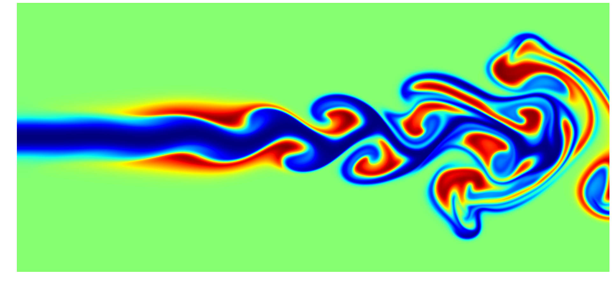
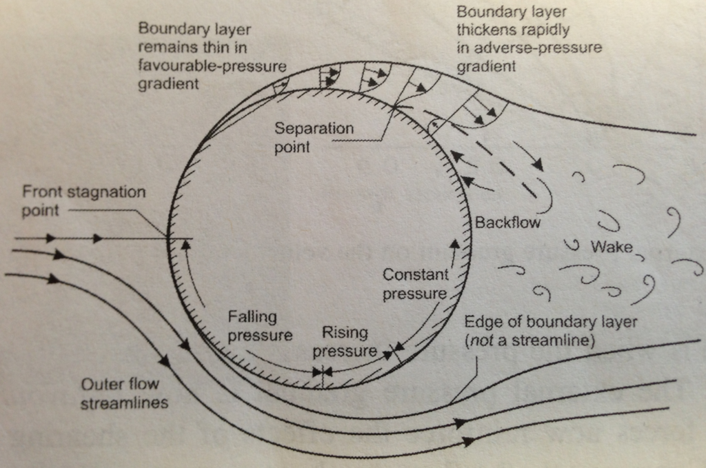 .png>)  

</font> 

---


## 7.1 计算力学简介

<font size=4>

Navier-Stokes（NS）方程组
(The Navier Stokes equations are solved on a three-dimensional grid over the globe.The global model (black) has a 60km grid spacing, the European model (green) 20km
and the UK model (red) 12km.)

 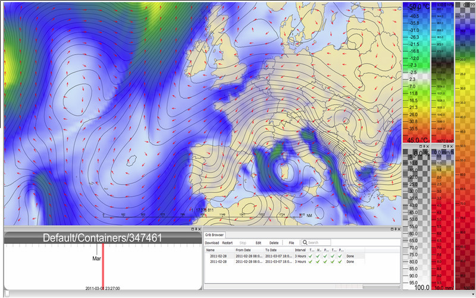

</font> 

---


## 7.1 计算力学简介

<font size=4>

3. 复杂偏微分方程

**薛定谔方程**，也称为薛定谔时间无关方程，是量子力学中的一项基本方程，由奥地利物理学家埃尔温·薛定谔（Erwin Schrödinger）于1926年提出。这个方程描述了微观粒子（如电子、原子、分子等）的量子态随时间的演化，并揭示了量子力学的基本原理。

薛定谔方程的一般形式如下：

$$i\hbar\frac{\partial\psi}{\partial t} = -\frac{\hbar^2}{2m}\nabla^2\psi + V\psi$$

其中，$ψ$ 代表波函数，描述了粒子的量子态，$t$ 代表时间，$ℏ$ 是约化普朗克常数，$m$ 是粒子的质量，$∇^2$表示拉普拉斯算子，$V$ 是势能。

薛定谔方程的解（波函数）包含了粒子的能级和量子态信息，使我们能够理解微观粒子的行为和性质。这个方程在原子物理学、分子物理学、固体物理学、核物理学、化学等领域中被广泛应用，用于解释原子和分子的结构、光谱、反应等现象。


</font> 

---


<font size=4>


</font> 

---


## 7.1 计算力学简介

<font size=4>

**Kohn-Sham方程**：DFT核心的控制方程是Kohn-Sham方程，它是薛定谔方程的近似。Kohn-Sham方程用于描述电子的运动，其中每个电子由一个单电子波函数（Kohn-Sham波函数）来描述。该方程的一般形式如下：

$$H_{KS} \psi_i = \epsilon_i \psi_i$$
其中，$H_{KS}$ 是Kohn-Sham哈密顿算符，$\psi_i$是Kohn-Sham波函数，$\epsilon_i$是对应的能级。
Kohn-Sham方程中的哈密顿算符（$H_{KS}$）由动能（T）和外部势能（$V_ext$）构成，以及交换-相关势（$V_xc$）：
$$H_{KS} = -\frac{\hbar^2}{2m}\nabla^2 + V_{ext} + V_{xc}$$

Kohn-Sham方程通过引入虚拟波函数和自洽场的迭代过程，将多体问题简化为单电子问题。这种方法使DFT成为一种强大的工具，用于计算材料的电子结构和各种性质。

</font> 

---


## 7.1 计算力学简介

<font size=4>

**Kohn-Sham方程**
DFT calculations results a The H adsorption energy for Pt, Os, and Os with different doping configurations. 


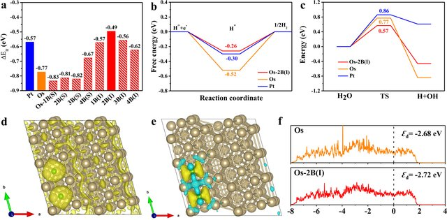

</font> 

---


## 7.1 计算力学简介

离散化方法

<font size=4>

微分方程的离散化方法旨在将连续的微分方程转化为离散形式，从而使计算机能够处理。这通常涉及将时间和空间分割成离散的步骤，以便在每个离散点上计算解的近似值。一旦微分方程被离散化，就可以得到迭代格式，即在每个离散时间步骤或空间点上更新解的数值算法。

以下是一般的步骤，以获得微分方程的离散形式和迭代格式：

`离散化空间和时间`：将问题的空间域和时间域分割为离散的网格点。这通常涉及选择`网格的间距`或`时间步长`。

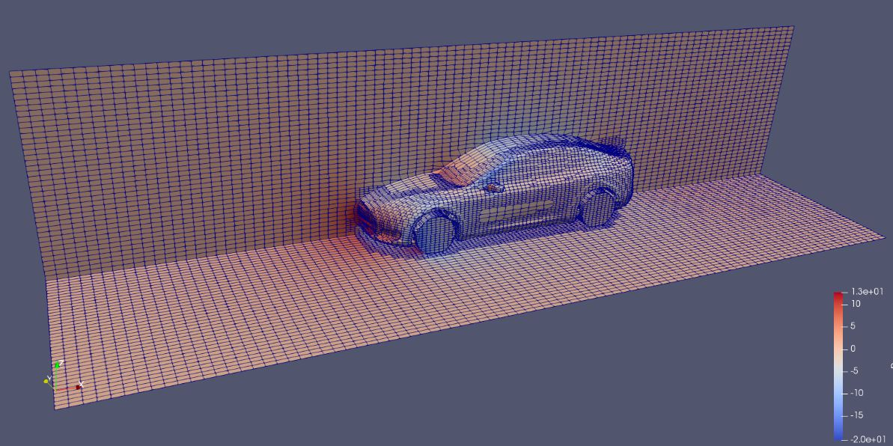  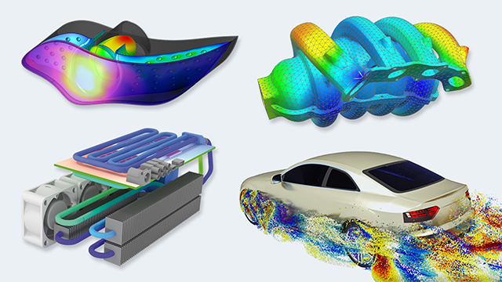

</font> 

---


## 7.1 计算力学简介

离散化方法

<font size=4>


`将微分方程应用于离散化的点`：将微分方程应用于离散网格上的点，以创建差分方程或代数方程组。离散化方法通常包括：`有限差分方法`，`有限体积方法`，`有限元方法`，`谱方法`，`无网格方法`。

 
`选择数值方法`：根据问题的性质和数值稳定性的要求，选择适当的数值方法，如`显式方法`、`隐式方法`、`Crank-Nicolson方法`等。

`建立迭代格式`：根据数值方法，将离散化的微分方程转化为迭代格式，其中明确规定如何在每个离散时间步或空间点上更新解的近似值。

`迭代求解`：使用迭代格式，从初始条件开始，按照时间步骤或空间点的顺序，更新解的值，直到达到所需的时间或空间范围。


</font> 

---


## 7.1 计算力学简介

常微分方程有限差分显式迭代格式

<font size=4>


对于常微分方程 $\frac{dy}{dt} = -k \cdot y$，其中 $y(0) = y_0$，可以使用显式方法进行离散化：

`选择时间步长`：选择一个适当的时间步长 $\Delta t$，该步长决定了在时间上如何离散化问题。通常，较小的时间步长可以提高数值解的准确性，但也会增加计算时间。

`离散化时间`：将时间轴分成离散的时间步。使用 $t_n = n \cdot \Delta t$ 表示时间步 $n$，其中 $n$ 是一个非负整数。

`差分近似`：使用差分近似来代替微分操作。对于 $\frac{dy}{dt}$，我们可以使用前向差分：

$$\frac{dy}{dt} \approx \frac{y_{n+1} - y_n}{\Delta t}$$
 

这里，$y_n$ 表示在时间步 $n$ 处的解 $y(t_n)$。


</font> 

---


## 7.1 计算力学简介

<font size=4>

有限差分逼近导数

0. 导数: $f^{\prime}(a)=\lim _{x \rightarrow a} \frac{f(x)-f(a)}{x-a}$

1. 前向差分：$D_+f\left(x_{j}\right)=\frac{f\left(x_{j+1}\right)-f\left(x_{j}\right)}{x_{j+1}-x_{j}}$,$f^{\prime}\left(x_{j}\right)=D_+f\left(x_{j}\right)+O\left(\Delta x\right)$ 具有`一阶`精度

2. 前后差分：$D_-f\left(x_{j}\right)=\frac{f\left(x_{j}\right)-f\left(x_{j-1}\right)}{x_{j}-x_{j-1}}$,$f^{\prime}\left(x_{j}\right)=D_-f\left(x_{j}\right)+O\left(\Delta x\right)$ 具有`一阶`精度

3. 中心差分：$D_cf\left(x_{j}\right)=\frac{f\left(x_{j+1}\right)-f\left(x_{j-1}\right)}{x_{j+1}-x_{j-1}}$,$f^{\prime}\left(x_{j}\right)=D_cf\left(x_{j}\right)+O\left(\Delta x^2\right)$ 具有`二阶`精度

.png>)


</font> 

---


## 7.1 计算力学简介

A. 常微分方程有限差分显式迭代格式

<font size=4>


`代入差分操作`：将差分近似代入原微分方程：

$$\frac{y_{n+1} - y_n}{\Delta t} = -k \cdot y_n$$

这表示在每个时间步上，新的解 $y_{n+1}$ 可以通过旧的解 $y_n$ 计算得出。

`迭代计算`：通过这个差分方程，你可以从初始条件 $y(0) = y_0$ 开始迭代计算 $y$ 的值。从时间步 $n = 0$ 开始，通过下述递推关系求解 $y_{n+1}$：

$$y_{n+1} = y_n - k \cdot y_n \cdot \Delta t$$

这个递推公式在每个时间步更新 $y$ 的值，直到达到所需的时间点或时间步数。

`计算到达所需时间点`：可以重复执行时间步直到达到所需的时间点，或者计算特定数量的时间步，以获得 $y$ 在不同时间点上的数值解。

通过这些步骤，将获得 $y$ 在不同时间点上的数值解，这些解逐步从初始条件 $y(0) = y_0$ 演化到所需的时间点。显式方法适用于这种简单的线性微分方程。选择合适的时间步长 $\Delta t$ 对于数值解的稳定性和准确性至关重要。


</font> 

---


## 7.1 计算力学简介

抛物型偏微分方程有限差分显式迭代格式

<font size=4>

对于偏微分方程 $\frac{\partial u}{\partial t} = \alpha \frac{\partial^2 u}{\partial x^2}$，使用显式方法进行离散化需要以下步骤：

**离散化时间和空间**：将时间域和空间域分别分割为离散的时间步长 $\Delta t$ 和空间步长 $\Delta x$。这将导致网格点的生成，其中 $x$ 方向上有多个离散的点，而 $t$ 方向上有多个时间步骤。

**差分近似**：使用差分近似来代替微分操作。对于一阶时间导数 $\frac{\partial u}{\partial t}$，你可以使用前向差分：

$$​\frac{\partial u}{\partial t} \approx \frac{u(x, t + \Delta t) - u(x, t)}{\Delta t}$$

对于二阶空间导数 $\frac{\partial^2 u}{\partial x^2}$，可以使用中心差分：

$$\frac{\partial^2 u}{\partial x^2} \approx \frac{u(x + \Delta x, t) - 2u(x, t) + u(x - \Delta x, t)}{(\Delta x)^2}$$


</font> 

---


## 7.1 计算力学简介

B. 抛物型偏微分方程有限差分显式迭代格式

<font size=4>

**代入差分操作**：将这些差分近似代入原偏微分方程，得到一个差分方程。将前向差分和中心差分的近似代入：

$$\frac{u(x, t + \Delta t) - u(x, t)}{\Delta t} = \alpha \frac{u(x + \Delta x, t) - 2u(x, t) + u(x - \Delta x, t)}{(\Delta x)^2}$$

**求解差分方程**：通过这个差分方程，你可以计算下一个时间步骤 $t + \Delta t$ 的解 $u(x, t + \Delta t)$，然后重复此过程以获得整个时间范围内的解。

通过这些步骤，你将在网格点上得到解 $u(x, t)$ 的离散近似。与显式方法相关的关键是要小心选择适当的时间步长 $\Delta t$ 和空间步长 $\Delta x$ 以确保数值解的稳定性和准确性。这通常涉及到Courant-Friedrichs-Lewy (CFL)条件的考虑, $\text{CFL} = \frac{D \cdot \Delta t}{\Delta x^2} \leq \text{CFL}_{\text{max}}$，这是一个关于 $\Delta t$ 和 $\Delta x$ 的条件，以确保数值解的稳定性。

</font> 

---


## 7.1 计算力学简介

<font size=4>

尽管传统方法取得了不错的效果，但多数结果只适用于低维度的非线性系统，利用上述传统方法对非线性的复杂巨系统的演化进行建模和预测难以实现。此外，微分方程反问题的求解仍是棘手的问题。实际应用中数据存在缺失、裂隙或噪声边界条件等问题，这些问题都极大地影响传统方法的求解精度。因此，亟须提出新的方法来解决上述问题。

物理信息神经网络（PINN）的出现是由于需要有效地解决偏微分方程（PDE）和微分方程（ODE）等物理方程的数值求解问题，特别是在科学和工程领域中：

**数值模拟的传统方法**： 在过去，解决复杂的物理问题通常依赖于传统的数值方法，如有限元法、有限差分法和有限体积法。这些方法在某些情况下效果很好，但在处理高度非线性、多尺度和复杂边界条件的问题时可能面临挑战。

**深度学习的崛起**： 随着深度学习技术的兴起，神经网络在计算机视觉、自然语言处理等领域取得了巨大成功。这引发了对将神经网络应用于解决物理方程的兴趣。

**融合物理知识和深度学习**： 物理信息神经网络（PINN）的发展意味着融合了物理知识和深度学习技术。PINN通过将已知的物理定律嵌入神经网络模型中，能够更好地模拟物理现象，同时利用神经网络的拟合能力来处理非线性和复杂性。

**自适应性和高效性**： PINN具有自适应性，无需事先定义精细的网格划分，从而减少了数值模拟的复杂性。此外，PINN通常能够更快地收敛，因为它可以在求解的同时学习参数。

**广泛应用**： PINN已成功应用于各种领域，包括流体力学、材料科学、天文学等。它成为了一个通用工具，为科学家和工程师提供了一种新的数值模拟方法。


</font> 

---


## 7.1 计算力学简介

<font size=4>

物理信息神经网络（PINN）融合了数据驱动和物理定律驱动的方法，以解决微分方程和偏微分方程等物理问题。数据和物理信息量不同的3种情形：

**数据驱动（Data-Driven）**： 数据驱动方法是指通过大量观测数据来训练神经网络，以建立输入和输出之间的关系，而不需要先验的物理知识。在PINN中，数据驱动部分通常是通过提供具有已知输入和输出值的数据点来实现。这些数据点用于训练神经网络来拟合系统的行为。数据驱动方法的优势是它可以适应复杂的非线性关系，但它通常需要大量的数据才能获得准确的结果。

**物理定律驱动（Physics-Informed）**： 物理定律驱动方法是指将已知的物理定律嵌入神经网络模型中，以确保模型在解决物理问题时遵循物理定律。在PINN中，物理定律通常以形式化的微分方程或偏微分方程提供。神经网络的结构和参数化设计使其能够满足这些物理定律的约束条件。物理定律驱动方法的优势是它能够更好地保持系统的物理一致性，尤其在数据稀缺的情况下。

**融合方法（Hybrid Approach）**： PINN将数据驱动和物理定律驱动方法结合起来。在PINN中，神经网络同时学习适应数据和满足物理定律的解。这意味着PINN既可以通过数据来学习系统的特性，又可以确保所学到的模型与物理现象一致。这种融合方法旨在克服单独使用数据驱动或物理定律驱动方法时的局限性。


</font> 


---


## 7.1 计算力学简介

<font size=4>

数据和物理信息量不同的3种情形：

<center>

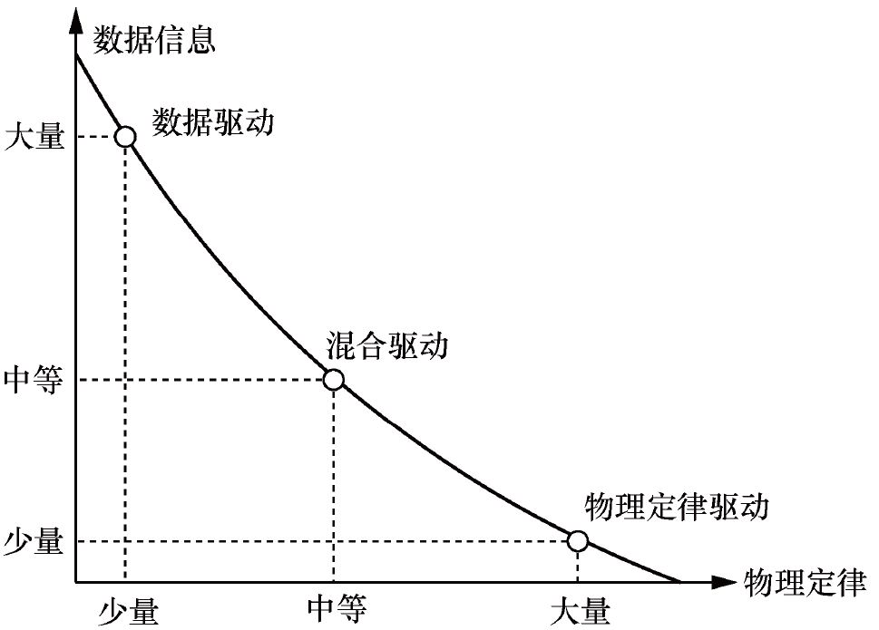

</center>

</font> 

---


## 7.2 PINN 解常微分方程

<font size=4>


偏微分方程具有较好的实用价值。采用深度学习方法可求解常微分方程和偏微分方程。以抛物形方程为例，求解方法的基本框架：

$$u_t(\boldsymbol{x,t})+F\left(\boldsymbol{x}, u(\boldsymbol{x}), \nabla u(\boldsymbol{x,t}), \nabla^2 u(\boldsymbol{x,t}), \lambda\right)=0$$

其中，时间 $t ∈[0,T ]$, 空间 $\boldsymbol{x}=\left[x_1, \cdots, x_n\right]^{\top} \in \Omega, \Omega \subset \mathbb{R}^n$ 表示定义域。 $u(\boldsymbol{x,t})$ 为未知解。 $\nabla$ 为微分算子, 可以是 $\mathrm{ODE}$ 算子、$\mathrm{PDE}$ 算子或者是 IDE 算子等。 $\lambda$ 为方程中的**参数**。该方程表示曲面沿其法线以与平均曲率成比例的速度运动的演化过程。

定义近似$u(\boldsymbol{x,t})$的神经网络为$\hat{u}(\boldsymbol{x, t})$，一个简单的 3 层前馈神经网络（feed forward network，FNN）的表示形式如式：

$$\hat{u}(\boldsymbol{x}, t)=\boldsymbol{\theta}_2^{\top} \sigma\left(\boldsymbol{\theta}_1^{\top}\left[\boldsymbol{x}^{\top}, t\right]^{\top}+b_1\right)+b_2$$

其中, $\theta=\left[\theta_1^{\top}, \theta_2^{\top}\right]^{\top}$ 为神经网络权重矩阵, $\boldsymbol{b}=\left[b_1, b_2\right]^{\top}$ 为偏置向量, $\sigma(\cdot)$ 为激活函数。


</font> 

---


## 7.2 PINN 解常微分方程

<font size=4>

进一步可得到偏微分方程的表示形式 $f(x, t)$ :

$$f(\boldsymbol{x}, t):=\hat{u}_t+F\left(\boldsymbol{x}, \hat{u}, \nabla \hat{u}, \nabla^2 \hat{u}, \lambda\right)$$

可见 $f(x, t)$ 由物理方程和深度神经网络组合表示, 称其为**物理信息神经网络（PINN）**。将初始和边界条件看作软约束处理, 则可得到**损失函数**:

$$
\operatorname{Loss}=\mathrm{MSE}_u+\mathrm{MSE}_f \\
=\frac{1}{N_u} \sum_{i=1}^{N_u}\left|u\left(t_u^i, x_u^i\right)-u^i\right|^2+\frac{1}{N_f} \sum_{i=1}^{N_f}\left|f\left(t_f^i, x_f^i\right)\right|^2
$$

其中, $\left\{t_u^i, x_u^i, u^i\right\}_{i=1}^{N_u}$ 表示**初始条件**和**边界条件**产生的训练数据, 也可是从**实际应用中观测得到的数值,可视为数据驱动的部分**。 $\left\{t_f^i, x_f^i\right\}_{i=1}^{N_f}$ 表示采样数据,用于计算控制方程的残差, 可视为**物理定律驱动的部分**。


</font> 

---

## 7.2 PINN 解常微分方程

<font size=4>

<center> 

**深度学习求解微分方程基本框架**


</center> 

</font> 

---


## 7.2 PINN 解常微分方程

<font size=4>


通常将微分方程的求解问题分为两类：**正问题**和**反问题**：

**正问题**是在参数$λ$ 和边界条件已知的情况下，根据方程求出解析或者数值解，预测系统运动，产生观测数据的过程。

**反问题**是指参数$λ$ 未知，利用有限的观测数据反推出最佳的参数$λ$。


</font> 

---


## 7.2 PINN 解常微分方程

<font size=4>

**正问题**

1. 常微分方程 $\frac{dy}{dt} = -k \cdot y$，其中 $y(0) = y_0$


**初始化模型参数**：开始时，需要初始化神经网络的权重 ($w_{2,1}, w_{2,2}, w_{2,3}, b_{\text{output}}$) 和任何其他相关参数。

**数据准备**：收集训练数据，包括时间点 $t$ 和相应的 $y(t)$，以及初始条件 $y(0) = y_0$。

**前向传播**：使用初始化的参数和输入数据进行前向传播，计算网络的输出 $y$ 的近似值。根据您提供的表示形式，近似值为：


</font> 

---


## 7.2 PINN 解常微分方程

<font size=4>

**输入层**：输入层包含神经元，每个神经元对应输入特征。通常，这个层是线性的，不进行任何变换，所以输入特征直接传递到下一层。

**隐藏层**：这是包含两个神经元的隐藏层。每个神经元接收输入特征的加权和，并通过激活函数进行非线性变换。通常，你会在每个神经元后面看到以下表示：$a_1 = f(w_1 \cdot t + b_1)$和$a_2 = f(w_2 \cdot t + b_2)$，其中：$a_1$和$a_2$是隐藏层神经元的输出。$w_1$和$w_2$是权重，用于加权输入$x$。$b_1$和$b_2$是偏置。$f$是激活函数，如Sigmoid、ReLU等。

**输出层**：输出层通常包含一个或多个神经元，根据问题的性质而定。在这个情况下，如果只有一个输出神经元，输出可以表示为：$y = v_1 \cdot a_1 + v_2 \cdot a_2 + c$，其中：

$$\hat{y} = v_1 \cdot f(w_1 \cdot t + b_1) + v_2 \cdot f(w_2 \cdot t + b_2) + c$$

$y$是网络的输出。$v_1$和$v_2$是权重，用于加权隐藏层的输出。$c$是偏置。$g$是输出激活函数，可以根据问题选择。


</font> 

---


## 7.2 PINN 解常微分方程


**算例1**： $\frac{dy}{dt} =  y$，其中 $y(0) = 1$

<font size=4>

```python
import tensorflow as tf
import numpy as np
import matplotlib.pyplot as plt

# 模型定义
class Net(tf.keras.Model):
    def __init__(self, NN):
        super(Net, self).__init__()
        self.input_layer = tf.keras.layers.Dense(NN, input_dim=1)
        self.hidden_layer = tf.keras.layers.Dense(NN)
        self.output_layer = tf.keras.layers.Dense(1)

    def call(self, x):
        out = tf.tanh(self.input_layer(x))
        out = tf.tanh(self.hidden_layer(out))
        out = self.output_layer(out)
        return out


```


</font> 

---


## 7.2 PINN 解常微分方程

<font size=4>

```python

net = Net(20)  # 创建一个神经网络模型，包括4层，每层20个神经元

# 损失函数
mse = tf.keras.losses.MeanSquaredError()  # 使用均方误差作为损失函数
# 优化器
optimizer = tf.keras.optimizers.Adam(learning_rate=1e-4)  # 使用Adam优化器

# 模型编译
net.compile(optimizer, loss=mse)

# 创建动态图
plt.ion()
fig = plt.figure(figsize=(6, 5))

iterations = 20000  # 迭代次数
for epoch in range(iterations):
    # 使用tf.GradientTape进行自动微分
    with tf.GradientTape() as tape:
        # Boundary Loss - 边界条件损失
        x_0 = tf.zeros((2000, 1))  # 创建2000个x=0的数据点
        y_0 = net(x_0)  # 模型预测的结果
        mse_i = mse(y_0, tf.ones((2000, 1)))  # 计算模型预测值与真实值的均方误差

        # ODE Loss - 微分方程损失
        x_in = tf.Variable(tf.random.uniform((2000, 1), dtype=tf.float32, minval=0.0, maxval=2.0))  # 随机生成2000个x值

        with tf.GradientTape() as t:
            y_hat = net(x_in)  # 模型对随机生成的x值的预测结果

        dy_dx = t.gradient(y_hat, x_in)  # 计算模型输出关于x的导数
        mse_f = mse(y_hat, dy_dx)  # 计算模型输出与导数的均方误差
        loss = mse_i + mse_f  # 总损失为边界条件损失与微分方程损失之和

```

</font> 

---


## 7.2 PINN 解常微分方程

<font size=3>

```python
    # 计算梯度
    gradients = tape.gradient(loss, net.trainable_variables)
    # 使用优化器更新模型参数
    optimizer.apply_gradients(zip(gradients, net.trainable_variables))
    if (epoch + 1) % 100 == 0:
        fig.clf()  # 清空当前Figure对象
        fig.suptitle("epoch: %d" % (epoch + 1))  # 设置图标题
        ax = fig.add_subplot(111)  # 添加子图
        y_real = tf.exp(x_in)  # 计算真实y值
        y_pred = net(x_in)  # 模型预测的y值
        ax.scatter(x_in.numpy(), y_real.numpy(), label="true") # 绘制真实值散点图
        ax.scatter(x_in.numpy(), y_pred.numpy(), c='red', label="pred") # 绘制预测值散点图
        ax.legend()  # 添加图例
        plt.pause(0.1)  # 暂停显示
plt.show()  # 显示图形

```

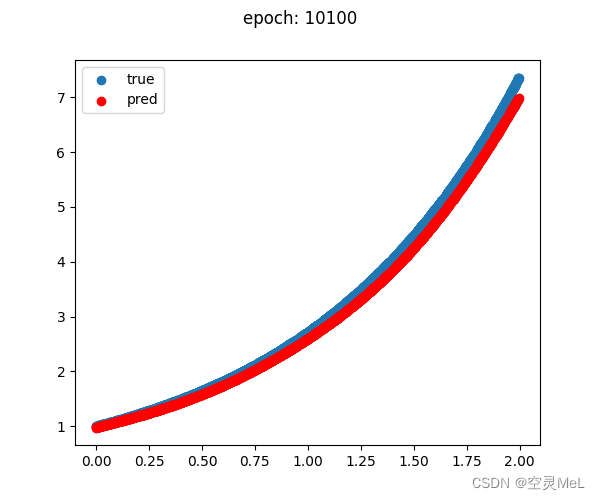

</font> 

---


## 7.2 PINN 解常微分方程


**算例2**： $\frac{dy}{dt} = - 1\cdot y$，其中 $y(0) = 1$

<font size=4>


```python
import numpy as np
import tensorflow as tf
import matplotlib.pyplot as plt

# 创建神经网络模型
NN = tf.keras.models.Sequential([
    tf.keras.layers.Input((1,)),  # 输入层，输入维度为1
    tf.keras.layers.Dense(units=32, activation='tanh'),  # 第一个隐藏层，32个神经元，tanh激活函数
    tf.keras.layers.Dense(units=32, activation='tanh'),  # 第二个隐藏层，32个神经元，tanh激活函数
    tf.keras.layers.Dense(units=32, activation='tanh'),  # 第三个隐藏层，32个神经元，tanh激活函数
    tf.keras.layers.Dense(units=1)  # 输出层，1个神经元
])

# 打印模型概要
NN.summary()

# 创建Adam优化器
optm = tf.keras.optimizers.Adam(learning_rate=0.001)

```

</font> 

---


## 7.2 PINN 解常微分方程

<font size=4>

```python

# 定义ODE系统的函数
def ode_system(t, net):
    # 对输入时间 t 进行处理
    t = t.reshape(-1, 1)
    t = tf.constant(t, dtype=tf.float32)
    t_0 = tf.zeros((1, 1))  # 创建一个0的张量
    one = tf.ones((1, 1))   # 创建一个1的张量

    # 使用 TensorFlow 的 GradientTape 追踪计算
    with tf.GradientTape() as tape:
        tape.watch(t)

        # 计算神经网络在时间点 t 的输出 u
        u = net(t)
        # 计算 u 对 t 的导数 u_t
        u_t = tape.gradient(u, t)

    # 计算ODE损失，即 u_t 与真实值 -1 * y 之间的差异
    ode_loss = u_t + u
    # 计算初始条件损失，确保在 t = 0 处，模型的输出等于 1
    IC_loss = net(t_0) - 1.

    # 计算总损失，将ODE损失和初始条件损失的平方相加，并取均值
    square_loss = tf.square(ode_loss) + tf.square(IC_loss)
    total_loss = tf.reduce_mean(square_loss)

    return total_loss

```

</font> 

---
   

## 7.2 PINN 解常微分方程

<font size=4>

```python
# 创建一组用于训练的时间点 train_t
train_t = np.linspace(0, 2, 100).reshape(-1, 1)

# 用于记录训练损失的列表
train_loss_record = []

# 开始训练循环，迭代6000次
for itr in range(6000):
    with tf.GradientTape() as tape:
        # 计算训练损失
        train_loss = ode_system(train_t, NN)
        train_loss_record.append(train_loss)

        # 计算参数梯度并使用Adam优化器更新参数
        grad_w = tape.gradient(train_loss, NN.trainable_variables)
        optm.apply_gradients(zip(grad_w, NN.trainable_variables))

    if itr % 1000 == 0:
        print(train_loss.numpy())  # 每1000次迭代打印当前的训练损失

# 绘制训练损失的图表
plt.figure(figsize=(10, 8))
plt.plot(train_loss_record)
plt.xlabel('Iterations', fontsize=14)
plt.ylabel('Loss', fontsize=14)
plt.title('PINN Training Loss', fontsize=16)
plt.grid(True)
plt.show()

```

</font> 

---


## 7.2 PINN 解常微分方程

<font size=4>

```python
# 创建一组测试时间点 test_t
test_t = np.linspace(0, 2, 100).reshape(-1, 1)

# 计算训练数据 train_u，真实数据 true_u，以及模型预测数据 pred_u
train_u = np.exp(-train_t)
true_u = np.exp(-test_t)
pred_u = NN.predict(test_t).ravel()

# 绘制训练数据、真实数据和预测数据的图表
plt.figure(figsize=(10, 8))
plt.plot(train_t, train_u, 'ok', label='Train')  # 训练数据
plt.plot(test_t, true_u, '-k', label='True')  # 真实数据
plt.plot(test_t, pred_u, '--r', label='Prediction')  # 预测数据
plt.legend(fontsize=15)
plt.xlabel('t', fontsize=15)
plt.ylabel('u', fontsize=15)
plt.title('PINN Solution of $\\frac{dy}{dt} = -1 \\cdot y$, $y(0) = 0$', fontsize=16)
plt.grid(True)
plt.show()
```

</font> 

---


## 7.2 PINN 解常微分方程

<font size=4>

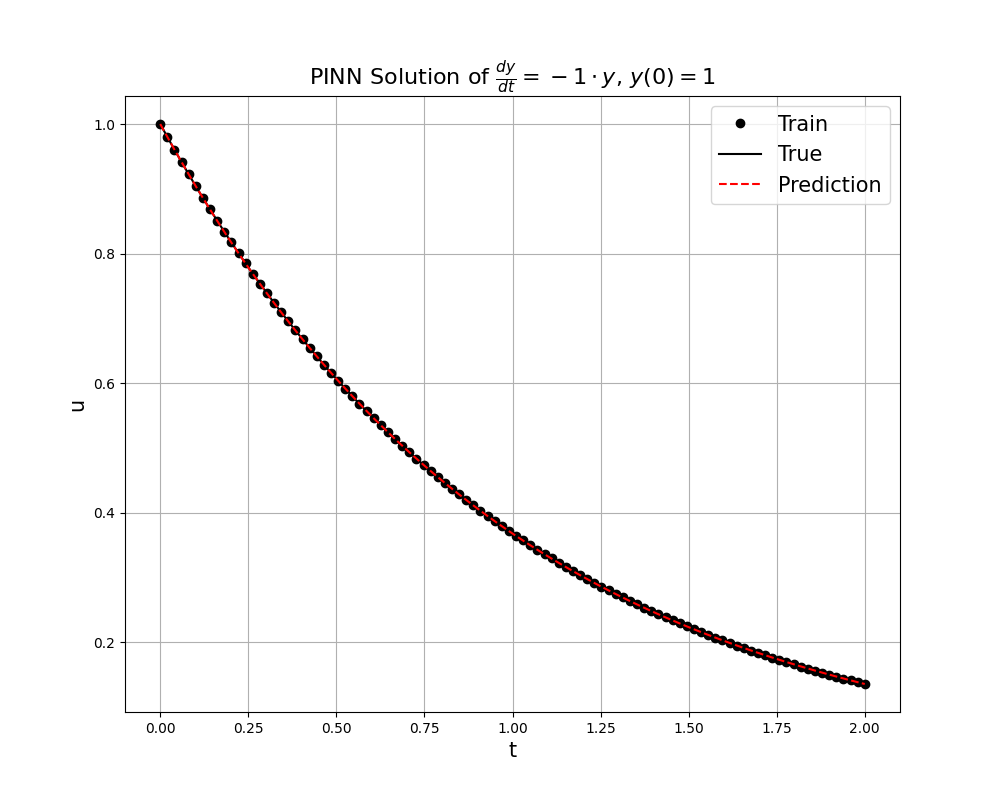

</font> 

---


## 7.2 PINN 解常微分方程

<font size=4>

ROBER problem

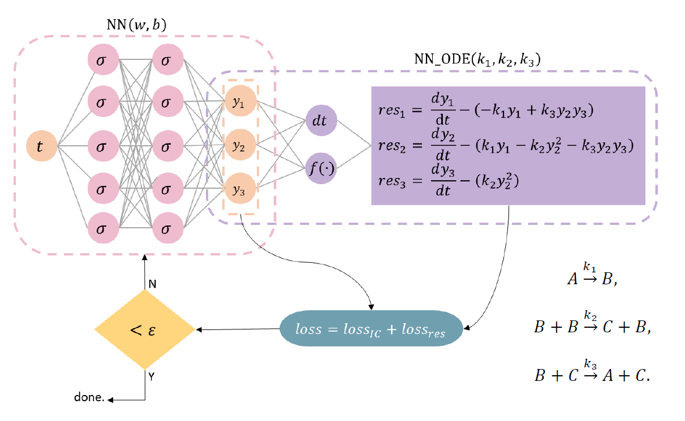


</font> 

---


## 7.2 PINN 解常微分方程

<font size=4>

核反应堆动力学的点动力学方程


Annals of Nuclear Energy 167 (2022) 108833 


</font> 

---


## 7.2 PINN 解常微分方程

<font size=4>

催化CO2甲烷化反应器模型的求解和参数识别神经网络

 forward problem for CO2 methanation in an isothermal fixed-bed (IFB) reactor.PNG>) 


</font> 

---


## 7.3 PINN 解偏微分方程

<font size=4> 

**物理信息神经网络**（Physics-informed Neural Network， 简称PINN）解偏微分方程实例
物理方程作为限制加入到神经网络之中使得拟合得到的结果更加满足物理规律。
$\frac{\partial u}{\partial t}+u \frac{\partial u}{\partial x}=v \frac{\partial^{2} u}{\partial x^{2}}$
</font> 


---


## 7.3 PINN 解偏微分方程

<font size=4>
综合考虑边界条件和初始条件：

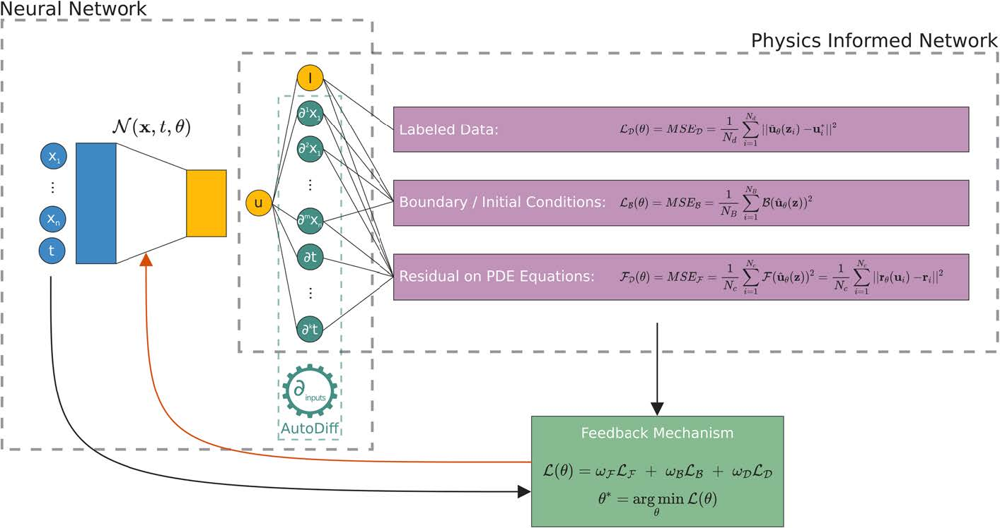

</font> 

---


## 7.3 PINN 解偏微分方程

<font size=5> 

**Burgers 方程（Burgers' equation）**或Bateman-Burgers 方程是一个基本的偏微分方程和**对流扩散方程**，出现在应用数学的各个领域，例如流体力学、非线性声学、气体动力学和交通流。该方程由Harry Bateman于 1915 年首次提出，随后由Johannes Martinus Burgers于 1948 年进行研究。Burgers 方程（也称为粘性Burgers 方程）在一维空间中的一般形式是耗散系统：

$$\frac{\partial u}{\partial t}+u \frac{\partial u}{\partial x}=\nu \frac{\partial^{2} u}{\partial x^{2}}$$

**算例3**： 

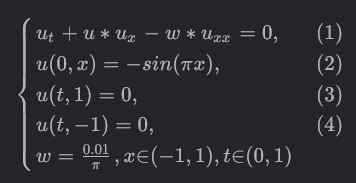


</font> 

---


## 7.3 PINN 解偏微分方程

<font size=5> 


```python
import tensorflow as tf
import numpy as np
import matplotlib.pyplot as plt
from matplotlib import cm

# 模型定义
class Net(tf.keras.Model):
    def __init__(self, NN):
        super(Net, self).__init__()
        self.input_layer = tf.keras.layers.Dense(NN, input_dim=2)
        self.hidden_layer = tf.keras.layers.Dense(NN)
        self.hidden_layer_2 = tf.keras.layers.Dense(NN)
        self.output_layer = tf.keras.layers.Dense(1)

    def call(self, x):
        out = tf.tanh(self.input_layer(x))
        out = tf.tanh(self.hidden_layer(out))
        out = tf.tanh(self.hidden_layer_2(out))
        out = self.output_layer(out)
        return out
```


</font> 

---


## 7.3 PINN 解偏微分方程

<font size=5> 

```python

net = Net(256)  # 创建一个神经网络模型，包括4层，每层256个神经元

# 损失函数
mse = tf.keras.losses.MeanSquaredError()  # 使用均方误差作为损失函数
# 优化器
optimizer = tf.keras.optimizers.Adam(learning_rate=1e-4)  # 使用Adam优化器

# 模型编译
net.compile(optimizer, loss=mse)

# 创建动态图
plt.ion()
fig = plt.figure(figsize=(6, 5))

iterations = 20000  # 迭代次数

# 初始化常量
w = 0.01 / 3.1415926
t_bc_zeros = tf.constant(np.zeros((2000, 1)), dtype=tf.float32)
x_in_pos_one = tf.constant(np.ones((2000, 1)), dtype=tf.float32)
x_in_neg_one = tf.constant(-np.ones((2000, 1)), dtype=tf.float32)
u_in_zeros = tf.constant(np.zeros((2000, 1)), dtype=tf.float32)
```

</font> 

---


## 7.3 PINN 解偏微分方程

<font size=5> 

```python

for epoch in range(iterations):
    # 使用tf.GradientTape进行自动微分
    with tf.GradientTape() as tape:
        # 初始化变量
        t_var = tf.Variable(tf.random.uniform((2000, 1), dtype=tf.float32, minval=0.0, maxval=1.0))
        x_var = tf.Variable(tf.random.uniform((2000, 1), dtype=tf.float32, minval=-1.0, maxval=1.0))

        # 求一阶、二阶偏导
        with tf.GradientTape(persistent=True) as tape_xx:
            with tf.GradientTape(persistent=True) as tape_x:
                u_hat = net(tf.concat([t_var, x_var], axis=1))
            du_dt = tape_x.gradient(u_hat, t_var)
            du_dx = tape_x.gradient(u_hat, x_var)
        du_dxx = tape_xx.gradient(du_dx, x_var)


        # eq(1)
        eq1_1 = du_dt + u_hat * du_dx - w * du_dxx
        mse_1 = mse(eq1_1, u_in_zeros)

        # eq(2)
        eq2_1 = net(tf.concat([t_bc_zeros, x_var], axis=1))
        eq2_2 = -tf.sin(3.1415926 * x_var)
        mse_2 = mse(eq2_1, eq2_2)

        # eq(3)
        eq3_1 = net(tf.concat([t_var, x_in_pos_one], axis=1))
        mse_3 = mse(eq3_1, u_in_zeros)

        # eq(4)
        eq4_1 = net(tf.concat([t_var, x_in_neg_one], axis=1))
        mse_4 = mse(eq4_1, u_in_zeros)

        loss = mse_1 + mse_2 + mse_3 + mse_4        
```


</font> 

---


## 7.3 PINN 解偏微分方程

<font size=5> 

```python

    gradients = tape.gradient(loss, net.trainable_variables)
    optimizer.apply_gradients(zip(gradients, net.trainable_variables))

    if (epoch + 1) % 100 == 0:
        t = np.linspace(0, 1, 100)
        x = np.linspace(-1, 1, 256)
        ms_t, ms_x = np.meshgrid(t, x)
        x = np.ravel(ms_x).reshape(-1, 1)
        t = np.ravel(ms_t).reshape(-1, 1)
        pt_u = net(tf.concat([t, x], axis=1))
        u = pt_u.numpy().reshape(ms_t.shape)

        fig.clf()  # 清空当前Figure对象
        ax = fig.add_subplot(111, projection='3d')
        ax.set_zlim([-1, 1])
        # 在图中添加文字
        ax.text(0, 0, 1, "epoch:%d" % (epoch + 1), color='black')
        ax.plot_surface(ms_t, ms_x, u, cmap=cm.RdYlBu_r, edgecolor='blue', linewidth=0.0003, antialiased=True)
        ax.set_xlabel('t')
        ax.set_ylabel('x')
        ax.set_zlabel('u')
        plt.pause(0.1)
plt.show()

```

</font> 

---


## 7.3 PINN 解偏微分方程

<font size=5> 

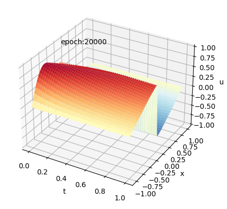

</font> 

---


## 7.3 PINN 解偏微分方程

<font size=5> 
电力系统动力学求解


</font> 

---


## 7.3 PINN 解偏微分方程

<font size=5> 
金属表面声波裂缝检测


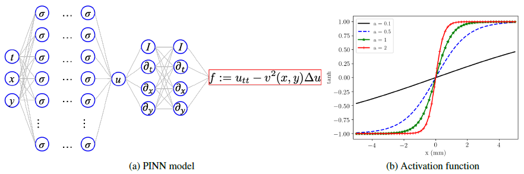

</font> 

---


## 7.3 PINN 解偏微分方程

<font size=5> 
不可压NS方程求解

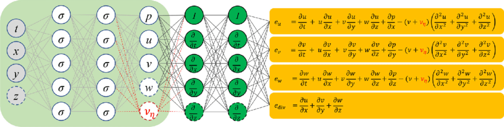

</font> 

---


## 7.3 PINN 解偏微分方程

<font size=3> 

预测植物细胞的水分浓度
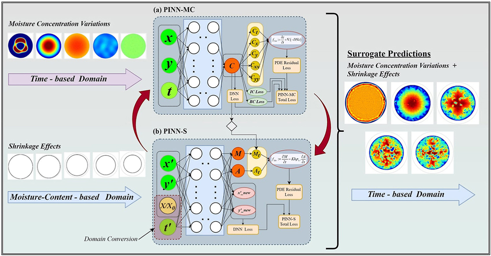


</font> 

---


## 7.3 PINN 解偏微分方程

<font size=5> 

虚拟热传感器代理模型与实时仿真


</font> 

---


## 7.3 PINN 解偏微分方程

<font size=5> 

盾构隧道诱发地表沉降预测

.jpg>)

</font> 

---


## 7.3 PINN 解偏微分方程

<font size=5> 

线性弹性问题


</font> 

---


## 7.3 PINN 解偏微分方程

<font size=5> 

准脆性材料断裂计算机器学习模型

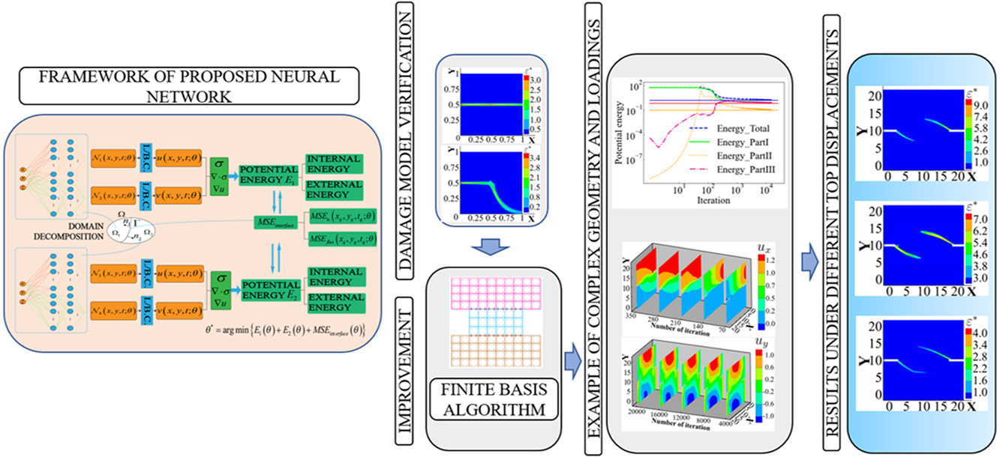

</font> 

---


## 7.3 PINN 解偏微分方程

<font size=5> 

定向能沉积中晶粒结构特征的预测

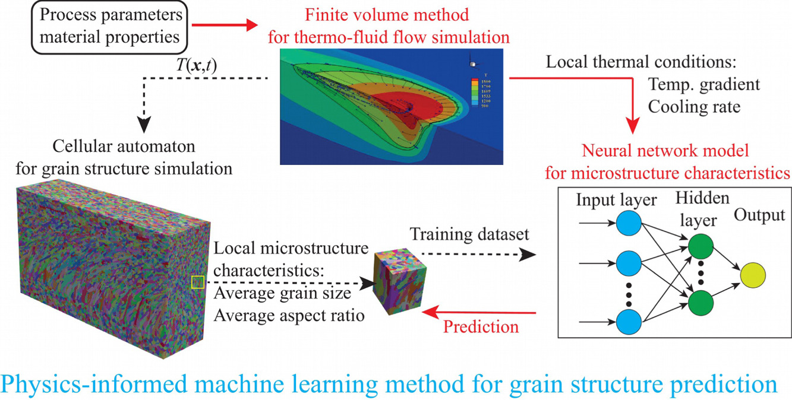

</font> 

---


## 7.3 PINN 解偏微分方程

<font size=5> 

材料中的逆传热问题

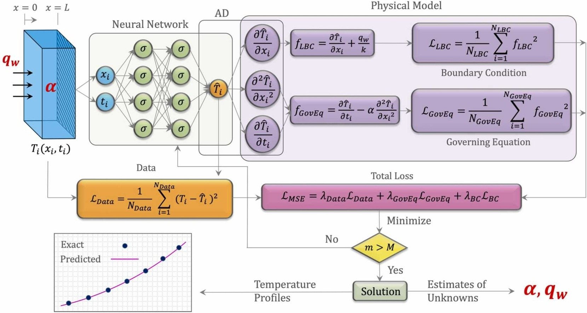

</font> 

---


## 6.3 PINN 解偏微分方程

<font size=5> 

基于偏微分方程求解光子学反问题的PINN原理图


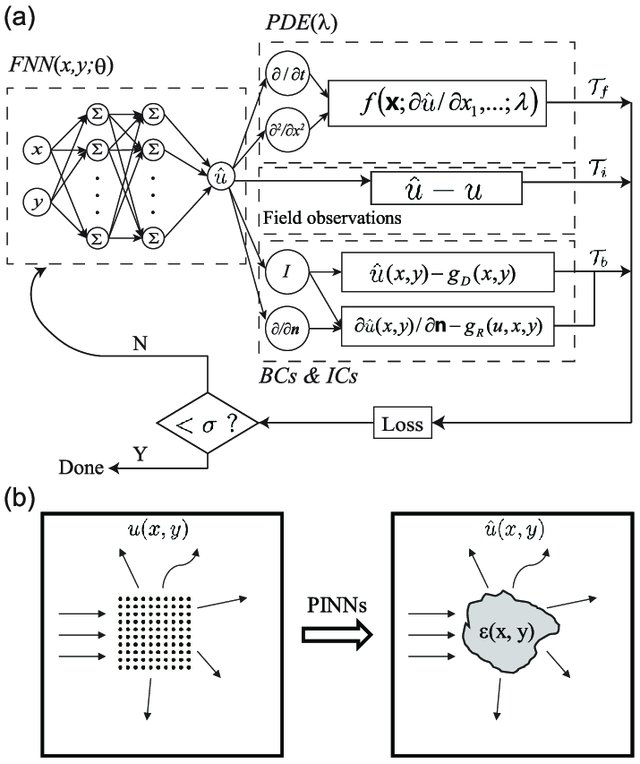  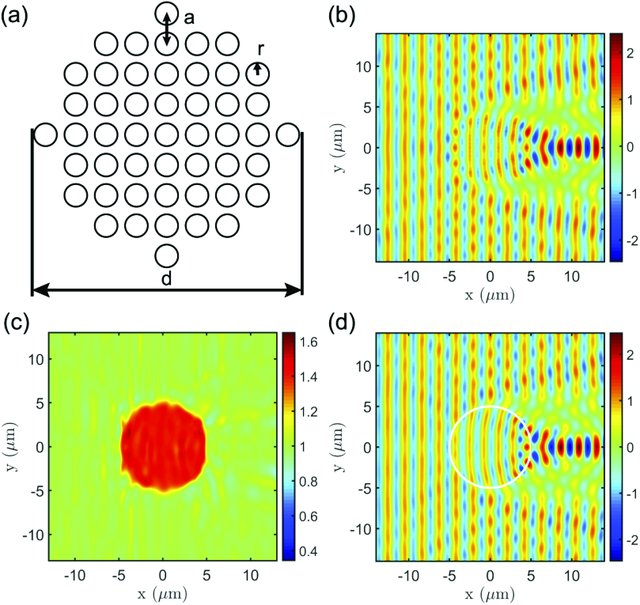


</font> 

---


## 7.4 PINN 微分方程逆问题

<font size=4> 

当使用PINN（Physics-Informed Neural Networks）来求解常微分方程（ODE）的逆问题时，通常是通过已知ODE的解来**估计初始条件**或**模型参数**。以下是一个简单的示例，说明如何使用PINN来解决这种类型的逆问题。

**问题描述**： 假设有一个一阶线性ODE：

$$\frac{dy}{dt} = ay + b$$

其中$a$和$b$是未知参数，需要使用PINN来估计它们。

PINN求解过程：

1. 收集数据： 首先，我们需要收集一些已知的ODE解数据。这些数据应包括不同时间点$t$的解$y$，以及在这些时间点的导数$\frac{dy}{dt}$。

2. 建立PINN模型： 创建一个神经网络模型，该模型将接受时间$t$作为输入，并输出预测的$y$。此模型将有两个输出，一个用于预测$y$，另一个用于预测$\frac{dy}{dt}$。模型的输入是时间$t$。

4. 物理约束： 在PINN中，我们需要将ODE的物理定律嵌入到模型中。对于这个例子，物理定律是$\frac{dy}{dt} = ay + b$，我们将其添加到模型的损失函数中，以确保模型遵循这个方程。

5. 训练模型： 使用已知的ODE解数据来训练模型。模型将被训练以最小化损失函数，包括数据拟合损失和物理约束损失。

6. 估计参数： 一旦模型训练完成，我们可以使用模型来估计未知参数$a$和$b$。

</font> 

---


## 7.4 PINN 微分方程逆问题


<font size=4> 

```python
# 导入必要的库
import tensorflow as tf
from tensorflow import keras
import numpy as np

# 收集已知的ODE解数据，包括时间点t和解y
t_data = np.array([...])
y_data = np.array([...])

# 创建PINN模型
model = keras.Sequential([
    keras.layers.Input(shape=(1,)),
    keras.layers.Dense(50, activation='tanh'),
    keras.layers.Dense(50, activation='tanh'),
    keras.layers.Dense(2)  # 两个输出，分别用于预测y和dy/dt
])

# 物理约束函数
def physics_loss(y, dy_dt):
    a = tf.constant(1.0)  # 已知的参数
    b = tf.constant(2.0)  # 已知的参数
    dy_dt_pred = a * y + b
    return tf.reduce_mean(tf.square(dy_dt - dy_dt_pred))

# 编译模型，包括物理约束损失
model.compile(optimizer='adam', loss=physics_loss)

# 训练模型
model.fit(t_data, [y_data, physics_loss], epochs=1000)

# 使用模型来估计参数a和b
a_est, b_est = model.get_weights()[-2:]
print(f"Estimated a: {a_est}, Estimated b: {b_est}")
```

</font> 

---


